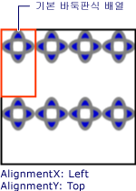
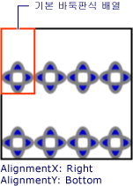

# 방법: TileBrush의 가로 및 세로 맞춤 설정
이 예제에서는 타일에서 콘텐츠의 가로 및 세로 맞춤을 제어하는 방법을 보여 줍니다. 가로 및 세로 맞춤을 제어 하는 <xref:System.Windows.Media.TileBrush>를 사용 하 여 해당 <xref:System.Windows.Media.TileBrush.AlignmentX%2A> 및 <xref:System.Windows.Media.TileBrush.AlignmentY%2A> 속성입니다.  
  
 <xref:System.Windows.Media.TileBrush.AlignmentX%2A> 및 <xref:System.Windows.Media.TileBrush.AlignmentY%2A> 의 속성은 <xref:System.Windows.Media.TileBrush> 사용 되는 다음 조건 중 하나가 true 이면 경우:  
  
-   <xref:System.Windows.Media.TileBrush.Stretch%2A> 속성은 <xref:System.Windows.Media.Stretch.Uniform> 또는 <xref:System.Windows.Media.Stretch.UniformToFill> 및 <xref:System.Windows.Media.TileBrush.Viewbox%2A> 및 <xref:System.Windows.Media.TileBrush.Viewport%2A> 다른 가로 세로 비율입니다.  
  
-   <xref:System.Windows.Media.TileBrush.Stretch%2A> 속성은 <xref:System.Windows.Media.Stretch.None> 및 <xref:System.Windows.Media.TileBrush.Viewbox%2A> 및 <xref:System.Windows.Media.TileBrush.Viewport%2A> 크기가 다릅니다.  
  
## 예제  
 콘텐츠를 정렬 하는 다음 예제는 <xref:System.Windows.Media.DrawingBrush>의 형식인 <xref:System.Windows.Media.TileBrush>, 타일의 왼쪽 위 모퉁이에 있습니다. 예제에서는 콘텐츠를 정렬 하는 <xref:System.Windows.Media.TileBrush.AlignmentX%2A> 의 속성은 <xref:System.Windows.Media.DrawingBrush> 를 <xref:System.Windows.Media.AlignmentX.Left> 및 <xref:System.Windows.Media.TileBrush.AlignmentY%2A> 속성을 <xref:System.Windows.Media.AlignmentY.Top>합니다. 이 예제의 결과는 다음과 같습니다.  
  
   
콘텐츠가 왼쪽 위 구석에 정렬된 TileBrush  
  
 [!code-csharp[brushoverviewexamples_snip#TileBrushTopLeftAlignmentInline](../../../../samples/snippets/csharp/VS_Snippets_Wpf/BrushOverviewExamples_snip/CSharp/TileBrushAlignmentExample.cs#tilebrushtopleftalignmentinline)]
 [!code-vb[brushoverviewexamples_snip#TileBrushTopLeftAlignmentInline](../../../../samples/snippets/visualbasic/VS_Snippets_Wpf/BrushOverviewExamples_snip/visualbasic/tilebrushalignmentexample.vb#tilebrushtopleftalignmentinline)]
 [!code-xaml[brushoverviewexamples_snip#TileBrushTopLeftAlignmentInline](../../../../samples/snippets/xaml/VS_Snippets_Wpf/BrushOverviewExamples_snip/XAML/TileBrushAlignmentExample.xaml#tilebrushtopleftalignmentinline)]  
  
## 예제  
 콘텐츠를 정렬 하는 다음 예제는 <xref:System.Windows.Media.DrawingBrush> 설정 하 여 타일의 오른쪽 아래 모서리에는 <xref:System.Windows.Media.TileBrush.AlignmentX%2A> 속성을 <xref:System.Windows.Media.AlignmentX.Right> 및 <xref:System.Windows.Media.TileBrush.AlignmentY%2A> 속성을 <xref:System.Windows.Media.AlignmentY.Bottom>합니다. 예제의 결과는 다음과 같습니다.  
  
   
콘텐츠가 오른쪽 아래 구석에 정렬된 TileBrush  
  
 [!code-csharp[brushoverviewexamples_snip#TileBrushBottomRightAlignmentInline](../../../../samples/snippets/csharp/VS_Snippets_Wpf/BrushOverviewExamples_snip/CSharp/TileBrushAlignmentExample.cs#tilebrushbottomrightalignmentinline)]
 [!code-vb[brushoverviewexamples_snip#TileBrushBottomRightAlignmentInline](../../../../samples/snippets/visualbasic/VS_Snippets_Wpf/BrushOverviewExamples_snip/visualbasic/tilebrushalignmentexample.vb#tilebrushbottomrightalignmentinline)]
 [!code-xaml[brushoverviewexamples_snip#TileBrushBottomRightAlignmentInline](../../../../samples/snippets/xaml/VS_Snippets_Wpf/BrushOverviewExamples_snip/XAML/TileBrushAlignmentExample.xaml#tilebrushbottomrightalignmentinline)]  
  
## 예제  
 콘텐츠를 정렬 하는 다음 예제는 <xref:System.Windows.Media.DrawingBrush> 설정 하 여 타일의 왼쪽 위 모퉁이에 <xref:System.Windows.Media.TileBrush.AlignmentX%2A> 속성을 <xref:System.Windows.Media.AlignmentX.Left> 및 <xref:System.Windows.Media.TileBrush.AlignmentY%2A> 속성을 <xref:System.Windows.Media.AlignmentY.Top>합니다. 또한 설정는 <xref:System.Windows.Media.TileBrush.Viewport%2A> 및 <xref:System.Windows.Media.TileBrush.TileMode%2A> 의 <xref:System.Windows.Media.DrawingBrush> 타일 패턴을 생성 합니다. 예제의 결과는 다음과 같습니다.  
  
   
콘텐츠가 기본 타일에서 왼쪽 위에 정렬된 타일 패턴  
  
 이 그림에서는 기본 타일을 강조해서 보여 주므로 해당 콘텐츠가 정렬되는 방식을 확인할 수 있습니다. 다음에 유의 <xref:System.Windows.Media.TileBrush.AlignmentX%2A> 때문에 설정의 영향 없음의 콘텐츠는 <xref:System.Windows.Media.DrawingBrush> 가로로 기본 타일을 완전히 채웁니다.  
  
 [!code-csharp[brushoverviewexamples_snip#TileBrushTopLeftAlignmentTiledInline](../../../../samples/snippets/csharp/VS_Snippets_Wpf/BrushOverviewExamples_snip/CSharp/TileBrushAlignmentExample.cs#tilebrushtopleftalignmenttiledinline)]
 [!code-vb[brushoverviewexamples_snip#TileBrushTopLeftAlignmentTiledInline](../../../../samples/snippets/visualbasic/VS_Snippets_Wpf/BrushOverviewExamples_snip/visualbasic/tilebrushalignmentexample.vb#tilebrushtopleftalignmenttiledinline)]
 [!code-xaml[brushoverviewexamples_snip#TileBrushTopLeftAlignmentTiledInline](../../../../samples/snippets/xaml/VS_Snippets_Wpf/BrushOverviewExamples_snip/XAML/TileBrushAlignmentExample.xaml#tilebrushtopleftalignmenttiledinline)]  
  
## 예제  
 콘텐츠를 정렬 하는 마지막 예제 <xref:System.Windows.Media.DrawingBrush> 설정 하 여 기본 타일의 오른쪽 아래에는 <xref:System.Windows.Media.TileBrush.AlignmentX%2A> 속성을 <xref:System.Windows.Media.AlignmentX.Right> 및 <xref:System.Windows.Media.TileBrush.AlignmentY%2A> 속성을 <xref:System.Windows.Media.AlignmentY.Bottom>합니다. 예제의 결과는 다음과 같습니다.  
  
   
콘텐츠가 기본 타일에서 오른쪽 아래에 정렬된 타일 패턴  
  
 다시는 <xref:System.Windows.Media.TileBrush.AlignmentX%2A> 때문에 설정의 영향 없음의 콘텐츠는 <xref:System.Windows.Media.DrawingBrush> 가로로 기본 타일을 완전히 채웁니다.  
  
 [!code-csharp[brushoverviewexamples_snip#TileBrushBottomRightAlignmentInline](../../../../samples/snippets/csharp/VS_Snippets_Wpf/BrushOverviewExamples_snip/CSharp/TileBrushAlignmentExample.cs#tilebrushbottomrightalignmentinline)]
 [!code-vb[brushoverviewexamples_snip#TileBrushBottomRightAlignmentInline](../../../../samples/snippets/visualbasic/VS_Snippets_Wpf/BrushOverviewExamples_snip/visualbasic/tilebrushalignmentexample.vb#tilebrushbottomrightalignmentinline)]
 [!code-xaml[brushoverviewexamples_snip#TileBrushBottomRightAlignmentInline](../../../../samples/snippets/xaml/VS_Snippets_Wpf/BrushOverviewExamples_snip/XAML/TileBrushAlignmentExample.xaml#tilebrushbottomrightalignmentinline)]  
  
 예제에서는 사용 <xref:System.Windows.Media.DrawingBrush> 보여 주기 위해 개체 방법을 <xref:System.Windows.Media.TileBrush.AlignmentX%2A> 및 <xref:System.Windows.Media.TileBrush.AlignmentY%2A> 속성이 사용 됩니다. 이러한 속성에 대 한 모든 타일 브러시 동일 하 게 작동: <xref:System.Windows.Media.DrawingBrush>, <xref:System.Windows.Media.ImageBrush>, 및 <xref:System.Windows.Media.VisualBrush>합니다. 타일 브러시에 대한 자세한 내용은 [이미지, 그림 및 시각적 표시로 그리기](../../../../docs/framework/wpf/graphics-multimedia/painting-with-images-drawings-and-visuals.md)를 참조하세요.  
  
## 참고 항목  
 <xref:System.Windows.Media.DrawingBrush>  
 <xref:System.Windows.Media.ImageBrush>  
 <xref:System.Windows.Media.VisualBrush>  
 [이미지, 그림 및 시각적 표시로 그리기](../../../../docs/framework/wpf/graphics-multimedia/painting-with-images-drawings-and-visuals.md)
