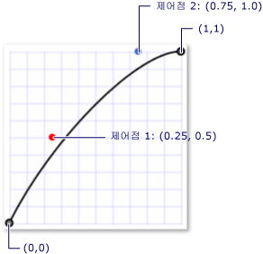

# 키 프레임 애니메이션 개요Key-Frame Animations Overview
이 항목에서는 키 프레임 애니메이션을 소개합니다.This topic introduces you to key-frame animations. 키 프레임 애니메이션을 사용하면 두 개 이상의 대상 값을 사용하여 애니메이션 효과를 주고 애니메이션의 보간 방법을 제어할 수 있습니다.Key-frame animations enable you to animate using more than two target values, and control an animation's interpolation method.  
  
   
## 필수 구성 요소Prerequisites  
 이 개요를 이해하려면 [!INCLUDE[TLA#tla_winclient](../../../../includes/tlasharptla-winclient-md.md)] 애니메이션 및 타임라인을 잘 알고 있어야 입니다.To understand this overview, you should be familiar with [!INCLUDE[TLA#tla_winclient](../../../../includes/tlasharptla-winclient-md.md)] animations and timelines. 애니메이션 소개를 보려면 [애니메이션 개요](../../../../docs/framework/wpf/graphics-multimedia/animation-overview.md)를 참조하세요.For an introduction to animations, see the [Animation Overview](../../../../docs/framework/wpf/graphics-multimedia/animation-overview.md). From/To/By 애니메이션을 잘 알고 있어도 도움이 됩니다.It also helps to be familiar with From/To/By animations. 자세한 내용은 From/To/By 애니메이션 개요를 참조하세요.For more information, see the From/To/By Animations Overview.  
  
   
## 키 프레임 애니메이션이란?What is a Key-Frame Animation?  
 From/To/By 애니메이션처럼 키 프레임 애니메이션도 대상 속성의 값에 애니메이션 효과를 줍니다.Like a From/To/By animation, a key-frame animation animates the value of a target property. 대상 값 간에 전환을 만듭니다 해당 <xref:System.Windows.Media.Animation.Timeline.Duration%2A>합니다.It creates a transition among its target values over its <xref:System.Windows.Media.Animation.Timeline.Duration%2A>. 그러나 From/To/By 애니메이션은 두 값 사이에 전환을 만들지만 단일 키 프레임 애니메이션은 원하는 수의 대상 값 사이에 전환을 만들 수 있습니다.However, while a From/To/By animation creates a transition between two values, a single key-frame animation can create transitions among any number of target values. From/To/By 애니메이션과 달리, 키 프레임 애니메이션에는 해당 대상 값을 설정하는 데 사용할 From, To 또는 By 속성이 없습니다.Unlike a From/To/By animation, a key frame animation has no From, To, or By properties with which to set its target values. 키 프레임 애니메이션의 대상 값은 키 프레임 개체를 사용하여 설명합니다(그래서 "키 프레임 애니메이션"이라고 지칭함).A key-frame animation's target values are described using key frames objects (hence the term, "key-frame animation"). 애니메이션의 대상 값을 지정 하려면 키 프레임 개체를 만들고 애니메이션의에 추가할 <xref:System.Windows.Media.Animation.DoubleAnimationUsingKeyFrames.KeyFrames%2A> 컬렉션입니다.To specify the animation's target values, you create key frame objects and add them to the animation's <xref:System.Windows.Media.Animation.DoubleAnimationUsingKeyFrames.KeyFrames%2A> collection. 이 애니메이션은 실행될 때 지정된 프레임 간에 전환됩니다.When the animation runs, it transitions between the frames you specified.  
  
 일부 키 프레임 메서드는 여러 대상 값을 지원할 뿐만 아니라 여러 보간 방법도 지원합니다.In addition to supporting multiple target values, some key-frame methods even support multiple interpolation methods. 애니메이션의 보간 방법은 한 값에서 다음 값으로 전환되는 방식을 정의합니다.An animation's interpolation method defines how it transitions from one value to the next. 보간에는 불연속, 선형 및 스플라인의 세 가지 유형이 있습니다.There are three types of interpolations: discrete, linear, and splined.  
  
 키 프레임 애니메이션으로 애니메이션 효과를 주려면 다음 단계를 완료합니다.To animate with a key-frame animation, you complete the following steps.  
  
-   애니메이션을 선언 하 고 지정 해당 <xref:System.Windows.Media.Animation.Timeline.Duration%2A>에서/하/여 애니메이션에 대 한와 마찬가지로, 합니다.Declare the animation and specify its <xref:System.Windows.Media.Animation.Timeline.Duration%2A>, just like you would for a from/to/by animation.  
  
-   각 대상 값에 대 한 적절 한 유형의 키 프레임을 만들고, 해당 값을 설정 하 고 <xref:System.Windows.Media.Animation.KeyTime>, 애니메이션의에 추가 하려면 <xref:System.Windows.Media.Animation.DoubleAnimationUsingKeyFrames.KeyFrames%2A> 컬렉션입니다.For each target value, create a key frame of the appropriate type, set its value and <xref:System.Windows.Media.Animation.KeyTime>, and add it to the animation's <xref:System.Windows.Media.Animation.DoubleAnimationUsingKeyFrames.KeyFrames%2A> collection.  
  
-   From/To/By 애니메이션의 경우처럼 애니메이션을 속성에 연결합니다.Associate the animation with a property, just like you would with a From/To/By animation. storyboard를 사용하여 속성에 애니메이션을 적용하는 방법에 대한 자세한 내용은 [Storyboard 개요](../../../../docs/framework/wpf/graphics-multimedia/storyboards-overview.md)를 참조하세요.For more information about applying an animation to a property using a storyboard, see [Storyboards Overview](../../../../docs/framework/wpf/graphics-multimedia/storyboards-overview.md).  
  
 다음 예제에서는 한 <xref:System.Windows.Media.Animation.DoubleAnimationUsingKeyFrames> 애니메이션 효과를 주는 <xref:System.Windows.Shapes.Rectangle> 요소 4 개의 서로 다른 위치를 합니다.The following example uses a <xref:System.Windows.Media.Animation.DoubleAnimationUsingKeyFrames> to animate a <xref:System.Windows.Shapes.Rectangle> element to four different locations.  
  
 [!code-xaml[keyframes_ovw_snippet#BasicKeyFrameExampleWholePage](../../../../samples/snippets/csharp/VS_Snippets_Wpf/keyframes_ovw_snippet/CS/KeyFramesIntroduction.xaml#basickeyframeexamplewholepage)]  
  
 From/하/By와 같은 애니메이션 키 프레임 애니메이션을 적용할 수 속성을 사용 하 여 한 <xref:System.Windows.Media.Animation.Storyboard> 태그와 코드 또는 사용 하 여는 <xref:System.Windows.Media.Animation.Animatable.BeginAnimation%2A> 코드에서 메서드.Like a From/To/By animation, a key-frame animation can be applied to a property by using a <xref:System.Windows.Media.Animation.Storyboard> in markup and code or by using the <xref:System.Windows.Media.Animation.Animatable.BeginAnimation%2A> method in code. 만들려는 키 프레임 애니메이션을 사용할 수도 있습니다는 <xref:System.Windows.Media.Animation.AnimationClock> 하나 이상의 속성에 적용 합니다.You may also use a key-frame animation to create an <xref:System.Windows.Media.Animation.AnimationClock> and apply it to one or more properties. 애니메이션 효과를 주기 위한 여러 다양한 방법에 대한 자세한 내용은 [속성 애니메이션 기술 개요](../../../../docs/framework/wpf/graphics-multimedia/property-animation-techniques-overview.md)를 참조하세요.For more information about the different methods for applying animations, see the [Property Animation Techniques Overview](../../../../docs/framework/wpf/graphics-multimedia/property-animation-techniques-overview.md).  
  
   
## 키 프레임 애니메이션 형식Key-Frame Animation Types  
 애니메이션은 속성 값을 생성하므로 속성 형식이 다르면 애니메이션 형식도 다릅니다.Because animations generate property values, there are different animation types for different property types. 사용 하는 속성에 애니메이션 효과를 줄는 <xref:System.Double> (요소의 같은 <xref:System.Windows.FrameworkElement.Width%2A> 속성)를 생성 하는 애니메이션을 사용 하 여 <xref:System.Double> 값입니다.To animate a property that takes a <xref:System.Double> (such as an element's <xref:System.Windows.FrameworkElement.Width%2A> property), you use an animation that produces <xref:System.Double> values. 사용 하는 속성에 애니메이션 효과를 주는 <xref:System.Windows.Point>를 생성 하는 애니메이션을 사용 하 여 <xref:System.Windows.Point> 값, 및 기타 등등.To animate a property that takes a <xref:System.Windows.Point>, you use an animation that produces <xref:System.Windows.Point> values, and so on.  
  
 키 프레임 애니메이션 클래스에 속해는 <xref:System.Windows.Media.Animation> 네임 스페이스 및 다음 명명 규칙을 따릅니다.The key-frame animation classes belong to the <xref:System.Windows.Media.Animation> namespace and adhere to the following naming convention:  
  
 *\<Type>* `AnimationUsingKeyFrames`*\<Type>* `AnimationUsingKeyFrames`  
  
 여기서 *\<Type>*은 클래스가 애니메이션을 적용하는 값의 형식입니다.Where *\<Type>* is the type of value that the class animates.  
  
 [!INCLUDE[TLA2#tla_winclient](../../../../includes/tla2sharptla-winclient-md.md)]에서는 다음 키 프레임 애니메이션 클래스를 제공합니다. provides the following key-frame animation classes.  
  
|속성 형식Property type|해당 From/To/By 애니메이션 클래스Corresponding from/to/by animation class|지원되는 보간 방법Interpolation methods supported|  
|-------------------|------------------------------------------------|-------------------------------------|  
|<xref:System.Boolean>|<xref:System.Windows.Media.Animation.BooleanAnimationUsingKeyFrames>|불연속Discrete|  
|<xref:System.Byte>|<xref:System.Windows.Media.Animation.ByteAnimationUsingKeyFrames>|불연속, 선형, 스플라인Discrete, Linear, Splined|  
|<xref:System.Windows.Media.Color>|<xref:System.Windows.Media.Animation.ColorAnimationUsingKeyFrames>|불연속, 선형, 스플라인Discrete, Linear, Splined|  
|<xref:System.Decimal>|<xref:System.Windows.Media.Animation.DecimalAnimationUsingKeyFrames>|불연속, 선형, 스플라인Discrete, Linear, Splined|  
|<xref:System.Double>|<xref:System.Windows.Media.Animation.DoubleAnimationUsingKeyFrames>|불연속, 선형, 스플라인Discrete, Linear, Splined|  
|<xref:System.Int16>|<xref:System.Windows.Media.Animation.Int16AnimationUsingKeyFrames>|불연속, 선형, 스플라인Discrete, Linear, Splined|  
|<xref:System.Int32>|<xref:System.Windows.Media.Animation.Int32AnimationUsingKeyFrames>|불연속, 선형, 스플라인Discrete, Linear, Splined|  
|<xref:System.Int64>|<xref:System.Windows.Media.Animation.Int64AnimationUsingKeyFrames>|불연속, 선형, 스플라인Discrete, Linear, Splined|  
|<xref:System.Windows.Media.Matrix>|<xref:System.Windows.Media.Animation.MatrixAnimationUsingKeyFrames>|불연속Discrete|  
|<xref:System.Object>|<xref:System.Windows.Media.Animation.ObjectAnimationUsingKeyFrames>|불연속Discrete|  
|<xref:System.Windows.Point>|<xref:System.Windows.Media.Animation.PointAnimationUsingKeyFrames>|불연속, 선형, 스플라인Discrete, Linear, Splined|  
|<xref:System.Windows.Media.Media3D.Quaternion>|<xref:System.Windows.Media.Animation.QuaternionAnimationUsingKeyFrames>|불연속, 선형, 스플라인Discrete, Linear, Splined|  
|<xref:System.Windows.Rect>|<xref:System.Windows.Media.Animation.RectAnimationUsingKeyFrames>|불연속, 선형, 스플라인Discrete, Linear, Splined|  
|<xref:System.Windows.Media.Media3D.Rotation3D>|<xref:System.Windows.Media.Animation.Rotation3DAnimationUsingKeyFrames>|불연속, 선형, 스플라인Discrete, Linear, Splined|  
|<xref:System.Single>|<xref:System.Windows.Media.Animation.SingleAnimationUsingKeyFrames>|불연속, 선형, 스플라인Discrete, Linear, Splined|  
|<xref:System.String>|<xref:System.Windows.Media.Animation.StringAnimationUsingKeyFrames>|불연속Discrete|  
|<xref:System.Windows.Size>|<xref:System.Windows.Media.Animation.SizeAnimationUsingKeyFrames>|불연속, 선형, 스플라인Discrete, Linear, Splined|  
|<xref:System.Windows.Thickness>|<xref:System.Windows.Media.Animation.ThicknessAnimationUsingKeyFrames>|불연속, 선형, 스플라인Discrete, Linear, Splined|  
|<xref:System.Windows.Media.Media3D.Vector3D>|<xref:System.Windows.Media.Animation.Vector3DAnimationUsingKeyFrames>|불연속, 선형, 스플라인Discrete, Linear, Splined|  
|<xref:System.Windows.Vector>|<xref:System.Windows.Media.Animation.VectorAnimationUsingKeyFrames>|불연속, 선형, 스플라인Discrete, Linear, Splined|  
  
   
## 대상 값(키 프레임) 및 키 시간Target Values (key frames) and Key Times  
 다양한 속성 형식에 애니메이션 효과를 주기 위한 다양한 형식의 키 프레임 애니메이션이 있는 것처럼, 애니메이션 효과가 적용되는 각 형식의 값 및 지원되는 보간 방법에 따라 다양한 형식의 키 프레임 개체가 사용됩니다.Just as there are different types of key-frame animations for animating different property types, there are also different types of key frame objects: one for each type of value animated and interpolation method supported. 키 프레임 형식은 다음과 같은 명명 규칙을 따릅니다.Key frame types adhere to the following naming convention:  
  
 *\<InterpolationMethod>\<Type>* `KeyFrame`*\<InterpolationMethod>\<Type>* `KeyFrame`  
  
 여기서 *\<InterpolationMethod>*는 키 프레임이 사용하는 보간 방법이고 *\<Type>*은 클래스가 애니메이션 효과를 주는 값의 형식입니다.Where *\<InterpolationMethod>* is the interpolation method the key frame uses and *\<Type>* is the type of value that the class animates. 세 가지 보간 방법을 모두 지원하는 키 프레임 애니메이션에는 사용할 수 있는 세 가지 키 프레임 형식이 있습니다.A key-frame animation that supports all three interpolation methods will have three key frame types that you can use. 예를 들어 세 개의 키 프레임 형식을 사용할 수 있습니다는 <xref:System.Windows.Media.Animation.DoubleAnimationUsingKeyFrames>: <xref:System.Windows.Media.Animation.DiscreteDoubleKeyFrame>, <xref:System.Windows.Media.Animation.LinearDoubleKeyFrame>, 및 <xref:System.Windows.Media.Animation.SplineDoubleKeyFrame>합니다.For example, you can use three key frame types with a <xref:System.Windows.Media.Animation.DoubleAnimationUsingKeyFrames>: <xref:System.Windows.Media.Animation.DiscreteDoubleKeyFrame>, <xref:System.Windows.Media.Animation.LinearDoubleKeyFrame>, and <xref:System.Windows.Media.Animation.SplineDoubleKeyFrame>. (보간 방법은 뒤에 나오는 섹션에 자세히 설명되어 있습니다.)(Interpolation methods are described in detail in a later section.)  
  
 키 프레임의 주요 목적은 지정 하는 것을 <xref:System.Windows.Media.Animation.IKeyFrame.KeyTime%2A> 및 <xref:System.Windows.Media.Animation.IKeyFrame.Value%2A>합니다.The primary purpose of a key frame is to specify a <xref:System.Windows.Media.Animation.IKeyFrame.KeyTime%2A> and a <xref:System.Windows.Media.Animation.IKeyFrame.Value%2A>. 모든 키 프레임 형식은 이러한 두 가지 속성을 제공합니다.Every key frame type provides these two properties.  
  
-   <xref:System.Windows.Media.Animation.IKeyFrame.Value%2A> 속성 키 프레임에 대 한 대상 값을 지정 합니다.The <xref:System.Windows.Media.Animation.IKeyFrame.Value%2A> property specifies the target value for that key-frame.  
  
-   <xref:System.Windows.Media.Animation.IKeyFrame.KeyTime%2A> 시점을 지정 하는 속성 (애니메이션의 내 <xref:System.Windows.Media.Animation.Timeline.Duration%2A>) 키 프레임의 <xref:System.Windows.Media.Animation.IKeyFrame.Value%2A> 에 도달 합니다.The <xref:System.Windows.Media.Animation.IKeyFrame.KeyTime%2A> property specifies when (within the animation's <xref:System.Windows.Media.Animation.Timeline.Duration%2A>) a key frame's <xref:System.Windows.Media.Animation.IKeyFrame.Value%2A> is reached.  
  
 에 정의 된 순서 대로 키 프레임이을 반복 하는 키 프레임 애니메이션 시작 되 면 해당 <xref:System.Windows.Media.Animation.IKeyFrame.KeyTime%2A> 속성입니다.When a key frame animation begins, iterates through its key frames in the order defined by their <xref:System.Windows.Media.Animation.IKeyFrame.KeyTime%2A> properties.  
  
-   애니메이션 대상 속성의 현재 값 간의 전환을 만듭니다 0 시간에 키 프레임이 있는 경우와 <xref:System.Windows.Media.Animation.IKeyFrame.Value%2A> ; 첫 번째 키 프레임의 그렇지 않은 경우 애니메이션의 출력 값은 첫 번째 키 프레임의 값입니다.If there is no key frame at time 0, the animation creates a transition between the target property's current value and the <xref:System.Windows.Media.Animation.IKeyFrame.Value%2A> of the first key frame; otherwise, the animation's output value becomes the value of the first key frame.  
  
-   애니메이션 간 전환을 만듭니다는 <xref:System.Windows.Media.Animation.IKeyFrame.Value%2A> 두 번째 키 프레임으로 지정한 보간 메서드를 사용 하 여 첫 번째 및 두 번째 키 프레임의 합니다.The animation creates a transition between the <xref:System.Windows.Media.Animation.IKeyFrame.Value%2A> of the first and second key frames using the interpolation method specified by the second key frame. 첫 번째 키 프레임에서 전환을 시작 <xref:System.Windows.Media.Animation.IKeyFrame.KeyTime%2A> 종료 될 때 두 번째 키 프레임의 <xref:System.Windows.Media.Animation.IKeyFrame.KeyTime%2A> 에 도달 합니다.The transition starts at the first key frame's <xref:System.Windows.Media.Animation.IKeyFrame.KeyTime%2A> and ends when the second key frame's <xref:System.Windows.Media.Animation.IKeyFrame.KeyTime%2A> is reached.  
  
-   애니메이션이 지속되면서 각 후속 키 프레임 및 해당 이전 키 프레임 간에 전환이 생성됩니다.The animation continues, creating transitions between each subsequent key frame and its preceding key frame.  
  
-   마지막으로, 가장 큰 키 시간을 사용 하 여 키 프레임의 값에 애니메이션이 전환 하는 애니메이션의 보다 작거나 <xref:System.Windows.Media.Animation.Timeline.Duration%2A>합니다.Finally, the animation transitions to the value of the key frame with the greatest key time that is equal to or smaller than the animation's <xref:System.Windows.Media.Animation.Timeline.Duration%2A>.  
  
 경우 애니메이션의 <xref:System.Windows.Media.Animation.Timeline.Duration%2A> 은 <xref:System.Windows.Duration.Automatic%2A> 나 해당 <xref:System.Windows.Media.Animation.Timeline.Duration%2A> 마지막 키 프레임 애니메이션 끝 시간 같습니다.If the animation's <xref:System.Windows.Media.Animation.Timeline.Duration%2A> is <xref:System.Windows.Duration.Automatic%2A> or its <xref:System.Windows.Media.Animation.Timeline.Duration%2A> is equal to the time of the last key frame, the animation ends. 그렇지 않은 경우, 애니메이션의 <xref:System.Windows.Duration> 의 마지막 키 프레임 애니메이션 보류 될 때까지 키 프레임 값의 끝에 도달 하면 키 시간 보다 크면 해당 <xref:System.Windows.Duration>합니다.Otherwise, if the animation's <xref:System.Windows.Duration> is greater than the key time of the last key frame, the animation holds the key frame value until it reaches the end of its <xref:System.Windows.Duration>. 키 프레임 애니메이션 마찬가지로 모든 애니메이션을 사용 하 여 해당 <xref:System.Windows.Media.Animation.Timeline.FillBehavior%2A> 속성을 포함 하는지 여부를 것이 최종 값 활성 기간의 끝에 도달 하면 확인 합니다.Like all animations, a key-frame animation uses its <xref:System.Windows.Media.Animation.Timeline.FillBehavior%2A> property to determine whether it holds it final value when it reaches the end of its active period. 자세한 내용은 [타이밍 동작 개요](../../../../docs/framework/wpf/graphics-multimedia/timing-behaviors-overview.md)를 참조하세요.For more information, see the [Timing Behaviors Overview](../../../../docs/framework/wpf/graphics-multimedia/timing-behaviors-overview.md).  
  
 다음 예제에서는 <xref:System.Windows.Media.Animation.DoubleAnimationUsingKeyFrames> 보여 주기 위해 앞의 예제에 정의 된 개체는 어떻게 <xref:System.Windows.Media.Animation.IKeyFrame.Value%2A> 및 <xref:System.Windows.Media.Animation.IKeyFrame.KeyTime%2A> 속성의 작동 합니다.The following example uses the <xref:System.Windows.Media.Animation.DoubleAnimationUsingKeyFrames> object defined in the preceding example to demonstrate how the <xref:System.Windows.Media.Animation.IKeyFrame.Value%2A> and <xref:System.Windows.Media.Animation.IKeyFrame.KeyTime%2A> properties work.  
  
-   첫 번째 키 프레임은 애니메이션의 출력 값을 0으로 즉시 설정합니다.The first key frame immediately sets the animation's output value to 0.  
  
-   두 번째 키 프레임은 0에서 350으로 애니메이션 효과를 줍니다.The second key frame animates from 0 to 350. 이 키 프레임은 첫 번째 키 프레임이 종료된 후(시간 = 0초) 시작되고 2초 동안 재생된 후 시간 = 0:0:2에 종료됩니다.It starts after the first key frame ends (at time = 0 seconds) and plays for 2 seconds, ending at time = 0:0:2.  
  
-   세 번째 키 프레임은 350에서 50으로 애니메이션 효과를 줍니다.The third key frame animates from 350 to 50. 이 키 프레임은 두 번째 키 프레임이 종료된 후(시간 = 2초) 시작되고 5초 동안 재생된 후 시간 = 0:0:7에 종료됩니다.It starts when the second key frame ends (at time = 2 seconds) and plays for 5 seconds, ending at time = 0:0:7.  
  
-   네 번째 키 프레임은 50에서 200으로 애니메이션 효과를 줍니다.The fourth key frame animates from 50 to 200. 이 키 프레임은 세 번째 키 프레임이 종료된 후(시간 = 7초) 시작되고 1초 동안 재생된 후 시간 = 0:0:8에 종료됩니다.It starts when the third key frame ends (at time = 7 seconds) and plays for 1 second, ending at time = 0:0:8.  
  
-   때문에 <xref:System.Windows.Media.Animation.Timeline.Duration%2A> 애니메이션의 속성을 10 초로 설정 된, 끝나기 전에 2 초에 대 한 최종 값을 보유 하는 애니메이션 시간 = 0:0:10입니다.Because the <xref:System.Windows.Media.Animation.Timeline.Duration%2A> property of the animation was set to 10 seconds, the animation holds its final value for two seconds before ending at time = 0:0:10.  
  
 [!code-xaml[keyframes_ovw_snippet#BasicKeyFrameExampleWholePage](../../../../samples/snippets/csharp/VS_Snippets_Wpf/keyframes_ovw_snippet/CS/KeyFramesIntroduction.xaml#basickeyframeexamplewholepage)]  
  
   
## 보간 방법Interpolation Methods  
 이전 섹션에서는 일부 키 프레임 애니메이션이 여러 보간 방법을 지원한다고 언급했습니다.The preceding sections mentioned that some key-frame animations support multiple interpolation methods. 애니메이션의 보간은 애니메이션이 지속 기간 동안 값 사이에서 전환되는 방식을 설명합니다.An animation's interpolation describes how an animation transitions between values over its duration. 애니메이션에서 사용하는 키 프레임 형식을 선택하여 해당 키 프레임 세그먼트에 대한 보간 방법을 정의할 수 있습니다.By selecting which key frame type you use with your animation, you can define the interpolation method for that key frame segment. 보간 방법 종류에는 선형, 불연속 및 스플라인의 세 가지가 있습니다.There are three different types of interpolation methods: linear, discrete, and splined.  
  
### 선형 보간Linear Interpolation  
 선형 보간을 사용하면 애니메이션이 세그먼트 기간에 일정한 속도로 진행됩니다.With linear interpolation, the animation progresses at a constant rate of the segment duration. 예를 들어 키 프레임 세그먼트가 5초 동안 0에서 10으로 전환되면 애니메이션은 지정된 시간에 다음 값을 출력합니다.For example, if a key frame segment transitions from 0 to 10 over a duration of 5 seconds, the animation will output the following values at the specified times:  
  
|시간Time|출력 값Output value|  
|----------|------------------|  
|00|00|  
|11|22|  
|22|44|  
|33|66|  
|44|88|  
|4.254.25|8.58.5|  
|4.54.5|99|  
|55|1010|  
  
### 불연속 보간Discrete Interpolation  
 불연속 보간을 사용하면 애니메이션 함수가 보간 없이 한 값에서 다음 값으로 이동합니다.With discrete interpolation, the animation function jumps from one value to the next without interpolation. 키 프레임 세그먼트가 5초 동안 0에서 10으로 전환되면 애니메이션은 지정된 시간에 다음 값을 출력합니다.If a key frame segment transitions from 0 to 10 over a duration of 5 seconds, the animation will output the following values at the specified times:  
  
|시간Time|출력 값Output value|  
|----------|------------------|  
|00|00|  
|11|00|  
|22|00|  
|33|00|  
|44|00|  
|4.254.25|00|  
|4.54.5|00|  
|55|1010|  
  
 세그먼트 기간의 거의 끝날 때까지 애니메이션이 출력 값을 변경하지 않는 방식을 살펴보세요.Notice how the animation does not change its output value until the very end of the segment duration.  
  
 스플라인 보간은 좀 더 복잡합니다.Splined interpolation is more complex. 이 방식은 다음 섹션에서 설명합니다.It is described in the next section.  
  
   
### 스플라인 보간Splined Interpolation  
 스플라인 보간은 보다 실제적인 타이밍 효과를 얻기 위해 사용할 수 있습니다.Splined interpolation can be used to achieve more realistic timing effects. 애니메이션은 실제 환경에서 발생하는 효과를 모방하는 데 주로 사용되므로 개발자는 개체의 가속 및 감속을 보다 세밀하게 제어하고 타이밍 세그먼트를 면밀히 조작해야 할 수 있습니다.Because animations are so often used to imitate effects that occur in the real world, developers might need fine control of the acceleration and deceleration of objects, and close manipulation of timing segments. 스플라인 키 프레임을 사용하면 스플라인 보간을 사용하여 애니메이션 효과를 줄 수 있습니다.Spline key frames enable you to animate with splined interpolation. 다른 키 프레임으로 지정 된 <xref:System.Windows.Media.Animation.IKeyFrame.Value%2A> 및 <xref:System.Windows.Media.Animation.IKeyFrame.KeyTime%2A>합니다.With other key frames, you specify a <xref:System.Windows.Media.Animation.IKeyFrame.Value%2A> and <xref:System.Windows.Media.Animation.IKeyFrame.KeyTime%2A>. 스플라인 키 프레임으로도 지정 된 <xref:System.Windows.Media.Animation.SplineDoubleKeyFrame.KeySpline%2A>합니다.With a spline key frame, you also specify a <xref:System.Windows.Media.Animation.SplineDoubleKeyFrame.KeySpline%2A>. 다음 예제에서는 단일 스플라인 키 프레임에 대 한는 <xref:System.Windows.Media.Animation.DoubleAnimationUsingKeyFrames>합니다.The following example shows a single spline key frame for a <xref:System.Windows.Media.Animation.DoubleAnimationUsingKeyFrames>. 공지는 <xref:System.Windows.Media.Animation.KeySpline> 속성; 스플라인 키 프레임의 키 프레임의 다른 형식에서 다른 구성입니다.Notice the <xref:System.Windows.Media.Animation.KeySpline> property; that's what makes a spline key frame different from the other types of key frames.  
  
 [!code-xaml[keyframes_ovw_snippet#SingleSplineKeyFrameExample](../../../../samples/snippets/csharp/VS_Snippets_Wpf/keyframes_ovw_snippet/CS/InterpolationMethodsExample.xaml#singlesplinekeyframeexample)]  
  
 입방형 3차원 곡선은 시작점, 끝점 및 두 개의 제어점에 의해 정의됩니다.A cubic Bezier curve is defined by a start point, an end point, and two control points. <xref:System.Windows.Media.Animation.KeySpline> 스플라인 키 프레임의 속성 (0, 0)에서 (1, 1)를 확장 하는 베 지 어 곡선의 제어점 두 개를 정의 합니다.The <xref:System.Windows.Media.Animation.KeySpline> property of a spline key frame defines the two control point of a Bezier curve that extends from (0,0) to (1,1). 첫 번째 제어점은 3차원 곡선의 첫 번째 절반 부분에 대한 곡선 요소를 제어하 고 두 번째 제어점은 3차원 곡선의 두 번째 절반 부분에 대한 곡선 요소를 제어합니다.The first control point controls the curve factor of the first half of the Bezier curve, and the second control point controls the curve factor of the second half of the Bezier segment. 결과 곡선은 해당 스플라인 키 프레임의 변동률을 설명합니다.The resulting curve describes the rate of change for that spline key frame. 곡선이 더 가파를수록 키 프레임 값이 더 빠르게 변경됩니다.The steeper the curve, the faster the key frame changes its values. 곡선이 평평해지면 키 프레임은 값을 더 느리게 변경합니다.As the curve gets flatter, the key frame changes its values more slowly.  
  
 사용할 수 있습니다 <xref:System.Windows.Media.Animation.KeySpline> 을 떨어지는 물 또는 공, 반송와 같은 물리적 궤도 시뮬레이션 하거나 동작 애니메이션을 다른 "점점" 및 "감속" 효과 적용 합니다.You might use <xref:System.Windows.Media.Animation.KeySpline> to simulate physical trajectories like falling water or bouncing balls, or apply other "ease in" and "ease out" effects to motion animations. 배경 페이드 또는 컨트롤 단추 리바운드와 같은 사용자 상호 작용 효과의 경우 스플라인 보간을 적용하여 특정한 방식으로 애니메이션의 변동률을 빠르게 하거나 느리게 할 수 있습니다.For user interaction effects like background fades or control button rebound, you might apply splined interpolation to speed up or slow down the rate of change for an animation in a specific way.  
  
 다음 예에서는 지정 된 <xref:System.Windows.Media.Animation.KeySpline> 의 0, 1 1, 0, 다음 베 지 어 곡선을 만듭니다.The following example specifies a <xref:System.Windows.Media.Animation.KeySpline> of 0,1 1,0, which creates the following Bezier curve.  
  
   
제어점 (0.0, 1.0) 및 (1.0, 0.0)을 갖는 키 스플라인A key spline with control points (0.0, 1.0) and (1.0, 0.0)  
  
 [!code-xaml[keyframes_ovw_snippet#SingleSplineKeyFrameExample](../../../../samples/snippets/csharp/VS_Snippets_Wpf/keyframes_ovw_snippet/CS/InterpolationMethodsExample.xaml#singlesplinekeyframeexample)]  
  
 이 키 프레임을 사용하면 애니메이션이 시작할 때 빨라졌다가 느려진 후 끝나기 전에 다시 빨라집니다.This key frame animates rapidly when it begins, slows down, and then speeds up again before it ends.  
  
 다음 예에서는 지정 된 <xref:System.Windows.Media.Animation.KeySpline> 의 0.5,0.25 0.75, 1.0으로 다음 베 지 어 곡선을 만듭니다.The following example specifies a <xref:System.Windows.Media.Animation.KeySpline> of 0.5,0.25 0.75,1.0, which creates the following Bezier curve.  
  
   
제어점 (0.25, 0.5) 및 (0.75, 1.0)을 갖는 키 스플라인A key spline with control points (0.25, 0.5) and (0.75, 1.0)  
  
 [!code-xaml[keyframes_ovw_snippet#SingleSplineKeyFrameExampleInline3](../../../../samples/snippets/csharp/VS_Snippets_Wpf/keyframes_ovw_snippet/CS/InterpolationMethodsExample.xaml#singlesplinekeyframeexampleinline3)]  
  
 이 3차원 곡선의 곡률은 거의 변경되지 않으므로 이 키 프레임 애니메이션은 거의 일정한 속도를 유지하다가 끝에서는 다소 느려집니다.Because the curvature of the Bezier curve changes very little, this key frame animates at an almost constant rate; it slows down somewhat toward its very end.  
  
 다음 예제에서는 한 <xref:System.Windows.Media.Animation.DoubleAnimationUsingKeyFrames> 사각형의 위치에 애니메이션 효과를 주는 합니다.The following example uses a <xref:System.Windows.Media.Animation.DoubleAnimationUsingKeyFrames> to animate the position of rectangle. 때문에 <xref:System.Windows.Media.Animation.DoubleAnimationUsingKeyFrames> 사용 하 여 <xref:System.Windows.Media.Animation.SplineDoubleKeyFrame> 각 키 프레임 값 간을 전환 스플라인 보간을 사용 하 여 개체입니다.Because the <xref:System.Windows.Media.Animation.DoubleAnimationUsingKeyFrames> uses <xref:System.Windows.Media.Animation.SplineDoubleKeyFrame> objects, the transition between each key frame value uses splined interpolation.  
  
 [!code-xaml[keyframes_ovw_snippet#SplinedInterpolationExample](../../../../samples/snippets/csharp/VS_Snippets_Wpf/keyframes_ovw_snippet/CS/InterpolationMethodsExample.xaml#splinedinterpolationexample)]  
  
 스플라인 보간은 이해하기 어려울 수 있으므로 다른 설정을 사용해서 시험해보면 도움이 될 수 있습니다.Splined interpolation can be difficult to understand; experimenting with different settings can help. [키 스플라인 애니메이션 샘플](http://go.microsoft.com/fwlink/?LinkID=160011)을 사용하여 키 스플라인 값을 변경하고 애니메이션에 나타나는 결과를 볼 수 있습니다.The [Key Spline Animation Sample](http://go.microsoft.com/fwlink/?LinkID=160011) enables you to change key spline values and see the result it has on an animation.  
  
   
### 보간 방법 조합Combining Interpolation Methods  
 단일 키 프레임 애니메이션에서 여러 다른 보간 형식을 갖는 키 프레임을 사용할 수 있습니다.You can use key frames with different interpolation types in a single key frame animation. 다른 보간을 사용하는 두 개의 키 프레임 애니메이션이 서로를 따라 진행되면 두 번째 키 프레임의 보간 방법이 첫 번째 값에서 두 번째 값으로의 전환을 만드는 데 사용됩니다.When two key frame animations with different interpolations follow each other, the interpolation method of the second key frame is used to create the transition from the first value to the second.  
  
 다음 예제에서는 <xref:System.Windows.Media.Animation.DoubleAnimationUsingKeyFrames> 해당 사용 하 여 선형 스플라인 및 불연속 보간을 만들어집니다.In the following example, a <xref:System.Windows.Media.Animation.DoubleAnimationUsingKeyFrames> is created that uses linear, splined, and discrete interpolation.  
  
 [!code-xaml[keyframes_ovw_snippet#ComboInterpolationExample](../../../../samples/snippets/csharp/VS_Snippets_Wpf/keyframes_ovw_snippet/CS/InterpolationMethodsExample.xaml#combointerpolationexample)]  
  
   
## 기간 및 키 시간에 대한 추가 정보More about Duration and Key Times  
 마찬가지로 다른 애니메이션 키 프레임 애니메이션에는 한 <xref:System.Windows.Duration> 속성입니다.Like other animations, key-frame animations have a <xref:System.Windows.Duration> property. 애니메이션의 지정 외에도 <xref:System.Windows.Duration>, 해당 기간의 부분 각 키 프레임에 제공 되어 지정 해야 합니다.In addition to specifying the animation's <xref:System.Windows.Duration>, you need to specify what portion of that duration is given to each key frame. 설명 하 여 이렇게 한 <xref:System.Windows.Media.Animation.IKeyFrame.KeyTime%2A> 각 애니메이션의 키 프레임에 대 한 합니다.You do so by describing a   <xref:System.Windows.Media.Animation.IKeyFrame.KeyTime%2A> for each of the animation's key frames. 각 키 프레임의 <xref:System.Windows.Media.Animation.IKeyFrame.KeyTime%2A> 해당 키 프레임이 끝나는 시기를 지정 합니다.Each key frame's <xref:System.Windows.Media.Animation.IKeyFrame.KeyTime%2A> specifies when that key frame ends.  
  
 <xref:System.Windows.Media.Animation.IKeyFrame.KeyTime%2A> 속성 재생 하는 길이 키 시간을 지정 하지 않습니다.The <xref:System.Windows.Media.Animation.IKeyFrame.KeyTime%2A> property does not specify how long the key time plays. 키 프레임이 재생되는 기간은 키 프레임이 끝나는 시점, 이전 키 프레임 끝난 시점 및 애니메이션의 지속 시간에 의해 결정됩니다.The amount of time a key frame plays is determined by when the key frame ends, when the previous key frame ended, and the animation's duration. 특수 값 또는 백분율을 시간 값으로 키 시간을 지정할 수 있습니다 <xref:System.Windows.Media.Animation.KeyTime.Uniform%2A> 또는 <xref:System.Windows.Media.Animation.KeyTime.Paced%2A>합니다.Key times may be specified as a time value, a percentage, or as the special values <xref:System.Windows.Media.Animation.KeyTime.Uniform%2A> or <xref:System.Windows.Media.Animation.KeyTime.Paced%2A>.  
  
 다음 목록에서는 키 시간을 지정하는 여러 가지 방법을 설명합니다.The following list describes the different ways of specifying key times.  
  
### TimeSpan 값TimeSpan Values  
 사용할 수 있습니다 <xref:System.TimeSpan> 지정 하는 값을 <xref:System.Windows.Media.Animation.KeyTime>합니다.You may use <xref:System.TimeSpan> values to specify a <xref:System.Windows.Media.Animation.KeyTime>. 값은 0보다 크거나 같고 애니메이션의 지속 시간보다 작거나 같아야 합니다.The value should be greater than or equal to 0 and less than or equal to the animation's duration. 다음 예제에서는 기간이 10초이고 해당 키 시간이 시간 값으로 지정된 4개의 키 프레임을 갖는 애니메이션을 보여 줍니다.The following example shows an animation with a duration of 10 seconds and four key frames whose key times are specified as time values.  
  
-   첫 번째 키 프레임은 처음 3초 동안 기준 값에서 100까지 애니메이션 효과를 준 다음 시간 = 0:0:03에서 끝납니다.The first key frame animates from the base value to 100 over the first 3 seconds, ending at time = 0:0:03.  
  
-   두 번째 키 프레임은 100에서 200으로 애니메이션 효과를 줍니다.The second key frame animates from 100 to 200. 이 키 프레임은 첫 번째 키 프레임이 종료된 후(시간 = 3초) 시작되고 5초 동안 재생된 후 시간 = 0:0:8에 종료됩니다.It starts after the first key frame ends (at time = 3 seconds) and plays for 5 seconds, ending at time = 0:0:8.  
  
-   세 번째 키 프레임은 200에서 500으로 애니메이션 효과를 줍니다.The third key frame animates from 200 to 500. 이 키 프레임은 두 번째 키 프레임이 종료된 후(시간 = 8초) 시작되고 1초 동안 재생된 후 시간 = 0:0:9에 종료됩니다.It starts when the second key frame ends (at time = 8 seconds) and plays for 1 second, ending at time = 0:0:9.  
  
-   네 번째 키 프레임은 500에서 600으로 애니메이션 효과를 줍니다.The fourth key frame animates from 500 to 600. 이 키 프레임은 세 번째 키 프레임이 종료된 후(시간 = 9초) 시작되고 1초 동안 재생된 후 시간 = 0:0:10에 종료됩니다.It starts when the third key frame ends (at time = 9 seconds) and plays for 1 second, ending at time = 0:0:10.  
  
 [!code-xaml[keyframes_ovw_snippet#TimeSpanKeyTimeExample](../../../../samples/snippets/csharp/VS_Snippets_Wpf/keyframes_ovw_snippet/CS/KeyTimesExample.xaml#timespankeytimeexample)]  
  
### 백분율 값Percentage Values  
 백분율 값을 키 프레임 애니메이션의 일정 비율 끝나는 지정 <xref:System.Windows.Media.Animation.Timeline.Duration%2A>합니다.A percentage value specifies that the key frame ends at some percentage of the animation's <xref:System.Windows.Media.Animation.Timeline.Duration%2A>. [!INCLUDE[TLA2#tla_xaml](../../../../includes/tla2sharptla-xaml-md.md)]에서는 숫자를 입력한 후 `%` 기호를 입력하여 백분율을 지정합니다.In [!INCLUDE[TLA2#tla_xaml](../../../../includes/tla2sharptla-xaml-md.md)], you specify the percentage as a number followed by the `%` symbol. 코드를 사용 하 여는 <xref:System.Windows.Media.Animation.KeyTime.FromPercent%2A> 메서드 전달는 <xref:System.Double> 백분율을 나타내는입니다.In code, you use the <xref:System.Windows.Media.Animation.KeyTime.FromPercent%2A> method and pass it a <xref:System.Double> indicating the percentage. 값은 0보다 크거나 같고 100%보다 작거나 같아야 합니다.The value must be greater than or equal to 0 and less than or equal to 100 percent. 다음 예제에서는 기간이 10초이고 해당 키 시간이 백분율로 지정된 4개의 키 프레임을 갖는 애니메이션을 보여 줍니다.The following example shows an animation with a duration of 10 seconds and four key frames whose key times are specified as percentages.  
  
-   첫 번째 키 프레임은 처음 3초 동안 기준 값에서 100까지 애니메이션 효과를 준 다음 시간 = 0:0:3에서 끝납니다.The first key frame animates from the base value to 100 over the first 3 seconds, ending at time = 0:0:3.  
  
-   두 번째 키 프레임은 100에서 200으로 애니메이션 효과를 줍니다.The second key frame animates from 100 to 200. 이 키 프레임은 첫 번째 키 프레임이 종료된 후(시간 = 3초) 시작되고 5초 동안 재생된 후 시간 = 0:0:8(0.8 * 10 = 8)에 종료됩니다.It starts after the first key frame ends (at time = 3 seconds) and plays for 5 seconds, ending at time = 0:0:8 (0.8 * 10 = 8).  
  
-   세 번째 키 프레임은 200에서 500으로 애니메이션 효과를 줍니다.The third key frame animates from 200 to 500. 이 키 프레임은 두 번째 키 프레임이 종료된 후(시간 = 8초) 시작되고 1초 동안 재생된 후 시간 = 0:0:9(0.9 * 10 = 9)에 종료됩니다.It starts when the second key frame ends (at time = 8 seconds) and plays for 1 second, ending at time = 0:0:9 (0.9 * 10 = 9).  
  
-   네 번째 키 프레임은 500에서 600으로 애니메이션 효과를 줍니다.The fourth key frame animates from 500 to 600. 이 키 프레임은 세 번째 키 프레임이 종료된 후(시간 = 9초) 시작되고 1초 동안 재생된 후 시간 = 0:0:10(1 * 10 = 10)에 종료됩니다.It starts when the third key frame ends (at time = 9 seconds) and plays for 1 second, ending at time = 0:0:10 (1 * 10 = 10).  
  
 [!code-xaml[keyframes_ovw_snippet#PercentageKeyTimeExample](../../../../samples/snippets/csharp/VS_Snippets_Wpf/keyframes_ovw_snippet/CS/KeyTimesExample.xaml#percentagekeytimeexample)]  
  
### 특수 값, UniformSpecial Value, Uniform  
 사용 하 여 <xref:System.Windows.Media.Animation.KeyTime.Uniform%2A> 시간의 동일한 시간을 각 키 프레임을 원하는 경우 시간을 계산 합니다.Use <xref:System.Windows.Media.Animation.KeyTime.Uniform%2A> timing when you want each key frame to take the same amount of time.  
  
 A <xref:System.Windows.Media.Animation.KeyTime.Uniform%2A> 키 시간 나눈 사용 가능한 시간 동일 하 게 각 키 프레임의 종료 시간을 결정 하는 키 프레임 수입니다.A <xref:System.Windows.Media.Animation.KeyTime.Uniform%2A> key time divides the available time equally by the number of key frames to determine the end time of each key frame. 다음 예제에서는 10 초 동안 애니메이션 및으로 지정 된 키를 가진 시간이 네 개의 키 프레임이 <xref:System.Windows.Media.Animation.KeyTime.Uniform%2A>합니다.The following example shows an animation with a duration of 10 seconds and four key frames whose key times are specified as <xref:System.Windows.Media.Animation.KeyTime.Uniform%2A>.  
  
-   첫 번째 키 프레임은 처음 2.5초 동안 기준 값에서 100까지 애니메이션 효과를 준 다음 시간 = 0:0:2.5에서 끝납니다.The first key frame animates from the base value to 100 over the first 2.5 seconds, ending at time = 0:0:2.5.  
  
-   두 번째 키 프레임은 100에서 200으로 애니메이션 효과를 줍니다.The second key frame animates from 100 to 200. 이 키 프레임은 첫 번째 키 프레임이 종료된 후(시간 = 2.5초) 시작되고 약 2.5초 동안 재생된 후 시간 = 0:0:5에 종료됩니다.It starts after the first key frame ends (at time = 2.5 seconds) and plays for approximately 2.5 seconds, ending at time = 0:0:5.  
  
-   세 번째 키 프레임은 200에서 500으로 애니메이션 효과를 줍니다.The third key frame animates from 200 to 500. 이 키 프레임은 두 번째 키 프레임이 종료된 후(시간 = 5초) 시작되고 2.5초 동안 재생된 후 시간 = 0:0:7.5에 종료됩니다.It starts when the second key frame ends (at time = 5 seconds) and plays for 2.5 seconds, ending at time = 0:0:7.5.  
  
-   네 번째 키 프레임은 500에서 600으로 애니메이션 효과를 줍니다.The fourth key frame animates from 500 to 600. 이 키 프레임은 두 번째 키 프레임이 종료된 후(시간 = 7.5초) 시작되고 2.5초 동안 재생된 후 시간 = 0:0:1에 종료됩니다.It starts when the second key frame ends (at time = 7.5 seconds) and plays for 2.5 seconds, ending at time = 0:0:1.  
  
 [!code-xaml[keyframes_ovw_snippet#UniformKeyTimeExample](../../../../samples/snippets/csharp/VS_Snippets_Wpf/keyframes_ovw_snippet/CS/KeyTimesExample.xaml#uniformkeytimeexample)]  
  
### 특수 값, PacedSpecial Value, Paced  
 사용 하 여 <xref:System.Windows.Media.Animation.KeyTime.Paced%2A> 일정 한 비율로에 애니메이션 효과 적용할 때 시간을 계산 합니다.Use <xref:System.Windows.Media.Animation.KeyTime.Paced%2A> timing when you want to animate at a constant rate.  
  
 A <xref:System.Windows.Media.Animation.KeyTime.Paced%2A> 키 시간은 각 각 프레임의 기간을 결정 하는 키 프레임의 길이 따라 사용할 수 있는 시간을 할당 합니다.A <xref:System.Windows.Media.Animation.KeyTime.Paced%2A> key time allocates the available time according to the length of each of the key frames to determine the duration of each frame.  이를 통해 애니메이션의 속도가 일정하게 유지되는 동작이 제공됩니다.This will provide the behavior that the velocity or pace of the animation remains constant.  다음 예제에서는 10 초 동안 애니메이션으로 지정 된 키를 가진 시간이 세 가지 키 프레임 및 <xref:System.Windows.Media.Animation.KeyTime.Paced%2A>합니다.The following example shows an animation with a duration of 10 seconds and three key frames whose key times are specified as <xref:System.Windows.Media.Animation.KeyTime.Paced%2A>.  
  
 [!code-xaml[keyframes_ovw_snippet#PacedKeyTimeExample](../../../../samples/snippets/csharp/VS_Snippets_Wpf/keyframes_ovw_snippet/CS/KeyTimesExample.xaml#pacedkeytimeexample)]  
  
 키 시간은 마지막 키 프레임의 경우 <xref:System.Windows.Media.Animation.KeyTime.Paced%2A> 또는 <xref:System.Windows.Media.Animation.KeyTime.Uniform%2A>, 확인 된 키 시간이 100%로 설정 됩니다.Note that, if the last key frame's key time is <xref:System.Windows.Media.Animation.KeyTime.Paced%2A> or <xref:System.Windows.Media.Animation.KeyTime.Uniform%2A>, its resolved key time will be set to 100 percent. 다중 프레임 애니메이션의 첫 번째 키 프레임 속도가 지정되면 확인된 키 시간이 0으로 설정됩니다.If the first key frame in a multiframe animation is paced, its resolved key time will be set to 0. (키 프레임 컬렉션에 단일 키 프레임만 포함되며 속도가 지정된 키 프레임인 경우 확인된 키 시간이 100%로 설정됩니다.)(If the key frame collection contains only a single key frame and it is a paced key frame, its resolved key time will be set to 100 percent.)  
  
 단일 키 프레임 애니메이션 내의 다른 키 프레임은 다른 키 시간 형식을 사용할 수 있습니다.Different key frames within a single key frame animation may use different key time types.  
  
   
## 키 시간 결합, 정렬되지 않은 키 프레임Combining Key Times, Out-Of-Order Key Frames  
 키 프레임을 사용 하 여 서로 다른 <xref:System.Windows.Media.Animation.KeyTime> 동일한 애니메이션의 값 형식이 있습니다.You can use key frames with different <xref:System.Windows.Media.Animation.KeyTime> value types in the same animation. 또한 키 프레임을 재생되는 순서대로 추가하는 것이 좋지만 반드시 그래야 할 필요는 없습니다.And, although it's recommended that you add key frames in the order in which they should play, it's not necessary. 애니메이션 및 타이밍 시스템은 정렬되지 않은 키 프레임을 확인할 수 있습니다.The animation and timing system is capable of resolving out of order key frames. 잘못된 키 프레임을 갖는 키 시간은 무시됩니다.Key frames with invalid key times are ignored.  
  
 다음 목록에서는 키 프레임 애니메이션의 키 프레임에 대한 키 시간을 확인하는 절차를 설명합니다.The following list describes the procedure by which key times are resolved for a key-frame animation's key frames.  
  
1.  해결 <xref:System.TimeSpan> <xref:System.Windows.Media.Animation.KeyTime> 값입니다.Resolve <xref:System.TimeSpan> <xref:System.Windows.Media.Animation.KeyTime> values.  
  
2.  키 프레임 애니메이션이 정방향 반복을 완료하는 데 걸리는 총 시간을 나타내는 애니메이션의 *총 보간 시간*을 확인합니다.Determine the animation’s *total interpolation time*, the total time it takes the key-frame animation to complete a forward iteration.  
  
    1.  경우 애니메이션의 <xref:System.Windows.Media.Animation.Timeline.Duration%2A> 않습니다 <xref:System.Windows.Duration.Automatic%2A> 또는 <xref:System.Windows.Duration.Forever%2A>, 총 보간 시간은 애니메이션의 값인 <xref:System.Windows.Media.Animation.Timeline.Duration%2A> 속성입니다.If the animation's <xref:System.Windows.Media.Animation.Timeline.Duration%2A> is not <xref:System.Windows.Duration.Automatic%2A> or <xref:System.Windows.Duration.Forever%2A>, the total interpolation time is the value of the animation's <xref:System.Windows.Media.Animation.Timeline.Duration%2A> property.  
  
    2.  그렇지 않으면 총 보간 시간은 가장 큰 <xref:System.TimeSpan> <xref:System.Windows.Media.Animation.KeyTime> 하나라도 해당 하는 경우 키 프레임 간에 지정 된 값입니다.Otherwise, the total interpolation time is the largest <xref:System.TimeSpan> <xref:System.Windows.Media.Animation.KeyTime> value specified among its key frames, if any exist.  
  
    3.  이 값이 없으면 총 보간 시간은 1초입니다.Otherwise, the total interpolation time is 1 second.  
  
3.  총 보간 시간 값을 사용 하 여 해결 하려면 <xref:System.Windows.Media.Animation.KeyTimeType.Percent> <xref:System.Windows.Media.Animation.KeyTime> 값입니다.Use the total interpolation time value to resolve <xref:System.Windows.Media.Animation.KeyTimeType.Percent> <xref:System.Windows.Media.Animation.KeyTime> values.  
  
4.  이전 단계에서 확인하지 않은 경우 마지막 키 프레임을 확인합니다.Resolve last key frame, if it wasn't already resolved in the previous steps. 경우는 <xref:System.Windows.Media.Animation.KeyTime> 은 마지막 키 프레임이 <xref:System.Windows.Media.Animation.KeyTime.Uniform%2A> 또는 <xref:System.Windows.Media.Animation.KeyTime.Paced%2A>, 확인 된 시간이 총 보간 시간은 같게 됩니다.If the <xref:System.Windows.Media.Animation.KeyTime> of the last key frame is <xref:System.Windows.Media.Animation.KeyTime.Uniform%2A> or <xref:System.Windows.Media.Animation.KeyTime.Paced%2A>, its resolved time will be equal to the total interpolation time.  
  
     경우는 <xref:System.Windows.Media.Animation.KeyTime> 은 첫 번째 키 프레임의 <xref:System.Windows.Media.Animation.KeyTime.Paced%2A> 이 애니메이션에 개 이상의 키 프레임의 문제를 해결 하 고 해당 <xref:System.Windows.Media.Animation.KeyTime> 하나만 키 프레임 이면 0입니다; 값 및 해당 <xref:System.Windows.Media.Animation.KeyTime> 값은 <xref:System.Windows.Media.Animation.KeyTime.Paced%2A>, 총 해결 되었기 이전 단계에 설명 된 대로 보간 시간입니다.If the <xref:System.Windows.Media.Animation.KeyTime> of the first key frame is <xref:System.Windows.Media.Animation.KeyTime.Paced%2A> and this animation has more than on key frames, resolve its <xref:System.Windows.Media.Animation.KeyTime> value to zero; if there is only one key frame and its <xref:System.Windows.Media.Animation.KeyTime> value is <xref:System.Windows.Media.Animation.KeyTime.Paced%2A>, it is resolved to the total interpolation time, as described in the preceding step.  
  
5.  남은 해결 <xref:System.Windows.Media.Animation.KeyTime.Uniform%2A> <xref:System.Windows.Media.Animation.KeyTime> 값: 각 제공 된 사용 가능한 시간을 균등 합니다.Resolve remaining <xref:System.Windows.Media.Animation.KeyTime.Uniform%2A> <xref:System.Windows.Media.Animation.KeyTime> values: they are each given an equal share of the available time.  이 과정에서 확인 되지 <xref:System.Windows.Media.Animation.KeyTime.Paced%2A> <xref:System.Windows.Media.Animation.KeyTime> 값으로 일시적으로 처리 됩니다 <xref:System.Windows.Media.Animation.KeyTime.Uniform%2A> <xref:System.Windows.Media.Animation.KeyTime> 값, 그리고 get 임시 해결 시간입니다.During this process, unresolved <xref:System.Windows.Media.Animation.KeyTime.Paced%2A> <xref:System.Windows.Media.Animation.KeyTime> values  are temporarily treated as <xref:System.Windows.Media.Animation.KeyTime.Uniform%2A> <xref:System.Windows.Media.Animation.KeyTime> values, and get a temporary resolved time.  
  
6.  해결 된 <xref:System.Windows.Media.Animation.KeyTime> 된 키 프레임의 값 키 시간을 지정 하지 않으면 해결 된으로 가장 가까운 된 키 프레임을 사용 하 여 <xref:System.Windows.Media.Animation.KeyTime> 값입니다.Resolve the <xref:System.Windows.Media.Animation.KeyTime> values of key frames with unspecified key times by using the key frames declared nearest them that have resolved <xref:System.Windows.Media.Animation.KeyTime> values.  
  
7.  남은 해결 <xref:System.Windows.Media.Animation.KeyTime.Paced%2A> <xref:System.Windows.Media.Animation.KeyTime> 값입니다.Resolve remaining <xref:System.Windows.Media.Animation.KeyTime.Paced%2A> <xref:System.Windows.Media.Animation.KeyTime> values. <xref:System.Windows.Media.Animation.KeyTime.Paced%2A><xref:System.Windows.Media.Animation.KeyTime> 사용은 <xref:System.Windows.Media.Animation.KeyTime> 는 인접 값 키 프레임의 해결된 시간을 결정 합니다.<xref:System.Windows.Media.Animation.KeyTime.Paced%2A> <xref:System.Windows.Media.Animation.KeyTime> use the <xref:System.Windows.Media.Animation.KeyTime> values of the neighboring key frames to determine their resolved time.  이것은 이 키 프레임의 확인된 시간 동안 애니메이션의 속도가 일정한지 확인하기 위한 것입니다.The goal is to ensure that the velocity of the animation is constant around this key frame's resolved time.  
  
8.  즉, 해결 된 시간 (기본 키)의 순서 및 (보조 키), 선언 순서 대로 키 프레임 정렬, 확인 된 키 프레임을 기준으로 사용 하 여 안정적인 정렬 <xref:System.Windows.Media.Animation.KeyTime> 값입니다.Sort key frames in order of resolved time (primary key), and order of declaration (secondary key), i.e., use a stable sort based on the resolved key frame <xref:System.Windows.Media.Animation.KeyTime> values.  
  
## 참고 항목See Also  
 <xref:System.Windows.Media.Animation.KeyTime>  
 <xref:System.Windows.Media.Animation.KeySpline>  
 <xref:System.Windows.Media.Animation.Timeline>  
 [키 스플라인 애니메이션 샘플Key Spline Animation Sample](http://go.microsoft.com/fwlink/?LinkID=160011)  
 [키 프레임 애니메이션 샘플KeyFrame Animation Sample](http://go.microsoft.com/fwlink/?LinkID=160012)  
 [애니메이션 개요Animation Overview](../../../../docs/framework/wpf/graphics-multimedia/animation-overview.md)  
 [Storyboard 개요Storyboards Overview](../../../../docs/framework/wpf/graphics-multimedia/storyboards-overview.md)  
 [키 프레임 방법 항목Key-Frame How-to Topics](../../../../docs/framework/wpf/graphics-multimedia/key-frame-animation-how-to-topics.md)  
 [타이밍 동작 개요Timing Behaviors Overview](../../../../docs/framework/wpf/graphics-multimedia/timing-behaviors-overview.md)
