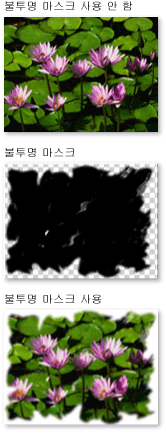
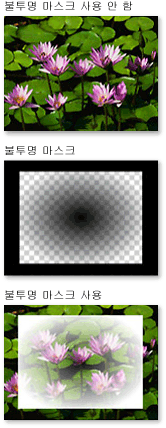

# 불투명 마스크 개요
불투명 마스크를 사용하면 요소나 시각적 표시의 일부를 투명 또는 부분 투명하게 만들 수 있습니다.  불투명 마스크를 만들려면 <xref:System.Windows.Media.Visual> 또는 요소의 <xref:System.Windows.UIElement.OpacityMask%2A> 속성에 <xref:System.Windows.Media.Brush>를 적용합니다.  브러시는 요소 또는 시각적 표시에 매핑되며 각 브러시 픽셀의 불투명도 값은 요소 또는 시각적 표시의 각 해당 픽셀에 대한 결과 불투명도를 결정하는 데 사용됩니다.  
  
 이 항목에는 다음 단원이 포함되어 있습니다.  
  
   
-   [사전 요구 사항](#prereqs)  
  
-   [불투명 마스크를 사용하여 시각적 효과 만들기](#opacitymasks)  
  
-   [불투명 마스크 만들기](#creatingopacitymasks)  
  
-   [그라데이션을 불투명 마스크로 사용](#creatingopacitymaskswithgradients)  
  
-   [불투명 마스크에 그라데이션 중지점 지정](#specifyinggradientcolors)  
  
-   [이미지를 불투명 마스크로 사용](#usingimageasopacitymask)  
  
-   [그리기에서 불투명 마스크 만들기](#drawingbrushasopacitymask)  
  
-   [관련 항목](#seeAlsoToggle)  
  
   
## 사전 요구 사항  
 이 개요에서는 <xref:System.Windows.Media.Brush> 개체에 익숙하다고 가정합니다.  브러시 사용에 대한 소개는 [단색 및 그라데이션을 사용한 그리기 개요](../../../../docs/framework/wpf/graphics-multimedia/painting-with-solid-colors-and-gradients-overview.md)를 참조하십시오.  <xref:System.Windows.Media.ImageBrush> 및 <xref:System.Windows.Media.DrawingBrush>에 대한 자세한 내용은 [이미지, 그림 및 시각적 표시로 그리기](../../../../docs/framework/wpf/graphics-multimedia/painting-with-images-drawings-and-visuals.md)를 참조하십시오.  
  
   
## 불투명 마스크를 사용하여 시각적 효과 만들기  
 불투명 마스크는 해당 콘텐츠를 요소나 시각적 표시에 매핑하여 작동합니다.  그런 다음 각 브러시 픽셀의 [알파 채널](GTMT)은 요소 또는 시각적 표시의 해당 픽셀에 대한 결과 불투명도를 결정하는 데 사용됩니다. 브러시의 실제 색은 무시됩니다.  브러시의 지정된 부분이 투명한 경우 요소 또는 시각적 표시의 해당 부분이 투명하게 됩니다.  브러시의 지정된 부분이 불투명한 경우 요소 또는 시각적 표시의 해당 부분은 변경되지 않습니다.  불투명 마스크에 의해 지정된 불투명도는 요소나 시각적 표시에 있는 모든 불투명도 설정과 결합됩니다.  예를 들어 요소가 25% 불투명하고 완전 불투명에서 완전 투명으로 전환되는 불투명 마스크가 적용될 경우 결과적으로 25% 불투명도에서 완전 투명으로 전환되는 요소가 됩니다.  
  
> [!NOTE]
>  이 개요의 예제에서는 이미지 요소에 불투명 마스크를 사용하는 방법을 설명하지만 패널 및 컨트롤을 비롯한 모든 요소 또는 <xref:System.Windows.Media.Visual>에 불투명 마스크를 적용할 수도 있습니다.  
  
 불투명 마스크는 뷰에서 점차 사라지는 이미지 또는 단추를 만들거나 요소에 질감을 추가하거나 그라데이션을 결합하여 유리 같은 표면을 만드는 경우처럼 흥미로운 시각적 효과를 만드는 데 사용됩니다.  다음 그림에서는 불투명 마스크의 사용을 보여 줍니다.  마스크의 투명한 부분을 표시하기 위해 바둑판 배경이 사용됩니다.  
  
   
불투명 마스크 샘플  
  
   
## 불투명 마스크 만들기  
 불투명 마스크를 만들려면 <xref:System.Windows.Media.Brush>를 만들고 요소 또는 시각적 표시의 <xref:System.Windows.UIElement.OpacityMask%2A> 속성에 적용합니다.  모든 형식의 <xref:System.Windows.Media.Brush>를 불투명 마스크로 사용할 수 있습니다.  
  
-   <xref:System.Windows.Media.LinearGradientBrush>, <xref:System.Windows.Media.RadialGradientBrush>: 요소나 시각적 표시를 뷰에서 개체가 점차 사라지도록 만드는 데 사용됩니다.  
  
     다음 이미지에서는 불투명 마스크로 사용된 <xref:System.Windows.Media.LinearGradientBrush>를 보여 줍니다.  
  
       
LinearGradientBrush 불투명 마스크 예제  
  
-   <xref:System.Windows.Media.ImageBrush>: 질감과 부드러운 또는 찢어진 가장자리 효과를 만드는 데 사용됩니다.  
  
     다음 이미지에서는 불투명 마스크로 사용된 <xref:System.Windows.Media.ImageBrush>를 보여 줍니다.  
  
       
LinearGradientBrush 불투명 마스크 예제  
  
-   <xref:System.Windows.Media.DrawingBrush>: 도형, 이미지 및 그라데이션의 패턴에서 복잡한 불투명 마스크를 만드는 데 사용됩니다.  
  
     다음 이미지에서는 불투명 마스크로 사용된 <xref:System.Windows.Media.DrawingBrush>를 보여 줍니다.  
  
       
DrawingBrush 불투명 마스크 예제  
  
 그라데이션 브러시\(<xref:System.Windows.Media.LinearGradientBrush> 및 <xref:System.Windows.Media.RadialGradientBrush>\)는 특히 불투명 마스크로 사용하기에 적합합니다.  <xref:System.Windows.Media.SolidColorBrush>는 영역을 균일한 색으로 채우므로 제한된 불투명 마스크를 만듭니다. <xref:System.Windows.Media.SolidColorBrush>를 사용하는 것은 요소 또는 시각적 표시의 <xref:System.Windows.UIElement.OpacityMask%2A> 속성을 설정하는 것과 같습니다.  
  
   
## 그라데이션을 불투명 마스크로 사용  
 그라데이션 채우기를 만들려면 둘 이상의 그라데이션 중지점을 지정합니다.  각 그라데이션 중지점은 색과 위치를 설명합니다. 그라데이션 만들기 및 사용에 대한 자세한 내용은 [단색 및 그라데이션을 사용한 그리기 개요](../../../../docs/framework/wpf/graphics-multimedia/painting-with-solid-colors-and-gradients-overview.md)를 참조하십시오.  혼합 색 대신에 불투명 마스크 그라데이션이 알파 채널 값을 혼합한다는 점을 제외하고 그라데이션을 불투명 마스크로 사용할 때와 프로세스가 동일합니다.  따라서 그라데이션 콘텐츠의 실제 색은 중요하지 않으며 각 색의 알파 채널 또는 불투명도만 중요합니다.  예를 들면 다음과 같습니다.  
  
 [!code-xml[OpacityMasksExample#LinearGradientOpacityMaskonImage](../../../../samples/snippets/csharp/VS_Snippets_Wpf/OpacityMasksExample/CS/GradientBrushExample.xaml#lineargradientopacitymaskonimage)]
 [!code-xml[OpacityMasksExample#LinearGradientOpacityMaskonImage](../../../../samples/snippets/xaml/VS_Snippets_Wpf/OpacityMasksExample/XAML/GradientBrushExample.xaml#lineargradientopacitymaskonimage)]  
  
   
## 불투명 마스크에 그라데이션 중지점 지정  
 앞의 예제에서 시스템 정의 색 <xref:System.Windows.Media.Colors.Black%2A>이 그라데이션의 시작 색으로 사용됩니다.  <xref:System.Windows.Media.Colors.Transparent%2A>를 제외한 <xref:System.Windows.Media.Colors> 클래스의 모든 색이 완전히 불투명하므로 단순히 그라데이션 불투명 마스크의 시작 색을 정의하기 위해 이러한 색을 사용할 수 있습니다.  
  
 불투명 마스크를 정의할 때 알파 값을 추가로 제어하기 위해 태그에서 [!INCLUDE[TLA#tla_argb](../../../../includes/tlasharptla-argb-md.md)] 16진수 표기법을 사용하거나 <xref:System.Windows.Media.Color.FromScRgb%2A?displayProperty=fullName> 메서드를 사용하여 색의 알파 채널을 지정할 수 있습니다.  
  
   
### "XAML"에서 색 불투명도 지정  
 [!INCLUDE[TLA#tla_xaml](../../../../includes/tlasharptla-xaml-md.md)]에서는 [!INCLUDE[TLA2#tla_argb](../../../../includes/tla2sharptla-argb-md.md)] 16진수 표기법을 사용하여 개별 색의 불투명도를 지정합니다.  [!INCLUDE[TLA2#tla_argb](../../../../includes/tla2sharptla-argb-md.md)] 16진수 표기법에는 다음 구문이 사용됩니다.  
  
 `#`**aa** *rrggbb*  
  
 위 줄에서 *aa*는 색의 불투명도를 지정하는 데 사용되는 2자리 16진수 값을 나타냅니다.  *rr*, *gg* 및 *bb*는 각각 색에서 빨간색, 녹색 및 파란색의 양을 지정하는 데 사용되는 2자리 16진수 값을 나타냅니다.  각 16진수는 0\-9 또는 A\-F의 값을 가집니다.  0이 가장 작은 값이고 F가 가장 큰 값입니다.  알파 값이 00이면 색이 완전히 투명해지고 알파 값이 FF이면 색이 완전히 불투명해집니다.  다음 예제에서는 두 개의 색을 지정하기 위해 16진수 [!INCLUDE[TLA2#tla_argb](../../../../includes/tla2sharptla-argb-md.md)] 표기법이 사용됩니다.  첫 번째는 완전히 불투명하고 두 번째는 완전히 투명합니다.  
  
 [!code-xml[OpacityMasksExample#AARRGGBBValueonOpacityMask](../../../../samples/snippets/csharp/VS_Snippets_Wpf/OpacityMasksExample/CS/GradientBrushExample.xaml#aarrggbbvalueonopacitymask)]
 [!code-xml[OpacityMasksExample#AARRGGBBValueonOpacityMask](../../../../samples/snippets/xaml/VS_Snippets_Wpf/OpacityMasksExample/XAML/GradientBrushExample.xaml#aarrggbbvalueonopacitymask)]  
  
   
## 이미지를 불투명 마스크로 사용  
 이미지를 불투명 마스크로 사용할 수도 있습니다.  다음 이미지에서는 예제를 보여 줍니다.  마스크의 투명한 부분을 표시하기 위해 바둑판 배경이 사용됩니다.  
  
   
불투명 마스크 샘플  
  
 이미지를 불투명 마스크로 사용하려면 <xref:System.Windows.Media.ImageBrush>를 사용하여 이미지를 포함합니다.  불투명 마스크로 사용할 이미지를 만들 때 [!INCLUDE[TLA#tla_png](../../../../includes/tlasharptla-png-md.md)]와 같은 여러 수준의 투명도를 지원하는 형식으로 이미지를 저장합니다.  다음 예제에서는 이전 그림을 만드는 데 사용된 코드를 보여 줍니다.  
  
 [!code-xml[OpacityMasksExample#UIElementOpacityMask](../../../../samples/snippets/csharp/VS_Snippets_Wpf/OpacityMasksExample/CS/ImageBrushExample.xaml#uielementopacitymask)]
 [!code-xml[OpacityMasksExample#UIElementOpacityMask](../../../../samples/snippets/xaml/VS_Snippets_Wpf/OpacityMasksExample/XAML/ImageBrushExample.xaml#uielementopacitymask)]  
  
   
### 바둑판식 이미지를 불투명 마스크로 사용  
 다음 예제에서는 동일한 이미지가 또 다른 <xref:System.Windows.Media.ImageBrush>와 함께 사용되지만 50픽셀 정사각형의 이미지 바둑판을 생성하기 위해 브러시의 바둑판식 배열 기능이 사용됩니다.  
  
 [!code-xml[OpacityMasksExample#TiledImageasOpacityMask](../../../../samples/snippets/csharp/VS_Snippets_Wpf/OpacityMasksExample/CS/ImageBrushExample.xaml#tiledimageasopacitymask)]
 [!code-xml[OpacityMasksExample#TiledImageasOpacityMask](../../../../samples/snippets/xaml/VS_Snippets_Wpf/OpacityMasksExample/XAML/ImageBrushExample.xaml#tiledimageasopacitymask)]  
  
   
## 그리기에서 불투명 마스크 만들기  
 그리기를 불투명 마스크로 사용할 수 있습니다.  그리기 내에 포함된 도형을 그라데이션, 단색, 이미지 또는 심지어 다른 그리기로 채울 수 있습니다.  다음 이미지에서는 불투명 마스크로 사용된 그리기의 예제를 보여 줍니다.  마스크의 투명한 부분을 표시하기 위해 바둑판 배경이 사용됩니다.  
  
   
DrawingBrush 불투명 마스크 예제  
  
 그리기를 불투명 마스크로 사용하려면 <xref:System.Windows.Media.DrawingBrush>를 사용하여 그리기를 포함합니다.  다음 예제에서는 이전 그림을 만드는 데 사용된 코드를 보여 줍니다.  
  
 [!code-xml[OpacityMasksExample#OpacityMaskfromDrawing](../../../../samples/snippets/csharp/VS_Snippets_Wpf/OpacityMasksExample/CS/DrawingBrushExample.xaml#opacitymaskfromdrawing)]
 [!code-xml[OpacityMasksExample#OpacityMaskfromDrawing](../../../../samples/snippets/xaml/VS_Snippets_Wpf/OpacityMasksExample/XAML/DrawingBrushExample.xaml#opacitymaskfromdrawing)]  
  
   
### 바둑판식 그리기를 불투명 마스크로 사용  
 <xref:System.Windows.Media.ImageBrush>와 마찬가지로 <xref:System.Windows.Media.DrawingBrush>에서 그리기를 바둑판식으로 배열하도록 만들 수 있습니다.  다음 예제에서는 바둑판식 불투명 마스크를 만들기 위해 그리기 브러시가 사용됩니다.  
  
 [!code-xml[OpacityMasksExample#TiledDrawingasOpacityMask](../../../../samples/snippets/csharp/VS_Snippets_Wpf/OpacityMasksExample/CS/DrawingBrushExample.xaml#tileddrawingasopacitymask)]
 [!code-xml[OpacityMasksExample#TiledDrawingasOpacityMask](../../../../samples/snippets/xaml/VS_Snippets_Wpf/OpacityMasksExample/XAML/DrawingBrushExample.xaml#tileddrawingasopacitymask)]  
  
## 참고 항목  
 [이미지, 그림 및 시각적 표시로 그리기](../../../../docs/framework/wpf/graphics-multimedia/painting-with-images-drawings-and-visuals.md)   
 [단색 및 그라데이션을 사용한 그리기 개요](../../../../docs/framework/wpf/graphics-multimedia/painting-with-solid-colors-and-gradients-overview.md)