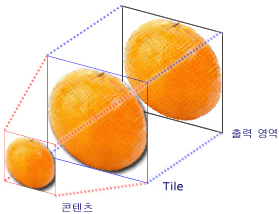
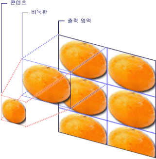

# 이미지, 그림 및 시각적 표시로 그리기
이 항목에서는 <xref:System.Windows.Media.ImageBrush>, <xref:System.Windows.Media.DrawingBrush> 및 <xref:System.Windows.Media.VisualBrush> 개체를 사용하여 영역에 이미지, <xref:System.Windows.Media.Drawing> 또는 <xref:System.Windows.Media.Visual>을 그리는 방법을 보여 줍니다.  
  
 [!INCLUDE[autoOutline](../Token/autoOutline_md.md)]  
  
   
## 사전 요구 사항  
 이 항목을 이해하려면 [!INCLUDE[TLA#tla_winclient](../../../../includes/tlasharptla-winclient-md.md)]에서 제공하는 여러 브러시 형식과 해당 기본 기능에 익숙해야 합니다.  브러시에 대한 소개를 보려면 [WPF 브러시 개요](../../../../docs/framework/wpf/graphics-multimedia/wpf-brushes-overview.md)를 참조하십시오.  
  
   
## 이미지로 영역 그리기  
 <xref:System.Windows.Media.ImageBrush>는 <xref:System.Windows.Media.ImageSource>로 영역을 그립니다.  <xref:System.Windows.Media.ImageBrush>와 함께 사용하는 가장 흔한 <xref:System.Windows.Media.ImageSource> 형식은 비트맵 그래픽을 나타내는 <xref:System.Windows.Media.Imaging.BitmapImage>입니다.  <xref:System.Windows.Media.DrawingImage>를 사용하면 <xref:System.Windows.Media.Drawing> 개체를 사용하여 그릴 수 있지만 대신 <xref:System.Windows.Media.DrawingBrush>를 사용하는 것이 더 간단합니다.  <xref:System.Windows.Media.ImageSource> 개체에 대한 자세한 내용은 [이미징 개요](../../../../docs/framework/wpf/graphics-multimedia/imaging-overview.md)를 참조하십시오.  
  
 <xref:System.Windows.Media.ImageBrush>로 그리려면 <xref:System.Windows.Media.Imaging.BitmapImage>를 만들고 이를 사용하여 비트맵 콘텐츠를 로드합니다.  그런 다음 <xref:System.Windows.Media.Imaging.BitmapImage>를 사용하여 <xref:System.Windows.Media.ImageBrush>의 <xref:System.Windows.Media.ImageBrush.ImageSource%2A> 속성을 설정합니다.  마지막으로 <xref:System.Windows.Media.ImageBrush>를 그릴 개체에 적용합니다.  [!INCLUDE[TLA#tla_xaml](../../../../includes/tlasharptla-xaml-md.md)]에서는 <xref:System.Windows.Media.ImageBrush>의 <xref:System.Windows.Media.ImageBrush.ImageSource%2A> 속성을 로드할 이미지의 경로로 설정하기만 해도 됩니다.  
  
 다른 모든 <xref:System.Windows.Media.Brush> 개체와 마찬가지로 <xref:System.Windows.Media.ImageBrush>는 도형, 패널, 컨트롤 및 텍스트와 같은 개체를 그리는 데 사용할 수 있습니다.  다음 그림에서는 <xref:System.Windows.Media.ImageBrush>로 얻을 수 있는 몇 가지 효과를 보여 줍니다.  
  
   
ImageBrush로 그린 개체  
  
 기본적으로 <xref:System.Windows.Media.ImageBrush>는 그리고 있는 영역을 완전히 채우도록 이미지를 늘이므로 그려지는 영역의 가로 세로 비율이 이미지와 다른 경우 이미지가 왜곡될 수 있습니다.  <xref:System.Windows.Media.TileBrush.Stretch%2A> 속성을 기본값인 <xref:System.Windows.Media.Stretch>에서 <xref:System.Windows.Media.Stretch>, <xref:System.Windows.Media.Stretch> 또는 <xref:System.Windows.Media.Stretch>로 변경하여 이 동작을 변경할 수 있습니다.  <xref:System.Windows.Media.ImageBrush>가 <xref:System.Windows.Media.TileBrush> 형식이므로 이미지 브러시가 출력 영역을 채우는 방법을 정확히 지정할 수 있으며 패턴을 만들 수도 있습니다.  고급 <xref:System.Windows.Media.TileBrush> 기능에 대한 자세한 내용은 [TileBrush 개요](../../../../docs/framework/wpf/graphics-multimedia/tilebrush-overview.md)를 참조하십시오.  
  
   
## 예제: 비트맵 이미지로 개체 그리기  
 다음 예제에서는 <xref:System.Windows.Media.ImageBrush>를 사용하여 <xref:System.Windows.Controls.Canvas>의 <xref:System.Windows.Controls.Panel.Background%2A>를 그립니다.  
  
 [!code-xml[BrushOverviewExamples_snip#GraphicsMMImageBrushAsCanvasBackgroundExampleWholePage](../../../../samples/snippets/xaml/VS_Snippets_Wpf/BrushOverviewExamples_snip/XAML/ImageBrushExample.xaml#graphicsmmimagebrushascanvasbackgroundexamplewholepage)]  
  
 [!code-csharp[BrushOverviewExamples_procedural_snip#GraphicsMMImageBrushAsCanvasBackgroundExampleWholePage](../../../../samples/snippets/csharp/VS_Snippets_Wpf/BrushOverviewExamples_procedural_snip/CSharp/ImageBrushExample.cs#graphicsmmimagebrushascanvasbackgroundexamplewholepage)]
 [!code-vb[BrushOverviewExamples_procedural_snip#GraphicsMMImageBrushAsCanvasBackgroundExampleWholePage](../../../../samples/snippets/visualbasic/VS_Snippets_Wpf/BrushOverviewExamples_procedural_snip/visualbasic/imagebrushexample.vb#graphicsmmimagebrushascanvasbackgroundexamplewholepage)]  
  
   
## 그림으로 영역 그리기  
 <xref:System.Windows.Media.DrawingBrush>를 사용하면 도형, 텍스트, 이미지 및 비디오로 영역을 그릴 수 있습니다.  그리기 브러시 내의 도형 자체를 단색, 그라데이션, 이미지 또는 다른 <xref:System.Windows.Media.DrawingBrush>로 그릴 수 있습니다.  다음 그림에서는 <xref:System.Windows.Media.DrawingBrush>의 몇 가지 용례를 보여 줍니다.  
  
   
DrawingBrush로 그린 개체  
  
 <xref:System.Windows.Media.DrawingBrush>는 <xref:System.Windows.Media.Drawing> 개체로 영역을 그립니다.  <xref:System.Windows.Media.Drawing> 개체는 도형, 비트맵, 비디오 또는 텍스트 줄과 같은 표시 가능한 콘텐츠를 나타냅니다.  그리기 형식이 다르면 나타내는 콘텐츠 형식도 다릅니다.  다음은 여러 그리기 개체 형식을 보여 주는 목록입니다.  
  
-   <xref:System.Windows.Media.GeometryDrawing> \- 도형을 그립니다.  
  
-   <xref:System.Windows.Media.ImageDrawing> \- 이미지를 그립니다.  
  
-   <xref:System.Windows.Media.GlyphRunDrawing> \- 텍스트를 그립니다.  
  
-   <xref:System.Windows.Media.VideoDrawing> – 오디오 또는 비디오 파일을 재생합니다.  
  
-   <xref:System.Windows.Media.DrawingGroup> \- 기타 그림을 그립니다.  다른 그리기를 단일 합성 그리기로 결합하려면 그리기 그룹을 사용합니다.  
  
 <xref:System.Windows.Media.Drawing> 개체에 대한 자세한 내용은 [Drawing 개체 개요](../../../../docs/framework/wpf/graphics-multimedia/drawing-objects-overview.md)를 참조하십시오.  
  
 <xref:System.Windows.Media.ImageBrush>처럼 <xref:System.Windows.Media.DrawingBrush>도 <xref:System.Windows.Media.DrawingBrush.Drawing%2A>을 늘여 출력 영역을 채웁니다.  <xref:System.Windows.Media.TileBrush.Stretch%2A> 속성을 기본 설정인 <xref:System.Windows.Media.Stretch>에서 다른 설정으로 변경하여 이러한 동작을 재정의할 수 있습니다.  자세한 내용은 <xref:System.Windows.Media.TileBrush.Stretch%2A> 속성을 참조하십시오.  
  
   
## 예제: 그림으로 개체 그리기  
 다음 예제에서는 세 개의 타원 그림으로 개체를 그리는 방법을 보여 줍니다.  <xref:System.Windows.Media.GeometryDrawing>은 타원을 나타내는 데 사용합니다.  
  
 [!code-xml[BrushOverviewExamples_snip#GraphicsMMDrawingBrushAsButtonBackgroundExample](../../../../samples/snippets/xaml/VS_Snippets_Wpf/BrushOverviewExamples_snip/XAML/DrawingBrushExample.xaml#graphicsmmdrawingbrushasbuttonbackgroundexample)]  
  
 [!code-csharp[BrushOverviewExamples_procedural_snip#GraphicsMMDrawingBrushAsButtonBackgroundExample1](../../../../samples/snippets/csharp/VS_Snippets_Wpf/BrushOverviewExamples_procedural_snip/CSharp/DrawingBrushExample.cs#graphicsmmdrawingbrushasbuttonbackgroundexample1)]
 [!code-vb[BrushOverviewExamples_procedural_snip#GraphicsMMDrawingBrushAsButtonBackgroundExample1](../../../../samples/snippets/visualbasic/VS_Snippets_Wpf/BrushOverviewExamples_procedural_snip/visualbasic/drawingbrushexample.vb#graphicsmmdrawingbrushasbuttonbackgroundexample1)]  
  
   
## 시각적 표시로 영역 그리기  
 모든 브러시 중에서 가장 강력하고 다재다능한 <xref:System.Windows.Media.VisualBrush>는 <xref:System.Windows.Media.Visual>로 영역을 그립니다.  <xref:System.Windows.Media.Visual>은 여러 유용한 그래픽 형식의 부모로 사용되는 하위 수준 그래픽 형식입니다.  예를 들어 <xref:System.Windows.Window>, <xref:System.Windows.FrameworkElement> 및 <xref:System.Windows.Controls.Control> 클래스는 모두 <xref:System.Windows.Media.Visual> 개체 형식입니다.  <xref:System.Windows.Media.VisualBrush>를 사용하면 거의 모든 [!INCLUDE[TLA#tla_winclient](../../../../includes/tlasharptla-winclient-md.md)] 그래픽 개체로 영역을 그릴 수 있습니다.  
  
> [!NOTE]
>  <xref:System.Windows.Media.VisualBrush>는 <xref:System.Windows.Freezable> 개체 형식이지만 해당 <xref:System.Windows.Media.VisualBrush.Visual%2A> 속성을 `null` 외의 값으로 설정하는 경우 고정할\(읽기 전용으로 만들\) 수 없습니다.  
  
 <xref:System.Windows.Media.VisualBrush>의 <xref:System.Windows.Media.VisualBrush.Visual%2A> 콘텐츠를 지정하는 방법은 다음과 같이 두 가지가 있습니다.  
  
-   새 <xref:System.Windows.Media.Visual>을 만들고 이를 사용하여 <xref:System.Windows.Media.VisualBrush>의 <xref:System.Windows.Media.VisualBrush.Visual%2A> 속성을 설정합니다.  예제를 보려면 뒤에 나오는 [예제: 시각적 표시로 개체 그리기](#examplevisualbrush1) 단원을 참조하십시오.  
  
-   기존 <xref:System.Windows.Media.Visual>을 사용하여 대상 <xref:System.Windows.Media.Visual>의 복제 이미지를 만듭니다.  그런 다음 <xref:System.Windows.Media.VisualBrush>를 사용하여 반사와 확대 같은 재미있는 효과를 만들 수 있습니다.  예제를 보려면 [예제: 반사 만들기](#examplevisualbrush2) 단원을 참조하십시오.  
  
 <xref:System.Windows.Media.VisualBrush>의 새 <xref:System.Windows.Media.VisualBrush.Visual%2A>을 만들 때 <xref:System.Windows.Media.Visual>이 <xref:System.Windows.UIElement>\(예: 패널 또는 컨트롤\)인 경우 <xref:System.Windows.Media.VisualBrush.AutoLayoutContent%2A> 속성을 `true`로 설정하면 레이아웃 시스템이 <xref:System.Windows.UIElement>와 해당 자식 요소에서 실행됩니다.  그러나 루트 <xref:System.Windows.UIElement>는 기본적으로 나머지 시스템\(스타일\)과 분리되어 있으므로 외부 레이아웃이 이 경계로 스며들 수 없습니다.  따라서 <xref:System.Windows.UIElement>는 해당 부모만 <xref:System.Windows.Media.VisualBrush>여서 그려지는 영역에 맞게 자체의 크기가 자동으로 조정되지 않으므로 크기를 명시적으로 지정해야 합니다.  [!INCLUDE[TLA#tla_winclient](../../../../includes/tlasharptla-winclient-md.md)]의 레이아웃에 대한 자세한 내용은 [레이아웃](../../../../docs/framework/wpf/advanced/layout.md)를 참조하십시오.  
  
 <xref:System.Windows.Media.ImageBrush> 및 <xref:System.Windows.Media.DrawingBrush>처럼 <xref:System.Windows.Media.VisualBrush>도 콘텐츠를 늘여 출력 영역을 채웁니다.  <xref:System.Windows.Media.TileBrush.Stretch%2A> 속성을 기본 설정인 <xref:System.Windows.Media.Stretch>에서 다른 설정으로 변경하여 이러한 동작을 재정의할 수 있습니다.  자세한 내용은 <xref:System.Windows.Media.TileBrush.Stretch%2A> 속성을 참조하십시오.  
  
   
## 예제: 시각적 표시로 개체 그리기  
 다음 예제에서는 여러 컨트롤과 패널을 사용하여 사각형을 그립니다.  
  
 [!code-xml[BrushOverviewExamples_snip#GraphicsMMVisualBrushAsRectangleBackgroundExample](../../../../samples/snippets/xaml/VS_Snippets_Wpf/BrushOverviewExamples_snip/XAML/VisualBrushExample.xaml#graphicsmmvisualbrushasrectanglebackgroundexample)]  
  
 [!code-csharp[BrushOverviewExamples_procedural_snip#GraphicsMMVisualBrushAsRectangleBackgroundExample1](../../../../samples/snippets/csharp/VS_Snippets_Wpf/BrushOverviewExamples_procedural_snip/CSharp/VisualBrushExample.cs#graphicsmmvisualbrushasrectanglebackgroundexample1)]
 [!code-vb[BrushOverviewExamples_procedural_snip#GraphicsMMVisualBrushAsRectangleBackgroundExample1](../../../../samples/snippets/visualbasic/VS_Snippets_Wpf/BrushOverviewExamples_procedural_snip/visualbasic/visualbrushexample.vb#graphicsmmvisualbrushasrectanglebackgroundexample1)]  
  
   
## 예제: 반사 만들기  
 앞의 예제에서는 배경으로 사용할 새 <xref:System.Windows.Media.Visual>을 만드는 방법을 보여 주었습니다.  <xref:System.Windows.Media.VisualBrush>를 사용하여 기존의 시각적 효과를 표시할 수도 있습니다. 이 기능을 사용하면 반사 및 확대와 같은 흥미로운 시각적 효과를 만들 수 있습니다.  다음 예제에서는 <xref:System.Windows.Media.VisualBrush>를 사용하여 여러 개의 요소가 포함된 <xref:System.Windows.Controls.Border>의 리플렉션을 만듭니다.  다음 그림에서는 이 예제가 만들어내는 결과를 보여 줍니다.  
  
   
반사된 표시 개체  
  
 [!code-csharp[visualbrush_markup_snip#GraphicsMMVisualBrushReflectionExampleWholePage](../../../../samples/snippets/csharp/VS_Snippets_Wpf/visualbrush_markup_snip/CSharp/ReflectionExample.cs#graphicsmmvisualbrushreflectionexamplewholepage)]
 [!code-vb[visualbrush_markup_snip#GraphicsMMVisualBrushReflectionExampleWholePage](../../../../samples/snippets/visualbasic/VS_Snippets_Wpf/visualbrush_markup_snip/visualbasic/reflectionexample.vb#graphicsmmvisualbrushreflectionexamplewholepage)]
 [!code-xml[visualbrush_markup_snip#GraphicsMMVisualBrushReflectionExampleWholePage](../../../../samples/snippets/xaml/VS_Snippets_Wpf/visualbrush_markup_snip/XAML/ReflectionExample.xaml#graphicsmmvisualbrushreflectionexamplewholepage)]  
  
 화면 일부를 확대하고 리플렉션을 만드는 방법을 보여 주는 추가 예제를 보려면 [VisualBrush 샘플](http://go.microsoft.com/fwlink/?LinkID=160049)을 참조하십시오.  
  
   
## TileBrush 기능  
 <xref:System.Windows.Media.ImageBrush>, <xref:System.Windows.Media.DrawingBrush> 및 <xref:System.Windows.Media.VisualBrush>는 <xref:System.Windows.Media.TileBrush> 개체의 형식입니다.  <xref:System.Windows.Media.TileBrush> 개체를 사용하면 이미지, 그림 또는 시각적 표시로 영역을 그리는 방법을 다양하게 제어할 수 있습니다.  예를 들어 하나의 늘어난 이미지를 사용하여 영역을 그리는 대신 패턴을 만드는 일련의 이미지 바둑판을 사용하여 영역을 그릴 수 있습니다.  
  
 <xref:System.Windows.Media.TileBrush>의 세 가지 기본 구성 요소는 콘텐츠, 바둑판 및 출력 영역입니다.  
  
   
하나의 바둑판을 포함하는 TileBrush의 구성 요소  
  
   
여러 바둑판을 포함하는 TileBrush의 구성 요소  
  
 <xref:System.Windows.Media.TileBrush> 개체의 바둑판식 배열 기능에 대한 자세한 내용은 [TileBrush 개요](../../../../docs/framework/wpf/graphics-multimedia/tilebrush-overview.md)를 참조하십시오.  
  
## 참고 항목  
 <xref:System.Windows.Media.ImageBrush>   
 <xref:System.Windows.Media.DrawingBrush>   
 <xref:System.Windows.Media.VisualBrush>   
 <xref:System.Windows.Media.TileBrush>   
 [TileBrush 개요](../../../../docs/framework/wpf/graphics-multimedia/tilebrush-overview.md)   
 [WPF 브러시 개요](../../../../docs/framework/wpf/graphics-multimedia/wpf-brushes-overview.md)   
 [이미징 개요](../../../../docs/framework/wpf/graphics-multimedia/imaging-overview.md)   
 [Drawing 개체 개요](../../../../docs/framework/wpf/graphics-multimedia/drawing-objects-overview.md)   
 [불투명 마스크 개요](../../../../docs/framework/wpf/graphics-multimedia/opacity-masks-overview.md)   
 [WPF 그래픽 렌더링 개요](../../../../docs/framework/wpf/graphics-multimedia/wpf-graphics-rendering-overview.md)   
 [ImageBrush 샘플](http://go.microsoft.com/fwlink/?LinkID=160005)   
 [VisualBrush 샘플](http://go.microsoft.com/fwlink/?LinkID=160049)