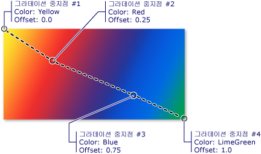
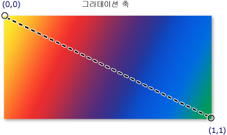

# 단색 및 그라데이션을 사용한 그리기 개요Painting with Solid Colors and Gradients Overview
이 항목에서는 사용 하는 방법을 설명 <xref:System.Windows.Media.SolidColorBrush>, <xref:System.Windows.Media.LinearGradientBrush>, 및 <xref:System.Windows.Media.RadialGradientBrush> 단색, 선형 그라데이션 및 방사형 그라데이션으로으로 그리려면 개체입니다.This topic describes how to use <xref:System.Windows.Media.SolidColorBrush>, <xref:System.Windows.Media.LinearGradientBrush>, and <xref:System.Windows.Media.RadialGradientBrush> objects to paint with solid colors, linear gradients, and radial gradients.  
  

  
   
## 단색으로 영역 그리기Painting an Area with a Solid Color  
 모든 플랫폼의 가장 일반적인 작업 중 하나을 단색으로 영역을 그리는 것 <xref:System.Windows.Media.Color>합니다.One of the most common operations in any platform is to paint an area with a solid <xref:System.Windows.Media.Color>. 이 작업을 수행 하려면 [!INCLUDE[TLA#tla_winclient](../../../../includes/tlasharptla-winclient-md.md)] 제공는 <xref:System.Windows.Media.SolidColorBrush> 클래스입니다.To accomplish this task, [!INCLUDE[TLA#tla_winclient](../../../../includes/tlasharptla-winclient-md.md)] provides the <xref:System.Windows.Media.SolidColorBrush> class. 다음 섹션에서는 다양 한 방법으로 그리려면는 <xref:System.Windows.Media.SolidColorBrush>합니다.The following sections describe the different ways to paint with a <xref:System.Windows.Media.SolidColorBrush>.  
  
   
### "XAML"에서 SolidColorBrush 사용Using a SolidColorBrush in "XAML"  
 [!INCLUDE[TLA2#tla_xaml](../../../../includes/tla2sharptla-xaml-md.md)]에서 단색으로 영역을 그리려면 다음 옵션 중 하나를 사용합니다.To paint an area with a solid color in [!INCLUDE[TLA2#tla_xaml](../../../../includes/tla2sharptla-xaml-md.md)], use one of the following options.  
  
-   미리 정의된 단색 브러시를 이름으로 선택합니다.Select a predefined solid color brush by name.  예를 들어 단추를 설정할 수 있습니다 <xref:System.Windows.Controls.Control.Background%2A> "Red" 또는 "MediumBlue"입니다.For example, you can set a button's <xref:System.Windows.Controls.Control.Background%2A> to "Red" or "MediumBlue".  정적 속성 참조의 다른 목록이 단색 브러시 미리 정의 된 <xref:System.Windows.Media.Brushes> 클래스입니다.For a list of other predefined solid color brushes, see the static properties of the <xref:System.Windows.Media.Brushes> class. 다음은 예제입니다.The following is an example.  
  
     [!code-xaml[BrushOverviewExamples_snip#SolidColorBrushNamedColor1XAML](../../../../samples/snippets/xaml/VS_Snippets_Wpf/BrushOverviewExamples_snip/XAML/SolidColorBrushExample.xaml#solidcolorbrushnamedcolor1xaml)]  
  
-   단색으로 조합할 빨강, 녹색 및 파랑의 양을 지정하여 32비트 색상표에서 색을 선택합니다.Choose a color from the 32-bit color palette by specifying the amounts of red, green, and blue to combine into a single solid color.  32비트 색상표에서 색을 지정하기 위한 형식은 "*#rrggbb*"입니다. 여기서 *rr*은 빨강의 상대적 양을 지정하는 2자리 16진수 숫자이고 *gg*는 녹색의 양을 지정하고, *bb*는 파랑의 양을 지정합니다.The format for specifying a color from the 32-bit palette is "*#rrggbb*", where *rr* is a two digit hexadecimal number specifying the relative amount of red, *gg* specifies the amount of green, and *bb* specifies the amount of blue.  또한 "#*aarrggbb*"로 색을 지정할 수도 있습니다. 여기서 *aa*는 색의 *알파* 값 또는 투명도를 지정합니다.Additionally, the color can be specified as "#*aarrggbb*" where *aa* specifies the *alpha* value, or transparency, of the color. 이 방법은 사용하면 부분적으로 투명한 색을 만들 수 있습니다.This approach enables you to create colors that are partially transparent.  다음 예제에서는 <xref:System.Windows.Controls.Control.Background%2A> 의 <xref:System.Windows.Controls.Button> 16 진수 표기법을 사용 하 여 완전히 불투명 한 빨간색으로 설정 됩니다.In the following example, the <xref:System.Windows.Controls.Control.Background%2A> of a <xref:System.Windows.Controls.Button> is set to fully-opaque red using hexadecimal notation.  
  
     [!code-xaml[BrushOverviewExamples_snip#SolidColorBrushHex1XAML](../../../../samples/snippets/xaml/VS_Snippets_Wpf/BrushOverviewExamples_snip/XAML/SolidColorBrushExample.xaml#solidcolorbrushhex1xaml)]  
  
-   속성 태그 구문을 사용 하 여 설명 하는 <xref:System.Windows.Media.SolidColorBrush>합니다.Use property tag syntax to describe a <xref:System.Windows.Media.SolidColorBrush>. 이 구문은 좀 더 복잡하지만 브러시의 불투명도 등의 추가 설정을 지정할 수 있습니다.This syntax is more verbose but enables you to specify additional settings, such as the brush's opacity. 다음 예제에서는 <xref:System.Windows.Controls.Control.Background%2A> 속성 두 <xref:System.Windows.Controls.Button> 요소는 완전히 불투명 한 빨간색으로 설정 됩니다.In the following example, the <xref:System.Windows.Controls.Control.Background%2A> properties of two <xref:System.Windows.Controls.Button> elements are set to fully-opaque red. 첫 번째 브러시 색은 미리 정의된 색 이름을 사용하여 설명됩니다.The first brush's color is described using a predefined color name. 두 번째 브러시 색은 16진수 표기법을 사용하여 설명됩니다.The second brush's color is described using hexadecimal notation.  
  
     [!code-xaml[BrushOverviewExamples_snip#SolidColorBrushPropertyTag1XAML](../../../../samples/snippets/xaml/VS_Snippets_Wpf/BrushOverviewExamples_snip/XAML/SolidColorBrushExample.xaml#solidcolorbrushpropertytag1xaml)]  
  
   
### 코드에서 SolidColorBrush를 사용하여 그리기Painting with a SolidColorBrush in Code  
 단색으로 영역을 그리려면 다음 옵션 중 하나를 사용합니다.To paint an area with a solid color in code, use one of the following options.  
  
-   제공 하는 미리 정의 된 브러시의 하나를 사용 하 여 <xref:System.Windows.Media.Brushes> 클래스입니다.Use one of the predefined brushes provided by the <xref:System.Windows.Media.Brushes> class. 다음 예제에서는 <xref:System.Windows.Controls.Control.Background%2A> 의 <xref:System.Windows.Controls.Button> 로 설정 된 <xref:System.Windows.Media.Brushes.Red%2A>합니다.In the following example, the <xref:System.Windows.Controls.Control.Background%2A> of a <xref:System.Windows.Controls.Button> is set to <xref:System.Windows.Media.Brushes.Red%2A>.  
  
     [!code-csharp[BrushOverviewExamples_snip#SolidColorBrushPredefinedBrush1CSharp](../../../../samples/snippets/csharp/VS_Snippets_Wpf/BrushOverviewExamples_snip/CSharp/SolidColorBrushExample.cs#solidcolorbrushpredefinedbrush1csharp)]  
  
-   만들기는 <xref:System.Windows.Media.SolidColorBrush> 설정 하 고 해당 <xref:System.Windows.Media.SolidColorBrush.Color%2A> 사용 하 여 속성을 <xref:System.Windows.Media.Color> 구조입니다.Create a <xref:System.Windows.Media.SolidColorBrush> and set its <xref:System.Windows.Media.SolidColorBrush.Color%2A> property using a <xref:System.Windows.Media.Color> structure. 미리 정의 된 색을 사용할 수 있습니다는 <xref:System.Windows.Media.Colors> 클래스 하거나 만들 수 있습니다는 <xref:System.Windows.Media.Color> 정적을 사용 하 여 <xref:System.Windows.Media.Color.FromArgb%2A> 메서드.You can use a predefined color from the <xref:System.Windows.Media.Colors> class or you can create a <xref:System.Windows.Media.Color> using the static <xref:System.Windows.Media.Color.FromArgb%2A> method.  
  
     설정 하는 방법을 보여 주는 다음 예제는 <xref:System.Windows.Media.SolidColorBrush.Color%2A> 속성은 <xref:System.Windows.Media.SolidColorBrush> 미리 정의 된 색을 사용 하 여 합니다.The following example shows how to set the <xref:System.Windows.Media.SolidColorBrush.Color%2A> property of a <xref:System.Windows.Media.SolidColorBrush> using a predefined color.  
  
     [!code-csharp[BrushOverviewExamples_snip#SolidColorBrushPredefinedColor1CSharp](../../../../samples/snippets/csharp/VS_Snippets_Wpf/BrushOverviewExamples_snip/CSharp/SolidColorBrushExample.cs#solidcolorbrushpredefinedcolor1csharp)]  
  
 정적 <xref:System.Windows.Media.Color.FromArgb%2A> 색의 알파, 빨간색, 녹색 및 파랑 값을 지정할 수 있습니다.The static <xref:System.Windows.Media.Color.FromArgb%2A> enables you to specify the color's alpha, red, green, and blue values. 이러한 각 값의 일반적인 범위는 0-255입니다.The typical range for each of these values is 0-255. 예를 들어 알파 값이 0이면 색이 완전히 투명하고, 값이 255이면 색이 완전히 불투명합니다.For example, an alpha value of 0 indicates that a color is completely transparent, while a value of 255 indicates the color is completely opaque. 마찬가지로 빨강 값이 0이면 색에 빨강이 전혀 없는 것이지만 255이면 최대의 빨강이 포함되어 있는 것입니다.Likewise, a red value of 0 indicates that a color has no red in it, while a value of 255 indicates a color has the maximum amount of red possible.  다음 예제에서 브러시의 색은 알파, 빨강, 녹색 및 파랑 값을 지정하여 설명됩니다.In the following example, a brush's color is described by specifying alpha, red, green, and blue values.  
  
 [!code-csharp[BrushOverviewExamples_snip#SolidColorBrushfromArgbExample1CSharp](../../../../samples/snippets/csharp/VS_Snippets_Wpf/BrushOverviewExamples_snip/CSharp/SolidColorBrushExample.cs#solidcolorbrushfromargbexample1csharp)]  
  
 색을 지정 하려면 다른 방법에 대 한 참조는 <xref:System.Windows.Media.Color> 참조 항목입니다.For additional ways to specify color, see the <xref:System.Windows.Media.Color> reference topic.  
  
   
## 그라데이션으로 영역 그리기Painting an Area with a Gradient  
 그라데이션 브러시는 축을 따라 서로 혼합되는 여러 색으로 영역을 그립니다.A gradient brush paints an area with multiple colors that blend into each other along an axis. 이를 사용하여 빛과 그림자를 나타내고 컨트롤에 3차원 느낌을 줄 수 있습니다.You can use them to create impressions of light and shadow, giving your controls a three-dimensional feel. 또한 유리, 크롬, 물, 기타 매끄러운 표면을 시뮬레이트하는 데도 사용할 수 있습니다.You can also use them to simulate glass, chrome, water, and other smooth surfaces.  [!INCLUDE[TLA2#tla_winclient](../../../../includes/tla2sharptla-winclient-md.md)]두 가지 유형의 그라데이션 브러시를 제공: <xref:System.Windows.Media.LinearGradientBrush> 및 <xref:System.Windows.Media.RadialGradientBrush>합니다. provides two types of gradient brushes: <xref:System.Windows.Media.LinearGradientBrush> and <xref:System.Windows.Media.RadialGradientBrush>.  
  
   
## 선형 그라데이션Linear Gradients  
 A <xref:System.Windows.Media.LinearGradientBrush> 선, 따라 정의 된 그라데이션으로 영역을 그립니다는 *그라데이션 축*합니다.A <xref:System.Windows.Media.LinearGradientBrush> paints an area with a gradient defined along a line, the *gradient axis*.  그라데이션 색과 함께 사용 하 여 그라데이션 축 해당 위치를 지정 <xref:System.Windows.Media.GradientStop> 개체입니다.You specify the gradient's colors and their location along the gradient axis using <xref:System.Windows.Media.GradientStop> objects.  그라데이션 축을 수정하여 가로 및 세로 그라데이션을 만들고 그라데이션 방향을 반대로 바꿀 수도 있습니다.You may also modify the gradient axis, which enables you to create horizontal and vertical gradients and to reverse the gradient direction. 그라데이션 축은 다음 섹션에서 설명합니다.The gradient axis is described in the next section. 기본적으로는 대각선 그라데이션이 생성됩니다.By default, a diagonal gradient is created.  
  
 다음 예제에서는 네 가지 색으로 선형 그라데이션을 만드는 코드를 보여 줍니다.The following example shows the code that creates a linear gradient with four colors.  
  
 [!code-xaml[GradientBrushExamples_snip#DiagonalGradient1XAML](../../../../samples/snippets/xaml/VS_Snippets_Wpf/GradientBrushExamples_snip/XAML/LinearGradientBrushExample.xaml#diagonalgradient1xaml)]  
  
 [!code-csharp[GradientBrushExamples_snip#DiagonalGradient1CSharp](../../../../samples/snippets/csharp/VS_Snippets_Wpf/GradientBrushExamples_snip/CSharp/LinearGradientBrushExample.cs#diagonalgradient1csharp)]  
  
 이 코드는 다음 그라데이션을 생성합니다.This code produces the following gradient:  
  
   
  
 **참고:** 이 항목의 그라데이션 예제는 시작점 및 끝점을 설정하기 위해 기본 좌표계를 사용합니다.**Note:** The gradient examples in this topic use the default coordinate system for setting start points and end points. 기본 좌표계는 경계 상자를 기준으로 합니다. 즉, 0은 경계 상자의 0%를 나타내고 1은 경계 상자의 100%를 나타냅니다.The default coordinate system is relative to a bounding box: 0 indicates 0 percent of the bounding box and 1 indicates 100 percent of the bounding box. 이 좌표 시스템을 설정 하 여 변경할 수 있습니다는 <xref:System.Windows.Media.GradientBrush.MappingMode%2A> 속성 값을 <xref:System.Windows.Media.BrushMappingMode.Absolute>합니다.You can change this coordinate system by setting the <xref:System.Windows.Media.GradientBrush.MappingMode%2A> property to the value <xref:System.Windows.Media.BrushMappingMode.Absolute>. 절대 좌표계는 경계 상자를 기준으로 하지 않습니다.An absolute coordinate system is not relative to a bounding box. 값은 로컬 공간에서 직접 해석됩니다.Values are interpreted directly in local space.  
  
 <xref:System.Windows.Media.GradientStop> 그라데이션 브러시의 기본 빌딩 블록입니다.The <xref:System.Windows.Media.GradientStop> is the basic building block of a gradient brush.  그라데이션 중지점 지정는 <xref:System.Windows.Media.GradientStop.Color%2A> 에 <xref:System.Windows.Media.GradientStop.Offset%2A> 그라데이션 축의 합니다.A gradient stop specifies a <xref:System.Windows.Media.GradientStop.Color%2A> at an <xref:System.Windows.Media.GradientStop.Offset%2A> along the gradient axis.  
  
-   그라데이션 중지점의 <xref:System.Windows.Media.GradientStop.Color%2A> 속성은 그라데이션 중지점의 색을 지정 합니다.The gradient stop's <xref:System.Windows.Media.GradientStop.Color%2A> property specifies the color of the gradient stop. 미리 정의 된 색을 사용 하 여 색을 설정할 수 있습니다 (에서 제공 되는 <xref:System.Windows.Media.Colors> 클래스) 또는 ScRGB 또는 ARGB 값을 지정 하 여 합니다.You may set the color by using a predefined color (provided by the <xref:System.Windows.Media.Colors> class) or by specifying ScRGB or ARGB values. [!INCLUDE[TLA2#tla_xaml](../../../../includes/tla2sharptla-xaml-md.md)]에서는 16진수 표기법을 사용하여 색을 설명할 수도 있습니다.In [!INCLUDE[TLA2#tla_xaml](../../../../includes/tla2sharptla-xaml-md.md)], you may also use hexadecimal notation to describe a color. 자세한 내용은 참조는 <xref:System.Windows.Media.Color> 구조입니다.For more information, see the <xref:System.Windows.Media.Color> structure.  
  
-   그라데이션 중지점의 <xref:System.Windows.Media.GradientStop.Offset%2A> 속성은 그라데이션 축에서 그라데이션 중지점의 색의 위치를 지정 합니다.The gradient stop's <xref:System.Windows.Media.GradientStop.Offset%2A> property specifies the position of the gradient stop's color on the gradient axis. 오프셋은는 <xref:System.Double> 0에서 1 사이의입니다.The offset is a <xref:System.Double> that ranges from 0 to 1. 그라데이션 중지점의 오프셋 값이 0에 가까울수록 색이 그라데이션의 시작에 더 가깝습니다.The closer a gradient stop's offset value is to 0, the closer the color is to the start of the gradient. 그라데이션 중지점의 오프셋 값이 1에 가까울수록 색이 그라데이션의 끝에 더 가깝습니다.The closer the gradient's offset value is to 1, the closer the color is to the end of the gradient.  
  
 그라데이션 중지점 사이에 있는 각 점의 색은 두 경계 그라데이션 중지점으로 지정되는 색 조합으로 선형 보간됩니다.The color of each point between gradient stops is linearly interpolated as a combination of the color specified by the two bounding gradient stops. 다음 그림에서는 이전 예제의 그라데이션 중지점을 강조해서 보여 줍니다.The following illustration highlights the gradient stops in the previous example. 그라데이션 중지점에는 동그라미가 그려져 있고 그라데이션 축은 점선으로 표시됩니다.The circles mark the position of gradient stops and a dashed line shows the gradient axis.  
  
   
  
 첫 번째 그라데이션 중지점은 오프셋 `0.0`에서 노란색을 지정합니다.The first gradient stop specifies the color yellow at an offset of `0.0`.  두 번째 그라데이션 중지점은 오프셋 `0.25`에서 빨간색을 지정합니다.The second gradient stop specifies the color red at an offset of `0.25`.  이러한 두 중지점 사이에 있는 점들은 그라데이션 축을 따라 왼쪽에서 오른쪽으로 이동할 때 노란색에서 빨간색으로 서서히 변경됩니다.The points between these two stops gradually change from yellow to red as you move from left to right along the gradient axis.  세 번째 그라데이션 중지점은 오프셋 `0.75`에서 파란색을 지정합니다.The third gradient stop specifies the color blue at an offset of `0.75`.  두 번째 및 세 번째 그라데이션 중지점 사이에 있는 점들은 빨간색에서 파란색으로 서서히 변경됩니다.The points between the second and third gradient stops gradually change from red to blue. 네 번째 그라데이션 중지점은 오프셋 `1.0`에서 라임 녹색을 지정합니다.The fourth gradient stop specifies the color lime green at an offset of `1.0`. 세 번째 및 네 번째 그라데이션 중지점 사이에 있는 점들은 파란색에서 라임 녹색으로 서서히 변경됩니다.The points between the third and fourth gradient stops gradually change from blue to lime green.  
  
   
### 그라데이션 축The Gradient Axis  
 앞서 설명한 것처럼 선형 그라데이션 브러시의 그라데이션 중지점은 그라데이션 축에 해당하는 선을 따라 배치됩니다.As previously mentioned, a linear gradient brush's gradient stops are positioned along a line, the gradient axis. 브러시를 사용 하 여 줄의 크기와 방향 변경 될 수 있습니다 <xref:System.Windows.Media.LinearGradientBrush.StartPoint%2A> 및 <xref:System.Windows.Media.LinearGradientBrush.EndPoint%2A> 속성입니다.You may change the orientation and size of the line using the brush's <xref:System.Windows.Media.LinearGradientBrush.StartPoint%2A> and <xref:System.Windows.Media.LinearGradientBrush.EndPoint%2A> properties. 브러시의 조작 하 여 <xref:System.Windows.Media.LinearGradientBrush.StartPoint%2A> 및 <xref:System.Windows.Media.LinearGradientBrush.EndPoint%2A>, 가로 만들 수 있습니다 및 세로 그라데이션을 그라데이션 방향을 반대로, 그라데이션 확산 등을 축소 합니다.By manipulating the brush's <xref:System.Windows.Media.LinearGradientBrush.StartPoint%2A> and <xref:System.Windows.Media.LinearGradientBrush.EndPoint%2A>, you can create horizontal and vertical gradients, reverse the gradient direction, condense the gradient spread, and more.  
  
 기본적으로 선형 그라데이션 브러시의 <xref:System.Windows.Media.LinearGradientBrush.StartPoint%2A> 및 <xref:System.Windows.Media.LinearGradientBrush.EndPoint%2A> 그려지는 영역을 기준으로 합니다.By default, the linear gradient brush's <xref:System.Windows.Media.LinearGradientBrush.StartPoint%2A> and <xref:System.Windows.Media.LinearGradientBrush.EndPoint%2A> are relative to the area being painted. 점 (0,0)은 그리는 영역의 왼쪽 위 구석을 나타내고 (1,1)은 그리는 영역의 오른쪽 아래 구석을 나타냅니다.The point (0,0) represents the upper-left corner of the area being painted, and (1,1) represents the lower-right corner of the area being painted. 기본 <xref:System.Windows.Media.LinearGradientBrush.StartPoint%2A> 의 <xref:System.Windows.Media.LinearGradientBrush> 은 (0, 0) 및 해당 기본 <xref:System.Windows.Media.LinearGradientBrush.EndPoint%2A> (1, 1), 왼쪽 위 모퉁이에서 시작 하 고 그리고 영역의 오른쪽 아래 모서리를 확장 하는 대각선 그라데이션을 만듭니다.The default <xref:System.Windows.Media.LinearGradientBrush.StartPoint%2A> of a <xref:System.Windows.Media.LinearGradientBrush> is (0,0), and its default <xref:System.Windows.Media.LinearGradientBrush.EndPoint%2A> is (1,1), which creates a diagonal gradient starting at the upper-left corner and extending to the lower-right corner of the area being painted. 다음 그림과 이며 기본값은 선형 그라데이션 브러시 그라데이션 축의 <xref:System.Windows.Media.LinearGradientBrush.StartPoint%2A> 및 <xref:System.Windows.Media.LinearGradientBrush.EndPoint%2A>합니다.The following illustration shows the gradient axis of a linear gradient brush with default <xref:System.Windows.Media.LinearGradientBrush.StartPoint%2A> and <xref:System.Windows.Media.LinearGradientBrush.EndPoint%2A>.  
  
   
  
 다음 예제에서는 만드는 방법을 보여 줍니다 가로 그라데이션 브러시를 지정 하 여 <xref:System.Windows.Media.LinearGradientBrush.StartPoint%2A> 및 <xref:System.Windows.Media.LinearGradientBrush.EndPoint%2A>합니다.The following example shows how to create a horizontal gradient by specifying the brush's <xref:System.Windows.Media.LinearGradientBrush.StartPoint%2A> and <xref:System.Windows.Media.LinearGradientBrush.EndPoint%2A>. 그라데이션 중지점; 앞의 예와 동일한 지 확인 합니다. 단순히 변경 하 여는 <xref:System.Windows.Media.LinearGradientBrush.StartPoint%2A> 및 <xref:System.Windows.Media.LinearGradientBrush.EndPoint%2A>, 그라데이션 대각선에서 가로로 변경 되었습니다.Notice that the gradient stops are the same as in the previous examples; by simply changing the <xref:System.Windows.Media.LinearGradientBrush.StartPoint%2A> and <xref:System.Windows.Media.LinearGradientBrush.EndPoint%2A>, the gradient has been changed from diagonal to horizontal.  
  
 [!code-xaml[GradientBrushExamples_snip#HorizontalGradient1XAML](../../../../samples/snippets/xaml/VS_Snippets_Wpf/GradientBrushExamples_snip/XAML/LinearGradientBrushExample.xaml#horizontalgradient1xaml)]  
  
 [!code-csharp[GradientBrushExamples_snip#HorizontalGradient1CSharp](../../../../samples/snippets/csharp/VS_Snippets_Wpf/GradientBrushExamples_snip/CSharp/LinearGradientBrushExample.cs#horizontalgradient1csharp)]  
  
 다음 그림은 만들어진 그라데이션을 보여 줍니다.The following illustration shows the gradient that is created. 그라데이션 축은 점선으로 표시되고 그라데이션 중지점은 동그라미로 표시됩니다.The gradient axis is marked with a dashed line, and the gradient stops are marked with circles.  
  
   
  
 다음 예제에서는 세로 그라데이션을 만드는 방법을 보여 줍니다.The next example shows how to create a vertical gradient.  
  
 [!code-xaml[GradientBrushExamples_snip#VerticalGradient1XAML](../../../../samples/snippets/xaml/VS_Snippets_Wpf/GradientBrushExamples_snip/XAML/LinearGradientBrushExample.xaml#verticalgradient1xaml)]  
  
 [!code-csharp[GradientBrushExamples_snip#VerticalGradient1CSharp](../../../../samples/snippets/csharp/VS_Snippets_Wpf/GradientBrushExamples_snip/CSharp/LinearGradientBrushExample.cs#verticalgradient1csharp)]  
  
 다음 그림은 만들어진 그라데이션을 보여 줍니다.The following illustration shows the gradient that is created. 그라데이션 축은 점선으로 표시되고 그라데이션 중지점은 동그라미로 표시됩니다.The gradient axis is marked with a dashed line, and the gradient stops are marked with circles.  
  
   
  
   
## 방사형 그라데이션Radial Gradients  
 마찬가지로 <xref:System.Windows.Media.LinearGradientBrush>, <xref:System.Windows.Media.RadialGradientBrush> 축의 서로 혼합 하는 색으로 영역을 그립니다.Like a <xref:System.Windows.Media.LinearGradientBrush>, a <xref:System.Windows.Media.RadialGradientBrush> paints an area with colors that blend together along an axis. 이전 예제에서는 어떻게 선형 그라데이션 브러시의 축이 직선이 되는지를 보여 주었습니다.The previous examples showed how a linear gradient brush's axis is a straight line. 방사형 그라데이션 브러시의 축은 원으로 정의되고 해당 색은 원점에서 바깥으로 "방사"됩니다.A radial gradient brush's axis is defined by a circle; its colors "radiate" outward from its origin.  
  
 다음 예제에서는 방사형 그라데이션 브러시를 사용하여 사각형의 내부를 그립니다.In the following example, a radial gradient brush is used to paint the interior of a rectangle.  
  
 [!code-xaml[GradientBrushExamples_snip#RadialGradient1XAML](../../../../samples/snippets/xaml/VS_Snippets_Wpf/GradientBrushExamples_snip/XAML/RadialGradientBrushExample.xaml#radialgradient1xaml)]  
  
 [!code-csharp[GradientBrushExamples_snip#RadialGradient1CSharp](../../../../samples/snippets/csharp/VS_Snippets_Wpf/GradientBrushExamples_snip/CSharp/RadialGradientBrushExample.cs#radialgradient1csharp)]  
  
 다음 그림은 이전 예제에서 만든 그라데이션을 보여 줍니다.The following illustration shows the gradient created in the previous example. 브러시의 그라데이션 중지점은 강조 표시되어 있습니다.The brush's gradient stops have been highlighted. 결과는 다르지만 이 예제의 그라데이션 중지점은 이전 선형 그라데이션 브러시 예제의 그라데이션 중지점과 동일합니다.Notice that, even though the results are different, the gradient stops in this example are identical to the gradient stops in the previous linear gradient brush examples.  
  
   
  
 <xref:System.Windows.Media.RadialGradientBrush.GradientOrigin%2A> 방사형 그라데이션 브러시의 그라데이션 축의 시작 지점을 지정 합니다.The <xref:System.Windows.Media.RadialGradientBrush.GradientOrigin%2A> specifies the start point of a radial gradient brush's gradient axis. 그라데이션 축은 그라데이션 원점에서 그라데이션 원으로 방사됩니다.The gradient axis radiates from the gradient origin to the gradient circle. 브러시의 그라데이션 원은 정의한 해당 <xref:System.Windows.Media.RadialGradientBrush.Center%2A>, <xref:System.Windows.Media.RadialGradientBrush.RadiusX%2A>, 및 <xref:System.Windows.Media.RadialGradientBrush.RadiusY%2A> 속성입니다.A brush's gradient circle is defined by its <xref:System.Windows.Media.RadialGradientBrush.Center%2A>, <xref:System.Windows.Media.RadialGradientBrush.RadiusX%2A>, and <xref:System.Windows.Media.RadialGradientBrush.RadiusY%2A> properties.  
  
 다음 그림은 서로 다른 여러 방사형 그라데이션 <xref:System.Windows.Media.RadialGradientBrush.GradientOrigin%2A>, <xref:System.Windows.Media.RadialGradientBrush.Center%2A>, <xref:System.Windows.Media.RadialGradientBrush.RadiusX%2A>, 및 <xref:System.Windows.Media.RadialGradientBrush.RadiusY%2A> 설정 합니다.The following illustration shows several radial gradients with different <xref:System.Windows.Media.RadialGradientBrush.GradientOrigin%2A>, <xref:System.Windows.Media.RadialGradientBrush.Center%2A>, <xref:System.Windows.Media.RadialGradientBrush.RadiusX%2A>, and <xref:System.Windows.Media.RadialGradientBrush.RadiusY%2A> settings.  
  
   
다른 GradientOrigin, Center, RadiusX 및 RadiusY 설정을 갖는 RadialGradientBrushes입니다.RadialGradientBrushes with different GradientOrigin, Center, RadiusX, and RadiusY settings.  
  
   
## 투명 또는 부분적으로 투명한 그라데이션 중지점 지정Specifying Transparent or Partially-Transparent Gradient Stops  
 사용 하 여 색의 알파 채널을 지정 해야 그라데이션 중지점은 불투명도 속성을 제공 하지 않는 [!INCLUDE[TLA#tla_argb](../../../../includes/tlasharptla-argb-md.md)] 태그 또는 사용에 대 한 16 진수 표기법의 <xref:System.Windows.Media.Color.FromScRgb%2A?displayProperty=nameWithType> 메서드를 투명 하 게 또는 반투명 그라데이션 중 지점을 만들어야 합니다.Because gradient stops do not provide an opacity property, you must specify the alpha channel of colors using  [!INCLUDE[TLA#tla_argb](../../../../includes/tlasharptla-argb-md.md)] hexadecimal notation in markup or use the <xref:System.Windows.Media.Color.FromScRgb%2A?displayProperty=nameWithType> method to create gradient stops that are transparent or partially transparent. 다음 섹션에서는 [!INCLUDE[TLA2#tla_xaml](../../../../includes/tla2sharptla-xaml-md.md)] 및 코드에서 부분적으로 투명한 그라데이션 중지점을 만드는 방법을 설명합니다.The following sections explain how to create partially transparent gradient stops in [!INCLUDE[TLA2#tla_xaml](../../../../includes/tla2sharptla-xaml-md.md)] and code.  
  
   
### "XAML"에서 색 불투명도 지정Specifying Color Opacity in "XAML"  
 [!INCLUDE[TLA2#tla_xaml](../../../../includes/tla2sharptla-xaml-md.md)]에서는 [!INCLUDE[TLA2#tla_argb](../../../../includes/tla2sharptla-argb-md.md)] 16진수 표기법을 사용하여 개별 색의 불투명도를 지정합니다.In [!INCLUDE[TLA2#tla_xaml](../../../../includes/tla2sharptla-xaml-md.md)], you use  [!INCLUDE[TLA2#tla_argb](../../../../includes/tla2sharptla-argb-md.md)] hexadecimal notation to specify the opacity of individual colors. [!INCLUDE[TLA2#tla_argb](../../../../includes/tla2sharptla-argb-md.md)] 16진수 표기법은 다음 구문을 사용합니다. hexadecimal notation uses the following syntax:  
  
 `#` **aa** *rrggbb*`#` **aa** *rrggbb*  
  
 이전 줄의 *aa*는 색의 불투명도 지정하는 데 사용되는 2자리 16진수 값을 나타냅니다.The *aa* in the previous line represents a two-digit hexadecimal value used to specify the opacity of the color. *rr*, *gg* 및 *bb* 각각은 색에서 빨강, 녹색 및 파랑의 양을 지정하는 데 사용되는 2자리 16진수 값을 나타냅니다.The *rr*, *gg*, and *bb* each represent a two digit hexadecimal value used to specify the amount of red, green, and blue in the color. 각 16진수 숫자는 0-9 또는 A-F의 값을 가질 수 있습니다.Each hexadecimal digit may have a value from 0-9 or A-F. 0이 가장 작은 값이고 F가 가장 큰 값입니다.0 is the smallest value, and F is the greatest. 알파 값 00은 완전히 투명한 색을 지정하지만 알파 값 FF는 완전히 불투명한 색을 만듭니다.An alpha value of 00 specifies a color that is completely transparent, while an alpha value of FF creates a color that is fully opaque.  다음 예제에서는 16진수 [!INCLUDE[TLA2#tla_argb](../../../../includes/tla2sharptla-argb-md.md)] 표기법이 두 색을 지정하는 데 사용됩니다.In the following example, hexadecimal [!INCLUDE[TLA2#tla_argb](../../../../includes/tla2sharptla-argb-md.md)] notation is used to specify two colors. 첫 번째는 부분적으로 투명하지만(알파 값 x20), 두 번째는 완전히 불투명합니다.The first is partially transparent (it has an alpha value of x20), while the second is completely opaque.  
  
 [!code-xaml[GradientBrushExamples_snip#TransparentGradientStopExample1XAML](../../../../samples/snippets/xaml/VS_Snippets_Wpf/GradientBrushExamples_snip/XAML/GradientStopsExample.xaml#transparentgradientstopexample1xaml)]  
  
   
### 코드에서 색 불투명도 지정Specifying Color Opacity in Code  
 코드를 정적 사용할 경우 <xref:System.Windows.Media.Color.FromArgb%2A> 메서드를 사용 하면 색을 만들 때 알파 값을 지정할 수 있습니다.When using code, the static <xref:System.Windows.Media.Color.FromArgb%2A> method enables you to specify an alpha value when you create a color. 4 개의 매개 변수 형식의 메서드를 사용 하며 <xref:System.Byte>합니다.The method takes four parameters of type <xref:System.Byte>. 첫 번째 매개 변수는 색의 알파 채널을 지정하고, 나머지 매개 변수 3개는 색의 빨강, 녹색 및 파랑 값을 지정합니다.The first parameter specifies the alpha channel of the color; the other three parameters specify the red, green, and blue values of the color. 각 값은 0에서 255 이하여야 합니다.Each value should be between 0 to 255, inclusive. 알파 값이 0이면 색이 완전히 투명하고, 알파 값이 255이면 색이 완전히 불투명한 것입니다.An alpha value of 0 specifies that the color is completely transparent, while an alpha value of 255 specifies that the color is completely opaque. 다음 예제에서는 <xref:System.Windows.Media.Color.FromArgb%2A> 두 색을 생성 하기 위해 메서드를 사용 합니다.In the following example, the <xref:System.Windows.Media.Color.FromArgb%2A> method is used to produce two colors. 첫 번째 색은 부분적으로 투명하지만(알파 값 32), 두 번째 색은 완전히 불투명합니다.The first color is partially transparent (it has an alpha value of 32), while the second is fully opaque.  
  
 [!code-csharp[GradientBrushExamples_snip#TransparentGradientStopExample1CSharp](../../../../samples/snippets/csharp/VS_Snippets_Wpf/GradientBrushExamples_snip/CSharp/GradientStopsExample.cs#transparentgradientstopexample1csharp)]  
  
 사용할 수 있습니다는 <xref:System.Windows.Media.Color.FromScRgb%2A> 메서드를 사용 하면 색을 만들려면 ScRGB 값을 사용할 수 있습니다.Alternatively, you may use the <xref:System.Windows.Media.Color.FromScRgb%2A> method, which enables you to use ScRGB values to create a color.  
  
   
## 이미지, 그림, 시각적 표시 및 패턴으로 그리기Painting with Images, Drawings, Visuals, and Patterns  
 <xref:System.Windows.Media.ImageBrush><xref:System.Windows.Media.DrawingBrush>, 및 <xref:System.Windows.Media.VisualBrush> 클래스를 사용 하면 이미지, 그리기, 또는 시각적 개체를 사용 하 여 영역을 그릴 수 있습니다.<xref:System.Windows.Media.ImageBrush>, <xref:System.Windows.Media.DrawingBrush>, and <xref:System.Windows.Media.VisualBrush> classes enable you to paint an area with images, drawings, or visuals. 이미지, 그림 및 패턴으로 그리기에 대한 자세한 내용은 [이미지, 그림 및 시각적 표시로 그리기](../../../../docs/framework/wpf/graphics-multimedia/painting-with-images-drawings-and-visuals.md)를 참조하세요.For information about painting with images, drawings, and patterns, see [Painting with Images, Drawings, and Visuals](../../../../docs/framework/wpf/graphics-multimedia/painting-with-images-drawings-and-visuals.md).  
  
## 참고 항목See Also  
 <xref:System.Windows.Media.Brush>  
 <xref:System.Windows.Media.SolidColorBrush>  
 <xref:System.Windows.Media.LinearGradientBrush>  
 <xref:System.Windows.Media.RadialGradientBrush>  
 [이미지, 그림 및 시각적 표시로 그리기Painting with Images, Drawings, and Visuals](../../../../docs/framework/wpf/graphics-multimedia/painting-with-images-drawings-and-visuals.md)  
 [브러시 변환 개요Brush Transformation Overview](../../../../docs/framework/wpf/graphics-multimedia/brush-transformation-overview.md)  
 [그래픽 렌더링 계층Graphics Rendering Tiers](../../../../docs/framework/wpf/advanced/graphics-rendering-tiers.md)
