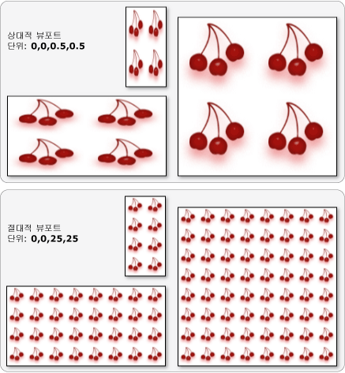

# TileBrush 개요
<xref:System.Windows.Media.TileBrush> 개체를 사용하면 이미지, <xref:System.Windows.Media.Drawing> 또는 <xref:System.Windows.Media.Visual>로 영역을 그리는 방법을 다양하게 제어할 수 있습니다.  이 항목에서는 <xref:System.Windows.Media.TileBrush> 기능을 사용하여 <xref:System.Windows.Media.ImageBrush>, <xref:System.Windows.Media.DrawingBrush> 또는 <xref:System.Windows.Media.VisualBrush>로 영역을 그리는 방법을 보다 잘 제어할 수 있는 방법에 대해 설명합니다.  
  
   
  
   
## 사전 요구 사항  
 이 항목의 내용을 이해하려면 <xref:System.Windows.Media.ImageBrush>, <xref:System.Windows.Media.DrawingBrush> 또는 <xref:System.Windows.Media.VisualBrush> 클래스의 기본 기능을 사용하는 방법에 대해 이해하는 것이 좋습니다.  이러한 형식에 대한 소개는 [이미지, 그림 및 시각적 표시로 그리기](../../../../docs/framework/wpf/graphics-multimedia/painting-with-images-drawings-and-visuals.md)를 참조하십시오.  
  
   
## 바둑판으로 영역 그리기  
 <xref:System.Windows.Media.ImageBrush>, <xref:System.Windows.Media.DrawingBrush> 및 <xref:System.Windows.Media.VisualBrush>는 <xref:System.Windows.Media.TileBrush> 개체의 형식입니다.  바둑판 브러시를 사용하면 이미지, 그림 또는 시각적 표시로 영역을 그리는 방법을 다양하게 제어할 수 있습니다.  예를 들어 하나의 늘어난 이미지를 사용하여 영역을 그리는 대신 패턴을 만드는 일련의 이미지 바둑판을 사용하여 영역을 그릴 수 있습니다.  
  
 바둑판으로 영역을 그리는 데에는 내용, 기본 바둑판 및 출력 영역이라는 세 가지 구성 요소가 필요합니다.  
  
   
하나의 바둑판을 포함하는 TileBrush의 구성 요소  
  
   
TileMode가 Tile인 TileBrush의 구성 요소  
  
 출력 영역은 그리고 있는 영역을 의미하며 <xref:System.Windows.Shapes.Ellipse>의 <xref:System.Windows.Shapes.Shape.Fill%2A> 또는 <xref:System.Windows.Controls.Button>의 <xref:System.Windows.Controls.Control.Background%2A>를 예로 들 수 있습니다.  다음 단원에서는 <xref:System.Windows.Media.TileBrush>의 다른 두 가지 구성 요소에 대해 설명합니다.  
  
   
## 브러시 내용  
 세 가지 다른 형식의 <xref:System.Windows.Media.TileBrush>가 있으며 각각 다른 형식의 내용을 그립니다.  
  
-   브러시가 <xref:System.Windows.Media.ImageBrush>인 경우 이 내용은 이미지입니다. <xref:System.Windows.Media.ImageBrush.ImageSource%2A> 속성은 <xref:System.Windows.Media.ImageBrush>의 내용을 지정합니다.  
  
-   브러시가 <xref:System.Windows.Media.DrawingBrush>이면 이 내용은 그리기입니다.  <xref:System.Windows.Media.DrawingBrush.Drawing%2A> 속성은 <xref:System.Windows.Media.DrawingBrush>의 내용을 지정합니다.  
  
-   브러시가 <xref:System.Windows.Media.VisualBrush>이면 이 내용은 표시입니다.  <xref:System.Windows.Media.VisualBrush.Visual%2A> 속성은 <xref:System.Windows.Media.VisualBrush>의 내용을 지정합니다.  
  
 <xref:System.Windows.Media.TileBrush.Viewbox%2A> 속성을 사용하여 <xref:System.Windows.Media.TileBrush> 내용의 위치와 크기를 지정할 수도 있지만 일반적으로 <xref:System.Windows.Media.TileBrush.Viewbox%2A>는 기본값으로 그대로 둡니다.  기본적으로 <xref:System.Windows.Media.TileBrush.Viewbox%2A>는 브러시의 내용을 완전히 포함하도록 구성됩니다.  <xref:System.Windows.Controls.Viewbox>를 구성하는 방법에 대한 자세한 내용은 <xref:System.Windows.Controls.Viewbox> 속성 페이지를 참조하십시오.  
  
   
## 기본 바둑판  
 <xref:System.Windows.Media.TileBrush>는 자체의 내용을 기본 바둑판에 투영합니다.  <xref:System.Windows.Media.TileBrush.Stretch%2A> 속성은 <xref:System.Windows.Media.TileBrush> 내용이 기본 바둑판을 채우도록 해당 내용을 늘리는 방법을 제어합니다.  <xref:System.Windows.Media.TileBrush.Stretch%2A> 속성에는 <xref:System.Windows.Media.Stretch> 열거형으로 정의하는 다음과 같은 값을 사용할 수 있습니다.  
  
-   <xref:System.Windows.Media.Stretch>: 브러시의 내용이 바둑판을 채우도록 늘어나지 않습니다.  
  
-   <xref:System.Windows.Media.Stretch>: 브러시의 내용이 바둑판에 맞게 배율 조정됩니다.  내용의 높이와 너비의 배율이 독립적으로 조정되기 때문에 내용의 원래 가로 세로 비율이 유지되지 않을 수 있습니다.  즉, 브러시의 내용이 출력 바둑판을 완전히 채우기 위해 휠 수 있습니다.  
  
-   <xref:System.Windows.Media.Stretch>: 브러시의 내용이 모두 바둑판 내에 포함되도록 배율 조정됩니다.  내용의 가로 세로 비율은 유지됩니다.  
  
-   <xref:System.Windows.Media.Stretch>: 브러시 내용이 출력 영역을 완벽하게 채우도록 배율 조정되며 내용의 원래 가로 세로 비율은 유지됩니다.  
  
 다음 이미지에서는 여러 가지 <xref:System.Windows.Media.TileBrush.Stretch%2A> 설정을 보여 줍니다.  
  
   
  
 다음 예제에서는 <xref:System.Windows.Media.ImageBrush>의 내용이 출력 영역을 채우기 위해 늘어나지 않도록 설정합니다.  
  
 [!code-xml[BrushOverviewExamples_snip#GraphicsMMNoStretchExample](../../../../samples/snippets/xaml/VS_Snippets_Wpf/BrushOverviewExamples_snip/XAML/StretchExample.xaml#graphicsmmnostretchexample)]  
  
 [!code-csharp[BrushOverviewExamples_procedural_snip#GraphicsMMNoStretchExample](../../../../samples/snippets/csharp/VS_Snippets_Wpf/BrushOverviewExamples_procedural_snip/CSharp/StretchExample.cs#graphicsmmnostretchexample)]
 [!code-vb[BrushOverviewExamples_procedural_snip#GraphicsMMNoStretchExample](../../../../samples/snippets/visualbasic/VS_Snippets_Wpf/BrushOverviewExamples_procedural_snip/visualbasic/stretchexample.vb#graphicsmmnostretchexample)]  
  
 기본적으로 <xref:System.Windows.Media.TileBrush>는 하나의 바둑판\(기본 바둑판\)을 생성하고 해당 바둑판을 늘려 출력 영역을 완전히 채웁니다.  <xref:System.Windows.Media.TileBrush.Viewport%2A> 및 <xref:System.Windows.Media.TileBrush.ViewportUnits%2A> 속성을 설정하여 기본 바둑판의 크기와 위치를 변경할 수 있습니다.  
  
   
### 기본 바둑판 크기  
 <xref:System.Windows.Media.TileBrush.Viewport%2A> 속성은 기본 바둑판의 크기와 위치를 결정하고 <xref:System.Windows.Media.TileBrush.ViewportUnits%2A> 속성은 <xref:System.Windows.Media.TileBrush.Viewport%2A>를 절대 좌표 또는 상대 좌표 중 무엇을 사용하여 지정하는지를 결정합니다.  좌표가 상대적이면 출력 영역의 크기가 기준입니다.  \(0, 0\) 지점은 출력 영역의 왼쪽 위 모퉁이를 나타내고 \(1, 1\)은 출력 영역의 오른쪽 아래 모퉁이를 나타냅니다.  <xref:System.Windows.Media.TileBrush.Viewport%2A> 속성에서 절대 좌표를 사용하도록 지정하려면 <xref:System.Windows.Media.TileBrush.ViewportUnits%2A> 속성을 <xref:System.Windows.Media.BrushMappingMode>로 설정합니다.  
  
 다음 그림에서는 상대 및 절대 <xref:System.Windows.Media.TileBrush.ViewportUnits%2A>를 사용한 <xref:System.Windows.Media.TileBrush> 간의 출력 차이를 보여 줍니다.  각 그림은 바둑판식 배열 패턴을 보여 줍니다. 다음 단원에서는 바둑판 패턴을 지정하는 방법을 설명합니다.  
  
   
  
 다음 예제에서는 이미지를 사용하여 너비와 높이가 50%인 바둑판을 만듭니다.  기본 바둑판은 출력 영역의 \(0,0\)에 있습니다.  
  
 [!code-xml[BrushOverviewExamples_snip#GraphicsMMRelativeViewportUnitsExample1](../../../../samples/snippets/xaml/VS_Snippets_Wpf/BrushOverviewExamples_snip/XAML/TileSizeExample.xaml#graphicsmmrelativeviewportunitsexample1)]  
  
 [!code-csharp[BrushOverviewExamples_procedural_snip#GraphicsMMRelativeViewportUnitsExample1](../../../../samples/snippets/csharp/VS_Snippets_Wpf/BrushOverviewExamples_procedural_snip/CSharp/TileSizeExample.cs#graphicsmmrelativeviewportunitsexample1)]
 [!code-vb[BrushOverviewExamples_procedural_snip#GraphicsMMRelativeViewportUnitsExample1](../../../../samples/snippets/visualbasic/VS_Snippets_Wpf/BrushOverviewExamples_procedural_snip/visualbasic/tilesizeexample.vb#graphicsmmrelativeviewportunitsexample1)]  
  
 다음 예제에서는 <xref:System.Windows.Media.ImageBrush>의 바둑판을 25 x 25 [장치 독립적 픽셀](GTMT)을 설정합니다.  <xref:System.Windows.Media.TileBrush.ViewportUnits%2A>가 절대적이므로 <xref:System.Windows.Media.ImageBrush> 바둑판은 그리고 있는 영역의 크기에 관계없이 항상 25 x 25픽셀입니다.  
  
 [!code-xml[BrushOverviewExamples_snip#GraphicsMMAbsoluteViewportUnitsExample1](../../../../samples/snippets/xaml/VS_Snippets_Wpf/BrushOverviewExamples_snip/XAML/TileSizeExample.xaml#graphicsmmabsoluteviewportunitsexample1)]  
  
 [!code-csharp[BrushOverviewExamples_procedural_snip#GraphicsMMAbsoluteViewportUnitsExample1](../../../../samples/snippets/csharp/VS_Snippets_Wpf/BrushOverviewExamples_procedural_snip/CSharp/TileSizeExample.cs#graphicsmmabsoluteviewportunitsexample1)]
 [!code-vb[BrushOverviewExamples_procedural_snip#GraphicsMMAbsoluteViewportUnitsExample1](../../../../samples/snippets/visualbasic/VS_Snippets_Wpf/BrushOverviewExamples_procedural_snip/visualbasic/tilesizeexample.vb#graphicsmmabsoluteviewportunitsexample1)]  
  
   
### 바둑판식 배열 동작  
 <xref:System.Windows.Media.TileBrush>에서는 기본 바둑판이 출력 영역을 완전히 채우지 않고 <xref:System.Windows.Media.TileMode> 외의 바둑판식 배열 모드가 지정된 경우 바둑판식 배열 패턴을 생성합니다.  브러시의 바둑판이 출력 영역을 완전히 채우지 않고 해당 <xref:System.Windows.Media.TileBrush.TileMode%2A> 속성에서 기본 바둑판을 복제하여 출력 영역을 채워야 하는지 여부를 지정하고, 그럴 경우 기본 바둑판을 복제하는 방법을 지정합니다.  <xref:System.Windows.Media.TileBrush.TileMode%2A> 속성에는 <xref:System.Windows.Media.TileMode> 열거형으로 정의하는 다음과 같은 값을 사용할 수 있습니다.  
  
-   <xref:System.Windows.Media.TileMode>: 기본 바둑판만 그립니다.  
  
-   <xref:System.Windows.Media.TileMode>: 기본 바둑판을 그리고 나머지 영역은 기본 바둑판을 반복하여 채웁니다. 이때 한 바둑판의 오른쪽 가장자리가 다음 바둑판의 왼쪽 가장자리 옆에 오고 마찬가지로 아래쪽과 위쪽 바둑판이 인접하도록 반복합니다.  
  
-   <xref:System.Windows.Media.TileMode>: 바둑판의 대체 열이 좌우 대칭 이동한다는 점을 제외하고 <xref:System.Windows.Media.TileMode>과 같습니다.  
  
-   <xref:System.Windows.Media.TileMode>: 바둑판의 대체 행이 세로로 대칭 이동한다는 점을 제외하고 <xref:System.Windows.Media.TileMode>과 같습니다.  
  
-   <xref:System.Windows.Media.TileMode>: <xref:System.Windows.Media.TileMode> 및 <xref:System.Windows.Media.TileMode>의 조합입니다.  
  
 다음 이미지에서는 여러 가지 바둑판식 배열 모드를 보여 줍니다.  
  
   
  
 다음 예제에서는 너비가 100픽셀이고 높이가 100픽셀인 사각형을 이미지를 사용하여 그립니다.  브러시의 <xref:System.Windows.Media.TileBrush.Viewport%2A>를 0,0,0.25,0.25로 설정하면 브러시의 기본 바둑판이 출력 영역의 1\/4이 되게 만들어집니다.  바둑판의 행으로 사각형을 채우도록 브러시의 <xref:System.Windows.Media.TileBrush.TileMode%2A>를 <xref:System.Windows.Media.TileMode>로  설정합니다.  
  
 [!code-xml[BrushOverviewExamples_snip#GraphicsMMFlipXYExample](../../../../samples/snippets/xaml/VS_Snippets_Wpf/BrushOverviewExamples_snip/XAML/TilingExample.xaml#graphicsmmflipxyexample)]  
  
 [!code-csharp[BrushOverviewExamples_procedural_snip#GraphicsMMFlipXYExample](../../../../samples/snippets/csharp/VS_Snippets_Wpf/BrushOverviewExamples_procedural_snip/CSharp/TilingExample.cs#graphicsmmflipxyexample)]
 [!code-vb[BrushOverviewExamples_procedural_snip#GraphicsMMFlipXYExample](../../../../samples/snippets/visualbasic/VS_Snippets_Wpf/BrushOverviewExamples_procedural_snip/visualbasic/tilingexample.vb#graphicsmmflipxyexample)]  
  
## 참고 항목  
 <xref:System.Windows.Media.ImageBrush>   
 <xref:System.Windows.Media.DrawingBrush>   
 <xref:System.Windows.Media.VisualBrush>   
 <xref:System.Windows.Media.TileBrush>   
 [이미지, 그림 및 시각적 표시로 그리기](../../../../docs/framework/wpf/graphics-multimedia/painting-with-images-drawings-and-visuals.md)   
 [방법 항목](../../../../docs/framework/wpf/graphics-multimedia/brushes-how-to-topics.md)   
 [Freezable 개체 개요](../../../../docs/framework/wpf/advanced/freezable-objects-overview.md)   
 [ImageBrush 샘플](http://go.microsoft.com/fwlink/?LinkID=160005)   
 [VisualBrush 샘플](http://go.microsoft.com/fwlink/?LinkID=160049)