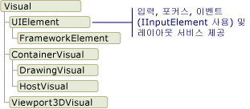
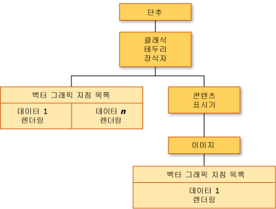
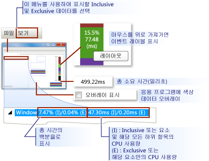
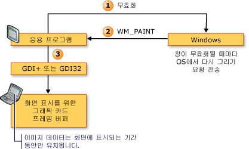
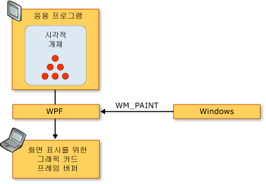
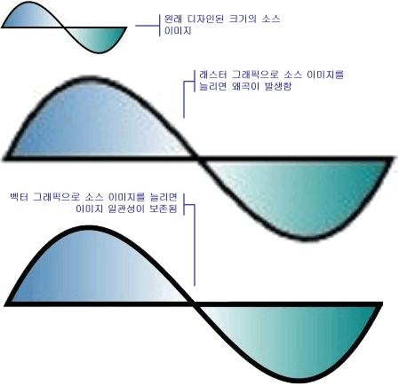
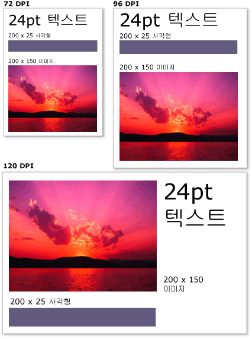

# WPF 그래픽 렌더링 개요WPF Graphics Rendering Overview
이 항목에서는 [!INCLUDE[TLA2#tla_winclient](../../../../includes/tla2sharptla-winclient-md.md)] 시각적 계층에 대해 간략하게 설명합니다.This topic provides an overview of the [!INCLUDE[TLA2#tla_winclient](../../../../includes/tla2sharptla-winclient-md.md)] visual layer. 역할에 중점을 둡니다는 <xref:System.Windows.Media.Visual> 렌더링에 지원 기능에 대 한 클래스는 [!INCLUDE[TLA2#tla_winclient](../../../../includes/tla2sharptla-winclient-md.md)] 모델입니다.It focuses on the role of the <xref:System.Windows.Media.Visual> class for rendering support in the [!INCLUDE[TLA2#tla_winclient](../../../../includes/tla2sharptla-winclient-md.md)] model.  
  
  
   
## 시각적 개체의 역할Role of the Visual Object  
 <xref:System.Windows.Media.Visual> 클래스는 기본 추상화 하는 모든 <xref:System.Windows.FrameworkElement> 개체에서 파생 됩니다.The <xref:System.Windows.Media.Visual> class is the basic abstraction from which every <xref:System.Windows.FrameworkElement> object derives. 또한 [!INCLUDE[TLA2#tla_winclient](../../../../includes/tla2sharptla-winclient-md.md)]에서 새 컨트롤을 작성하기 위한 진입점으로도 사용되며, Win32 응용 프로그램 모델에서는 여러 가지 측면에서 창 핸들(HWND)로도 간주될 수 있습니다.It also serves as the entry point for writing new controls in [!INCLUDE[TLA2#tla_winclient](../../../../includes/tla2sharptla-winclient-md.md)], and in many ways can be thought of as the window handle (HWND) in the Win32 application model.  
  
 <xref:System.Windows.Media.Visual> 개체는 핵심 [!INCLUDE[TLA2#tla_winclient](../../../../includes/tla2sharptla-winclient-md.md)] 주 역할이 렌더링 지원을 제공 하는 개체입니다.The <xref:System.Windows.Media.Visual> object is a core [!INCLUDE[TLA2#tla_winclient](../../../../includes/tla2sharptla-winclient-md.md)] object, whose primary role is to provide rendering support. 와 같은 사용자 인터페이스 컨트롤 <xref:System.Windows.Controls.Button> 및 <xref:System.Windows.Controls.TextBox>에서 파생 되는 <xref:System.Windows.Media.Visual> 클래스를 사용 하 여 렌더링 데이터를 유지 하는 것에 대 한 합니다.User interface controls, such as <xref:System.Windows.Controls.Button> and <xref:System.Windows.Controls.TextBox>, derive from the <xref:System.Windows.Media.Visual> class, and use it for persisting their rendering data. <xref:System.Windows.Media.Visual> 개체에 대 한 지원을 제공 합니다.The <xref:System.Windows.Media.Visual> object provides support for:  
  
-   출력 표시: 시각적 개체의 serialize된 지속형 그리기 콘텐츠 렌더링Output display: Rendering the persisted, serialized drawing content of a visual.  
  
-   변환: 시각적 개체에 대해 변환 수행Transformations: Performing transformations on a visual.  
  
-   클리핑: 시각적 개체에 대해 클리핑 영역 지원 제공Clipping: Providing clipping region support for a visual.  
  
-   적중 테스트: 좌표 또는 기하 도형이 시각적 개체의 범위 내에 포함되어 있는지 여부 확인Hit testing: Determining whether a coordinate or geometry is contained within the bounds of a visual.  
  
-   경계 상자 계산: 시각적 개체의 경계 사각형 결정Bounding box calculations: Determining the bounding rectangle of a visual.  
  
 그러나는 <xref:System.Windows.Media.Visual> 개체 비 렌더링 기능에 대 한 지원 등 포함 되지 않습니다.However, the <xref:System.Windows.Media.Visual> object does not include support for non-rendering features, such as:  
  
-   이벤트 처리Event handling  
  
-   레이아웃Layout  
  
-   스타일Styles  
  
-   데이터 바인딩Data binding  
  
-   전역화Globalization  
  
 <xref:System.Windows.Media.Visual> 자식 클래스를 파생 합니다는 공용 추상 클래스로 노출 됩니다.<xref:System.Windows.Media.Visual> is exposed as a public abstract class from which child classes must be derived. 다음 그림에서는 [!INCLUDE[TLA2#tla_winclient](../../../../includes/tla2sharptla-winclient-md.md)]에서 노출되는 시각적 개체의 계층 구조를 보여 줍니다.The following illustration shows the hierarchy of the visual objects that are exposed in [!INCLUDE[TLA2#tla_winclient](../../../../includes/tla2sharptla-winclient-md.md)].  
  
   
시각적 개체 클래스 계층 구조Visual class hierarchy  
  
### DrawingVisual 클래스DrawingVisual Class  
 <xref:System.Windows.Media.DrawingVisual> 은 간단한 그리기 도형, 이미지 또는 텍스트를 렌더링 하는 데 사용 되는 클래스입니다.The <xref:System.Windows.Media.DrawingVisual> is a lightweight drawing class that is used to render shapes, images, or text. 이 클래스는 런타임 성능을 향상시키는 레이아웃이나 이벤트 처리를 제공하지 않으므로 간단한 클래스로 간주됩니다.This class is considered lightweight because it does not provide layout or event handling, which improves its runtime performance. 이러한 이유 때문에 그리기는 배경 및 클립 아트에 적합합니다.For this reason, drawings are ideal for backgrounds and clip art. <xref:System.Windows.Media.DrawingVisual> 사용자 지정 시각적 개체를 만드는 데 사용할 수 있습니다.The <xref:System.Windows.Media.DrawingVisual> can be used to create a custom visual object. 자세한 내용은 [DrawingVisual 개체 사용](../../../../docs/framework/wpf/graphics-multimedia/using-drawingvisual-objects.md)을 참조하세요.For more information, see [Using DrawingVisual Objects](../../../../docs/framework/wpf/graphics-multimedia/using-drawingvisual-objects.md).  
  
### Viewport3DVisual 클래스Viewport3DVisual Class  
 <xref:System.Windows.Media.Media3D.Viewport3DVisual> 2 차원 제공 <xref:System.Windows.Media.Visual> 및 <xref:System.Windows.Media.Media3D.Visual3D> 개체입니다.The <xref:System.Windows.Media.Media3D.Viewport3DVisual> provides a bridge between 2D <xref:System.Windows.Media.Visual> and <xref:System.Windows.Media.Media3D.Visual3D> objects. <xref:System.Windows.Media.Media3D.Visual3D> 클래스는 모든 3D 시각적 요소에 대 한 기본 클래스입니다.The <xref:System.Windows.Media.Media3D.Visual3D> class is the base class for all 3D visual elements. <xref:System.Windows.Media.Media3D.Viewport3DVisual> 정의 해야는 <xref:System.Windows.Media.Media3D.Viewport3DVisual.Camera%2A> 값 및 <xref:System.Windows.Media.Media3D.Viewport3DVisual.Viewport%2A> 값입니다.The <xref:System.Windows.Media.Media3D.Viewport3DVisual> requires that you define a <xref:System.Windows.Media.Media3D.Viewport3DVisual.Camera%2A> value and a <xref:System.Windows.Media.Media3D.Viewport3DVisual.Viewport%2A> value. 카메라를 사용하면 장면을 볼 수 있습니다.The camera allows you to view the scene. 뷰포트는 프로젝션이 2D 표면에 매핑되는 위치를 설정합니다.The viewport establishes where the projection maps onto the 2D surface. [!INCLUDE[TLA2#tla_winclient](../../../../includes/tla2sharptla-winclient-md.md)]의 3D에 대한 자세한 내용은 [3차원 그래픽 개요](../../../../docs/framework/wpf/graphics-multimedia/3-d-graphics-overview.md)를 참조하세요.For more information on 3D in [!INCLUDE[TLA2#tla_winclient](../../../../includes/tla2sharptla-winclient-md.md)], see [3-D Graphics Overview](../../../../docs/framework/wpf/graphics-multimedia/3-d-graphics-overview.md).  
  
### ContainerVisual 클래스ContainerVisual Class  
 <xref:System.Windows.Media.ContainerVisual> 클래스의 컬렉션에 대 한 컨테이너로 사용 됩니다 <xref:System.Windows.Media.Visual> 개체입니다.The <xref:System.Windows.Media.ContainerVisual> class is used as a container for a collection of <xref:System.Windows.Media.Visual> objects. <xref:System.Windows.Media.DrawingVisual> 클래스에서 파생 되는 <xref:System.Windows.Media.ContainerVisual> 하므로 시각적 개체의 컬렉션을 포함 하는 클래스입니다.The <xref:System.Windows.Media.DrawingVisual> class derives from the <xref:System.Windows.Media.ContainerVisual> class, allowing it to contain a collection of visual objects.  
  
### 시각적 개체의 그리기 콘텐츠Drawing Content in Visual Objects  
 A <xref:System.Windows.Media.Visual> 로 렌더링 데이터를 저장 하는 개체는 **벡터 그래픽 명령 목록**합니다.A <xref:System.Windows.Media.Visual> object stores its render data as a **vector graphics instruction list**. 명령 목록의 각 항목은 그래픽 데이터 및 연결된 리소스의 하위 수준 집합을 serialize된 형식으로 나타냅니다.Each item in the instruction list represents a low-level set of graphics data and associated resources in a serialized format. 그리기 콘텐츠를 포함할 수 있는 렌더링 데이터 형식에는 네 가지가 있습니다.There are four different types of render data that can contain drawing content.  
  
|그리기 콘텐츠 형식Drawing content type|설명Description|  
|--------------------------|-----------------|  
|벡터 그래픽Vector graphics|벡터 그래픽 데이터와 모든 관련 <xref:System.Windows.Media.Brush> 및 <xref:System.Windows.Media.Pen> 정보입니다.Represents vector graphics data, and any associated <xref:System.Windows.Media.Brush> and <xref:System.Windows.Media.Pen> information.|  
|이미지Image|에 정의 된 영역 내에서 이미지 나타냅니다는 <xref:System.Windows.Rect>합니다.Represents an image within a region defined by a <xref:System.Windows.Rect>.|  
|문자 모양Glyph|렌더링 하는 그리기 나타냅니다는 <xref:System.Windows.Media.GlyphRun>, 있는 일련의 지정된 된 글꼴 리소스 문자입니다.Represents a drawing that renders a <xref:System.Windows.Media.GlyphRun>, which is a sequence of glyphs from a specified font resource. 이 방식에 따라 텍스트가 표시됩니다.This is how text is represented.|  
|비디오Video|비디오를 렌더링하는 그리기를 나타냅니다.Represents a drawing that renders video.|  
  
 <xref:System.Windows.Media.DrawingContext> 채울 수 있습니다는 <xref:System.Windows.Media.Visual> 시각적 콘텐츠를 사용 합니다.The <xref:System.Windows.Media.DrawingContext> allows you to populate a <xref:System.Windows.Media.Visual> with visual content. 사용 하는 경우는 <xref:System.Windows.Media.DrawingContext> 실제로 그래픽 시스템에서 나중에 사용할 렌더링 데이터 집합을 저장 하는 개체의 그리기 명령의 않으면 하는 개체의 형식에 따라 달라 집니다.When you use a <xref:System.Windows.Media.DrawingContext> object's draw commands, you are actually storing a set of render data that will later be used by the graphics system; you are not drawing to the screen in real-time.  
  
 만들 때 한 [!INCLUDE[TLA2#tla_winclient](../../../../includes/tla2sharptla-winclient-md.md)] 제어와 같은 <xref:System.Windows.Controls.Button>, 컨트롤이 드로잉 자체에 대 한 렌더링 데이터를 암시적으로 생성 합니다.When you create a [!INCLUDE[TLA2#tla_winclient](../../../../includes/tla2sharptla-winclient-md.md)] control, such as a <xref:System.Windows.Controls.Button>, the control implicitly generates render data for drawing itself. 예를 들어 설정는 <xref:System.Windows.Controls.ContentControl.Content%2A> 속성은 <xref:System.Windows.Controls.Button> 해당 컨트롤이 컨트롤의 문자 모양 렌더링 표현을 저장 합니다.For example, setting the <xref:System.Windows.Controls.ContentControl.Content%2A> property of the <xref:System.Windows.Controls.Button> causes the control to store a rendering representation of a glyph.  
  
 A <xref:System.Windows.Media.Visual> 하나 이상으로 해당 내용을 설명 <xref:System.Windows.Media.Drawing> 에 포함 된 개체는 <xref:System.Windows.Media.DrawingGroup>합니다.A <xref:System.Windows.Media.Visual> describes its content as one or more <xref:System.Windows.Media.Drawing> objects contained within a <xref:System.Windows.Media.DrawingGroup>. A <xref:System.Windows.Media.DrawingGroup> 도 불투명 마스크, 변환, 비트맵 효과 및 해당 내용에 적용 되는 기타 작업을 설명 합니다.A <xref:System.Windows.Media.DrawingGroup> also describes opacity masks, transforms, bitmap effects, and other operations that are applied to its contents. <xref:System.Windows.Media.DrawingGroup> 작업은 콘텐츠를 렌더링 하는 경우 다음과 같은 순서로 적용 됩니다: <xref:System.Windows.Media.DrawingGroup.OpacityMask%2A>, <xref:System.Windows.Media.DrawingGroup.Opacity%2A>, <xref:System.Windows.Media.DrawingGroup.BitmapEffect%2A>, <xref:System.Windows.Media.DrawingGroup.ClipGeometry%2A>, <xref:System.Windows.Media.DrawingGroup.GuidelineSet%2A>, 차례로 <xref:System.Windows.Media.DrawingGroup.Transform%2A>합니다.<xref:System.Windows.Media.DrawingGroup> operations are applied in the following order when content is rendered: <xref:System.Windows.Media.DrawingGroup.OpacityMask%2A>, <xref:System.Windows.Media.DrawingGroup.Opacity%2A>, <xref:System.Windows.Media.DrawingGroup.BitmapEffect%2A>, <xref:System.Windows.Media.DrawingGroup.ClipGeometry%2A>, <xref:System.Windows.Media.DrawingGroup.GuidelineSet%2A>, and then <xref:System.Windows.Media.DrawingGroup.Transform%2A>.  
  
 다음 그림에서는 순서는 <xref:System.Windows.Media.DrawingGroup> 렌더링 시퀀스 중 작업이 적용 됩니다.The following illustration shows the order in which <xref:System.Windows.Media.DrawingGroup> operations are applied during the rendering sequence.  
  
   
DrawingGroup 작업의 순서Order of DrawingGroup operations  
  
 자세한 내용은 [그리기 개체 개요](../../../../docs/framework/wpf/graphics-multimedia/drawing-objects-overview.md)를 참조하세요.For more information, see [Drawing Objects Overview](../../../../docs/framework/wpf/graphics-multimedia/drawing-objects-overview.md).  
  
#### 시각적 계층에서 그리기 콘텐츠Drawing Content at the Visual Layer  
 그러나 직접 인스턴스화는 <xref:System.Windows.Media.DrawingContext>; 얻을 수 있습니다, 특정 메서드를 직접와 같은 <xref:System.Windows.Media.DrawingGroup.Open%2A?displayProperty=nameWithType> 및 <xref:System.Windows.Media.DrawingVisual.RenderOpen%2A?displayProperty=nameWithType>합니다.You never directly instantiate a <xref:System.Windows.Media.DrawingContext>; you can, however, acquire a drawing context from certain methods, such as <xref:System.Windows.Media.DrawingGroup.Open%2A?displayProperty=nameWithType> and <xref:System.Windows.Media.DrawingVisual.RenderOpen%2A?displayProperty=nameWithType>. 다음 예제에서는 검색 한 <xref:System.Windows.Media.DrawingContext> 에서 <xref:System.Windows.Media.DrawingVisual> 사각형 그리기를 사용 하 여 합니다.The following example retrieves a <xref:System.Windows.Media.DrawingContext> from a <xref:System.Windows.Media.DrawingVisual> and uses it to draw a rectangle.  
  
 [!code-csharp[drawingvisualsample#101](../../../../samples/snippets/csharp/VS_Snippets_Wpf/DrawingVisualSample/CSharp/Window1.xaml.cs#101)]
 [!code-vb[drawingvisualsample#101](../../../../samples/snippets/visualbasic/VS_Snippets_Wpf/DrawingVisualSample/visualbasic/window1.xaml.vb#101)]  
  
#### 시각적 계층에서 그리기 콘텐츠 열거Enumerating Drawing Content at the Visual Layer  
 기타 다른 용도, <xref:System.Windows.Media.Drawing> 도 개체의 내용을 열거 하기 위한 개체 모델을 제공는 <xref:System.Windows.Media.Visual>합니다.In addition to their other uses, <xref:System.Windows.Media.Drawing> objects also provide an object model for enumerating the contents of a <xref:System.Windows.Media.Visual>.  
  
> [!NOTE]
>  검색 하는 시각적 개체의 내용을 열거 하는 경우 <xref:System.Windows.Media.Drawing> 개체 및 하지 기본 표시에 나타나는 렌더링 데이터의 벡터 그래픽 명령 목록으로 합니다.When you are enumerating the contents of the visual, you are retrieving <xref:System.Windows.Media.Drawing> objects, and not the underlying representation of the render data as a vector graphics instruction list.  
  
 다음 예제에서는 <xref:System.Windows.Media.VisualTreeHelper.GetDrawing%2A> 를 검색할 메서드는 <xref:System.Windows.Media.DrawingGroup> 값은 <xref:System.Windows.Media.Visual> 고이 열거 합니다.The following example uses the <xref:System.Windows.Media.VisualTreeHelper.GetDrawing%2A> method to retrieve the <xref:System.Windows.Media.DrawingGroup> value of a <xref:System.Windows.Media.Visual> and enumerate it.  
  
 [!code-csharp[DrawingMiscSnippets_snip#GraphicsMMRetrieveDrawings](../../../../samples/snippets/csharp/VS_Snippets_Wpf/DrawingMiscSnippets_snip/CSharp/EnumerateDrawingsExample.xaml.cs#graphicsmmretrievedrawings)]  
  
   
## 컨트롤 빌드에 시각적 개체를 사용하는 방법How Visual Objects are Used to Build Controls  
 [!INCLUDE[TLA2#tla_winclient](../../../../includes/tla2sharptla-winclient-md.md)]의 많은 개체는 다른 시각적 개체로 구성됩니다. 즉, 다양한 하위 개체 계층 구조를 포함할 수 있습니다.Many of the objects in [!INCLUDE[TLA2#tla_winclient](../../../../includes/tla2sharptla-winclient-md.md)] are composed of other visual objects, meaning they can contain varying hierarchies of descendant objects. 컨트롤과 같은 [!INCLUDE[TLA2#tla_winclient](../../../../includes/tla2sharptla-winclient-md.md)]의 많은 사용자 인터페이스 요소는 여러 다른 형식의 렌더링 요소를 나타내는 다양한 시각적 개체로 구성됩니다.Many of the user interface elements in [!INCLUDE[TLA2#tla_winclient](../../../../includes/tla2sharptla-winclient-md.md)], such as controls, are composed of multiple visual objects, representing different types of rendering elements. 예를 들어는 <xref:System.Windows.Controls.Button> 컨트롤 포함 하는 다른 개체의 숫자를 포함할 수 있습니다 <xref:Microsoft.Windows.Themes.ClassicBorderDecorator>, <xref:System.Windows.Controls.ContentPresenter>, 및 <xref:System.Windows.Controls.TextBlock>합니다.For example, the <xref:System.Windows.Controls.Button> control can contain a number of other objects, including <xref:Microsoft.Windows.Themes.ClassicBorderDecorator>, <xref:System.Windows.Controls.ContentPresenter>, and <xref:System.Windows.Controls.TextBlock>.  
  
 다음 코드는 <xref:System.Windows.Controls.Button> 컨트롤 태그에 정의 되어 있습니다.The following code shows a <xref:System.Windows.Controls.Button> control defined in markup.  
  
 [!code-xaml[VisualsOverview#VisualsOverviewSnippet1](../../../../samples/snippets/csharp/VS_Snippets_Wpf/VisualsOverview/CSharp/Window1.xaml#visualsoverviewsnippet1)]  
  
 기본값을 구성 하는 시각적 개체를 열거 하는 경우 <xref:System.Windows.Controls.Button> 컨트롤 아래에서 설명 하는 시각적 개체의 계층 구조를 발견할 수 있습니다.If you were to enumerate the visual objects that comprise the default <xref:System.Windows.Controls.Button> control, you would find the hierarchy of visual objects illustrated below:  
  
   
시각적 트리 계층 구조의 다이어그램Diagram of visual tree hierarchy  
  
 <xref:System.Windows.Controls.Button> 컨트롤에 포함 된 <xref:Microsoft.Windows.Themes.ClassicBorderDecorator> 차례로 포함 하는 요소는 <xref:System.Windows.Controls.ContentPresenter> 요소입니다.The <xref:System.Windows.Controls.Button> control contains a <xref:Microsoft.Windows.Themes.ClassicBorderDecorator> element, which in turn, contains a <xref:System.Windows.Controls.ContentPresenter> element. <xref:Microsoft.Windows.Themes.ClassicBorderDecorator> 요소를 그리는 테두리와 배경은 <xref:System.Windows.Controls.Button>합니다.The <xref:Microsoft.Windows.Themes.ClassicBorderDecorator> element is responsible for drawing a border and a background for the <xref:System.Windows.Controls.Button>. <xref:System.Windows.Controls.ContentPresenter> 요소는의 내용을 표시는 <xref:System.Windows.Controls.Button>합니다.The <xref:System.Windows.Controls.ContentPresenter> element is responsible for displaying the contents of the <xref:System.Windows.Controls.Button>. 이 경우 표시 하므로 텍스트를는 <xref:System.Windows.Controls.ContentPresenter> 요소를 포함 한 <xref:System.Windows.Controls.TextBlock> 요소입니다.In this case, since you are displaying text, the <xref:System.Windows.Controls.ContentPresenter> element contains a <xref:System.Windows.Controls.TextBlock> element. 팩트는는 <xref:System.Windows.Controls.Button> 컨트롤이 사용 하는 <xref:System.Windows.Controls.ContentPresenter> 콘텐츠와 같은 다른 요소도 나타낼 수 있다는 것을 의미는 <xref:System.Windows.Controls.Image> 기와 같은 <xref:System.Windows.Media.EllipseGeometry>합니다.The fact that the <xref:System.Windows.Controls.Button> control uses a <xref:System.Windows.Controls.ContentPresenter> means that the content could be represented by other elements, such as an <xref:System.Windows.Controls.Image> or a geometry, such as an <xref:System.Windows.Media.EllipseGeometry>.  
  
### 컨트롤 템플릿Control Templates  
 컨트롤의 컨트롤 계층 구조로 확장에 키가는 <xref:System.Windows.Controls.ControlTemplate>합니다.The key to the expansion of a control into a hierarchy of controls is the <xref:System.Windows.Controls.ControlTemplate>. 컨트롤 템플릿은 컨트롤에 대한 기본 시각적 개체 계층 구조를 지정합니다.A control template specifies the default visual hierarchy for a control. 컨트롤을 명시적으로 참조할 때는 해당 시각적 개체 계층 구조를 암시적으로 참조하게 됩니다.When you explicitly reference a control, you implicitly reference its visual hierarchy. 컨트롤 템플릿에 대한 기본값을 재정의하여 컨트롤의 사용자 지정된 시각적 모양을 만들 수 있습니다.You can override the default values for a control template to create a customized visual appearance for a control. 예를 들어 배경색의 값을 수정할 수 있습니다는 <xref:System.Windows.Controls.Button> 선형 그라데이션 색상 값을 사용 하 여 단색 값 대신 되도록 합니다.For example, you could modify the background color value of the <xref:System.Windows.Controls.Button> control so that it uses a linear gradient color value instead of a solid color value. 자세한 내용은 [단추 스타일 및 템플릿](../../../../docs/framework/wpf/controls/button-styles-and-templates.md)을 참조하세요.For more information, see [Button Styles and Templates](../../../../docs/framework/wpf/controls/button-styles-and-templates.md).  
  
 와 같은 사용자 인터페이스 요소에는 <xref:System.Windows.Controls.Button> 제어 하 고, 여러 벡터 그래픽 명령 목록이 포함 된 컨트롤의 전체 렌더링 정의 설명 합니다.A user interface element, such as a <xref:System.Windows.Controls.Button> control, contains several vector graphics instruction lists that describe the entire rendering definition of a control. 다음 코드는 <xref:System.Windows.Controls.Button> 컨트롤 태그에 정의 되어 있습니다.The following code shows a <xref:System.Windows.Controls.Button> control defined in markup.  
  
 [!code-xaml[VisualsOverview#VisualsOverviewSnippet2](../../../../samples/snippets/csharp/VS_Snippets_Wpf/VisualsOverview/CSharp/Window1.xaml#visualsoverviewsnippet2)]  
  
 시각적 개체를 열거 하 고 벡터를 구성 하는 그래픽 지침 목록을 마치는 <xref:System.Windows.Controls.Button> 컨트롤을 아래와 같은 개체의 계층 구조를 발견할 수 있습니다.If you were to enumerate the visual objects and vector graphics instruction lists that comprise the <xref:System.Windows.Controls.Button> control, you would find the hierarchy of objects illustrated below:  
  
   
시각적 트리 및 렌더링 데이터의 다이어그램Diagram of visual tree and rendering data  
  
 <xref:System.Windows.Controls.Button> 컨트롤에 포함 된 <xref:Microsoft.Windows.Themes.ClassicBorderDecorator> 차례로 포함 하는 요소는 <xref:System.Windows.Controls.ContentPresenter> 요소입니다.The <xref:System.Windows.Controls.Button> control contains a <xref:Microsoft.Windows.Themes.ClassicBorderDecorator> element, which in turn, contains a <xref:System.Windows.Controls.ContentPresenter> element. <xref:Microsoft.Windows.Themes.ClassicBorderDecorator> 요소는 모든 개별 그래픽 요소 테두리와 단추의 배경색을 구성 하는 그리기를 담당 합니다.The <xref:Microsoft.Windows.Themes.ClassicBorderDecorator> element is responsible for drawing all the discrete graphic elements that make up the border and background of a button. <xref:System.Windows.Controls.ContentPresenter> 요소는의 내용을 표시는 <xref:System.Windows.Controls.Button>합니다.The <xref:System.Windows.Controls.ContentPresenter> element is responsible for displaying the contents of the <xref:System.Windows.Controls.Button>. 이 경우 표시 하므로 이미지는 <xref:System.Windows.Controls.ContentPresenter> 요소에 포함 되어는 <xref:System.Windows.Controls.Image> 요소입니다.In this case, since you are displaying an image, the <xref:System.Windows.Controls.ContentPresenter> element contains a <xref:System.Windows.Controls.Image> element.  
  
 시각적 개체 및 벡터 그래픽 명령 목록의 계층 구조에 대해 다음과 같은 사항을 명심해야 합니다.There are a number of points to note about the hierarchy of visual objects and vector graphics instruction lists:  
  
-   계층 구조의 순서는 그리기 정보의 렌더링 순서를 나타냅니다.The ordering in the hierarchy represents the rendering order of the drawing information. 루트 시각적 요소에서 자식 요소는 왼쪽에서 오른쪽, 위쪽에서 아래쪽으로 트래버스됩니다.From the root visual element, child elements are traversed, left to right, top to bottom. 요소에 시각적 자식 요소가 있으면 요소의 형제 요소보다 먼저 트래버스됩니다.If an element has visual child elements, they are traversed before the element’s siblings.  
  
-   계층의 리프가 아닌 노드 요소와 같은 <xref:System.Windows.Controls.ContentPresenter>, 자식 요소를 포함 하는 데 사용 된-지침 목록을 포함 하지 않습니다.Non-leaf node elements in the hierarchy, such as <xref:System.Windows.Controls.ContentPresenter>, are used to contain child elements—they do not contain instruction lists.  
  
-   시각적 요소가 벡터 그래픽 명령 목록과 시각적 자식 개체를 모두 포함하는 경우 시각적 자식 개체의 그리기 작업 전에 시각적 부모 요소의 명령 목록이 먼저 렌더링됩니다.If a visual element contains both a vector graphics instruction list and visual children, the instruction list in the parent visual element is rendered before drawings in any of the visual child objects.  
  
-   벡터 그래픽 명령 목록에 있는 항목은 왼쪽에서 오른쪽으로 렌더링됩니다.The items in the vector graphics instruction list are rendered left to right.  
  
   
## 표시 트리Visual Tree  
 시각적 트리에는 응용 프로그램의 사용자 인터페이스에서 사용되는 모든 시각적 요소가 포함됩니다.The visual tree contains all visual elements used in an application's user interface. 시각적 요소에는 지속형 그리기 정보가 포함되어 있으므로 시각적 트리를 디스플레이 장치에 대한 출력을 작성하는 데 필요한 모든 렌더링 정보를 포함하는 장면 그래프로 간주할 수 있습니다.Since a visual element contains persisted drawing information, you can think of the visual tree as a scene graph, containing all the rendering information needed to compose the output to the display device. 이 트리는 코드 또는 태그를 통해 응용 프로그램에서 직접 만든 모든 시각적 요소가 누적된 것입니다.This tree is the accumulation of all visual elements created directly by the application, whether in code or in markup. 또한 시각적 트리는 컨트롤 및 데이터 개체와 같은 요소의 템플릿 확장을 통해 만들어진 모든 시각적 요소도 포함합니다.The visual tree also contains all visual elements created by the template expansion of elements such as controls and data objects.  
  
 다음 코드는 <xref:System.Windows.Controls.StackPanel> 태그에 정의 된 요소입니다.The following code shows a <xref:System.Windows.Controls.StackPanel> element defined in markup.  
  
 [!code-xaml[VisualsOverview#VisualsOverviewSnippet3](../../../../samples/snippets/csharp/VS_Snippets_Wpf/VisualsOverview/CSharp/Window1.xaml#visualsoverviewsnippet3)]  
  
 구성 하는 시각적 개체를 열거 하는 경우는 <xref:System.Windows.Controls.StackPanel> 태그 예제에서 요소를 아래와 같은 시각적 개체의 계층 구조를 발견할 수 있습니다.If you were to enumerate the visual objects that comprise the <xref:System.Windows.Controls.StackPanel> element in the markup example, you would find the hierarchy of visual objects illustrated below:  
  
   
시각적 트리 계층 구조의 다이어그램Diagram of visual tree hierarchy  
  
### 렌더링 순서Rendering Order  
 시각적 트리는 [!INCLUDE[TLA2#tla_winclient](../../../../includes/tla2sharptla-winclient-md.md)] 시각적 및 그리기 개체의 렌더링 순서를 결정합니다.The visual tree determines the rendering order of [!INCLUDE[TLA2#tla_winclient](../../../../includes/tla2sharptla-winclient-md.md)] visual and drawing objects. 트래버스 순서는 시각적 트리의 최상위 노드를 나타내는 루트 시각적 개체에서 시작됩니다.The order of traversal starts with the root visual, which is the top-most node in the visual tree. 그런 후에 루트 시각적 개체의 자식이 왼쪽에서 오른쪽으로 트래버스됩니다.The root visual’s children are then traversed, left to right. 시각적 개체에 자식이 있으면 해당 자식은 시각적 요소의 형제보다 먼저 트래버스됩니다.If a visual has children, its children are traversed before the visual’s siblings. 즉, 시각적 자식 개체의 콘텐츠는 시각적 개체 자체의 콘텐츠보다 먼저 렌더링됩니다.This means that the content of a child visual is rendered in front of the visual's own content.  
  
   
시각적 트리 렌더링 순서의 다이어그램Diagram of visual tree rendering order  
  
### 루트 시각적 개체Root Visual  
 **루트 시각적 개체**는 시각적 트리 계층의 최상위 요소입니다.The **root visual** is the top-most element in a visual tree hierarchy. 대부분의 응용 프로그램의 루트 visual의 기본 클래스는 <xref:System.Windows.Window> 또는 <xref:System.Windows.Navigation.NavigationWindow>합니다.In most applications, the base class of the root visual is either <xref:System.Windows.Window> or <xref:System.Windows.Navigation.NavigationWindow>. 그러나 Win32 응용 프로그램에서 시각적 개체를 호스트한다면 루트 시각적 개체가 Win32 창에서 호스트한 최상위 시각적 개체가 될 것입니다.However, if you were hosting visual objects in a Win32 application, the root visual would be the top-most visual you were hosting in the Win32 window. 자세한 내용은 [자습서: Win32 응용 프로그램에서 시각적 개체 호스팅](../../../../docs/framework/wpf/graphics-multimedia/tutorial-hosting-visual-objects-in-a-win32-application.md)을 참조하세요.For more information, see [Tutorial: Hosting Visual Objects in a Win32 Application](../../../../docs/framework/wpf/graphics-multimedia/tutorial-hosting-visual-objects-in-a-win32-application.md).  
  
### 논리적 트리와의 관계Relationship to the Logical Tree  
 [!INCLUDE[TLA2#tla_winclient](../../../../includes/tla2sharptla-winclient-md.md)]의 논리적 트리는 런타임의 응용 프로그램 요소를 나타냅니다.The logical tree in [!INCLUDE[TLA2#tla_winclient](../../../../includes/tla2sharptla-winclient-md.md)] represents the elements of an application at run time. 이 트리를 직접 조작하지는 않지만 응용 프로그램의 이 보기는 속성 상속 및 이벤트 라우팅을 이해하는 데 유용합니다.Although you do not manipulate this tree directly, this view of the application is useful for understanding property inheritance and event routing. 시각적 트리 달리 논리적 트리 나타낼 수 비시각적 데이터 개체와 같은 <xref:System.Windows.Documents.ListItem>합니다.Unlike the visual tree, the logical tree can represent non-visual data objects, such as <xref:System.Windows.Documents.ListItem>. 대부분의 경우 논리적 트리는 응용 프로그램의 태그 정의에 매우 밀접하게 매핑됩니다.In many cases, the logical tree maps very closely to an application's markup definitions. 다음 코드는 <xref:System.Windows.Controls.DockPanel> 태그에 정의 된 요소입니다.The following code shows a <xref:System.Windows.Controls.DockPanel> element defined in markup.  
  
 [!code-xaml[VisualsOverview#VisualsOverviewSnippet5](../../../../samples/snippets/csharp/VS_Snippets_Wpf/VisualsOverview/CSharp/Window1.xaml#visualsoverviewsnippet5)]  
  
 구성 하는 논리적 개체를 열거 하는 경우는 <xref:System.Windows.Controls.DockPanel> 태그 예제에서 요소를 아래와 같은 논리 개체의 계층 구조를 발견할 수 있습니다.If you were to enumerate the logical objects that comprise the <xref:System.Windows.Controls.DockPanel> element in the markup example, you would find the hierarchy of logical objects illustrated below:  
  
   
논리적 트리 다이어그램Diagram of logical tree  
  
 시각적 트리와 논리적 트리 둘 다 현재의 응용 프로그램 요소 집합과 동기화되므로 요소의 모든 추가, 삭제 또는 수정이 반영됩니다.Both the visual tree and logical tree are synchronized with the current set of application elements, reflecting any addition, deletion, or modification of elements. 그러나 트리는 응용 프로그램의 여러 다른 보기를 나타냅니다.However, the trees present different views of the application. 시각적 트리 달리 논리적 트리 컨트롤의 확장 되지 않고 <xref:System.Windows.Controls.ContentPresenter> 요소입니다.Unlike the visual tree, the logical tree does not expand a control's <xref:System.Windows.Controls.ContentPresenter> element. 즉, 동일한 집합에 대한 논리적 트리와 시각적 트리 간에 직접적인 일대일 대응은 없습니다.This means there is not a direct one-to-one correspondence between a logical tree and a visual tree for the same set of objects. 실제로 호출 하 여 **사실** 개체의 <xref:System.Windows.LogicalTreeHelper.GetChildren%2A> 메서드 및 **VisualTreeHelper** 개체의 <xref:System.Windows.Media.VisualTreeHelper.GetChild%2A> 매개 변수가 서로 다른 결과 생성 하는 대로 동일한 요소를 사용 하는 방법 .In fact, invoking the **LogicalTreeHelper** object's <xref:System.Windows.LogicalTreeHelper.GetChildren%2A> method and the **VisualTreeHelper** object's <xref:System.Windows.Media.VisualTreeHelper.GetChild%2A> method using the same element as a parameter yields differing results.  
  
 논리적 트리에 대한 자세한 내용은 [WPF의 트리](../../../../docs/framework/wpf/advanced/trees-in-wpf.md)를 참조하세요.For more information on the logical tree, see [Trees in WPF](../../../../docs/framework/wpf/advanced/trees-in-wpf.md).  
  
### XamlPad에서 시각적 트리 보기Viewing the Visual Tree with XamlPad  
 [!INCLUDE[TLA2#tla_winclient](../../../../includes/tla2sharptla-winclient-md.md)] 도구인 XamlPad는 현재 정의된 [!INCLUDE[TLA#tla_titlexaml](../../../../includes/tlasharptla-titlexaml-md.md)] 콘텐츠에 해당하는 시각적 트리를 보고 탐색하기 위한 옵션을 제공합니다.The [!INCLUDE[TLA2#tla_winclient](../../../../includes/tla2sharptla-winclient-md.md)] tool, XamlPad, provides an option for viewing and exploring the visual tree that corresponds to the currently defined [!INCLUDE[TLA#tla_titlexaml](../../../../includes/tlasharptla-titlexaml-md.md)] content. 메뉴 모음에서 **시각적 트리 표시** 단추를 클릭하여 시각적 트리를 표시합니다.Click the **Show Visual Tree** button on the menu bar to display the visual tree. 다음에서는 XamlPad의 **시각적 트리 탐색기** 패널에서 [!INCLUDE[TLA#tla_titlexaml](../../../../includes/tlasharptla-titlexaml-md.md)] 콘텐츠를 시각적 트리 노드로 확장하는 방법을 보여 줍니다.The following illustrates the expansion of [!INCLUDE[TLA#tla_titlexaml](../../../../includes/tlasharptla-titlexaml-md.md)] content into visual tree nodes in the **Visual Tree Explorer** panel of XamlPad:  
  
   
XamlPad의 시각적 트리 탐색기 패널Visual Tree Explorer panel in XamlPad  
  
 알림 방법을 <xref:System.Windows.Controls.Label>, <xref:System.Windows.Controls.TextBox>, 및 <xref:System.Windows.Controls.Button> 각 컨트롤에 시각적 개체를 별도 계층 구조를 표시할는 **시각적 트리 탐색기** XamlPad의 패널입니다.Notice how the <xref:System.Windows.Controls.Label>, <xref:System.Windows.Controls.TextBox>, and <xref:System.Windows.Controls.Button> controls each display a separate visual object hierarchy in the **Visual Tree Explorer** panel of XamlPad. 때문에 이것이 [!INCLUDE[TLA2#tla_winclient](../../../../includes/tla2sharptla-winclient-md.md)] 컨트롤는 <xref:System.Windows.Controls.ControlTemplate> 해당 컨트롤의 표시 트리를 포함 하는 합니다.This is because [!INCLUDE[TLA2#tla_winclient](../../../../includes/tla2sharptla-winclient-md.md)] controls have a <xref:System.Windows.Controls.ControlTemplate> that contains the visual tree of that control. 컨트롤을 명시적으로 참조할 때는 해당 시각적 개체 계층 구조를 암시적으로 참조하게 됩니다.When you explicitly reference a control, you implicitly reference its visual hierarchy.  
  
### 시각적 성능 프로파일링Profiling Visual Performance  
 [!INCLUDE[TLA2#tla_winclient](../../../../includes/tla2sharptla-winclient-md.md)]에서는 응용 프로그램의 런타임 동작을 분석할 수 있고 적용할 수 있는 성능 최적화 형식을 판별하는 성능 프로파일링 도구 제품군을 제공합니다. provides a suite of performance profiling tools that allow you to analyze the run-time behavior of your application and determine the types of performance optimizations you can apply. Visual Profiler 도구는 응용 프로그램의 시각적 트리에 직접 매핑하여 성능 데이터의 다양한 그래픽 보기를 제공합니다.The Visual Profiler tool provides a rich, graphical view of performance data by mapping directly to the application's visual tree. 이 스크린 샷에서 Visual Profiler의 **CPU 사용량** 섹션에서는 렌더링 및 레이아웃과 같은 개체의 [!INCLUDE[TLA2#tla_winclient](../../../../includes/tla2sharptla-winclient-md.md)] 서비스 사용을 정확히 분석할 수 있습니다.In this screenshot, the **CPU Usage** section of the Visual Profiler gives you a precise breakdown of an object's use of [!INCLUDE[TLA2#tla_winclient](../../../../includes/tla2sharptla-winclient-md.md)] services, such as rendering and layout.  
  
   
Visual Profiler 표시 출력Visual Profiler display output  
  
   
## 시각적 개체 렌더링 동작Visual Rendering Behavior  
 [!INCLUDE[TLA2#tla_winclient](../../../../includes/tla2sharptla-winclient-md.md)]에서는 시각적 개체의 렌더링 동작에 영향을 주는 여러 기능이 도입되었습니다. 여기에는 유지 모드 그래픽, 벡터 그래픽 및 장치 독립적 그래픽이 포함됩니다. introduces several features that affect the rendering behavior of visual objects: retained mode graphics, vector graphics, and device independent graphics.  
  
### 유지 모드 그래픽Retained Mode Graphics  
 시각적 개체의 역할을 이해하기 위해서는 **직접 실행 모드**와 **유지 모드** 그래픽 시스템 간 차이를 이해하는 것이 중요합니다.One of the keys to understanding the role of the Visual object is to understand the difference between **immediate mode** and **retained mode** graphics systems. GDI 또는 GDI+를 기준으로 하는 표준 Win32 응용 프로그램은 직접 실행 모드 그래픽 시스템을 사용합니다.A standard Win32 application based on GDI or GDI+ uses an immediate mode graphics system. 즉, 이 응용 프로그램은 창의 크기 조정이나 개체의 시각적 모양 변경과 같은 동작으로 인해 무효화되는 클라이언트 영역의 부분을 다시 그립니다.This means that the application is responsible for repainting the portion of the client area that is invalidated, due to an action such as a window being resized, or an object changing its visual appearance.  
  
   
Win32 렌더링 시퀀스의 다이어그램Diagram of Win32 rendering sequence  
  
 반면, [!INCLUDE[TLA2#tla_winclient](../../../../includes/tla2sharptla-winclient-md.md)]에서는 유지 모드 시스템을 사용합니다.In contrast, [!INCLUDE[TLA2#tla_winclient](../../../../includes/tla2sharptla-winclient-md.md)] uses a retained mode system. 즉, 시각적 모양을 갖는 응용 프로그램 개체는 serialize된 그리기 데이터 집합을 정의합니다.This means application objects that have a visual appearance define a set of serialized drawing data. 그리기 데이터가 정의되면 시스템은 응용 프로그램 개체 렌더링을 위한 모든 다시 그리기 요청에 응답합니다.Once the drawing data is defined, the system is responsible thereafter for responding to all repaint requests for rendering the application objects. 런타임에도 응용 프로그램 개체를 수정하거나 만들 수 있으며 그리기 요청에 응답하기 위해 해당 시스템에 의존할 수 있습니다.Even at run time, you can modify or create application objects, and still rely on the system for responding to paint requests. 유지 모드 그래픽 시스템의 강점은 그리기 정보가 항상 응용 프로그램에서 serialize된 상태로 지속되지만 렌더링 책임은 시스템에 남아 있다는 것입니다.The power in a retained mode graphics system is that drawing information is always persisted in a serialized state by the application, but rendering responsibility left to the system. 다음 다이어그램에서는 응용 프로그램이 그리기 요청에 응답하기 위해 [!INCLUDE[TLA2#tla_winclient](../../../../includes/tla2sharptla-winclient-md.md)]에 의존하는 방식을 보여 줍니다.The following diagram shows how the application relies on [!INCLUDE[TLA2#tla_winclient](../../../../includes/tla2sharptla-winclient-md.md)] for responding to paint requests.  
  
   
WPF 렌더링 시퀀스의 다이어그램Diagram of WPF rendering sequence  
  
#### 지능형 다시 그리기Intelligent Redrawing  
 유지 모드 그래픽을 사용할 때는 가장 큰 장점 중 하나는 [!INCLUDE[TLA2#tla_winclient](../../../../includes/tla2sharptla-winclient-md.md)]가 응용 프로그램에서 다시 그려야 하는 항목을 효율적으로 최적화할 수 있다는 것입니다.One of the biggest benefits in using retained mode graphics is that [!INCLUDE[TLA2#tla_winclient](../../../../includes/tla2sharptla-winclient-md.md)] can efficiently optimize what needs to be redrawn in the application. 다양한 수준의 불투명도를 갖는 복잡한 장면이 있더라도 다시 그리기를 최적화하기 위해 특수한 용도의 코드를 작성할 필요가 없습니다.Even if you have a complex scene with varying levels of opacity, you generally do not need to write special-purpose code to optimize redrawing. 이러한 특성을 업데이트 영역의 다시 그리기 작업량을 최소화하여 적은 노력으로 응용 프로그램을 최적화할 수 있는 Win32 프로그래밍 작업과 비교해 보세요.Compare this with Win32 programming in which you can spend a great deal of effort in optimizing your application by minimizing the amount of redrawing in the update region. Win32 응용 프로그램의 다시 그리기 최적화와 관련된 복잡성 형식의 예제를 보려면 [업데이트 영역의 다시 그리기](https://msdn.microsoft.com/library/dd162909.aspx)를 참조하세요.See [Redrawing in the Update Region](https://msdn.microsoft.com/library/dd162909.aspx) for an example of the type of complexity involved in optimizing redrawing in Win32 applications.  
  
### 벡터 그래픽Vector Graphics  
 [!INCLUDE[TLA2#tla_winclient](../../../../includes/tla2sharptla-winclient-md.md)]에서는 **벡터 그래픽**을 해당 렌더링 데이터 형식으로 사용합니다. uses **vector graphics** as its rendering data format. SVG(Scalable Vector Graphics), Windows 메타파일(.wmf) 및 트루타입 글꼴을 포함하는 벡터 그래픽은 렌더링 데이터를 저장하고 그래픽 기본형을 사용하여 이미지를 다시 만드는 방법을 설명하는 명령 목록으로 전송합니다.Vector graphics—which include Scalable Vector Graphics (SVG), Windows metafiles (.wmf), and TrueType fonts—store rendering data and transmit it as a list of instructions that describe how to recreate an image using graphics primitives. 예를 들어 트루타입 글꼴은 픽셀 배열이 아니라, 선, 곡선 및 명령 집합을 설명하는 윤곽선 글꼴입니다.For example, TrueType fonts are outline fonts that describe a set of lines, curves, and commands, rather than an array of pixels. 벡터 그래픽의 주요 이점 중 하나는 어떤 크기 및 해상도로도 조정이 가능하다는 것입니다.One of the key benefits of vector graphics is the ability to scale to any size and resolution.  
  
 벡터 그래픽과 달리, 비트맵 그래픽은 렌더링 데이터를 특정 해상도로 미리 렌더링된 이미지의 픽셀 단위 표현으로 저장합니다.Unlike vector graphics, bitmap graphics store rendering data as a pixel-by-pixel representation of an image, pre-rendered for a specific resolution. 비트맵 그래픽과 벡터 그래픽 형식 간의 주요 차이점 중 하나에 원본 소스 이미지에 대한 충실도입니다.One of the key differences between bitmap and vector graphic formats is fidelity to the original source image. 예를 들어 소스 이미지의 크기를 수정한 경우 비트맵 그래픽 시스템은 이미지를 늘이지만 벡터 그래픽 시스템은 이미지의 충실도를 보존하면서 이미지 배율을 조정합니다.For example, when the size of a source image is modified, bitmap graphics systems stretch the image, whereas vector graphics systems scale the image, preserving the image fidelity.  
  
 다음 그림에서는 300%만큼 크기가 조정된 소스 이미지를 보여 줍니다.The following illustration shows a source image that has been resized by 300%. 소스 이미지가 벡터 그래픽 이미지처럼 배율이 조정되지 않고 비트맵 그래픽 이미지처럼 확장됩니다.Notice the distortions that appear when the source image is stretched as a bitmap graphics image rather than scaled as a vector graphics image.  
  
   
래스터 그래픽과 벡터 그래프의 차이Differences between raster and vector graphics  
  
 두 번호에 다음 태그를 표시 <xref:System.Windows.Shapes.Path> 정의 된 요소입니다.The following markup shows two <xref:System.Windows.Shapes.Path> elements defined. 두 번째 요소를 사용 하 여 한 <xref:System.Windows.Media.ScaleTransform> 를 300% 첫 번째 요소 그리기 지침을 조정 합니다.The second element uses a <xref:System.Windows.Media.ScaleTransform> to resize the drawing instructions of the first element by 300%. 그리기 지침에는 <xref:System.Windows.Shapes.Path> 요소 그대로 유지 됩니다.Notice that the drawing instructions in the <xref:System.Windows.Shapes.Path> elements remain unchanged.  
  
 [!code-xaml[VectorGraphicsSnippets#VectorGraphicsSnippet1](../../../../samples/snippets/csharp/VS_Snippets_Wpf/VectorGraphicsSnippets/CS/PageOne.xaml#vectorgraphicssnippet1)]  
  
### 해상도 및 장치 독립적인 그래픽 정보About Resolution and Device-Independent Graphics  
 화면에서 텍스트 및 그래픽의 크기를 결정하는 두 시스템 요소는 바로 해상도와 DPI입니다.There are two system factors that determine the size of text and graphics on your screen: resolution and DPI. 해상도는 화면에 표시되는 픽셀 수를 설명합니다.Resolution describes the number of pixels that appear on the screen. 해상도가 더 높을수록 픽셀은 더 작아지므로 그래픽 및 텍스트가 더 작게 표시됩니다.As the resolution gets higher, pixels get smaller, causing graphics and text to appear smaller. 1024 x 768로 설정된 모니터에 표시되는 그래픽은 해상도를 1600 x 1200으로 변경하면 훨씬 더 작게 나타납니다.A graphic displayed on a monitor set to 1024 x 768 will appear much smaller when the resolution is changed to 1600 x 1200.  
  
 다른 시스템 설정인 DPI는 화면 인치 크기(픽셀)를 설명합니다.The other system setting, DPI, describes the size of a screen inch in pixels. 대부분의 [!INCLUDE[TLA#tla_mswin](../../../../includes/tlasharptla-mswin-md.md)] 시스템은 DPI가 96입니다. 이것은 화면 인치가 96픽셀임을 나타냅니다.Most [!INCLUDE[TLA#tla_mswin](../../../../includes/tlasharptla-mswin-md.md)] systems have a DPI of 96, which means a screen inch is 96 pixels. DPI 설정을 늘리면 화면 인치가 더 커지고 DPI를 줄이면 화면 인치가 더 작아집니다.Increasing the DPI setting makes the screen inch larger; decreasing the DPI makes the screen inch smaller. 즉, 화면 인치가 실제 인치와 같지 않음을 의미합니다. 대부분의 시스템에서 같지 않을 수 있습니다.This means that a screen inch isn't the same size as a real-world inch; on most systems, it's probably not. DPI를 늘리면 화면 인치 크기도 늘어났을 것이므로 DPI 인식 그래픽 및 텍스트가 더 커집니다.As you increase the DPI, DPI-aware graphics and text become larger because you've increased the size of the screen inch. 특히 고해상도에서 DPI를 늘리면 텍스트 읽기가 훨씬 더 쉬워집니다.Increasing the DPI can make text easier to read, especially at high resolutions.  
  
 모든 응용 프로그램이 DPI를 인식하는 것은 아닙니다. 일부에서는 하드웨어 픽셀을 측정의 기본 단위로 사용합니다. 시스템 DPI를 변경해도 이러한 응용 프로그램에는 영향이 없습니다.Not all applications are DPI-aware: some use hardware pixels as the primary unit of measurement; changing the system DPI has no effect on these applications. 많은 다른 응용 프로그램에서 DPI 인식 단위를 사용하여 글꼴 크기를 설명하지만 다른 요소를 설명할 때는 픽셀을 사용합니다.Many other applications use DPI-aware units to describe font sizes, but use pixels to describe everything else. 이러한 응용 프로그램의 텍스트는 시스템의 DPI 설정에 따라 확장되지만 UI는 그렇지 않으므로 DPI를 너무 작거나 너무 크게 지정하면 이러한 응용 프로그램에서 레이아웃 문제가 발생할 수 있습니다.Making the DPI too small or too large can cause layout problems for these applications, because the applications' text scales with the system's DPI setting, but the applications' UI does not. 이 문제는 [!INCLUDE[TLA2#tla_winclient](../../../../includes/tla2sharptla-winclient-md.md)]를 사용하여 개발된 응용 프로그램에서는 해결되었습니다.This problem has been eliminated for applications developed using [!INCLUDE[TLA2#tla_winclient](../../../../includes/tla2sharptla-winclient-md.md)].  
  
 [!INCLUDE[TLA2#tla_winclient](../../../../includes/tla2sharptla-winclient-md.md)]에서는 하드웨어 픽셀이 아닌 장치 독립적 픽셀을 기본 측정 단위로 사용하여 자동 크기 조정을 지원합니다. 그래픽 및 텍스트는 응용 프로그램 개발자의 추가 작업 없이 적절히 확장됩니다. supports automatic scaling by using the device independent pixel as its primary unit of measurement, instead of hardware pixels; graphics and text scale properly without any extra work from the application developer. 다음 그림에는 [!INCLUDE[TLA2#tla_winclient](../../../../includes/tla2sharptla-winclient-md.md)] 텍스트와 그래픽이 다른 DPI 설정으로 표시되는 방식의 예가 나와 있습니다.The following illustration shows an example of how [!INCLUDE[TLA2#tla_winclient](../../../../includes/tla2sharptla-winclient-md.md)] text and graphics are appear at different DPI settings.  
  
   
서로 다른 DPI 설정에서의 그래픽과 텍스트Graphics and text at different DPI settings  
  
   
## VisualTreeHelper 클래스VisualTreeHelper Class  
 <xref:System.Windows.Media.VisualTreeHelper> 클래스는 성능이 뛰어난 사용자 지정 컨트롤 개발 하는 등의 매우 구체적인 시나리오에서 유용 시각적 개체 수준에서 프로그래밍에 대 한 하위 수준 기능을 제공 하는 정적 도우미 클래스입니다.The <xref:System.Windows.Media.VisualTreeHelper> class is a static helper class that provides low-level functionality for programming at the visual object level, which is useful in very specific scenarios, such as developing high-performance custom controls. 에서는 상위 수준의 대부분 경우 [!INCLUDE[TLA2#tla_winclient](../../../../includes/tla2sharptla-winclient-md.md)] 프레임 워크와 같은 개체 <xref:System.Windows.Controls.Canvas> 및 <xref:System.Windows.Controls.TextBlock>, 사용 편의성 및 큰 유연성을 제공 합니다.In most case, the higher-level [!INCLUDE[TLA2#tla_winclient](../../../../includes/tla2sharptla-winclient-md.md)] framework objects, such as <xref:System.Windows.Controls.Canvas> and <xref:System.Windows.Controls.TextBlock>, offer greater flexibility and ease of use.  
  
### 적중 테스트Hit Testing  
 <xref:System.Windows.Media.VisualTreeHelper> 클래스는 기본 적중 테스트를 지 원하는 경우 시각적 개체에 대 한 테스트 적중 요구를 충족 하지 않는 위한 메서드를 제공 합니다.The <xref:System.Windows.Media.VisualTreeHelper> class provides methods for hit testing on visual objects when the default hit test support does not meet your needs. 사용할 수는 <xref:System.Windows.Media.VisualTreeHelper.HitTest%2A> 의 메서드는 <xref:System.Windows.Media.VisualTreeHelper> 기 하 도형 또는 점 좌표 값이 컨트롤, 그래픽 요소 등의 지정된 된 개체의 경계 내에 있는지 확인 하려면 클래스입니다.You can use the <xref:System.Windows.Media.VisualTreeHelper.HitTest%2A> methods in the <xref:System.Windows.Media.VisualTreeHelper> class to determine whether a geometry or point coordinate value is within the boundary of a given object, such as a control or graphic element. 예를 들어 적중 테스트를 사용하여 개체의 경계 사각형 안을 마우스로 클릭할 때 원 기하 도형 내부를 클릭한 것인지 여부를 결정할 수 있습니다. 또한 적중 테스트의 기본 구현을 재정의하여 사용자 고유의 적중 테스트 계산을 사용자 지정하도록 선택할 수도 있습니다.For example, you could use hit testing to determine whether a mouse click within the bounding rectangle of an object falls within the geometry of a circle You can also choose to override the default implementation of hit testing to perform your own custom hit test calculations.  
  
 적중 테스트에 대한 자세한 내용은 [시각적 계층에서 테스트 적중](../../../../docs/framework/wpf/graphics-multimedia/hit-testing-in-the-visual-layer.md)를 참조하세요.For more information on hit testing, see [Hit Testing in the Visual Layer](../../../../docs/framework/wpf/graphics-multimedia/hit-testing-in-the-visual-layer.md).  
  
### 시각적 트리 열거Enumerating the Visual Tree  
 <xref:System.Windows.Media.VisualTreeHelper> 클래스 시각적 트리의 멤버를 열거 하기 위한 기능을 제공 합니다.The <xref:System.Windows.Media.VisualTreeHelper> class provides functionality for enumerating the members of a visual tree. 부모를 검색 하려면 호출 된 <xref:System.Windows.Media.VisualTreeHelper.GetParent%2A> 메서드.To retrieve a parent, call the <xref:System.Windows.Media.VisualTreeHelper.GetParent%2A> method. 자식 또는 시각적 개체의 직계 하위 항목을 검색 하려면는 <xref:System.Windows.Media.VisualTreeHelper.GetChild%2A> 메서드.To retrieve a child, or direct descendant, of a visual object, call the <xref:System.Windows.Media.VisualTreeHelper.GetChild%2A> method. 이 메서드는 자식 <xref:System.Windows.Media.Visual> 지정된 된 인덱스에는 부모의 합니다.This method returns a child <xref:System.Windows.Media.Visual> of the parent at the specified index.  
  
 다음 예제에서는 시각적 개체의 모든 하위 항목을 열거하는 방법을 보여 줍니다. 이 방법은 시각적 개체 계층 구조의 모든 렌더링 정보를 serialize하려는 경우에 사용할 수 있습니다.The following example shows how to enumerate all the descendants of a visual object, which is a technique you might want to use if you were interested in serializing all the rendering information of a visual object hierarchy.  
  
 [!code-csharp[VisualsOverview#101](../../../../samples/snippets/csharp/VS_Snippets_Wpf/VisualsOverview/CSharp/Window1.xaml.cs#101)]
 [!code-vb[VisualsOverview#101](../../../../samples/snippets/visualbasic/VS_Snippets_Wpf/VisualsOverview/visualbasic/window1.xaml.vb#101)]  
  
 대부분의 경우에서 논리적 트리는 [!INCLUDE[TLA2#tla_winclient](../../../../includes/tla2sharptla-winclient-md.md)] 응용 프로그램의 요소를 좀 더 유용하게 나타낸 것입니다.In most cases, the logical tree is a more useful representation of the elements in a [!INCLUDE[TLA2#tla_winclient](../../../../includes/tla2sharptla-winclient-md.md)] application. 논리적 트리를 직접 수정하지는 않지만 응용 프로그램의 이 보기는 속성 상속 및 이벤트 라우팅을 이해하는 데 유용합니다.Although you do not modify the logical tree directly, this view of the application is useful for understanding property inheritance and event routing. 시각적 트리 달리 논리적 트리 나타낼 수 비시각적 데이터 개체와 같은 <xref:System.Windows.Documents.ListItem>합니다.Unlike the visual tree, the logical tree can represent non-visual data objects, such as <xref:System.Windows.Documents.ListItem>. 논리적 트리에 대한 자세한 내용은 [WPF의 트리](../../../../docs/framework/wpf/advanced/trees-in-wpf.md)를 참조하세요.For more information on the logical tree, see [Trees in WPF](../../../../docs/framework/wpf/advanced/trees-in-wpf.md).  
  
 <xref:System.Windows.Media.VisualTreeHelper> 클래스 시각적 개체의 경계 사각형을 반환 하기 위한 메서드를 제공 합니다.The <xref:System.Windows.Media.VisualTreeHelper> class provides methods for returning the bounding rectangle of visual objects. 호출 하 여 시각적 개체의 경계 사각형을 반환할 수 있습니다 <xref:System.Windows.Media.VisualTreeHelper.GetContentBounds%2A>합니다.You can return the bounding rectangle of a visual object by calling <xref:System.Windows.Media.VisualTreeHelper.GetContentBounds%2A>. 호출 하 여 시각적 개체 자체를 포함 하 여 시각적 개체의 모든 하위 항목의 경계 사각형을 반환할 수 있습니다 <xref:System.Windows.Media.VisualTreeHelper.GetDescendantBounds%2A>합니다.You can return the bounding rectangle of all the descendants of a visual object, including the visual object itself, by calling <xref:System.Windows.Media.VisualTreeHelper.GetDescendantBounds%2A>. 다음 코드에서는 시각적 개체 및 모든 하위 개체의 경계 사각형을 계산하는 방법을 보여 줍니다.The following code shows how you would calculate the bounding rectangle of a visual object and all its descendants.  
  
 [!code-csharp[VisualsOverview#102](../../../../samples/snippets/csharp/VS_Snippets_Wpf/VisualsOverview/CSharp/Window1.xaml.cs#102)]
 [!code-vb[VisualsOverview#102](../../../../samples/snippets/visualbasic/VS_Snippets_Wpf/VisualsOverview/visualbasic/window1.xaml.vb#102)]  
  
## 참고 항목See Also  
 <xref:System.Windows.Media.Visual>  
 <xref:System.Windows.Media.VisualTreeHelper>  
 <xref:System.Windows.Media.DrawingVisual>  
 [2차원 그래픽 및 이미징2D Graphics and Imaging](../../../../docs/framework/wpf/advanced/optimizing-performance-2d-graphics-and-imaging.md)  
 [시각적 계층에서 적중 테스트Hit Testing in the Visual Layer](../../../../docs/framework/wpf/graphics-multimedia/hit-testing-in-the-visual-layer.md)  
 [DrawingVisual 개체 사용Using DrawingVisual Objects](../../../../docs/framework/wpf/graphics-multimedia/using-drawingvisual-objects.md)  
 [자습서: Win32 응용 프로그램에서 시각적 개체 호스팅Tutorial: Hosting Visual Objects in a Win32 Application](../../../../docs/framework/wpf/graphics-multimedia/tutorial-hosting-visual-objects-in-a-win32-application.md)  
 [WPF 응용 프로그램 성능 최적화Optimizing WPF Application Performance](../../../../docs/framework/wpf/advanced/optimizing-wpf-application-performance.md)
