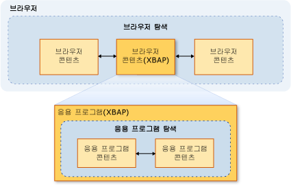
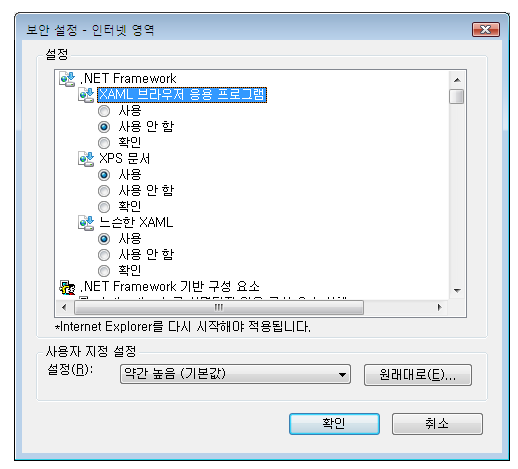

# 보안(WPF)
 Windows Presentation Foundation (WPF) 독립 실행형 및 브라우저에서 호스팅되는 응용 프로그램을 개발할 때는 보안 모델을 고려해 야 합니다. [!INCLUDE[TLA2#tla_wpf](../../../includes/tla2sharptla-wpf-md.md)] 독립 실행형 응용 프로그램 무제한 권한으로 실행 ( [!INCLUDE[TLA2#tla_cas](../../../includes/tla2sharptla-cas-md.md)] **FullTrust** 사용 권한 집합), Windows Installer (.msi) XCopy를 사용 하 여 배포 인지 여부 또는 [!INCLUDE[TLA2#tla_clickonce](../../../includes/tla2sharptla-clickonce-md.md)]합니다. ClickOnce를 포함한 부분 신뢰, 독립 실행형 WPF 응용 프로그램 배포가 지원되지 않습니다. 그러나 완전 신뢰 호스트 응용 프로그램 부분 신뢰를 만들 수 <xref:System.AppDomain> .NET Framework 추가 기능 모델을 사용 하 여 합니다. 자세한 내용은 참조 [WPF 추가 기능 개요](../../../docs/framework/wpf/app-development/wpf-add-ins-overview.md)합니다.  
  
 [!INCLUDE[TLA2#tla_wpf](../../../includes/tla2sharptla-wpf-md.md)] 브라우저에서 호스팅되는 응용 프로그램에서 호스팅되는 [!INCLUDE[TLA#tla_iegeneric](../../../includes/tlasharptla-iegeneric-md.md)] 또는 Firefox 될 수 있습니다 [!INCLUDE[TLA#tla_xbap#plural](../../../includes/tlasharptla-xbapsharpplural-md.md)] 또는 느슨한 [!INCLUDE[TLA#tla_xaml](../../../includes/tlasharptla-xaml-md.md)] 에 대 한 자세한 내용은 문서 참조 [WPF XAML 브라우저 응용 프로그램 개요](../../../docs/framework/wpf/app-development/wpf-xaml-browser-applications-overview.md)합니다.  
  
 [!INCLUDE[TLA2#tla_wpf](../../../includes/tla2sharptla-wpf-md.md)] 브라우저에서 호스팅되는 응용 프로그램 기본 제한 되는 기본적으로 부분 신뢰 보안 샌드박스에서 실행 [!INCLUDE[TLA2#tla_cas](../../../includes/tla2sharptla-cas-md.md)] **인터넷** 영역 권한 집합입니다. 이 실제로 [!INCLUDE[TLA2#tla_wpf](../../../includes/tla2sharptla-wpf-md.md)] 분리 되어야 하는 일반적인 웹 응용 프로그램 기대 같은 방식으로 클라이언트 컴퓨터에서 브라우저 호스팅되는 응용 프로그램입니다. XBAP는 배포 URL 및 클라이언트의 보안 구성의 보안 영역에 따라 권한을 완전 신뢰까지 높일 수 있습니다. 자세한 내용은 [WPF 부분 신뢰 보안](../../../docs/framework/wpf/wpf-partial-trust-security.md)을 참조하세요.  
  
 이 항목에서는 Windows Presentation Foundation (WPF) 독립 실행형 및 브라우저에서 호스팅되는 응용 프로그램에 대 한 보안 모델에 설명 합니다.  
  
 이 항목에는 다음과 같은 단원이 포함되어 있습니다.  
  
-   [안전한 탐색](#SafeTopLevelNavigation)  
  
-   [웹 브라우징 소프트웨어 보안 설정](#InternetExplorerSecuritySettings)  
  
-   [WebBrowser 컨트롤 및 기능 컨트롤](#webbrowser_control_and_feature_controls)  
  
-   [부분적으로 신뢰할 수 있는 클라이언트 응용 프로그램에 대한 APTCA 어셈블리를 사용하지 않도록 설정](#APTCA)  
  
-   [XAML 사용 완화 파일에 대한 샌드박스 동작](#LooseContentSandboxing)  
  
-   [보안을 승격하는 WPF 응용 프로그램 개발을 위한 리소스](#BestPractices)  
  
   
## 안전한 탐색  
 에 대 한 [!INCLUDE[TLA2#tla_xbap#plural](../../../includes/tla2sharptla-xbapsharpplural-md.md)], [!INCLUDE[TLA2#tla_wpf](../../../includes/tla2sharptla-wpf-md.md)] 탐색의 두 가지 유형의 구분: 응용 프로그램 및 브라우저.  
  
 *응용 프로그램 탐색*은 브라우저에서 호스트되는 응용 프로그램 내의 콘텐츠 항목 간을 탐색합니다. *브라우저 탐색*은 브라우저 자체의 콘텐츠 및 위치 URL을 변경하는 탐색입니다. 응용 프로그램 탐색 (일반적으로 XAML)와 브라우저 탐색 (일반적으로 HTML) 간의 관계는 다음 그림에 표시 됩니다.
  
   
  
 에 대 한 안전 하다 고 판단 되는 콘텐츠 형식의 [!INCLUDE[TLA2#tla_xbap](../../../includes/tla2sharptla-xbap-md.md)] 이동할 주로 따라 사용자가 응용 프로그램 탐색 또는 브라우저 탐색 사용 여부.  
  
   
### 응용 프로그램 탐색 보안  
 응용 프로그램 탐색 팩으로 식별할 수 있는 경우에 안전한 것으로 간주 됩니다 [!INCLUDE[TLA2#tla_uri](../../../includes/tla2sharptla-uri-md.md)]를 지 원하는 네 가지 형식의 콘텐츠:  
  
|콘텐츠 형식|설명|URI 예제|  
|------------------|-----------------|-----------------|  
|리소스|파일의 빌드 형식 사용 하 여 프로젝트에 추가 된 **리소스**합니다.|`pack://application:,,,/MyResourceFile.xaml`|  
|콘텐츠|파일의 빌드 형식 사용 하 여 프로젝트에 추가 된 **콘텐츠**합니다.|`pack://application:,,,/MyContentFile.xaml`|  
|원래 사이트|파일의 빌드 형식 사용 하 여 프로젝트에 추가 된 **None**합니다.|`pack://siteoforigin:,,,/MySiteOfOriginFile.xaml`|  
|응용 프로그램 코드|컴파일된 코드 숨김이 있는 XAML 리소스.   -또는-   XAML 파일의 빌드 형식 사용 하 여 프로젝트에 추가 된 **페이지**합니다.|`pack://application:,,,/MyResourceFile` `.xaml`|  
  
> [!NOTE]
>  응용 프로그램 데이터 파일 및 팩에 대 한 자세한 내용은 [!INCLUDE[TLA2#tla_uri#plural](../../../includes/tla2sharptla-urisharpplural-md.md)], 참조 [WPF 응용 프로그램 리소스, 내용 및 데이터 파일](../../../docs/framework/wpf/app-development/wpf-application-resource-content-and-data-files.md)합니다.  
  
 이러한 콘텐츠 형식의 파일은 사용자 또는 프로그래밍 방식으로 탐색할 수 있습니다.  
  
-   **사용자 탐색**. 사용자가 클릭 하 여 탐색 한 <xref:System.Windows.Documents.Hyperlink> 요소입니다.  
  
-   **프로그래밍 방식 탐색**. 응용 프로그램에서 탐색을 설정 하 여 예를 들어 사용자를 통하지 않고는 <xref:System.Windows.Navigation.NavigationWindow.Source%2A?displayProperty=nameWithType> 속성입니다.  
  
   
### 브라우저 탐색 보안  
 브라우저 탐색은 다음 조건에서만 안전한 것으로 간주됩니다.  
  
-   **사용자 탐색**. 사용자가 클릭 하 여 탐색 한 <xref:System.Windows.Documents.Hyperlink> 주 내에 있는 요소 <xref:System.Windows.Navigation.NavigationWindow>아니라 중첩 된 <xref:System.Windows.Controls.Frame>합니다.  
  
-   **영역**. 탐색 대상 콘텐츠는 인터넷 또는 로컬 인트라넷에 있습니다.  
  
-   **프로토콜**. 사용 되는 프로토콜은 **http**, **https**, **파일**, 또는 **mailto**합니다.  
  
 경우는 [!INCLUDE[TLA2#tla_xbap](../../../includes/tla2sharptla-xbap-md.md)] 이러한 조건에 맞지 않는 방식으로 콘텐츠를 탐색 하려고 한 <xref:System.Security.SecurityException> throw 됩니다.  
  
   
## 웹 브라우징 소프트웨어 보안 설정  
 컴퓨터의 보안 설정은 웹 브라우징 소프트웨어 권한이 부여된 액세스 권한을 결정합니다. 웹 검색 소프트웨어 정보와 모든 응용 프로그램 또는 구성 요소를 사용 하는 [WinINet](http://go.microsoft.com/fwlink/?LinkId=179379) 또는 [UrlMon](http://go.microsoft.com/fwlink/?LinkId=179383) Api, Internet Explorer 및 PresentationHost.exe 포함 합니다.  
  
 [!INCLUDE[TLA2#tla_iegeneric](../../../includes/tla2sharptla-iegeneric-md.md)] 으로 또는에서 실행할 수 있도록 허용 되는 기능을 구성할 수 있는 메커니즘을 제공 [!INCLUDE[TLA2#tla_iegeneric](../../../includes/tla2sharptla-iegeneric-md.md)], 다음을 포함 하 여:  
  
-   .NET framework 기반 구성 요소  
  
-   ActiveX 컨트롤 및 플러그인  
  
-   다운로드  
  
-   스크립팅  
  
-   사용자 인증  
  
 이러한 방식으로 보호 될 수 있는 기능 컬렉션에 대 한 영역별로에 구성 되는 **인터넷**, **인트라넷**, **신뢰할 수 있는 사이트**, 및  **제한 된 사이트** 영역입니다. 다음 단계는 보안 설정을 구성하는 방법을 설명합니다.  
  
1.  **제어판**을 엽니다.  
  
2.  클릭 **네트워크 및 인터넷** 클릭 하 고 **인터넷 옵션**합니다.  
  
     인터넷 옵션 대화 상자가 나타납니다.  
  
3.  에 **보안** 탭에 대 한 보안 설정을 구성 하는 영역을 선택 합니다.  
  
4.  클릭는 **사용자 지정 수준** 단추입니다.  
  
     **보안 설정** 대화 상자가 표시 되며 선택한 영역에 대 한 보안 설정을 구성할 수 있습니다.  
  
       
  
> [!NOTE]
>  Internet Explorer에서 인터넷 옵션 대화 상자에 액세스할 수도 있습니다. 클릭 **도구** 클릭 하 고 **인터넷 옵션**합니다.  
  
 부터는 [!INCLUDE[TLA#tla_ie7](../../../includes/tlasharptla-ie7-md.md)], 특히.NET Framework에 대 한 다음 보안 설정이 포함 됩니다.  
  
-   **느슨한 XAML**. 컨트롤 여부 [!INCLUDE[TLA2#tla_iegeneric](../../../includes/tla2sharptla-iegeneric-md.md)] 탐색 하 여 느슨한 [!INCLUDE[TLA2#tla_xaml](../../../includes/tla2sharptla-xaml-md.md)] 파일입니다. (설정, 해제 및 확인 옵션).  
  
-   **XAML 브라우저 응용 프로그램**. 컨트롤 여부 [!INCLUDE[TLA2#tla_iegeneric](../../../includes/tla2sharptla-iegeneric-md.md)] 탐색 하 여 실행 [!INCLUDE[TLA2#tla_xbap#plural](../../../includes/tla2sharptla-xbapsharpplural-md.md)]합니다. (설정, 해제 및 확인 옵션).  
  
 기본적으로 이러한 설정을 모두 사용에 대 한는 **인터넷**, **로컬 인트라넷**, 및 **신뢰할 수 있는 사이트** 영역 및에 대 한 사용 안 함은 **제한 된 사이트**  영역입니다.  
  
   
### 보안 관련 WPF 레지스트리 설정  
 인터넷 옵션을 통해 사용할 수 있는 보안 설정 외에 다음 레지스트리 값은 선택적으로 다양한 보안 관련 WPF 기능을 차단하는 데 사용할 수 있습니다. 해당 값은 다음 키에서 정의됩니다.  
  
 `HKEY_LOCAL_MACHINE\SOFTWARE\Microsoft\.NETFramework\Windows Presentation Foundation\Features`  
  
 다음 표에서는 설정할 수 있는 값을 보여 줍니다.  
  
|값 이름|값 형식|값 데이터|  
|----------------|----------------|----------------|  
|XBAPDisallow|REG_DWORD|1은 허용되지 않으며 0은 허용됩니다.|  
|LooseXamlDisallow|REG_DWORD|1은 허용되지 않으며 0은 허용됩니다.|  
|WebBrowserDisallow|REG_DWORD|1은 허용되지 않으며 0은 허용됩니다.|  
|MediaAudioDisallow|REG_DWORD|1은 허용되지 않으며 0은 허용됩니다.|  
|MediaImageDisallow|REG_DWORD|1은 허용되지 않으며 0은 허용됩니다.|  
|MediaVideoDisallow|REG_DWORD|1은 허용되지 않으며 0은 허용됩니다.|  
|ScriptInteropDisallow|REG_DWORD|1은 허용되지 않으며 0은 허용됩니다.|  
  
   
## WebBrowser 컨트롤 및 기능 컨트롤  
 WPF <xref:System.Windows.Controls.WebBrowser> 웹 콘텐츠를 호스트에 컨트롤을 사용할 수 있습니다. WPF <xref:System.Windows.Controls.WebBrowser> 컨트롤 내부 WebBrowser ActiveX 컨트롤을 래핑합니다. WPF를 사용 하는 경우 응용 프로그램을 보호 하기 위한 일부 지원을 제공 <xref:System.Windows.Controls.WebBrowser> 컨트롤을 호스트 웹 콘텐츠를 트러스트 합니다. 일부 보안 기능을 사용 하 여 응용 프로그램에서 직접 적용 해야 하는 반면는 <xref:System.Windows.Controls.WebBrowser> 제어 합니다. WebBrowser ActiveX 컨트롤에 대 한 자세한 내용은 참조 [WebBrowser 컨트롤 개요 및 자습서](http://go.microsoft.com/fwlink/?LinkId=179388)합니다.  
  
> [!NOTE]
>  이 섹션에도 적용 됩니다는 <xref:System.Windows.Controls.Frame> 하므로 사용 하 여이 컨트롤는 <xref:System.Windows.Controls.WebBrowser> HTML 콘텐츠를 탐색할 수 있습니다.  
  
 경우 WPF <xref:System.Windows.Controls.WebBrowser> 컨트롤은 신뢰할 수 없는 웹 콘텐츠를 호스트 하는 데 사용, 응용 프로그램 부분 신뢰를 사용 해야 <xref:System.AppDomain> 잠재적 악성 HTML 스크립트 코드에서 응용 프로그램 코드를 분리 하려면. 사용 하 여 응용 프로그램은 호스팅된 스크립트와 상호 작용 하는 경우에 특히 그렇습니다는 <xref:System.Windows.Controls.WebBrowser.InvokeScript%2A> 메서드 및 <xref:System.Windows.Controls.WebBrowser.ObjectForScripting%2A> 속성입니다. 자세한 내용은 참조 [WPF 추가 기능 개요](../../../docs/framework/wpf/app-development/wpf-add-ins-overview.md)합니다.  
  
 응용 프로그램에서 WPF를 사용 하는 경우 <xref:System.Windows.Controls.WebBrowser> 컨트롤, 보안을 강화 하 고 공격을 완화 하는 다른 방법은 Internet Explorer 기능 컨트롤 수 있도록 합니다. 기능 컨트롤은 Internet Explorer에 대 한 관리자와 개발자가 Internet Explorer 및 WebBrowser ActiveX 컨트롤을 호스트 하는 응용 프로그램의 기능을 구성할 수 있는 추가 WPF <xref:System.Windows.Controls.WebBrowser> 래핑하고 제어 합니다. 기능 컨트롤을 사용 하 여 구성할 수 있습니다는 [CoInternetSetFeatureEnabled](http://go.microsoft.com/fwlink/?LinkId=179394) 함수 또는 레지스트리 값을 변경 하 여 합니다. 기능 컨트롤에 대 한 자세한 내용은 참조 [기능 컨트롤 소개](http://go.microsoft.com/fwlink/?LinkId=179390) 및 [인터넷 기능 컨트롤](http://go.microsoft.com/fwlink/?LinkId=179392)합니다.  
  
 WPF를 사용 하는 독립 실행형 WPF 응용 프로그램을 개발 하는 경우 <xref:System.Windows.Controls.WebBrowser> 컨트롤, WPF 응용 프로그램에 대 한 다음과 같은 기능 컨트롤을 자동으로 설정 합니다.  
  
|기능 컨트롤|  
|---------------------|  
|FEATURE_MIME_HANDLING|  
|FEATURE_MIME_SNIFFING|  
|FEATURE_OBJECT_CACHING|  
|FEATURE_SAFE_BINDTOOBJECT|  
|FEATURE_WINDOW_RESTRICTIONS|  
|FEATURE_ZONE_ELEVATION|  
|FEATURE_RESTRICT_FILEDOWNLOAD|  
|FEATURE_RESTRICT_ACTIVEXINSTALL|  
|FEATURE_ADDON_MANAGEMENT|  
|FEATURE_HTTP_USERNAME_PASSWORD_DISABLE|  
|FEATURE_SECURITYBAND|  
|FEATURE_UNC_SAVEDFILECHECK|  
|FEATURE_VALIDATE_NAVIGATE_URL|  
|FEATURE_DISABLE_TELNET_PROTOCOL|  
|FEATURE_WEBOC_POPUPMANAGEMENT|  
|FEATURE_DISABLE_LEGACY_COMPRESSION|  
|FEATURE_SSLUX|  
  
 이러한 기능 컨트롤은 조건에 상관 없이 사용되므로 이 컨트롤로 인해 완전 신뢰 응용 프로그램가 손상될 수 있습니다. 이 경우 특정 응용 프로그램 및 호스팅하는 콘텐츠에 대한 보안 위험이 없다면, 해당 기능 컨트롤을 비활성화할 수 있습니다.  
  
 기능 컨트롤 WebBrowser ActiveX 개체를 인스턴스화하는 프로세스에 의해 적용 됩니다. 따라서 신뢰할 수 없는 콘텐츠를 탐색할 수 있는 독립 실행형 응용 프로그램을 만드는 경우, 추가 기능 컨트롤 사용을 심각하게 고려해야 합니다.  
  
> [!NOTE]
>  이 권장 사항은 MSHTML 및 SHDOCVW 호스트 보안을 위한 일반 권장 사항을 기반으로 합니다. 자세한 내용은 참조 [The MSHTML 호스트 Security FAQ: II의 1 부에서](http://go.microsoft.com/fwlink/?LinkId=179396) 및 [MSHTML 호스트 보안 질문과 대답: II II 부](http://go.microsoft.com/fwlink/?LinkId=179415)합니다.  
  
 실행 파일의 경우, 레지스트리 값을 1로 설정하여 다음 기능 컨트롤을 사용하도록 설정하는 것이 좋습니다.  
  
|기능 컨트롤|  
|---------------------|  
|FEATURE_ACTIVEX_REPURPOSEDETECTION|  
|FEATURE_BLOCK_LMZ_IMG|  
|FEATURE_BLOCK_LMZ_OBJECT|  
|FEATURE_BLOCK_LMZ_SCRIPT|  
|FEATURE_RESTRICT_RES_TO_LMZ|  
|FEATURE_RESTRICT_ABOUT_PROTOCOL_IE7|  
|FEATURE_SHOW_APP_PROTOCOL_WARN_DIALOG|  
|FEATURE_LOCALMACHINE_LOCKDOWN|  
|FEATURE_FORCE_ADDR_AND_STATUS|  
|FEATURE_RESTRICTED_ZONE_WHEN_FILE_NOT_FOUND|  
  
 실행 파일의 경우, 레지스트리 값을 0으로 설정하여 다음 기능 컨트롤을 사용하지 않도록 설정하는 것이 좋습니다.  
  
|기능 컨트롤|  
|---------------------|  
|FEATURE_ENABLE_SCRIPT_PASTE_URLACTION_IF_PROMPT|  
  
 부분 신뢰를 실행 하는 경우 [!INCLUDE[TLA#tla_xbap](../../../includes/tlasharptla-xbap-md.md)] WPF를 포함 하는 <xref:System.Windows.Controls.WebBrowser> 제어 [!INCLUDE[TLA#tla_iegeneric](../../../includes/tlasharptla-iegeneric-md.md)], WPF Internet Explorer 프로세스의 주소 공간에서 WebBrowser ActiveX 컨트롤을 호스트 합니다. WebBrowser ActiveX 컨트롤에서 호스팅되므로 [!INCLUDE[TLA2#tla_iegeneric](../../../includes/tla2sharptla-iegeneric-md.md)] 프로세스에 Internet Explorer에 대 한 기능 컨트롤의 모든 WebBrowser ActiveX 컨트롤에 대해 설정 됩니다.  
  
 또한 Internet Explorer에서 실행하는 XBAP는 일반 독립 실행형 응용 프로그램보다 추가된 보안 수준이 제공됩니다. 이 추가 보안은 Internet Explorer 및 WebBrowser ActiveX 컨트롤에서 실행 되므로 보호 모드에서 기본적으로 [!INCLUDE[TLA#tla_winvista](../../../includes/tlasharptla-winvista-md.md)] 및 [!INCLUDE[win7](../../../includes/win7-md.md)]합니다. 보호 모드에 대 한 자세한 내용은 참조 [이해 하 고 보호 모드 Internet Explorer에서 작업](http://go.microsoft.com/fwlink/?LinkId=179393)합니다.  
  
> [!NOTE]
>  WPF를 포함 하는 XBAP 실행 하려고 하면 <xref:System.Windows.Controls.WebBrowser> 컨트롤 Firefox 인터넷 영역에 있는 동안에 <xref:System.Security.SecurityException> throw 됩니다. 이는 WPF 보안 정책에 의한 것입니다.  
  
   
## 부분적으로 신뢰할 수 있는 클라이언트 응용 프로그램에 대한 APTCA 어셈블리를 사용하지 않도록 설정  
 관리 되는 어셈블리에 설치 된 경우는 [!INCLUDE[TLA#tla_gac](../../../includes/tlasharptla-gac-md.md)], 사용자는 설치를 위해 명시적 권한을 제공 해야 하기 때문에 완전히 신뢰할 수 있는 해지기 합니다. 완전히 신뢰할 수 있기 때문에 완전히 신뢰할 수 있는 관리 클라이언트 응용 프로그램에서 사용할 수 있습니다. 부분적으로 신뢰할 수 있는 응용 프로그램을 사용할 수 있도록 것으로 표시 되어야 합니다는 <xref:System.Security.AllowPartiallyTrustedCallersAttribute> (APTCA). 부분 신뢰로 실행하기에 안전한 것으로 테스트된 어셈블리만 이 특성으로 표시되어야 합니다.  
  
 그러나는에 설치 된 후 보안 결함을 드러낼 APTCA 어셈블리는 [!INCLUDE[TLA2#tla_gac](../../../includes/tla2sharptla-gac-md.md)]합니다. 보안 결함이 발견되면 어셈블리 게시자는 기존 설치에서 문제를 해결하는 보안 업데이트를 생성할 수 있으며, 문제가 발견된 후 발생할 수 있는 설치를 방지할 수 있습니다. 업데이트에 대한 한 가지 옵션은 어셈블리를 제거하는 것이지만 어셈블리를 사용하는 완전히 신뢰할 수 있는 다른 클라이언트 응용 프로그램이 중단될 수 있습니다.  
  
 [!INCLUDE[TLA2#tla_wpf](../../../includes/tla2sharptla-wpf-md.md)] 기준인 APTCA 어셈블리 수 수에 대 한 비활성화 부분적으로 신뢰할 수 있는 메커니즘을 제공 [!INCLUDE[TLA2#tla_xbap#plural](../../../includes/tla2sharptla-xbapsharpplural-md.md)] APTCA 어셈블리를 제거 하지 않고 있습니다.  
  
 APTCA 어셈블리를 사용하지 않도록 설정하려면 특수한 레지스트리 키를 만들어야 합니다.  
  
 `HKEY_LOCAL_MACHINE\SOFTWARE\Microsoft\.NETFramework\policy\APTCA\<AssemblyFullName>, FileVersion=<AssemblyFileVersion>`  
  
 이에 대한 예는 다음과 같습니다.  
  
 `HKEY_LOCAL_MACHINE\SOFTWARE\Microsoft\.NETFramework\policy\APTCA\aptcagac, Version=1.0.0.0, Culture=neutral, PublicKeyToken=215e3ac809a0fea7, FileVersion=1.0.0.0`  
  
 이 키는 APTCA 어셈블리에 대한 항목을 설정합니다. 어셈블리를 사용할지를 지정하는 이 키에서 값을 만들 수도 있습니다. 다음은 값의 세부 정보입니다.  
  
-   값 이름: **APTCA_FLAG**합니다.  
  
-   값 종류: **REG_DWORD**합니다.  
  
-   값 데이터: **1** ; 해제 하려면 **0** 사용할 수 있도록 합니다.  
  
 어셈블리를 부분적으로 신뢰할 수 있는 클라이언트 응용 프로그램에 사용하지 않도록 설정해야 하는 경우, 레지스트리 키와 값을 만드는 업데이트를 작성할 수 있습니다.  
  
> [!NOTE]
>  핵심.NET Framework 어셈블리는 관리 되는 응용 프로그램을 실행 하는 데 필요 하기 때문에 이러한 방식으로 비활성화 하 여 영향을 받지 않습니다. APTCA 어셈블리를 사용하지 않도록 설정하는 것에 대한 지원은 기본적으로 타사 응용 프로그램을 대상으로 합니다.  
  
   
## 느슨한 XAML 파일에 대한 샌드박스 동작  
 느슨한 [!INCLUDE[TLA2#tla_xaml](../../../includes/tla2sharptla-xaml-md.md)] 파일은 코드 숨김, 이벤트 처리기 또는 응용 프로그램별 어셈블리에 종속 되지 않은 태그 전용 XAML 파일입니다. 느슨한 [!INCLUDE[TLA2#tla_xaml](../../../includes/tla2sharptla-xaml-md.md)] 브라우저에서 직접 파일 탐색할 기본 인터넷 영역 권한 집합에 따라 보안 샌드박스에 로드 됩니다.  
  
 그러나 보안 동작은 느슨한 다르게 [!INCLUDE[TLA2#tla_xaml](../../../includes/tla2sharptla-xaml-md.md)] 파일 중 하나에서 탐색할는 <xref:System.Windows.Navigation.NavigationWindow> 또는 <xref:System.Windows.Controls.Frame> 독립 실행형 응용 프로그램에서입니다.  
  
 두 경우 모두 느슨한 [!INCLUDE[TLA2#tla_xaml](../../../includes/tla2sharptla-xaml-md.md)] 파일 탐색은 호스트 응용 프로그램의 사용 권한을 상속 합니다. 그러나이 동작의 느슨한 경우 특히 보안 측면에서 적절 하지 않을 [!INCLUDE[TLA2#tla_xaml](../../../includes/tla2sharptla-xaml-md.md)] 파일은 신뢰할 수 있는 또는 알 수 없는 엔터티에 의해 생성 되었습니다. 이 콘텐츠 형식의 라고 *외부 콘텐츠*, 둘 다 고 <xref:System.Windows.Controls.Frame> 및 <xref:System.Windows.Navigation.NavigationWindow> 를 탐색할 때 격리 하도록 구성할 수 있습니다. 격리를 설정 하 여 수행할는 **SandboxExternalContent** 속성을 true에 대 한 다음 예제에 나와 있는 것 처럼 <xref:System.Windows.Controls.Frame> 및 <xref:System.Windows.Navigation.NavigationWindow>:  
  
 [!code-xaml[SecurityOverviewSnippets#FrameMARKUP](../../../samples/snippets/csharp/VS_Snippets_Wpf/SecurityOverviewSnippets/CS/Window2.xaml#framemarkup)]  
  
 [!code-xaml[SecurityOverviewSnippets#NavigationWindowMARKUP](../../../samples/snippets/csharp/VS_Snippets_Wpf/SecurityOverviewSnippets/CS/Window1.xaml#navigationwindowmarkup)]  
  
 이 설정을 통해 외부 콘텐츠가 응용 프로그램을 호스팅하는 프로세스와 별개인 프로세스로 로드됩니다. 이 프로세스는 효과적으로 호스팅 응용 프로그램과 클라이언트 컴퓨터에서 격리되어 기본 인터넷 영역 권한 집합으로 제한됩니다.  
  
> [!NOTE]
>  경우에 탐색 느슨한을 [!INCLUDE[TLA2#tla_xaml](../../../includes/tla2sharptla-xaml-md.md)] 파일 중 하나에서 한 <xref:System.Windows.Navigation.NavigationWindow> 또는 <xref:System.Windows.Controls.Frame> 독립 실행형 응용 프로그램은 구현 호스팅 PresentationHost 프로세스와 관련 된 인프라 WPF 브라우저에 따라 보안 수준이 콘텐츠 Internet Explorer에서 직접 로드할 때 보다 약간 적은 범위로 [!INCLUDE[wiprlhext](../../../includes/wiprlhext-md.md)] 및 [!INCLUDE[win7](../../../includes/win7-md.md)] (있는 여전히 일 PresentationHost 통해). 웹 브라우저를 사용하는 독립 실행형 WPF 응용 프로그램은 Internet Explorer의 추가 보호 모드 보안 기능을 제공하지 않습니다.  
  
   
## 보안을 승격하는 WPF 응용 프로그램 개발을 위한 리소스  
 다음은 몇 가지 추가 리소스를 개발 하기 위해 [!INCLUDE[TLA2#tla_wpf](../../../includes/tla2sharptla-wpf-md.md)] 보안을 향상 하는 응용 프로그램:  
  
|영역|리소스|  
|----------|--------------|  
|관리 코드|[응용 프로그램에 대한 패턴 및 사례 보안 지침](http://go.microsoft.com/fwlink/?LinkId=117426)|  
|[!INCLUDE[TLA2#tla_cas](../../../includes/tla2sharptla-cas-md.md)]|[코드 액세스 보안](../../../docs/framework/misc/code-access-security.md)|  
|[!INCLUDE[TLA2#tla_clickonce](../../../includes/tla2sharptla-clickonce-md.md)]|[ClickOnce 보안 및 배포](/visualstudio/deployment/clickonce-security-and-deployment)|  
|[!INCLUDE[TLA2#tla_wpf](../../../includes/tla2sharptla-wpf-md.md)]|[WPF 부분 신뢰 보안](../../../docs/framework/wpf/wpf-partial-trust-security.md)|  
  
## 참고 항목  
 [WPF 부분 신뢰 보안](../../../docs/framework/wpf/wpf-partial-trust-security.md)  
 [WPF 보안 전략 - 플랫폼 보안](../../../docs/framework/wpf/wpf-security-strategy-platform-security.md)  
 [WPF 보안 전략 - 보안 엔지니어링](../../../docs/framework/wpf/wpf-security-strategy-security-engineering.md)  
 [응용 프로그램에 대한 패턴 및 사례 보안 지침](http://go.microsoft.com/fwlink/?LinkId=117426)  
 [코드 액세스 보안](../../../docs/framework/misc/code-access-security.md)  
 [ClickOnce 보안 및 배포](/visualstudio/deployment/clickonce-security-and-deployment)  
 [XAML 개요(WPF)](../../../docs/framework/wpf/advanced/xaml-overview-wpf.md)
