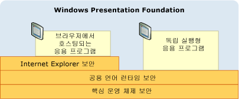
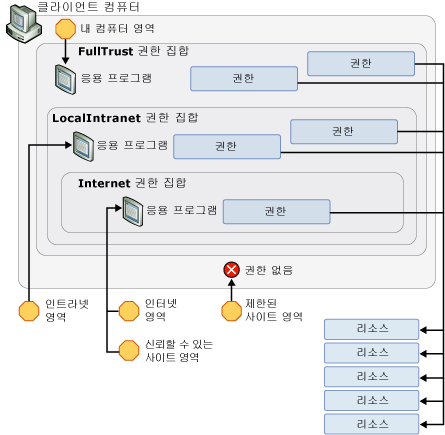

# WPF 보안 전략 - 플랫폼 보안
또한 운영 체제를 포함 하는 기본 플랫폼의 보안 기능을 활용 Windows Presentation Foundation (WPF) 다양 한 보안 서비스를 제공 하며는 [!INCLUDE[TLA2#tla_clr](../../../includes/tla2sharptla-clr-md.md)], 및 [!INCLUDE[TLA2#tla_ie](../../../includes/tla2sharptla-ie-md.md)]합니다. 이러한 계층이 결합되어 다음 그림과 같이 단일 실패 지점을 방지하는 강력한 심층 방어 보안 모델인 [!INCLUDE[TLA2#tla_wpf](../../../includes/tla2sharptla-wpf-md.md)]를 제공합니다.  
  
   
  
 이 항목의 나머지 부분에서는 특히 [!INCLUDE[TLA2#tla_wpf](../../../includes/tla2sharptla-wpf-md.md)]와 관련된 각 계층의 기능을 설명합니다.  
  

  
   
## 운영 체제 보안  
 [!INCLUDE[TLA2#tla_wpf](../../../includes/tla2sharptla-wpf-md.md)]에 필요한 최소 수준의 운영 체제는 [!INCLUDE[TLA2#tla_winxpsp2](../../../includes/tla2sharptla-winxpsp2-md.md)]입니다. 핵심 [!INCLUDE[TLA2#tla_winxpsp2](../../../includes/tla2sharptla-winxpsp2-md.md)] 사용 하 여 빌드한 포함 하 여 모든 Windows 응용 프로그램을 위한 보안 기초를 형성 하는 몇 가지 보안 기능이 제공 [!INCLUDE[TLA2#tla_wpf](../../../includes/tla2sharptla-wpf-md.md)]합니다. [!INCLUDE[TLA#tla_longhorn](../../../includes/tlasharptla-longhorn-md.md)]은 [!INCLUDE[TLA2#tla_wpf](../../../includes/tla2sharptla-wpf-md.md)]의 보안 기능을 통합하고 더욱 확장합니다. 이 항목에서는 [!INCLUDE[TLA2#tla_wpf](../../../includes/tla2sharptla-wpf-md.md)]에 중요한 다양한 보안 기능 및 [!INCLUDE[TLA2#tla_wpf](../../../includes/tla2sharptla-wpf-md.md)]가 더욱 심층 방어를 제공하기 위해 이러한 기능과 통합되는 방법을 설명합니다.  
  
   
### Microsoft Windows XP SP2(서비스 팩 2)  
 일반 검토 및의 Windows 강화 외에 세 가지 주요 기능에서 [!INCLUDE[TLA2#tla_winxpsp2](../../../includes/tla2sharptla-winxpsp2-md.md)] 이 항목에 설명 합니다.  
  
-   /GS 컴파일  
  
-   [!INCLUDE[TLA#tla_win_update](../../../includes/tlasharptla-win-update-md.md)].  
  
#### /GS 컴파일  
 [!INCLUDE[TLA2#tla_winxpsp2](../../../includes/tla2sharptla-winxpsp2-md.md)]에서는 버퍼 오버런 완화에 도움이 되도록 [!INCLUDE[TLA2#tla_clr](../../../includes/tla2sharptla-clr-md.md)]과 같은 모든 [!INCLUDE[TLA2#tla_wpf](../../../includes/tla2sharptla-wpf-md.md)] 종속성을 포함하여 많은 핵심 시스템 라이브러리를 다시 컴파일하여 보호를 제공합니다. 이 작업을 위해 /GS 매개 변수와 C/C++ 명령줄 컴파일러를 함께 사용합니다. 버퍼 오버런을 명시적으로 피해야 하지만 /GS 컴파일은 실수 또는 악의적으로 만들어진 잠재적인 취약성에 대한 심층 방어의 예를 제공합니다.  
  
 지금까지 버퍼 오버런은 많은 강력한 보안 익스플로이트의 원인이 되었습니다. 버퍼 오버런은 공격자는 버퍼의 경계를 지나서 쓰는 악성 코드의 삽입을 허용하는 코드 취약성을 활용하는 경우에 발생합니다. 이 경우 공격자의 코드가 실행되도록 함수의 반환 주소를 덮어써서 코드가 실행되는 프로세스를 공격자가 가로챌 수 있습니다. 그 결과, 가로챈 프로세스와 동일한 권한으로 임의 코드를 실행하는 악성 코드가 생깁니다.  
  
 높은 수준에서 /GS 컴파일러 플래그는 로컬 문자열 버퍼가 있는 함수의 반환 주소를 보호하기 위해 특수 보안 쿠키를 삽입하여 잠재적인 버퍼 오버런으로부터 보호합니다. 함수가 반환된 후 보안 쿠키를 이전 값과 비교합니다. 값이 변경된 경우 버퍼 오버런이 발생했을 수 있으며 프로세스가 오류 상태로 중지됩니다. 프로세스를 중지하면 잠재적인 악성 코드의 실행이 방지됩니다. 참조 [/GS (버퍼 보안 검사)](http://msdn.microsoft.com/library/8dbf701c.aspx) 내용을 확인 합니다.  
  
 [!INCLUDE[TLA2#tla_wpf](../../../includes/tla2sharptla-wpf-md.md)] 응용 프로그램에 다른 방어 계층을 추가하기 위해 [!INCLUDE[TLA2#tla_wpf](../../../includes/tla2sharptla-wpf-md.md)]는 /GS 플래그로 컴파일됩니다.  
  
#### Microsoft Windows 업데이트 향상 기능  
 [!INCLUDE[TLA2#tla_winxpsp2](../../../includes/tla2sharptla-winxpsp2-md.md)]에서는 업데이트 다운로드 및 설치 프로세스를 간소화하기 위해 [!INCLUDE[TLA#tla_win_update](../../../includes/tlasharptla-win-update-md.md)]도 향상되었습니다. 이러한 변경 내용은 특히 보안 업데이트와 관련해서 시스템을 최신 상태로 유지할 수 있게 하여 [!INCLUDE[TLA2#tla_wpf](../../../includes/tla2sharptla-wpf-md.md)] 고객의 보안을 훨씬 향상시킵니다.  
  
   
### Windows Vista  
 [!INCLUDE[TLA#tla_longhorn](../../../includes/tlasharptla-longhorn-md.md)]의 [!INCLUDE[TLA2#tla_wpf](../../../includes/tla2sharptla-wpf-md.md)] 사용자는 "최소 권한 사용자 액세스", 코드 무결성 검사 및 권한 격리를 비롯한 운영 체제의 향상된 추가 보안 기능을 활용합니다.  
  
#### UAC(사용자 계정 컨트롤)  
 현재 Windows 사용자 대부분의 응용 프로그램 설치 또는 실행 또는 둘 다에 대 한 필요 하기 때문에 관리자 권한으로 실행 하는 경향이 있습니다. 한 가지 예로 기본 응용 프로그램 설정을 레지스트리에 쓸 수 있습니다.  
  
 관리자 권한으로 실행은 실제로 관리자 권한이 부여된 프로세스에서 응용 프로그램이 실행됨을 의미합니다. 이 경우 보안에 미치는 영향은 관리자 권한으로 실행되는 프로세스를 가로챈 악성 코드가 중요한 시스템 리소스에 대한 액세스를 포함하여 해당 권한을 자동으로 상속하게 된다는 것입니다.  
  
 이 보안 위협으로부터 보호하는 한 가지 방법은 필요한 최소한의 권한으로 응용 프로그램을 실행하는 것입니다. 이를 최소 권한의 원칙이라고 하며 [!INCLUDE[TLA#tla_longhorn](../../../includes/tlasharptla-longhorn-md.md)] 운영 체제의 핵심 기능입니다. 이 기능은 UAC(사용자 계정 컨트롤)라고 하며 [!INCLUDE[TLA#tla_longhorn](../../../includes/tlasharptla-longhorn-md.md)] UAC에서 다음 두 가지 주요 방식으로 사용됩니다.  
  
-   사용자가 관리자인 경우에도 기본적으로 대부분의 응용 프로그램을 UAC 권한으로 실행합니다. 관리자 권한이 필요한 응용 프로그램만 관리자 권한으로 실행됩니다. 관리자 권한으로 실행하려면 응용 프로그램 매니페스트에서 또는 보안 정책의 항목으로 응용 프로그램에 명시적으로 표시해야 합니다.  
  
-   가상화와 같은 호환성 솔루션을 제공합니다. 예를 들어 많은 응용 프로그램이 C:\Program Files와 같은 제한된 위치에 쓰려고 합니다. UAC로 실행되는 응용 프로그램의 경우 쓰는 데 관리자 권한이 필요하지 않은 사용자별 대체 위치가 있습니다. UAC로 실행되는 응용 프로그램의 경우 해당 위치에 쓰고 있다고 생각하는 응용 프로그램이 실제로는 사용자별 대체 위치에 쓰도록 UAC에서 C:\Program Files를 가상화합니다. 이러한 종류의 호환성 작업을 통해 운영 체제가 UAC에서 이전에 실행할 수 없었던 많은 응용 프로그램을 실행할 수 있습니다.  
  
#### 코드 무결성 검사  
 [!INCLUDE[TLA#tla_longhorn](../../../includes/tlasharptla-longhorn-md.md)]에서는 로드/실행 시 악성 코드가 시스템 파일이나 커널에 삽입되는 것을 방지하기 위해 더욱 강력한 코드 무결성 검사가 통합되었습니다. 이는 시스템 파일 보호 수준을 벗어납니다.  
  
   
### 브라우저에서 호스트된 응용 프로그램에 대한 제한된 권한 프로세스  
 브라우저에서 호스트된 [!INCLUDE[TLA2#tla_wpf](../../../includes/tla2sharptla-wpf-md.md)] 응용 프로그램은 인터넷 영역 샌드박스 내에서 실행됩니다. [!INCLUDE[TLA2#tla_wpf](../../../includes/tla2sharptla-wpf-md.md)] 및 [!INCLUDE[TLA#tla_ie](../../../includes/tlasharptla-ie-md.md)] 통합은 추가 지원으로 이 보호를 확장합니다.  
  
#### Internet Explorer 6 서비스 팩 2 및 XP용 Internet Explorer 7  
 [!INCLUDE[TLA2#tla_wpf](../../../includes/tla2sharptla-wpf-md.md)]는 추가 보호를 위해 [!INCLUDE[TLA#tla_winfxwebapp#plural](../../../includes/tlasharptla-winfxwebappsharpplural-md.md)]에 대한 프로세스 권한을 제한하여 운영 체제 보안을 활용합니다. 브라우저에서 호스트된 [!INCLUDE[TLA2#tla_wpf](../../../includes/tla2sharptla-wpf-md.md)] 응용 프로그램을 시작하기 전에 운영 체제는 프로세스 토큰에서 불필요한 권한을 제거하는 호스트 프로세스를 만듭니다. 제거되는 권한의 몇 가지 예로 사용자 컴퓨터 종료, 드라이버 로드 및 컴퓨터의 모든 파일에 대한 읽기 권한 등이 포함됩니다.  
  
#### Vista용 Internet Explorer 7  
 [!INCLUDE[TLA#tla_ie7](../../../includes/tlasharptla-ie7-md.md)]에서는 [!INCLUDE[TLA2#tla_wpf](../../../includes/tla2sharptla-wpf-md.md)] 응용 프로그램이 보호 모드로 실행됩니다. 특히, [!INCLUDE[TLA#tla_xbap#plural](../../../includes/tlasharptla-xbapsharpplural-md.md)]는 중간 수준의 무결성으로 실행됩니다.  
  
#### 심층 방어 계층  
 [!INCLUDE[TLA#tla_winfxwebapp#plural](../../../includes/tlasharptla-winfxwebappsharpplural-md.md)]은 일반적으로 인터넷 영역 권한 집합을 통해 샌드박싱되므로 이러한 권한을 제거해도 호환성 관점에서 [!INCLUDE[TLA#tla_winfxwebapp#plural](../../../includes/tlasharptla-winfxwebappsharpplural-md.md)]에 나쁜 영향을 주지 않습니다. 대신, 추가 심층 방어 계층이 만들어집니다. 샌드박스 응용 프로그램이 다른 계층을 악용하고 프로세스를 가로챌 수 있는 경우 프로세스에 여전히 제한된 권한만 포함됩니다.  
  
 참조 [최소 권한 사용자 계정을 사용 하 여](http://technet.microsoft.com/library/cc700846.aspx)합니다.  
  
   
## 공용 언어 런타임 보안  
 [!INCLUDE[TLA#tla_clr](../../../includes/tlasharptla-clr-md.md)]은 유효성 검사와 검증, [!INCLUDE[TLA#tla_cas](../../../includes/tlasharptla-cas-md.md)] 및 보안에 중요한 방법론을 포함하는 다양한 주요 보안 이점을 제공합니다.  
  
   
### 유효성 검사 및 검증  
 어셈블리 격리와 무결성을 제공하기 위해 [!INCLUDE[TLA2#tla_clr](../../../includes/tla2sharptla-clr-md.md)]은 유효성 검사 프로세스를 사용합니다. [!INCLUDE[TLA2#tla_clr](../../../includes/tla2sharptla-clr-md.md)] 유효성 검사는 어셈블리 외부를 가리키는 주소에 대해 PE(이식 가능한 실행 파일) 파일 형식의 유효성을 검사하여 어셈블리가 격리되었는지 확인합니다. 또한 [!INCLUDE[TLA2#tla_clr](../../../includes/tla2sharptla-clr-md.md)] 유효성 검사는 어셈블리 내에 포함된 메타데이터의 무결성을 확인합니다.  
  
 형식 안전성을 보장 하려면 일반적인 보안 문제 방지 (예: 버퍼 오버런) 하위 프로세스 격리를 통해 샌드 박싱을 사용 하도록 설정 하 고 [!INCLUDE[TLA2#tla_clr](../../../includes/tla2sharptla-clr-md.md)] 보안 확인의 개념을 사용 합니다.  
  
 관리되는 응용 프로그램은 MSIL(Microsoft Intermediate Language)로 컴파일됩니다. 관리되는 응용 프로그램의 메서드를 실행하면 해당 MSIL이 JIT(Just-In-Time) 컴파일을 통해 네이티브 코드로 컴파일됩니다. JIT 컴파일에는 코드에서 다음이 발생하지 않도록 하는 다양한 안정성 및 견고성 규칙을 적용하는 검증 프로세스가 포함됩니다.  
  
-   형식 계약 위반  
  
-   버퍼 오버런 도입  
  
-   무분별한 메모리 액세스  
  
 검증 규칙을 준수하지 않는 관리 코드는 신뢰할 수 있는 코드로 간주되지 않을 경우 실행할 수 없습니다.  
  
 안정형 코드의 장점은 주요 이유 이유 [!INCLUDE[TLA2#tla_wpf](../../../includes/tla2sharptla-wpf-md.md)] .NET Framework 기반으로 합니다. 검증할 수 있는 코드를 사용하면 가능한 취약성이 악용될 가능성이 훨씬 줄어듭니다.  
  
   
### 코드 액세스 보안  
 클라이언트 컴퓨터는 파일 시스템, 레지스트리, 인쇄 서비스, 사용자 인터페이스, 리플렉션 및 환경 변수를 포함하여 관리되는 응용 프로그램이 액세스할 수 있는 다양한 리소스를 노출합니다. 관리 되는 응용 프로그램의 클라이언트 컴퓨터에서 리소스에 액세스할 수 있습니다, 이렇게 하려면.NET Framework 권한이 있어야 합니다. [!INCLUDE[TLA2#tla_cas](../../../includes/tla2sharptla-cas-md.md)]의 권한은 <xref:System.Security.CodeAccessPermission>의 서브클래스입니다. [!INCLUDE[TLA2#tla_cas](../../../includes/tla2sharptla-cas-md.md)]는 관리되는 응용 프로그램이 액세스할 수 있는 각 리소스에 대해 하나의 서브클래스를 구현합니다.  
  
 실행을 시작할 때 [!INCLUDE[TLA2#tla_cas](../../../includes/tla2sharptla-cas-md.md)]에서 관리되는 응용 프로그램에 부여하는 권한 집합을 권한 집합이라고 하며 응용 프로그램에서 제공하는 증거로 결정됩니다. [!INCLUDE[TLA2#tla_wpf](../../../includes/tla2sharptla-wpf-md.md)] 응용 프로그램의 경우 제공되는 증거는 응용 프로그램이 시작되는 위치 또는 영역입니다. [!INCLUDE[TLA2#tla_cas](../../../includes/tla2sharptla-cas-md.md)]는 다음과 같은 영역을 식별합니다.  
  
-   **내 컴퓨터** 클라이언트 컴퓨터에서 시작된 응용 프로그램입니다(완전 신뢰).  
  
-   **로컬 인트라넷** 인트라넷에서 시작된 응용 프로그램입니다. (다소 신뢰).  
  
-   **인터넷** 인터넷에서 시작된 응용 프로그램입니다. (최소 신뢰).  
  
-   **신뢰할 수 있는 사이트** 사용자가 신뢰할 수 있는 것으로 식별한 응용 프로그램입니다. (최소 신뢰).  
  
-   **신뢰할 수 없는 사이트** 사용자가 신뢰할 수 없는 것으로 식별한 응용 프로그램입니다. (신뢰할 수 없음).  
  
 이러한 각 영역에 대해 [!INCLUDE[TLA2#tla_cas](../../../includes/tla2sharptla-cas-md.md)]는 각각 연결된 신뢰 수준과 일치하는 권한을 포함하는 미리 정의된 권한 집합을 제공합니다. 여기에는 다음이 포함됩니다.  
  
-   **FullTrust** 실행 응용 프로그램의 **내 컴퓨터** 영역입니다. 가능한 모든 권한은 부여됩니다.  
  
-   **LocalIntranet** 실행 응용 프로그램의 **로컬 인트라넷** 영역입니다. 격리된 저장소, 무제한 UI 액세스, 무제한 파일 대화 상자, 제한된 리플렉션, 환경 변수에 대한 제한된 액세스를 포함하여 클라이언트 컴퓨터의 리소스에 대해 보통 액세스 권한을 제공하도록 권한 하위 집합이 부여됩니다. 레지스트리와 같은 중요한 리소스에 대한 권한은 제공되지 않습니다.  
  
-   **인터넷** 실행 응용 프로그램의 **인터넷** 또는 **신뢰할 수 있는 사이트** 영역입니다. 격리된 저장소, 파일 열기 전용 및 제한된 UI를 포함하여 클라이언트 컴퓨터의 리소스에 대해 제한된 액세스 권한을 제공하도록 권한 하위 집합이 부여됩니다. 기본적으로 이 권한 집합은 클라이언트 컴퓨터에서 응용 프로그램을 격리시킵니다.  
  
 응용 프로그램에서 온 것으로 식별 되는 **신뢰할 수 없는 사이트** 영역으로 권한이 부여 됩니다 [!INCLUDE[TLA2#tla_cas](../../../includes/tla2sharptla-cas-md.md)] 전혀 합니다. 따라서 미리 정의된 해당 권한 집합이 없습니다.  
  
 다음 그림에서는 영역, 권한 집합, 권한 및 리소스 간의 관계를 보여 줍니다.  
  
   
  
 인터넷 영역 보안 샌드박스의 제한 사항은 [!INCLUDE[TLA2#tla_winfxwebapp](../../../includes/tla2sharptla-winfxwebapp-md.md)]이 [!INCLUDE[TLA2#tla_wpf](../../../includes/tla2sharptla-wpf-md.md)] 비롯한 시스템 라이브러리에서 가져오는 모든 코드에 똑같이 적용됩니다. 이렇게 하면 코드의 모든 비트가 [!INCLUDE[TLA2#tla_wpf](../../../includes/tla2sharptla-wpf-md.md)]에서도 잠깁니다. 실행할 수 있으려면 [!INCLUDE[TLA2#tla_winfxwebapp](../../../includes/tla2sharptla-winfxwebapp-md.md)]에서 인터넷 영역 보안 샌드박스를 통해 사용할 수 있는 것보다 더 많은 권한이 필요한 기능을 실행해야 합니다.  
  
 다음 페이지를 포함하는 [!INCLUDE[TLA2#tla_winfxwebapp](../../../includes/tla2sharptla-winfxwebapp-md.md)] 응용 프로그램을 고려해 보세요.  
  
 [!code-csharp[WPFPlatformSecuritySnippets#Permission](../../../samples/snippets/csharp/VS_Snippets_Wpf/WPFPlatformSecuritySnippets/CSharp/Page1.xaml.cs#permission)]
 [!code-vb[WPFPlatformSecuritySnippets#Permission](../../../samples/snippets/visualbasic/VS_Snippets_Wpf/WPFPlatformSecuritySnippets/VisualBasic/Page1.xaml.vb#permission)]  
  
 이 [!INCLUDE[TLA2#tla_winfxwebapp](../../../includes/tla2sharptla-winfxwebapp-md.md)]을 실행하려면 다음을 포함하여 내부 [!INCLUDE[TLA2#tla_wpf](../../../includes/tla2sharptla-wpf-md.md)] 코드에서 호출하는 [!INCLUDE[TLA2#tla_winfxwebapp](../../../includes/tla2sharptla-winfxwebapp-md.md)]이 사용할 수 있는 것보다 많은 기능을 실행해야 합니다.  
  
-   렌더링을 위한 창 핸들(hWnd) 만들기  
  
-   메시지 디스패치  
  
-   Tahoma 글꼴 로드  
  
 샌드박스 응용 프로그램에서 이러한 작업에 직접 액세스할 수 있도록 허용하면 보안상 치명적일 수 있습니다.  
  
 [!INCLUDE[TLA2#tla_wpf](../../../includes/tla2sharptla-wpf-md.md)]는 샌드박스 응용 프로그램 대신 높은 권한으로 이러한 작업을 실행할 수 있도록 허용하여 이 상황에 대응합니다. 모든 [!INCLUDE[TLA2#tla_wpf](../../../includes/tla2sharptla-wpf-md.md)] 작업은 [!INCLUDE[TLA2#tla_winfxwebapp](../../../includes/tla2sharptla-winfxwebapp-md.md)] 응용 프로그램 도메인의 제한된 인터넷 영역 보안 권한을 기준으로 검사되지만 다른 시스템 라이브러리와 마찬가지로 [!INCLUDE[TLA2#tla_wpf](../../../includes/tla2sharptla-wpf-md.md)]에 가능한 모든 권한을 포함하는 권한 집합이 부여됩니다.  
  
 이 경우 해당 권한이 호스트 응용 프로그램 도메인의 인터넷 영역 권한 집합에 의해 제어되지 않도록 하는 동시에 [!INCLUDE[TLA2#tla_wpf](../../../includes/tla2sharptla-wpf-md.md)]가 높은 권한을 받아야 합니다.  
  
 [!INCLUDE[TLA2#tla_wpf](../../../includes/tla2sharptla-wpf-md.md)] 사용 하 여이 작업을 수행 된 **Assert** 메서드는 사용 합니다. 다음 코드에서는 이렇게 되는 방식을 보여 줍니다.  
  
 [!code-csharp[WPFPlatformSecuritySnippets#Permission](../../../samples/snippets/csharp/VS_Snippets_Wpf/WPFPlatformSecuritySnippets/CSharp/Page1.xaml.cs#permission)]
 [!code-vb[WPFPlatformSecuritySnippets#Permission](../../../samples/snippets/visualbasic/VS_Snippets_Wpf/WPFPlatformSecuritySnippets/VisualBasic/Page1.xaml.vb#permission)]  
  
 **Assert** 에 필요한 무제한 권한 기본적으로 방지 [!INCLUDE[TLA2#tla_wpf](../../../includes/tla2sharptla-wpf-md.md)] 에서 인터넷에 의해 제한 되 고 영역의 권한에 [!INCLUDE[TLA2#tla_winfxwebapp](../../../includes/tla2sharptla-winfxwebapp-md.md)]합니다.  
  
 플랫폼 관점에서 [!INCLUDE[TLA2#tla_wpf](../../../includes/tla2sharptla-wpf-md.md)] 사용에 대 한 책임이 **Assert** 잘못 되었습니다; 사용이 잘못 **Assert** 권한을 상승 하는 악성 코드가 설정 될 수 있습니다. 따라서 것이 매우 중요 합니다만 호출 **Assert** 필요할 때 해당 샌드박스 되도록 제한 사항이 그대로 유지 하 고 있습니다. 예를 들어 샌드박스 코드는 임의의 파일을 열 수 없지만 글꼴을 사용할 수 있습니다. [!INCLUDE[TLA2#tla_wpf](../../../includes/tla2sharptla-wpf-md.md)] 호출 하 여 글꼴 기능을 사용 하려면 샌드 박싱된 응용 **Assert**, 및에 대 한 [!INCLUDE[TLA2#tla_wpf](../../../includes/tla2sharptla-wpf-md.md)] 샌드 박싱된 응용 프로그램 대신 이러한 글꼴이 들어에 알려진 파일을 읽을 수 있습니다.  
  
   
### ClickOnce 배포  
 [!INCLUDE[TLA#tla_clickonce](../../../includes/tlasharptla-clickonce-md.md)] .NET Framework에 포함 되 고와 통합 하는 포괄적인 배포 기술 [!INCLUDE[TLA#tla_visualstu](../../../includes/tlasharptla-visualstu-md.md)] (참조 [ClickOnce 배포 개요](http://msdn.microsoft.com/library/142dbbz4.aspx) 자세한 정보에 대 한). 브라우저에서 호스트된 응용 프로그램은 [!INCLUDE[TLA2#tla_wpf](../../../includes/tla2sharptla-wpf-md.md)]로 배포해야 하지만 독립 실행형 [!INCLUDE[TLA#tla_clickonce](../../../includes/tlasharptla-clickonce-md.md)] 응용 프로그램은 [!INCLUDE[TLA2#tla_clickonce](../../../includes/tla2sharptla-clickonce-md.md)]로 배포할 수 있습니다.  
  
 [!INCLUDE[TLA2#tla_clickonce](../../../includes/tla2sharptla-clickonce-md.md)]로 배포된 응용 프로그램에는 [!INCLUDE[TLA#tla_cas](../../../includes/tlasharptla-cas-md.md)]보다 높은 추가 보안 계층이 제공됩니다. 기본적으로 [!INCLUDE[TLA#tla_clickonce](../../../includes/tlasharptla-clickonce-md.md)]로 배포된 응용 프로그램이 필요한 권한을 요청합니다. 응용 프로그램이 배포된 소스 영역에 대한 권한 집합을 초과하지 않는 경우에만 해당 권한이 부여됩니다. 시작 영역의 권한 집합에서 제공하는 것보다 작아도 권한 집합을 필요한 권한으로만 줄이면 응용 프로그램이 액세스할 수 있는 리소스 수가 최소한으로 줄어듭니다. 따라서 응용 프로그램을 가로채는 경우 클라이언트 컴퓨터의 손상 가능성이 줄어듭니다.  
  
   
### 보안에 중요한 방법론  
 권한을 통해 [!INCLUDE[TLA2#tla_wpf](../../../includes/tla2sharptla-wpf-md.md)] 응용 프로그램에 대한 인터넷 영역 샌드박스를 사용할 수 있게 하는 [!INCLUDE[TLA2#tla_winfxwebapp](../../../includes/tla2sharptla-winfxwebapp-md.md)] 코드를 가능한 최고 수준의 보안 감사 및 제어로 유지해야 합니다. 이를 위해서,.NET Framework는 권한을 상승 하는 코드 관리에 대 한 새로운 지원을 제공 합니다. 특히,는 [!INCLUDE[TLA2#tla_clr](../../../includes/tla2sharptla-clr-md.md)] 권한을 상승 하는 코드를 식별 하 고 사용 하 여 표시할 수 있습니다는 <xref:System.Security.SecurityCriticalAttribute>;으로 표시 되지 않은 모든 코드 <xref:System.Security.SecurityCriticalAttribute> 됩니다 *투명* 이 방법을 사용 하 여 합니다. 반대로, <xref:System.Security.SecurityCriticalAttribute>로 표시되지 않은 관리 코드는 권한을 높일 수 있습니다.  
  
 보안 중요 방법을 사용 하면 [!INCLUDE[TLA2#tla_wpf](../../../includes/tla2sharptla-wpf-md.md)] 으로 권한을 상승 하는 코드 *보안에 중요 한 커널*, 투명 하 게 되 고 나머지입니다. 보안에 중요 한 코드를 격리 시키면는 [!INCLUDE[TLA2#tla_wpf](../../../includes/tla2sharptla-wpf-md.md)] 표준 보안 사례 물론 보안에 중요 한 커널 추가 보안 분석 및 소스 제어에 집중 엔지니어링 팀 (참조 [WPF 보안 전략 -보안 엔지니어링](../../../docs/framework/wpf/wpf-security-strategy-security-engineering.md)).  
  
 .NET Framework를 확장 하는 신뢰할 수 있는 코드를 허용 하는지 확인는 [!INCLUDE[TLA2#tla_winfxwebapp](../../../includes/tla2sharptla-winfxwebapp-md.md)] 개발자로 표시 된 관리 되는 어셈블리를 작성할 수 있도록 하 여 인터넷 영역 샌드박스 <xref:System.Security.AllowPartiallyTrustedCallersAttribute> (APTCA)에 사용자의 GAC 전역 어셈블리 캐시 ()를 배포 합니다. 어셈블리에 APTCA로 표시하는 경우 인터넷의 악성 코드를 비롯한 모든 코드에서 해당 어셈블리를 호출할 수 있으므로 중요한 보안 작업입니다. 이 작업을 수행할 때는 주의해서 최선의 방법을 사용해야 하며, 사용자가 해당 소프트웨어를 신뢰해야 설치됩니다.  
  
   
## Microsoft Internet Explorer 보안  
 보안 문제를 줄이고 보안 구성을 간소화하는 것 외에도 [!INCLUDE[TLA#tla_ie6sp2](../../../includes/tlasharptla-ie6sp2-md.md)]에는 [!INCLUDE[TLA#tla_winfxwebapp#plural](../../../includes/tlasharptla-winfxwebappsharpplural-md.md)] 사용자의 보안을 향상시키는 여러 가지 보안 향상 기능이 포함되어 있습니다. 이러한 기능은 사용자가 검색 환경을 보다 효율적으로 제어할 수 있도록 하기 위한 것입니다.  
  
 [!INCLUDE[TLA2#tla_ie6sp2](../../../includes/tla2sharptla-ie6sp2-md.md)] 이전에는 사용자에게 다음 중 하나가 적용될 수 있었습니다.  
  
-   무작위 팝업 창  
  
-   혼란스러운 스크립트 리디렉션  
  
-   일부 웹 사이트의 수많은 보안 대화 상자  
  
 경우에 따라 신뢰할 수 없는 웹 사이트가 설치 [!INCLUDE[TLA#tla_ui](../../../includes/tlasharptla-ui-md.md)]를 스푸핑하거나 사용자가 취소해도 [!INCLUDE[TLA#tla_actx](../../../includes/tlasharptla-actx-md.md)] 설치 대화 상자를 반복적으로 표시하여 사용자를 속이려고 합니다. 이러한 기술을 사용하면 다수의 사용자가 속아서 잘못된 결정을 내리고 스파이웨어 응용 프로그램을 설치할 수 있습니다.  
  
 [!INCLUDE[TLA2#tla_ie6sp2](../../../includes/tla2sharptla-ie6sp2-md.md)]에는 사용자 시작의 개념을 중심으로 이러한 유형의 문제를 완화하는 여러 가지 기능이 포함되어있습니다. [!INCLUDE[TLA2#tla_ie6sp2](../../../includes/tla2sharptla-ie6sp2-md.md)] 작업으로 알려진 전에 링크 또는 페이지 요소에 대해 사용자가 클릭 하는 경우를 검색 *사용자 초기화*, 스크립트는 페이지에 의해 트리거되는 유사한 작업과 처리 합니다. 예를 들어, [!INCLUDE[TLA2#tla_ie6sp2](../../../includes/tla2sharptla-ie6sp2-md.md)] 를 통합 한 **팝업 차단** 페이지 팝업을 만들기 전에 단추를 클릭할 때이 감지 하 합니다. 이 기능을 통해 [!INCLUDE[TLA2#tla_ie6sp2](../../../includes/tla2sharptla-ie6sp2-md.md)]에서는 사용자가 요청하거나 원하지 않는 팝업을 차단하는 동시에 무해한 팝업을 대부분 허용할 수 있습니다. 차단 된 팝업은 새 아래에 트래핑 **알림 표시줄**, 사용자가 직접 블록을 재정의 하 고 팝업을 볼 수 있습니다.  
  
 동일한 사용자 초기화 논리에도 적용 됩니다 **열려**/**저장** 보안 메시지입니다. 이전에 설치된 컨트롤의 업그레이드를 나타내지 않는 경우 [!INCLUDE[TLA2#tla_actx](../../../includes/tla2sharptla-actx-md.md)] 설치 대화 상자는 항상 알림 표시줄 아래에 포착됩니다. 이러한 조치가 결합되어 사용자에게 더 안전하고 제어된 사용자 환경을 제공합니다. 사용자가 원하지 않는 소프트웨어나 악성 소프트웨어를 설치하도록 유인하는 사이트로부터 보호되기 때문입니다.  
  
 또한 이러한 기능은 [!INCLUDE[TLA2#tla_ie6sp2](../../../includes/tla2sharptla-ie6sp2-md.md)]를 사용하여 [!INCLUDE[TLA2#tla_wpf](../../../includes/tla2sharptla-wpf-md.md)] 응용 프로그램 다운로드 및 설치를 허용하는 웹 사이트를 검색하는 고객을 보호합니다. 특히, 이는 [!INCLUDE[TLA2#tla_ie6sp2](../../../includes/tla2sharptla-ie6sp2-md.md)]에서 [!INCLUDE[TLA2#tla_wpf](../../../includes/tla2sharptla-wpf-md.md)]를 포함하여 빌드에 사용된 기술에 관계없이 사용자가 악성 응용 프로그램이나 유해한 응용 프로그램을 설치할 가능성을 줄이는 보다 효율적인 사용자 환경을 제공하기 때문입니다. [!INCLUDE[TLA2#tla_wpf](../../../includes/tla2sharptla-wpf-md.md)]는 [!INCLUDE[TLA#tla_clickonce](../../../includes/tlasharptla-clickonce-md.md)]를 통해 인터넷에서 응용 프로그램을 쉽게 다운로드할 수 있게 하여 이러한 보호를 강화합니다. [!INCLUDE[TLA#tla_winfxwebapp#plural](../../../includes/tlasharptla-winfxwebappsharpplural-md.md)]은 인터넷 영역 보안 샌드박스 내에서 실행되므로 매끄럽게 시작할 수 있습니다. 반면, 독립 실행형 [!INCLUDE[TLA2#tla_wpf](../../../includes/tla2sharptla-wpf-md.md)] 응용 프로그램을 실행하려면 완전 신뢰가 필요합니다. 이러한 응용 프로그램의 경우 시작 프로세스 중에 [!INCLUDE[TLA#tla_clickonce](../../../includes/tlasharptla-clickonce-md.md)]에서 보안 대화 상자를 표시하여 응용 프로그램의 추가 보안 요구 사항 사용을 알립니다. 그러나 사용자가 시작해야 하고, 사용자가 시작한 논리에 의해 제어되며, 취소할 수 있습니다.  
  
 [!INCLUDE[TLA2#tla_ie7](../../../includes/tla2sharptla-ie7-md.md)]에서는 보안을 위한 지속적인 노력의 일환으로 [!INCLUDE[TLA2#tla_ie6sp2](../../../includes/tla2sharptla-ie6sp2-md.md)]의 보안 기능을 통합하고 확장합니다.  
  
## 참고 항목  
 [Windows XP s p 2의 Microsoft Internet Explorer 6의에서 보안 이해](http://www.microsoft.com/downloads/details.aspx?FamilyId=E550F940-37A0-4541-B5E2-704AB386C3ED&displaylang=en)  
 [보호 모드 Internet Explorer에서 작업 및 이해](http://msdn.microsoft.com/library/bb250462.aspx)  
 [Windows XP 서비스 팩 3](http://www.microsoft.com/windows/products/windowsxp/sp3/default.mspx)  
 [Windows Vista 보안 가이드](http://www.microsoft.com/downloads/details.aspx?familyid=a3d1bbed-7f35-4e72-bfb5-b84a526c1565&displaylang=en)  
 [코드 액세스 보안](../../../docs/framework/misc/code-access-security.md)  
 [보안](../../../docs/framework/wpf/security-wpf.md)  
 [WPF 부분 신뢰 보안](../../../docs/framework/wpf/wpf-partial-trust-security.md)  
 [WPF 보안 전략 - 보안 엔지니어링](../../../docs/framework/wpf/wpf-security-strategy-security-engineering.md)
