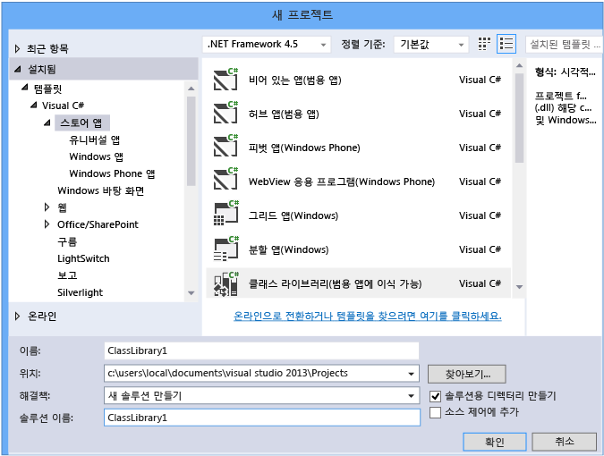
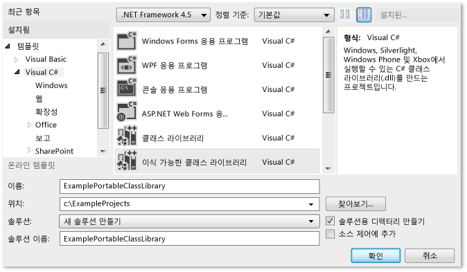
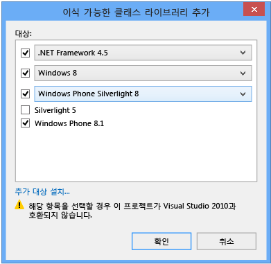
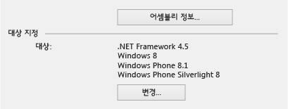
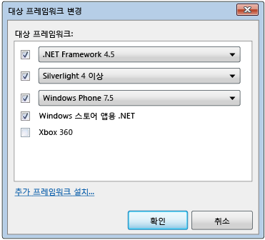
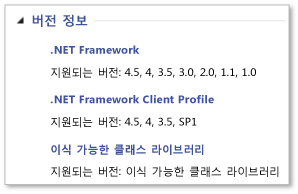

# <a name="cross-platform-development-with-the-portable-class-library"></a>이식 가능한 클래스 라이브러리로 크로스 플랫폼 개발
Visual Studio의 .NET Framework 이식 가능한 클래스 라이브러리 프로젝트 형식으로 Microsoft 플랫폼용 플랫폼 간 앱 및 라이브러리를 신속하고 쉽게 빌드할 수 있습니다.  
  
 이식 가능한 클래스 라이브러리를 사용하면 코드 개발 및 테스트에 드는 시간과 비용을 줄일 수 있습니다. 이 프로젝트 형식을 사용하여 이식 가능한 .NET Framework 어셈블리를 쓰고 빌드한 다음 Windows 및 Windows Phone과 같은 여러 플랫폼을 대상으로 하는 앱에서 해당 어셈블리를 참조합니다.  
  
 Visual Studio에서 이식 가능한 클래스 라이브러리 프로젝트를 만든 다음 해당 프로젝트 개발을 시작한 후에도 대상 플랫폼을 변경할 수 있습니다. Visual Studio는 새 어셈블리로 라이브러리를 컴파일하여 코드에서 변경해야 하는 내용을 식별할 수 있도록 합니다.  
  
 이 문서에서는 Visual Studio에서의 앱 개발에 대해 설명할 뿐만 아니라 Xamarin과 같은 다른 도구로 앱 및 라이브러리를 개발하는 데 사용할 수 있는 이식 가능한 클래스 라이브러리 참조 어셈블리도 제공합니다. 이러한 앱 및 라이브러리는 Microsoft 이외 플랫폼의 모든 .NET Framework 기반 런타임에서 사용할 수 있습니다. 참조 어셈블리에 대 한 자세한 내용은 블로그 항목을 참조 하십시오. [PCL 이식 가능한 클래스 라이브러리 ()는 모든 플랫폼에서 현재 사용할 수 있는](http://blogs.msdn.com/b/dotnet/archive/2013/10/14/portable-class-library-pcl-now-available-on-all-platforms.aspx)합니다. 어셈블리를 다운로드 하려면 [Microsoft.NET 이식 가능한 라이브러리 참조 어셈블리](http://www.microsoft.com/download/details.aspx?id=40727) Microsoft 다운로드 센터에서. Xamarin을 사용한 어셈블리를 사용 하는 방법에 대 한 자세한 내용은 블로그 항목을 참조 하십시오. [PCL 및.NET NuGet 라이브러리 이제](http://blogs.msdn.com/b/dotnet/archive/2013/11/13/pcl-and-net-nuget-libraries-are-now-enabled-for-xamarin.aspx)합니다.  
  
 Visual Studio에서는 이식 가능한 클래스 라이브러리로 개발하는 데 도움이 되는 템플릿을 제공합니다. 사용 중인 Visual Studio의 버전에 따라 사용 가능한 템플릿 및 메뉴가 이 문서에서 설명하는 것과 다를 수 있습니다.  
  
> [!WARNING]
>  Visual Studio 2013 업데이트 2에 이식 가능한 클래스 라이브러리 템플릿에 대 한 업데이트가 포함 됩니다. 이전 버전의 Visual Studio와 동일한 컴퓨터에 설치 하는 Visual Studio 2013 업데이트 2를 변경 하려면 다음 설치 하는 경우는 **대상 프레임 워크** 선택 항목을 Visual Studio의 두 버전 모두에 적용 됩니다.  
  
 항목 내용:  
  
 [Visual Studio 지원](#vs_support)  
 [이식 가능한 클래스 라이브러리 프로젝트 만들기](#create_pcl)  
 [대상 옵션](#platforms)  
 [대상 변경](#change_targets)  
 [지원 되는 기능](#features)  
 [지원 되는 형식 및 멤버](#members)  
 [이식 가능한 클래스 라이브러리의 API 차이점](#API_diff)  
 [이식 가능한 클래스 라이브러리를 사용 하 여](#using)  
  
<a name="vs_support"></a>   
## <a name="visual-studio-support"></a>Visual Studio 지원  
 이식 가능한 클래스 라이브러리에 대한 Visual Studio 지원은 사용 중인 Visual Studio의 버전에 따라 달라집니다. 일부의 경우 필요한 항목이 모두 있을 수도 있지만 아래 테이블에 표시된 것처럼 추가 항목을 설치해야 하는 경우도 있습니다.  
  
|Visual Studio SKU|이식 가능한 클래스 라이브러리 만들기 지원|  
|-----------------------|---------------------------------------------------|  
|Visual Studio 2010, Professional, Premium 또는 Ultimate|예, 설치할 때의 [이식 가능한 라이브러리 도구](https://marketplace.visualstudio.com/items?itemName=BCLTeam.PortableLibraryTools2)합니다.|  
|Visual Studio Express 2010 버전|아니요.|  
|Visual Studio 2012 Professional, Premium 또는 Ultimate|예. Windows Phone 8.0 지원에 대 한 설치는 [Windows Phone SDK 8.0](https://www.microsoft.com/download/details.aspx?id=35471)합니다.|  
|Visual Studio Express 2012 버전|아니요.|  
|Visual Studio 2013 Professional, Premium 또는 Ultimate|예. Windows Phone 8.1 지원을 설치는 [최신 버전의 Visual Studio 2013](https://visualstudio.microsoft.com/vs/older-downloads/)합니다.|  
|Windows 용 visual Studio Community 2013|예, 설치할 때는 [최신 버전의 Visual Studio Community 2013](https://visualstudio.microsoft.com/vs/older-downloads/), 업데이트 2 포함 합니다.|  
  
<a name="create_pcl"></a>   
## <a name="creating-a-portable-class-library-project"></a>이식 가능한 클래스 라이브러리 프로젝트 만들기  
 이식 가능한 클래스 라이브러리를 만들려면 Visual Studio에서 제공하는 템플릿 중 하나를 사용해야 합니다. 새 프로젝트 만들기 및는 **새 프로젝트** 대화 상자의 **템플릿**대상 언어 (C# 또는 Visual Basic)를 선택한 다음 대상으로 지정할 플랫폼 중 하나를 선택 합니다. 다음 단계에서 플랫폼을 추가로 선택할 수 있습니다.  
  
 Visual Studio 2013 업데이트 2에서 선택할 수 있습니다는 **클래스 라이브러리 (이식 가능)** 선택한 언어 및 이식 가능한 클래스 라이브러리를 만드는 플랫폼에 대 한 서식 파일입니다. 다음 플랫폼에 대해서는 이 템플릿이 표시됩니다.  
  
-   스토어 앱  
  
-   Windows 데스크톱  
  
-   Silverlight  
  
 C#에서 라이브러리를 대상 Windows Phone 8.1 및 Windows 8.1 만들려는 경우 선택할 수 있습니다 **스토어 앱**를 선택한 후 **클래스 라이브러리 (유니버설 앱에 이식 가능)** 합니다.  
  
   
  
 이 템플릿은 자동으로 Windows 8.1 및 Windows Phone 8.1을 대상으로 선택합니다. Windows Phone 8.1 또는 Windows 8.1만을 대상으로 하는 라이브러리를 만드는 경우 대상 플랫폼을 변경하고 나중에 플랫폼을 추가할 수 있습니다.  
  
 Visual Studio 2012 또는 Visual Studio 2013 업데이트 2 없이 사용 하는 경우 새 프로젝트를 만들고 선택 된 **이식 가능한 클래스 라이브러리** Visual C# 또는 Visual Basic 아래에서 템플릿을 합니다.  
  
   
  
 **이식 가능한 클래스 라이브러리 추가** 대화 상자가 나타나고 추가 템플릿을 선택할 수 있습니다. 선택한 대상에 따라 이 대화 상자에는 호환성 경고가 나타납니다.  
  
   
Visual Studio 2013 업데이트 2에 이식 가능한 클래스 라이브러리 대화 상자 추가  
  
 Visual Studio 2012 또는 Visual Studio 2013 사용 여부에 상관없이 이식 가능한 클래스 라이브러리 프로젝트를 만들 때 플랫폼을 선택하거나 프로젝트를 만든 후 프로젝트 속성을 사용하여 대상 플랫폼을 수정할 수 있습니다.  
  
<a name="platforms"></a>   
## <a name="target-options"></a>대상 옵션  
 이식 가능한 클래스 라이브러리 프로젝트를 만드는 경우 대상으로 지정할 운영 체제 및 .NET Framework 버전을 선택할 수 있습니다. Visual Studio 2013을 사용 하 고 업데이트 2를 설치한 다음 또는 이상 버전에서는 선택할 수 있습니다 하는 경우는 **클래스 라이브러리 (유니버설 앱에 이식 가능)** 템플릿을를 Windows 8.1 및 Windows Phone 8.1을 대상으로 하는 이식 가능한 클래스 라이브러리를 만듭니다. 다음 테이블은 사용 중인 Visual Studio 버전에 따라 사용할 수 있는 대상을 보여줍니다.  
  
|대상 옵션|Visual Studio 2012|Visual Studio 2013|Visual Studio 2013 업데이트 2 이상|  
|-|-|-|-|  
|.NET Framework|-.NET framework 4 이상<br /><br /> -.NET framework 4.0.3 이상<br /><br /> -.NET framework 4.5|-.NET framework 4 이상<br /><br /> -.NET framework 4.0.3 이상<br /><br /> -.NET framework 4.5 이상<br /><br /> -.NET framework 4.5.1|-.NET framework 4<br /><br /> -.NET framework 4.0.3<br /><br /> -.NET framework 4.5<br /><br /> -.NET framework 4.5.1|  
|Windows Phone|-Windows Phone 7 이상<br /><br /> -Windows Phone 7.5 이상<br /><br /> -Windows Phone 8|-Windows Phone 8|-Windows Phone Silverlight 8<br /><br /> -Windows Phone Silverlight 8.1<br /><br /> Windows 런타임 및 XAML 지원을 받으려면 다음 플랫폼을 선택하세요.<br /><br /> -Windows Phone 8.1|  
|Windows 스토어|-Windows 스토어 앱 용.NET|Windows 스토어 앱 (Windows 8) 이상<br /><br /> Windows 스토어 앱 (Windows 8.1)|-Windows 8<br /><br /> -Windows 8.1|  
|-Silverlight|-Silverlight 4 이상<br /><br /> -Silverlight 5|-Silverlight 5|-Silverlight 5|  
|Xbox|-Xbox 360|N/A|N/A|  
  
<a name="change_targets"></a>   
## <a name="changing-targets"></a>대상 변경  
 이식 가능한 클래스 라이브러리 템플릿을 선택하면 기본 플랫폼이 자동으로 선택됩니다. 그러나 이러한 기본값은 설치한 Visual Studio 버전과 이전에 선택한 대상에 따라 달라집니다. 이식 가능한 클래스 라이브러리를 만들 때 또는 이식 가능한 클래스 라이브러리 개발 시작 후 플랫폼을 변경할 수 있습니다.  
  
 프로젝트를 만든 후 대상을 변경 하려면 **솔루션 탐색기**, 이식 가능한 클래스 라이브러리 프로젝트 (솔루션 아님)에 대 한 바로 가기 메뉴를 열고 선택한 후 **속성** . 프로젝트 속성 페이지에는 **라이브러리** 탭 프로젝트가 현재 대상 플랫폼이 표시 됩니다.  
  
   
Visual Studio 2013 업데이트 2의 이식 가능한 클래스 라이브러리 속성 페이지  
  
 를 추가 또는 제거 대상 선택 된 **변경** 단추를 한 다음 선택 하 고 적절 한 확인란의 선택을 취소 합니다.  
  
 대상을 변경하면 프로젝트 개발에 사용할 수 있는 API가 선택에 맞춰 변경됩니다. Visual Studio에서는 대상 변경의 결과로 발생할 수 있는 오류 및 경고를 보고합니다.  
  
 Visual Studio에서 변경을 수행 하기 전에 어셈블리의 이식성을 평가 하려는 경우, 사용할 수 있습니다는 [.NET 이식성 분석기](http://visualstudiogallery.msdn.microsoft.com/1177943e-cfb7-4822-a8a6-e56c7905292b)합니다.  
  
 메뉴 옵션은 사용 중인 Visual Studio 버전에 따라 달라집니다.  
  
   
Visual Studio 2012의 대상 변경 대화 상자  
  
<a name="features"></a>   
## <a name="supported-features"></a>지원되는 기능  
 다음 표에서는 사용 가능한 플랫폼 및 버전에서 지원되는 기능을 보여줍니다. 일부 경우에 Microsoft에서는 NuGet 패키지를 릴리스하며 관련 지원을 추가했으며 이 내용에 대해서는 이미 언급했습니다. .NET Framework 용 NuGet 패키지에 대 한 자세한 내용은 참조 [.NET Framework 및 번 외 릴리스](../../../docs/framework/get-started/the-net-framework-and-out-of-band-releases.md)합니다.  
  
|기능|.NET Framework|.NET Framework|.NET Framework|Windows 스토어|Windows 스토어|Windows Phone 스토어|Windows Phone Silverlight|Windows Phone Silverlight|Windows Phone Silverlight|Silverlight|Silverlight|Xbox 360|  
|-------------|--------------------|--------------------|--------------------|-------------------|-------------------|-------------------------|-------------------------------|-------------------------------|-------------------------------|-----------------|-----------------|--------------|  
||**4**|**4.0.3**|**4.5**|**8**|**8.1**|**8.1**|**7.5**|**8**|**8.1**|**4**|**5**||  
|핵심 라이브러리|✓|✓|✓|✓|✓|✓|✓|✓|✓|✓|✓|✓|  
|비동기 지원|➊|➊|✓|✓|✓|✓|➊|➊|✓|➊|➊||  
|압축|||✓|✓|✓|✓||➋|➋||||  
|데이터 주석||✓|✓|✓|✓|||||✓|✓||  
|동적 키워드|✓|✓|✓|✓|✓|||||✓|✓||  
|HTTPClient|➌|➌|✓|✓|✓|✓|➌|➌|➌|➌|➌||  
|IQueryable|✓|✓|✓|✓|✓|✓|✓|✓|✓|✓|✓||  
|LINQ(Language-Integrated Query)|✓|✓|✓|✓|✓|✓|✓|✓|✓|✓|✓||  
|MEF(Managed Extensibility Network)|✓|✓|✓|✓|✓|||||✓|✓||  
|NCL(Network Class Library)|✓|✓|✓|✓|✓|✓|✓|✓|✓|✓|✓||  
|Serialization(데이터 계약, XML 및 JSON)|✓|✓|✓|✓|✓|✓|✓|✓|✓|✓|✓||  
|System.Numerics|✓|✓|✓|✓|✓|||||✓|✓||  
|모델 보기(MVVM)|||✓|✓|✓|✓|✓|✓|✓|✓|✓||  
|WCF(Windows Communication Foundation)|✓|✓|✓|✓|✓||✓|✓|✓|✓|✓||  
|Windows 런타임 API|||||✓|✓|||||||  
|Windows.UI.XAML|||||✓|✓|||||||  
|XLINQ||✓|✓|✓|✓|✓|✓|✓|✓|✓|✓|✓|  
  
 ➊ [Microsoft 비동기](https://www.nuget.org/packages/Microsoft.Bcl.Async/) 패키지  
 ➋ [Microsoft 압축](https://www.nuget.org/packages/Microsoft.Bcl.Compression) 패키지  
 ➌ [Microsoft HTTP 클라이언트 라이브러리](https://www.nuget.org/packages/Microsoft.Net.Http) 패키지  
  
> [!WARNING]
>  참조 하는 경우 오류가 발생할 수 있습니다는 [Microsoft 압축](https://www.nuget.org/packages/Microsoft.Bcl.Compression) 및 [Microsoft HTTP 클라이언트 라이브러리](https://www.nuget.org/packages/Microsoft.Net.Http) 패키지는 Windows Phone Silverlight 8.1 앱에서 사용 하는 이식 가능한 라이브러리에서. 자세한 내용은 참조 [의 플랫폼 규격 및 주요 변경 내용에 대 한 Windows Phone Silverlight 8.1 앱](/previous-versions/windows/apps/dn642084(v=vs.105))합니다.  
  
<a name="members"></a>   
## <a name="supported-types-and-members"></a>지원되는 형식 및 멤버  
 이식 가능한 클래스 라이브러리 프로젝트에서 사용할 수 있는 형식 및 멤버는 다음과 같이 여러 호환성 요소로 제한됩니다.  
  
-   이들은 선택한 대상 간에 공유되어야 합니다.  
  
-   이들은 이러한 여러 대상에서 유사하게 작동해야 합니다.  
  
-   이들은 사용 중단 후보가 되어서는 안 됩니다.  
  
-   이들은 특히 지원하는 멤버를 이식할 수 없을 때 이식 가능한 환경에서 의미가 있어야 합니다.  
  
 예를 들어, 이식 가능한 클래스 라이브러리에서는 Windows 8.1 및 Windows Phone 8.1이 대상인 경우에만 UI 관련 형식을 포함합니다. 또한, 이식 가능한 클래스 라이브러리를 도입하기 전에 릴리스된 플랫폼(예: Xbox, .NET Framework 4 및 Windows Phone 7)을 대상으로 하는 경우 한계에 도달할 수 있습니다. .NET Framework는 NuGet을 통해 패키지를 릴리스하여 이러한 이전 플랫폼의 일부에 대한 이식 가능한 클래스 라이브러리의 지원을 개선합니다. 자세한 내용과 NuGet 패키지 목록은 참조 [.NET Framework 및 번 외 릴리스](../../../docs/framework/get-started/the-net-framework-and-out-of-band-releases.md)합니다.  
  
 멤버가 이식 가능한 클래스 라이브러리에서 그리고 선택한 대상에 대해 지원되는 경우 IntelliSense의 프로젝트에 나타납니다. 또한, 이식 가능한 클래스 라이브러리 아이콘  에 있는 멤버 테이블에 표시 된 [.NETFramework클래스라이브러리](https://msdn.microsoft.com/library/mt472912.aspx) 옆에 멤버를 지원 합니다. 예를 들어, 다음 멤버 테이블에서는 <xref:System.String.Chars%2A> 클래스의 <xref:System.String> 속성이 이식 가능한 클래스 라이브러리에서 지원됨을 보여줍니다.  
  
   
이식 가능한 클래스 라이브러리 아이콘  
  
 볼 수도 있습니다는 **버전 정보** 형식 또는 멤버가 이식 가능한 클래스 라이브러리 프로젝트에서 지원 하는지 나타내는 대 한 참조 항목의 섹션:  
  
   
버전 정보의 예  
  
 그러나 이식 가능한 클래스 라이브러리에서 API가 지원될 수는 있지만 API를 사용할 수 있는지 여부는 선택한 대상에 따라 달라집니다.  
  
<a name="API_diff"></a>   
## <a name="api-differences-in-the-portable-class-library"></a>이식 가능한 클래스 라이브러리에서의 API 차이점  
 이식 가능한 클래스 라이브러리 어셈블리가 지원되는 모든 플랫폼에서 호환되도록 하기 위해 이식 가능한 클래스 라이브러리에서 일부 멤버가 약간 변경되었습니다.  
  
<a name="using"></a>   
## <a name="using-the-portable-class-library"></a>이식 가능한 클래스 라이브러리 사용  
 이식 가능한 클래스 라이브러리 프로젝트를 빌드한 후에는 다른 프로젝트에서 이 프로젝트를 참조하게 합니다. 액세스하려는 클래스가 포함된 프로젝트 또는 특정 어셈블리를 참조할 수 있습니다.  
  
 이식 가능한 클래스 라이브러리 어셈블리를 참조하는 앱을 실행하려면 대상 플랫폼의 필수 버전(또는 이후 버전)이 컴퓨터에 설치되어 있어야 합니다. Visual Studio에는 필요한 모든 프레임워크가 포함되므로 앱을 개발하는 데 사용한 컴퓨터에서 더 이상의 수정 없이 앱을 실행할 수 있습니다.  
  
### <a name="deploying-a-windows-store-or-windows-phone-app"></a>Windows 스토어 또는 Windows Phone 앱 배포  
 이식 가능한 클래스 라이브러리 어셈블리를 참조하는 Windows 스토어 또는 Windows Phone 앱을 만드는 경우 만든 앱을 배포하는 데 필요한 모든 것이 앱 패키지에 들어 있으므로 추가 단계를 수행할 필요가 없습니다.  
  
### <a name="deploying-a-net-framework-app"></a>.NET Framework 앱 배포  
 이식 가능한 클래스 라이브러리 어셈블리를 참조하는 .NET Framework 앱을 배포할 때 종속성을 올바른 .NET Framework 버전에 지정해야 합니다. 이 종속성을 지정하여 응용 프로그램에 필수 버전이 설치되도록 해야 합니다. .NET Framework 4를 대상 또는 컴퓨터와.NET Framework 4 이상 버전에서는 있어야 하는 경우는 [업데이트](https://www.microsoft.com/download/details.aspx?id=3556),.NET Framework 4 또는.NET Framework 4.5가 설치 되어 업데이트 4.0.3.  
  
-   ClickOnce 배포 종속성을 만들려면:에서 **솔루션 탐색기**를 게시 하려면 프로젝트의 프로젝트 노드를 선택 합니다. 이 프로젝트가 이식 가능한 클래스 라이브러리 프로젝트를 참조할 프로젝트입니다. 메뉴 모음에서 **프로젝트**, **속성**를 선택한 후는 **게시** 탭 합니다. 에 **게시** 페이지에서 선택 **필수 구성 요소**합니다. 필수 .NET Framework 버전(또는 .NET Framework 4 업데이트)을 필수 구성 요소로 선택합니다.  
  
-   설치 프로젝트 종속성을 만들려면:에서 **솔루션 탐색기**, 설치 프로젝트를 선택 합니다. 메뉴 모음에서 **프로젝트**, **속성**, **필수 구성 요소**합니다. 필수 .NET Framework 버전을 필수 구성 요소로 선택합니다.  
  
 .NET Framework 앱을 배포 하는 방법에 대 한 자세한 내용은 참조 [개발자를 위한 배포 가이드](../../../docs/framework/deployment/deployment-guide-for-developers.md)합니다.  
  
### <a name="deploying-a-silverlight-based-app"></a>Silverlight 기반 앱 배포  
 이식 가능한 클래스 라이브러리 어셈블리를 참조하는 Silverlight 기반 앱을 배포할 때 앱에 필요한 최소 런타임 버전이 대상 버전과 일치하는지 확인해야 합니다. Silverlight 4를 대상으로 하는 경우 버전은 4.0.60129.0 이상이어야 합니다. 다음과 같이 Silverlight 기반 응용 프로그램을 호스트하는 웹 페이지에 `<param name="minRuntimeVersion" value="4.0.60129.0" />`을 포함하여 버전을 설정합니다.  
  
```xaml  
<div id="silverlightControlHost">  
    <object data="data:application/x-silverlight-2,"   
           type="application/x-silverlight-2" width="100%" height="100%">  
    <param name="source" value="ClientBin/SilverlightApplication.xap"/>  
    <param name="onError" value="onSilverlightError" />  
    <param name="background" value="white" />  
    <param name="minRuntimeVersion" value="4.0.60129.0" />  
    <param name="autoUpgrade" value="true" />  
    <a href="https://www.microsoft.com/getsilverlight/get-started/install/"   
             style="text-decoration:none">  
        
    </a>  
  </object>  
   <iframe id="_sl_historyFrame"   
              style="visibility:hidden;height:0px;width:0px;border:0px">  
   </iframe>  
</div>  
```  
  
## <a name="see-also"></a>참고 항목  
 [MVVM과 함께 이식 가능한 클래스 라이브러리 사용](../../../docs/standard/cross-platform/using-portable-class-library-with-model-view-view-model.md)  
 [여러 플랫폼을 대상으로 하는 라이브러리의 앱 리소스](../../../docs/standard/cross-platform/app-resources-for-libraries-that-target-multiple-platforms.md)  
 [.NET 이식성 분석기](http://visualstudiogallery.msdn.microsoft.com/1177943e-cfb7-4822-a8a6-e56c7905292b)  
 [Windows 스토어 앱 및 Windows 런타임에 대한 .NET Framework 지원](../../../docs/standard/cross-platform/support-for-windows-store-apps-and-windows-runtime.md)  
 [배포](../../../docs/framework/deployment/net-framework-applications.md)
