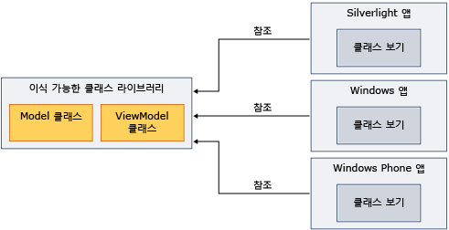

# Model-View-View Model과 함께 이식 가능한 클래스 라이브러리 사용
.NET Framework를 사용할 수 있습니다 [이식 가능한 클래스 라이브러리](../../../docs/standard/cross-platform/cross-platform-development-with-the-portable-class-library.md) 하 모델-뷰-보기 MVVM (Model) 패턴을 구현 하 고 여러 플랫폼 간에 어셈블리를 공유 합니다.  
  
 MVVM은 내부 비즈니스 논리에서 사용자 인터페이스를 분리하는 응용 프로그램 패턴입니다. [!INCLUDE[net_portable](../../../includes/net-portable-md.md)]의 [!INCLUDE[vs_dev11_long](../../../includes/vs-dev11-long-md.md)] 프로젝트에서 모델을 구현하고 모델 클래스를 본 다음, 여러 플랫폼을 위해 사용자 지정된 뷰를 만들 수 있습니다. 이 접근 방식을 사용하면 한 번만 데이터 모델과 비즈니스 논리를 작성하고, 다음 설명에서와 같이 .NET Framework, Silverlight, Windows Phone 및 [!INCLUDE[win8_appname_long](../../../includes/win8-appname-long-md.md)] 응용 프로그램의 해당 코드를 사용할 수 있습니다.  
  
   
  
 이 항목에서 MVVM 패턴에 대 한 일반 정보를 제공 하지 않습니다. 만 사용 하는 방법에 대 한 정보를 제공 [!INCLUDE[net_portable](../../../includes/net-portable-md.md)] MVVM 설정 하기로 합니다. MVVM에 대 한 자세한 내용은 참조는 [MVVM 퀵 스타트](http://go.microsoft.com/fwlink/?LinkId=234934)합니다.  
  
## MVVM를 지 원하는 클래스를  
 대상의 [!INCLUDE[net_v45](../../../includes/net-v45-md.md)], [!INCLUDE[net_win8_profile](../../../includes/net-win8-profile-md.md)], Silverlight, 또는 Windows Phone 7.5에 대 한 프로그램 [!INCLUDE[net_portable](../../../includes/net-portable-md.md)] MVVM 패턴 구현에 사용할 수 있는 프로젝트에 다음 클래스:  
  
-   <xref:System.Collections.ObjectModel.ObservableCollection%601?displayProperty=nameWithType> 클래스  
  
-   <xref:System.Collections.ObjectModel.ReadOnlyObservableCollection%601?displayProperty=nameWithType> 클래스  
  
-   <xref:System.Collections.Specialized.INotifyCollectionChanged?displayProperty=nameWithType> 클래스  
  
-   <xref:System.Collections.Specialized.NotifyCollectionChangedAction?displayProperty=nameWithType> 클래스  
  
-   <xref:System.Collections.Specialized.NotifyCollectionChangedEventArgs?displayProperty=nameWithType> 클래스  
  
-   <xref:System.Collections.Specialized.NotifyCollectionChangedEventHandler?displayProperty=nameWithType> 클래스  
  
-   <xref:System.ComponentModel.DataErrorsChangedEventArgs?displayProperty=nameWithType> 클래스  
  
-   <xref:System.ComponentModel.INotifyDataErrorInfo?displayProperty=nameWithType> 클래스  
  
-   <xref:System.ComponentModel.INotifyPropertyChanged?displayProperty=nameWithType> 클래스  
  
-   <xref:System.Windows.Input.ICommand?displayProperty=nameWithType> 클래스  
  
-   모든 클래스는 <xref:System.ComponentModel.DataAnnotations?displayProperty=nameWithType> 네임 스페이스  
  
## MVVM 구현  
 MVVM를 구현 하려면 일반적으로 만들면 모델과 보기 모델에는 [!INCLUDE[net_portable](../../../includes/net-portable-md.md)] 때문에 프로젝트는 [!INCLUDE[net_portable](../../../includes/net-portable-md.md)] 프로젝트 이식 불가능 프로젝트를 참조할 수 없습니다. 모델 및 뷰 모델에는 같은 프로젝트에 또는 별도 프로젝트에서 가능 합니다. 별도 프로젝트를 사용 하는 경우 모델 프로젝트를 보기 모델 프로젝트에서 참조를 추가 합니다.  
  
 모델을 컴파일하고 모델 프로젝트를 볼 뷰가 포함 된 응용 프로그램에서 해당 어셈블리 참조. 보기의 보기 모델에만 상호 작용을 하는 경우만 보기 모델에 포함 된 어셈블리를 참조 해야 합니다.  
  
### 모델  
 다음 예제에서는 간단한 모델 클래스에 있는 수는 [!INCLUDE[net_portable](../../../includes/net-portable-md.md)] 프로젝트.  
  
 [!code-csharp[PortableClassLibraryMVVM#1](../../../samples/snippets/csharp/VS_Snippets_CLR/portableclasslibrarymvvm/cs/customer.cs#1)]
 [!code-vb[PortableClassLibraryMVVM#1](../../../samples/snippets/visualbasic/VS_Snippets_CLR/portableclasslibrarymvvm/vb/customer.vb#1)]  
  
 다음 예에서는 채우기, 검색 및 데이터를 업데이트 하는 간단한 방법을 [!INCLUDE[net_portable](../../../includes/net-portable-md.md)] 프로젝트. 실제 앱에서 Windows Communication Foundation (WCF) 서비스와 같은 원본에서 데이터를 검색 합니다.  
  
 [!code-csharp[PortableClassLibraryMVVM#2](../../../samples/snippets/csharp/VS_Snippets_CLR/portableclasslibrarymvvm/cs/customerrepository.cs#2)]
 [!code-vb[PortableClassLibraryMVVM#2](../../../samples/snippets/visualbasic/VS_Snippets_CLR/portableclasslibrarymvvm/vb/customerrepository.vb#2)]  
  
### 뷰 모델  
 MVVM 패턴을 구현 하는 경우에 자주 보기 모델에 대 한 기본 클래스 추가 됩니다. 다음 예제에서는 기본 클래스를 보여 줍니다.  
  
 [!code-csharp[PortableClassLibraryMVVM#3](../../../samples/snippets/csharp/VS_Snippets_CLR/portableclasslibrarymvvm/cs/viewmodelbase.cs#3)]
 [!code-vb[PortableClassLibraryMVVM#3](../../../samples/snippets/visualbasic/VS_Snippets_CLR/portableclasslibrarymvvm/vb/viewmodelbase.vb#3)]  
  
 구현에서 <xref:System.Windows.Input.ICommand> 인터페이스 MVVM 패턴 자주 사용 됩니다. 다음 예제에서는 <xref:System.Windows.Input.ICommand> 인터페이스의 구현을 보여 줍니다.  
  
 [!code-csharp[PortableClassLibraryMVVM#4](../../../samples/snippets/csharp/VS_Snippets_CLR/portableclasslibrarymvvm/cs/relaycommand.cs#4)]
 [!code-vb[PortableClassLibraryMVVM#4](../../../samples/snippets/visualbasic/VS_Snippets_CLR/portableclasslibrarymvvm/vb/relaycommand.vb#4)]  
  
 다음 예에서는 단순된 뷰 모델을 보여 줍니다.  
  
 [!code-csharp[PortableClassLibraryMVVM#5](../../../samples/snippets/csharp/VS_Snippets_CLR/portableclasslibrarymvvm/cs/mainpageviewmodel.cs#5)]
 [!code-vb[PortableClassLibraryMVVM#5](../../../samples/snippets/visualbasic/VS_Snippets_CLR/portableclasslibrarymvvm/vb/customerviewmodel.vb#5)]  
  
### 보기  
 [!INCLUDE[net_v45](../../../includes/net-v45-md.md)] 앱 [!INCLUDE[win8_appname_long](../../../includes/win8-appname-long-md.md)] 앱, Silverlight 기반 앱 또는 Windows Phone 7.5 앱, 모델 및 뷰 모델 프로젝트를 포함 하는 어셈블리를 참조할 수 있습니다.  그런 다음 보기 모델로 상호 작용 하는 뷰를 만듭니다. 다음 예제에서는 검색 하 고 보기 모델의 데이터를에서 업데이트 하는 간단한 Windows Presentation Foundation (WPF) 앱을 보여 줍니다. Windows Phone Silverlight에서 유사한 뷰를 만들 수 있습니다 또는 [!INCLUDE[win8_appname_long](../../../includes/win8-appname-long-md.md)] 앱.  
  
 [!code-xaml[PortableClassLibraryMVVM#6](../../../samples/snippets/csharp/VS_Snippets_CLR/portableclasslibrarymvvm/cs/mainwindow.xaml#6)]  
  
## 참고 항목  
 [이식 가능한 클래스 라이브러리](../../../docs/standard/cross-platform/cross-platform-development-with-the-portable-class-library.md)
