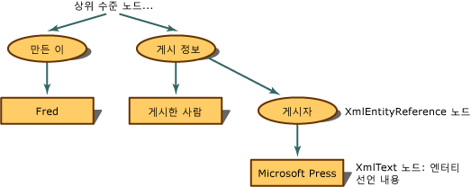

# 엔터티 참조 유지
엔터티 참조가 확장되지 않고 유지되면 XML DOM\(문서 개체 모델\)에서는 엔터티 참조가 발생하는 경우 **XmlEntityReference** 노드를 빌드합니다.  
  
 다음 XML을 사용한다고 가정합니다.  
  
```  
<author>Fred</author>  
<pubinfo>Published by &publisher;</pubinfo>  
```  
  
 DOM에서 `&publisher;`  참조가 발생하는 경우 **XmlEntityReference** 노드를 빌드합니다.  **XmlEntityReference**는 엔터티 선언의 내용에서 복사된 자식 노드를 포함합니다.  앞의 코드 예제에서는 엔터티 선언에 텍스트를 포함하고 있으므로 entityreference 노드의 자식 노드로 **XmlText** 노드가 만들어집니다.  
  
   
유지되는 엔터티 참조의 트리 구조  
  
 **XmlEntityReference**의 자식 노드는 엔터티 선언이 발생했을 경우 **XmlEntity** 노드에서 만들어진 모든 자식 노드의 복사본입니다.  
  
> [!NOTE]
>  **XmlEntity**에서 복사한 노드는 경우에 따라 해당 entityreference 노드 아래의 복사본과 다를 수 있습니다.  entityreference 노드 범위에 속한 네임스페이스가 있을 수 있으며 자식 노드의 최종 구성에 영향을 미칠 수 있습니다.  
  
 기본적으로 `&abc;`와 같은 일반 엔터티는 유지되며 항상 **XmlEntityReference** 노드가 만들어집니다.  
  
## 참고 항목  
 [XML DOM\(문서 개체 모델\)](../../../../docs/standard/data/xml/xml-document-object-model-dom.md)