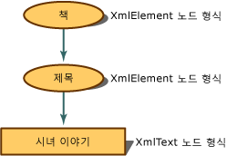

# <a name="mapping-the-object-hierarchy-to-xml-data"></a><span data-ttu-id="e91f7-102">XML 데이터에 개체 계층 구조 매핑</span><span class="sxs-lookup"><span data-stu-id="e91f7-102">Mapping the Object Hierarchy to XML Data</span></span>
<span data-ttu-id="e91f7-103">메모리에 있는 XML 문서를 개념적으로 표현한 것이 트리입니다.</span><span class="sxs-lookup"><span data-stu-id="e91f7-103">When an XML document is in memory, the conceptual representation is a tree.</span></span> <span data-ttu-id="e91f7-104">프로그래밍의 경우에는 트리 노드에 액세스하는 개체 계층 구조가 있습니다.</span><span class="sxs-lookup"><span data-stu-id="e91f7-104">For programming, you have an object hierarchy to access the nodes of the tree.</span></span> <span data-ttu-id="e91f7-105">다음 예제에서는 XML 내용이 노드가 되는 방법을 보여 줍니다.</span><span class="sxs-lookup"><span data-stu-id="e91f7-105">The following example shows you how the XML content becomes nodes.</span></span>  
  
 <span data-ttu-id="e91f7-106">XML을 DOM(문서 개체 모델)으로 읽어오면 각 요소가 노드로 변환됩니다. 이러한 노드에는 노드 형식 및 값과 같은 해당 노드 자체에 대한 추가 메타데이터가 포함됩니다.</span><span class="sxs-lookup"><span data-stu-id="e91f7-106">As the XML is read into the XML Document Object Model (DOM), the pieces are translated into nodes, and these nodes retain additional metadata about themselves, such as their node type and values.</span></span> <span data-ttu-id="e91f7-107">노드 형식은 자신의 개체이며, 수행할 수 있는 작업과 설정하거나 검색할 수 있는 속성을 결정합니다.</span><span class="sxs-lookup"><span data-stu-id="e91f7-107">The node type is its object and is what determines what actions can be performed and what properties can be set or retrieved.</span></span>  
  
 <span data-ttu-id="e91f7-108">다음과 같은 단순한 XML을 가정합니다.</span><span class="sxs-lookup"><span data-stu-id="e91f7-108">If you have the following simple XML:</span></span>  
  
 <span data-ttu-id="e91f7-109">**입력**</span><span class="sxs-lookup"><span data-stu-id="e91f7-109">**Input**</span></span>  
  
```xml  
<book>  
    <title>The Handmaid's Tale</title>  
</book>  
```  
  
 <span data-ttu-id="e91f7-110">이러한 입력은 지정된 노드 형식 속성이 있는 다음 노드 트리로 메모리에 표현됩니다.</span><span class="sxs-lookup"><span data-stu-id="e91f7-110">The input is represented in memory as the following node tree with the assigned node type property:</span></span>  
  
 <span data-ttu-id="e91f7-111"></span><span class="sxs-lookup"><span data-stu-id="e91f7-111"></span></span>  
<span data-ttu-id="e91f7-112">book 및 title 노드 트리 표현</span><span class="sxs-lookup"><span data-stu-id="e91f7-112">Book and title node tree representation</span></span>  
  
 <span data-ttu-id="e91f7-113">`book` 요소는 **XmlElement** 개체가 되고, 다음 요소인 `title`도 **XmlElement** 개체가 되지만 요소 내용은 **XmlText** 개체가 됩니다.</span><span class="sxs-lookup"><span data-stu-id="e91f7-113">The `book` element becomes an **XmlElement** object, the next element, `title`, also becomes an **XmlElement**, while the element content becomes an **XmlText** object.</span></span> <span data-ttu-id="e91f7-114">**XmlElement**의 메서드 및 속성은 **XmlText** 개체에서 사용할 수 있는 메서드 및 속성과 다릅니다.</span><span class="sxs-lookup"><span data-stu-id="e91f7-114">In looking at the **XmlElement** methods and properties, the methods and properties are different than the methods and properties available on an **XmlText** object.</span></span> <span data-ttu-id="e91f7-115">노드 형식에 따라 수행할 수 있는 작업이 결정되기 때문에 XML 태그에서 어떤 노드 형식이 만들어지는지를 반드시 알아야 합니다.</span><span class="sxs-lookup"><span data-stu-id="e91f7-115">So knowing what node type the XML markup becomes is vital, as its node type determines the actions that can be performed.</span></span>  
  
 <span data-ttu-id="e91f7-116">다음 예제에서는 XML 데이터를 읽고 노드 형식에 따라 다양한 텍스트를 작성합니다.</span><span class="sxs-lookup"><span data-stu-id="e91f7-116">The following example reads in XML data and writes out different text, depending on the node type.</span></span> <span data-ttu-id="e91f7-117">다음 XML 데이터 파일(**items.xml**)을 입력으로 사용합니다.</span><span class="sxs-lookup"><span data-stu-id="e91f7-117">Using the following XML data file as input, **items.xml**:</span></span>  
  
 <span data-ttu-id="e91f7-118">**입력**</span><span class="sxs-lookup"><span data-stu-id="e91f7-118">**Input**</span></span>  
  
```xml  
<?xml version="1.0"?>  
<!-- This is a sample XML document -->  
<!DOCTYPE Items [<!ENTITY number "123">]>  
<Items>  
  <Item>Test with an entity: &number;</Item>  
  <Item>test with a child element <more/> stuff</Item>  
  <Item>test with a CDATA section <![CDATA[<456>]]> def</Item>  
  <Item>Test with a char entity: A</Item>  
  <!-- Fourteen chars in this element.-->  
  <Item>1234567890ABCD</Item>  
</Items>  
```  
  
 <span data-ttu-id="e91f7-119">다음 코드 예제에서는 **items.xml** 파일을 읽고 각 노드 형식에 대한 정보를 표시합니다.</span><span class="sxs-lookup"><span data-stu-id="e91f7-119">The following code example reads the **items.xml** file and displays information for each node type.</span></span>  
  
```vb  
Imports System  
Imports System.IO  
Imports System.Xml  
  
Public Class Sample  
    Private Const filename As String = "items.xml"  
  
    Public Shared Sub Main()  
  
        Dim reader As XmlTextReader = Nothing  
  
        Try  
            ' Load the reader with the data file and   
            'ignore all white space nodes.   
            reader = New XmlTextReader(filename)  
            reader.WhitespaceHandling = WhitespaceHandling.None  
  
            ' Parse the file and display each of the nodes.  
            While reader.Read()  
                Select Case reader.NodeType  
                    Case XmlNodeType.Element  
                        Console.Write("<{0}>", reader.Name)  
                    Case XmlNodeType.Text  
                        Console.Write(reader.Value)  
                    Case XmlNodeType.CDATA  
                        Console.Write("<![CDATA[{0}]]>", reader.Value)  
                    Case XmlNodeType.ProcessingInstruction  
                        Console.Write("<?{0} {1}?>", reader.Name, reader.Value)  
                    Case XmlNodeType.Comment  
                        Console.Write("<!--{0}-->", reader.Value)  
                    Case XmlNodeType.XmlDeclaration  
                        Console.Write("<?xml version='1.0'?>")  
                    Case XmlNodeType.Document  
                    Case XmlNodeType.DocumentType  
                        Console.Write("<!DOCTYPE {0} [{1}]", reader.Name, reader.Value)  
                    Case XmlNodeType.EntityReference  
                        Console.Write(reader.Name)  
                    Case XmlNodeType.EndElement  
                        Console.Write("</{0}>", reader.Name)  
                End Select  
            End While  
  
        Finally  
            If Not (reader Is Nothing) Then  
                reader.Close()  
            End If  
        End Try  
    End Sub 'Main ' End class  
End Class 'Sample  
```  
  
```csharp  
using System;  
using System.IO;  
using System.Xml;  
  
public class Sample  
{  
    private const String filename = "items.xml";  
  
    public static void Main()  
    {  
        XmlTextReader reader = null;  
  
        try  
        {  
            // Load the reader with the data file and ignore   
            // all white space nodes.  
            reader = new XmlTextReader(filename);  
            reader.WhitespaceHandling = WhitespaceHandling.None;  
  
            // Parse the file and display each of the nodes.  
            while (reader.Read())  
            {  
                switch (reader.NodeType)  
                {  
                    case XmlNodeType.Element:  
                        Console.Write("<{0}>", reader.Name);  
                        break;  
                    case XmlNodeType.Text:  
                        Console.Write(reader.Value);  
                        break;  
                    case XmlNodeType.CDATA:  
                        Console.Write("<![CDATA[{0}]]>", reader.Value);  
                        break;  
                    case XmlNodeType.ProcessingInstruction:  
                        Console.Write("<?{0} {1}?>", reader.Name, reader.Value);  
                        break;  
                    case XmlNodeType.Comment:  
                        Console.Write("<!--{0}-->", reader.Value);  
                        break;  
                    case XmlNodeType.XmlDeclaration:  
                        Console.Write("<?xml version='1.0'?>");  
                        break;  
                    case XmlNodeType.Document:  
                        break;  
                    case XmlNodeType.DocumentType:  
                        Console.Write("<!DOCTYPE {0} [{1}]", reader.Name, reader.Value);  
                        break;  
                    case XmlNodeType.EntityReference:  
                        Console.Write(reader.Name);  
                        break;  
                    case XmlNodeType.EndElement:  
                        Console.Write("</{0}>", reader.Name);  
                        break;  
                }  
            }  
        }  
  
        finally  
        {  
            if (reader != null)  
                reader.Close();  
        }  
    }  
} // End class  
```  
  
 <span data-ttu-id="e91f7-120">예제의 출력은 데이터의 노드 형식 매핑을 보여 줍니다.</span><span class="sxs-lookup"><span data-stu-id="e91f7-120">The output from the example reveals the mapping of the data to the node types.</span></span>  
  
 <span data-ttu-id="e91f7-121">**출력**</span><span class="sxs-lookup"><span data-stu-id="e91f7-121">**Output**</span></span>  
  
```xml  
<?xml version='1.0'?><!--This is a sample XML document --><!DOCTYPE Items [<!ENTITY number "123">]<Items><Item>Test with an entity: 123</Item><Item>test with a child element <more> stuff</Item><Item>test with a CDATA section <![CDATA[<456>]]> def</Item><Item>Test with a char entity: A</Item><--Fourteen chars in this element.--><Item>1234567890ABCD</Item></Items>  
```  
  
 <span data-ttu-id="e91f7-122">한 번에 한 줄씩 입력하고 코드에서 생성된 출력을 사용하면 다음 표를 사용하여 출력 줄을 생성한 노드 테스트를 분석할 수 있어 어떤 XML 데이터가 어떤 노드 형식이 되는지 이해할 수 있습니다.</span><span class="sxs-lookup"><span data-stu-id="e91f7-122">Taking the input one line at a time and using the output generated from the code, you can use the following table to analyze what node test generated which lines of output, thereby understanding what XML data became what kind of node type.</span></span>  
  
|<span data-ttu-id="e91f7-123">입력</span><span class="sxs-lookup"><span data-stu-id="e91f7-123">Input</span></span>|<span data-ttu-id="e91f7-124">출력</span><span class="sxs-lookup"><span data-stu-id="e91f7-124">Output</span></span>|<span data-ttu-id="e91f7-125">노드 형식 테스트</span><span class="sxs-lookup"><span data-stu-id="e91f7-125">Node Type Test</span></span>|  
|-----------|------------|--------------------|  
|<span data-ttu-id="e91f7-126">\<?xml version="1.0"?></span><span class="sxs-lookup"><span data-stu-id="e91f7-126">\<?xml version="1.0"?></span></span>|<span data-ttu-id="e91f7-127">\<?xml version='1.0'?></span><span class="sxs-lookup"><span data-stu-id="e91f7-127">\<?xml version='1.0'?></span></span>|<span data-ttu-id="e91f7-128">XmlNodeType.XmlDeclaration</span><span class="sxs-lookup"><span data-stu-id="e91f7-128">XmlNodeType.XmlDeclaration</span></span>|  
|<span data-ttu-id="e91f7-129">\<!-- This is a sample XML document --></span><span class="sxs-lookup"><span data-stu-id="e91f7-129">\<!-- This is a sample XML document --></span></span>|<span data-ttu-id="e91f7-130">\<!--This is a sample XML document --></span><span class="sxs-lookup"><span data-stu-id="e91f7-130">\<!--This is a sample XML document --></span></span>|<span data-ttu-id="e91f7-131">XmlNodeType.Comment</span><span class="sxs-lookup"><span data-stu-id="e91f7-131">XmlNodeType.Comment</span></span>|  
|<span data-ttu-id="e91f7-132">\<!DOCTYPE Items [\<!ENTITY number "123">]></span><span class="sxs-lookup"><span data-stu-id="e91f7-132">\<!DOCTYPE Items [\<!ENTITY number "123">]></span></span>|<span data-ttu-id="e91f7-133">\<!DOCTYPE Items [\<!ENTITY number "123">]</span><span class="sxs-lookup"><span data-stu-id="e91f7-133">\<!DOCTYPE Items [\<!ENTITY number "123">]</span></span>|<span data-ttu-id="e91f7-134">XmlNodeType.DocumentType</span><span class="sxs-lookup"><span data-stu-id="e91f7-134">XmlNodeType.DocumentType</span></span>|  
|<span data-ttu-id="e91f7-135">\<Items></span><span class="sxs-lookup"><span data-stu-id="e91f7-135">\<Items></span></span>|<span data-ttu-id="e91f7-136">\<Items></span><span class="sxs-lookup"><span data-stu-id="e91f7-136">\<Items></span></span>|<span data-ttu-id="e91f7-137">XmlNodeType.Element</span><span class="sxs-lookup"><span data-stu-id="e91f7-137">XmlNodeType.Element</span></span>|  
|<span data-ttu-id="e91f7-138">\<Item></span><span class="sxs-lookup"><span data-stu-id="e91f7-138">\<Item></span></span>|<span data-ttu-id="e91f7-139">\<Item></span><span class="sxs-lookup"><span data-stu-id="e91f7-139">\<Item></span></span>|<span data-ttu-id="e91f7-140">XmlNodeType.Element</span><span class="sxs-lookup"><span data-stu-id="e91f7-140">XmlNodeType.Element</span></span>|  
|<span data-ttu-id="e91f7-141">Test with an entity: &number;</span><span class="sxs-lookup"><span data-stu-id="e91f7-141">Test with an entity: &number;</span></span>|<span data-ttu-id="e91f7-142">Test with an entity: 123</span><span class="sxs-lookup"><span data-stu-id="e91f7-142">Test with an entity: 123</span></span>|<span data-ttu-id="e91f7-143">XmlNodeType.Text</span><span class="sxs-lookup"><span data-stu-id="e91f7-143">XmlNodeType.Text</span></span>|  
|<span data-ttu-id="e91f7-144">\</Item></span><span class="sxs-lookup"><span data-stu-id="e91f7-144">\</Item></span></span>|<span data-ttu-id="e91f7-145">\</Item></span><span class="sxs-lookup"><span data-stu-id="e91f7-145">\</Item></span></span>|<span data-ttu-id="e91f7-146">XmlNodeType.EndElement</span><span class="sxs-lookup"><span data-stu-id="e91f7-146">XmlNodeType.EndElement</span></span>|  
|<span data-ttu-id="e91f7-147">\<Item></span><span class="sxs-lookup"><span data-stu-id="e91f7-147">\<Item></span></span>|<span data-ttu-id="e91f7-148">\<Item></span><span class="sxs-lookup"><span data-stu-id="e91f7-148">\<Item></span></span>|<span data-ttu-id="e91f7-149">XmNodeType.Element</span><span class="sxs-lookup"><span data-stu-id="e91f7-149">XmNodeType.Element</span></span>|  
|<span data-ttu-id="e91f7-150">test with a child element</span><span class="sxs-lookup"><span data-stu-id="e91f7-150">test with a child element</span></span>|<span data-ttu-id="e91f7-151">test with a child element</span><span class="sxs-lookup"><span data-stu-id="e91f7-151">test with a child element</span></span>|<span data-ttu-id="e91f7-152">XmlNodeType.Text</span><span class="sxs-lookup"><span data-stu-id="e91f7-152">XmlNodeType.Text</span></span>|  
|<span data-ttu-id="e91f7-153">\<more></span><span class="sxs-lookup"><span data-stu-id="e91f7-153">\<more></span></span>|<span data-ttu-id="e91f7-154">\<more></span><span class="sxs-lookup"><span data-stu-id="e91f7-154">\<more></span></span>|<span data-ttu-id="e91f7-155">XmlNodeType.Element</span><span class="sxs-lookup"><span data-stu-id="e91f7-155">XmlNodeType.Element</span></span>|  
|<span data-ttu-id="e91f7-156">stuff</span><span class="sxs-lookup"><span data-stu-id="e91f7-156">stuff</span></span>|<span data-ttu-id="e91f7-157">stuff</span><span class="sxs-lookup"><span data-stu-id="e91f7-157">stuff</span></span>|<span data-ttu-id="e91f7-158">XmlNodeType.Text</span><span class="sxs-lookup"><span data-stu-id="e91f7-158">XmlNodeType.Text</span></span>|  
|<span data-ttu-id="e91f7-159">\</Item></span><span class="sxs-lookup"><span data-stu-id="e91f7-159">\</Item></span></span>|<span data-ttu-id="e91f7-160">\</Item></span><span class="sxs-lookup"><span data-stu-id="e91f7-160">\</Item></span></span>|<span data-ttu-id="e91f7-161">XmlNodeType.EndElement</span><span class="sxs-lookup"><span data-stu-id="e91f7-161">XmlNodeType.EndElement</span></span>|  
|<span data-ttu-id="e91f7-162">\<Item></span><span class="sxs-lookup"><span data-stu-id="e91f7-162">\<Item></span></span>|<span data-ttu-id="e91f7-163">\<Item></span><span class="sxs-lookup"><span data-stu-id="e91f7-163">\<Item></span></span>|<span data-ttu-id="e91f7-164">XmlNodeType.Element</span><span class="sxs-lookup"><span data-stu-id="e91f7-164">XmlNodeType.Element</span></span>|  
|<span data-ttu-id="e91f7-165">test with a CDATA section</span><span class="sxs-lookup"><span data-stu-id="e91f7-165">test with a CDATA section</span></span>|<span data-ttu-id="e91f7-166">test with a CDATA section</span><span class="sxs-lookup"><span data-stu-id="e91f7-166">test with a CDATA section</span></span>|<span data-ttu-id="e91f7-167">XmlTest.Text</span><span class="sxs-lookup"><span data-stu-id="e91f7-167">XmlTest.Text</span></span>|  
|<span data-ttu-id="e91f7-168"><![CDATA[\<456>]]\></span><span class="sxs-lookup"><span data-stu-id="e91f7-168"><![CDATA[\<456>]]\></span></span>|<span data-ttu-id="e91f7-169"><![CDATA[\<456>]]\></span><span class="sxs-lookup"><span data-stu-id="e91f7-169"><![CDATA[\<456>]]\></span></span>|<span data-ttu-id="e91f7-170">XmlTest.CDATA</span><span class="sxs-lookup"><span data-stu-id="e91f7-170">XmlTest.CDATA</span></span>|  
|<span data-ttu-id="e91f7-171">def</span><span class="sxs-lookup"><span data-stu-id="e91f7-171">def</span></span>|<span data-ttu-id="e91f7-172">def</span><span class="sxs-lookup"><span data-stu-id="e91f7-172">def</span></span>|<span data-ttu-id="e91f7-173">XmlNodeType.Text</span><span class="sxs-lookup"><span data-stu-id="e91f7-173">XmlNodeType.Text</span></span>|  
|<span data-ttu-id="e91f7-174">\</Item></span><span class="sxs-lookup"><span data-stu-id="e91f7-174">\</Item></span></span>|<span data-ttu-id="e91f7-175">\</Item></span><span class="sxs-lookup"><span data-stu-id="e91f7-175">\</Item></span></span>|<span data-ttu-id="e91f7-176">XmlNodeType.EndElement</span><span class="sxs-lookup"><span data-stu-id="e91f7-176">XmlNodeType.EndElement</span></span>|  
|<span data-ttu-id="e91f7-177">\<Item></span><span class="sxs-lookup"><span data-stu-id="e91f7-177">\<Item></span></span>|<span data-ttu-id="e91f7-178">\<Item></span><span class="sxs-lookup"><span data-stu-id="e91f7-178">\<Item></span></span>|<span data-ttu-id="e91f7-179">XmlNodeType.Element</span><span class="sxs-lookup"><span data-stu-id="e91f7-179">XmlNodeType.Element</span></span>|  
|<span data-ttu-id="e91f7-180">Test with a char entity: &\#65;</span><span class="sxs-lookup"><span data-stu-id="e91f7-180">Test with a char entity: &\#65;</span></span>|<span data-ttu-id="e91f7-181">Test with a char entity: A</span><span class="sxs-lookup"><span data-stu-id="e91f7-181">Test with a char entity: A</span></span>|<span data-ttu-id="e91f7-182">XmlNodeType.Text</span><span class="sxs-lookup"><span data-stu-id="e91f7-182">XmlNodeType.Text</span></span>|  
|<span data-ttu-id="e91f7-183">\</Item></span><span class="sxs-lookup"><span data-stu-id="e91f7-183">\</Item></span></span>|<span data-ttu-id="e91f7-184">\</Item></span><span class="sxs-lookup"><span data-stu-id="e91f7-184">\</Item></span></span>|<span data-ttu-id="e91f7-185">XmlNodeType.EndElement</span><span class="sxs-lookup"><span data-stu-id="e91f7-185">XmlNodeType.EndElement</span></span>|  
|<span data-ttu-id="e91f7-186">\<!-- Fourteen chars in this element.--></span><span class="sxs-lookup"><span data-stu-id="e91f7-186">\<!-- Fourteen chars in this element.--></span></span>|<span data-ttu-id="e91f7-187">\<--Fourteen chars in this element.--></span><span class="sxs-lookup"><span data-stu-id="e91f7-187">\<--Fourteen chars in this element.--></span></span>|<span data-ttu-id="e91f7-188">XmlNodeType.Comment</span><span class="sxs-lookup"><span data-stu-id="e91f7-188">XmlNodeType.Comment</span></span>|  
|<span data-ttu-id="e91f7-189">\<Item></span><span class="sxs-lookup"><span data-stu-id="e91f7-189">\<Item></span></span>|<span data-ttu-id="e91f7-190">\<Item></span><span class="sxs-lookup"><span data-stu-id="e91f7-190">\<Item></span></span>|<span data-ttu-id="e91f7-191">XmlNodeType.Element</span><span class="sxs-lookup"><span data-stu-id="e91f7-191">XmlNodeType.Element</span></span>|  
|<span data-ttu-id="e91f7-192">1234567890ABCD</span><span class="sxs-lookup"><span data-stu-id="e91f7-192">1234567890ABCD</span></span>|<span data-ttu-id="e91f7-193">1234567890ABCD</span><span class="sxs-lookup"><span data-stu-id="e91f7-193">1234567890ABCD</span></span>|<span data-ttu-id="e91f7-194">XmlNodeType.Text</span><span class="sxs-lookup"><span data-stu-id="e91f7-194">XmlNodeType.Text</span></span>|  
|<span data-ttu-id="e91f7-195">\</Item></span><span class="sxs-lookup"><span data-stu-id="e91f7-195">\</Item></span></span>|<span data-ttu-id="e91f7-196">\</Item></span><span class="sxs-lookup"><span data-stu-id="e91f7-196">\</Item></span></span>|<span data-ttu-id="e91f7-197">XmlNodeType.EndElement</span><span class="sxs-lookup"><span data-stu-id="e91f7-197">XmlNodeType.EndElement</span></span>|  
|<span data-ttu-id="e91f7-198">\</Items></span><span class="sxs-lookup"><span data-stu-id="e91f7-198">\</Items></span></span>|<span data-ttu-id="e91f7-199">\</Items></span><span class="sxs-lookup"><span data-stu-id="e91f7-199">\</Items></span></span>|<span data-ttu-id="e91f7-200">XmlNodeType.EndElement</span><span class="sxs-lookup"><span data-stu-id="e91f7-200">XmlNodeType.EndElement</span></span>|  
  
 <span data-ttu-id="e91f7-201">노드 형식이 유효한 작업 종류와 설정하고 검색할 수 있는 속성 종류를 제어하기 때문에 지정되는 노드 형식을 알아야 합니다.</span><span class="sxs-lookup"><span data-stu-id="e91f7-201">You must know what node type is assigned, as the node type controls what kinds of actions are valid and what kind of properties you can set and retrieve.</span></span>  
  
 <span data-ttu-id="e91f7-202">공백에 대한 노드 생성은 **PreserveWhitespace** 플래그에 의해 DOM으로 데이터가 로드될 때 제어됩니다.</span><span class="sxs-lookup"><span data-stu-id="e91f7-202">Node creation for white space is controlled when the data is loaded into the DOM by the **PreserveWhitespace** flag.</span></span> <span data-ttu-id="e91f7-203">자세한 내용은 [DOM을 로드할 경우 공백 문자 및 유효 공백 문자 처리](../../../../docs/standard/data/xml/white-space-and-significant-white-space-handling-when-loading-the-dom.md)를 참조하세요.</span><span class="sxs-lookup"><span data-stu-id="e91f7-203">For more information, see [White Space and Significant White Space Handling when Loading the DOM](../../../../docs/standard/data/xml/white-space-and-significant-white-space-handling-when-loading-the-dom.md).</span></span>  
  
 <span data-ttu-id="e91f7-204">DOM에 새 노드를 추가하려면 [XML 문서에 노드 삽입](../../../../docs/standard/data/xml/inserting-nodes-into-an-xml-document.md)을 참조하세요.</span><span class="sxs-lookup"><span data-stu-id="e91f7-204">To add new nodes to the DOM, see [Inserting Nodes into an XML Document](../../../../docs/standard/data/xml/inserting-nodes-into-an-xml-document.md).</span></span> <span data-ttu-id="e91f7-205">DOM에서 노드를 제거하려면 [XML 문서에서 노드, 내용 및 값 제거](../../../../docs/standard/data/xml/removing-nodes-content-and-values-from-an-xml-document.md)를 참조하세요.</span><span class="sxs-lookup"><span data-stu-id="e91f7-205">To remove nodes from the DOM, see [Removing Nodes, Content, and Values from an XML Document](../../../../docs/standard/data/xml/removing-nodes-content-and-values-from-an-xml-document.md).</span></span> <span data-ttu-id="e91f7-206">DOM에서 노드 내용을 수정하려면 [XML 문서에서 노드, 내용 및 값 수정](../../../../docs/standard/data/xml/modifying-nodes-content-and-values-in-an-xml-document.md)을 참조하세요.</span><span class="sxs-lookup"><span data-stu-id="e91f7-206">To modify the content of nodes in the DOM, see [Modifying Nodes, Content, and Values in an XML Document](../../../../docs/standard/data/xml/modifying-nodes-content-and-values-in-an-xml-document.md).</span></span>  
  
## <a name="see-also"></a><span data-ttu-id="e91f7-207">참고 항목</span><span class="sxs-lookup"><span data-stu-id="e91f7-207">See Also</span></span>  
 [<span data-ttu-id="e91f7-208">XML DOM(문서 개체 모델)</span><span class="sxs-lookup"><span data-stu-id="e91f7-208">XML Document Object Model (DOM)</span></span>](../../../../docs/standard/data/xml/xml-document-object-model-dom.md)
