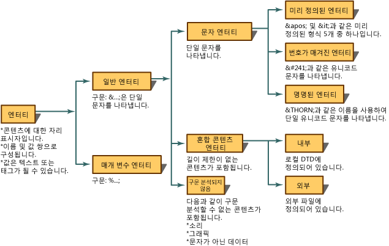
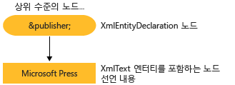

# <a name="reading-entity-declarations-and-entity-references-into-the-dom"></a>DOM에 엔터티 선언 및 엔터티 참조 읽어오기
엔터티는 XML에서 내용 또는 태그 대신 사용되는 이름을 나타내는 선언입니다. 엔터티는 두 부분으로 구성됩니다. 먼저 엔터티 선언을 사용하여 이름을 대체 내용에 연결해야 합니다. 엔터티 선언은 DTD(문서 종류 정의) 또는 XML 스키마에 `<!ENTITY name "value">` 구문을 사용하여 만듭니다. 그러면 엔터티 선언에 정의된 이름이 XML에서 사용됩니다. XML에서 사용될 경우 이 이름을 엔터티 참조라고 합니다. 예를 들어, 다음 엔터티 선언은 "Microsoft Press"라는 내용과 연결될 `publisher`라는 이름의 엔터티를 선언합니다.  
  
```xml  
<!ENTITY publisher "Microsoft Press">  
```  
  
 다음 예제에서는 XML에서 엔터티 참조로 이 엔터티 선언을 사용하는 방법을 보여 줍니다.  
  
```xml  
<author>Fred</author>  
<pubinfo>Published by &publisher;</pubinfo>  
```  
  
 문서가 메모리에 로드되면 일부 파서는 자동으로 엔터티를 확장합니다. 따라서 XML을 메모리에 읽어오면 엔터티 선언이 기억되고 저장됩니다. 그런 다음 파서가 일반 엔터티 참조를 식별하는 `&;` 문자를 발견하면 엔터티 선언 테이블에서 해당 이름을 찾습니다. `&publisher;` 참조는 해당 참조가 나타내는 내용으로 대체됩니다. 다음 XML을 사용한다고 가정합니다.  
  
```xml  
<author>Fred</author>  
<pubinfo>Published by &publisher;</pubinfo>  
```  
  
 엔터티 참조를 확장하고 `&publisher;`를 Microsoft Press라는 내용으로 바꿔 다음과 같은 확장된 XML을 얻을 수 있습니다.  
  
 **출력**  
  
```xml  
<author>Fred</author>  
<pubinfo>Published by Microsoft Press</pubinfo>  
```  
  
 엔터티에는 여러 종류가 있습니다. 다음 다이어그램은 엔터티 형식과 용어의 분류를 보여 줍니다.  
  
   
  
 Microsoft.NET Framework 구현은 XML 문서 개체 모델 (DOM)의 기본값인 참조를 유지 하는 XML이 로드 될 때 엔터티를 확장 하지 않습니다. 이 방식은 하는 문서를 DOM에 로드할 때는 **XmlEntityReference** 참조 변수를 포함 하는 노드 `&publisher;` DTD에 선언 된 엔터티의 내용을 나타내는 자식 노드를 만든 됩니다.  
  
 사용 하 여는 `<!ENTITY publisher "Microsoft Press">` 엔터티 선언에서 다음 그림에 **XmlEntity** 및 **XmlText** 이 선언에서 만든 노드.  
  
   
  
 엔터티 참조가 확장되는 경우와 그러지 않은 경우에 메모리의 DOM 트리에 생성되는 노드가 달라집니다. 생성 되는 노드의 차이점은 항목에서 설명 [엔터티 참조 유지](../../../../docs/standard/data/xml/entity-references-are-preserved.md) 및 [유지 되지 않고 확장 되는 엔터티 참조](../../../../docs/standard/data/xml/entity-references-are-expanded-and-not-preserved.md)합니다.  
  
## <a name="see-also"></a>참고 항목  
 [XML 문서 개체 모델 (DOM)](../../../../docs/standard/data/xml/xml-document-object-model-dom.md)
