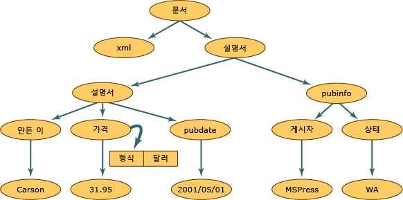

# <a name="xml-document-object-model-dom"></a><span data-ttu-id="a7739-102">XML DOM(문서 개체 모델)</span><span class="sxs-lookup"><span data-stu-id="a7739-102">XML Document Object Model (DOM)</span></span>
<span data-ttu-id="a7739-103">XML DOM(문서 개체 모델) 클래스는 XML 문서의 메모리 내 표현입니다.</span><span class="sxs-lookup"><span data-stu-id="a7739-103">The XML Document Object Model (DOM) class is an in-memory representation of an XML document.</span></span> <span data-ttu-id="a7739-104">DOM을 사용하여 XML 문서를 프로그래밍 방식으로 읽고, 조작하고, 수정할 수 있습니다.</span><span class="sxs-lookup"><span data-stu-id="a7739-104">The DOM allows you to programmatically read, manipulate, and modify an XML document.</span></span> <span data-ttu-id="a7739-105">그러나 **XmlReader** 클래스도 XML을 읽을 캐시 되지 않은 정방향 전용, 읽기 전용 액세스를 제공 합니다.</span><span class="sxs-lookup"><span data-stu-id="a7739-105">The **XmlReader** class also reads XML; however, it provides non-cached, forward-only, read-only access.</span></span> <span data-ttu-id="a7739-106">즉, 요소 또는 요소를 삽입 하 고 노드를 제거 하는 기능 또는 특성의 값을 편집 하는 기능이 없으며는 **XmlReader**합니다.</span><span class="sxs-lookup"><span data-stu-id="a7739-106">This means that there are no capabilities to edit the values of an attribute or content of an element, or the ability to insert and remove nodes with the **XmlReader**.</span></span> <span data-ttu-id="a7739-107">편집은 DOM의 기본 기능입니다.</span><span class="sxs-lookup"><span data-stu-id="a7739-107">Editing is the primary function of the DOM.</span></span> <span data-ttu-id="a7739-108">실제 XML 데이터는 파일에 저장될 때나 다른 개체에서 읽어 올 때 순차적인 방식으로 저장되지만 XML 데이터를 메모리에 표현하는 것은 일반적이고 구조적인 방식으로 수행됩니다.</span><span class="sxs-lookup"><span data-stu-id="a7739-108">It is the common and structured way that XML data is represented in memory, although the actual XML data is stored in a linear fashion when in a file or coming in from another object.</span></span> <span data-ttu-id="a7739-109">다음은 XML 데이터입니다.</span><span class="sxs-lookup"><span data-stu-id="a7739-109">The following is XML data.</span></span>  
  
## <a name="input"></a><span data-ttu-id="a7739-110">입력</span><span class="sxs-lookup"><span data-stu-id="a7739-110">Input</span></span>  
  
```xml  
<?xml version="1.0"?>  
  <books>  
    <book>  
        <author>Carson</author>  
        <price format="dollar">31.95</price>  
        <pubdate>05/01/2001</pubdate>  
    </book>  
    <pubinfo>  
        <publisher>MSPress</publisher>  
        <state>WA</state>  
    </pubinfo>  
  </books>   
```  
  
 <span data-ttu-id="a7739-111">다음 그림은 이 XML 데이터를 DOM 구조로 읽어올 때 메모리가 구조화되는 방법을 보여 줍니다.</span><span class="sxs-lookup"><span data-stu-id="a7739-111">The following illustration shows how memory is structured when this XML data is read into the DOM structure.</span></span>  
  
 <span data-ttu-id="a7739-112"></span><span class="sxs-lookup"><span data-stu-id="a7739-112"></span></span>  
<span data-ttu-id="a7739-113">XML 문서 구조</span><span class="sxs-lookup"><span data-stu-id="a7739-113">XML document structure</span></span>  
  
 <span data-ttu-id="a7739-114">XML 문서 구조 내에서이 그림의 각 원은 나타냅니다 라고 하는 노드는 **XmlNode** 개체입니다.</span><span class="sxs-lookup"><span data-stu-id="a7739-114">Within the XML document structure, each circle in this illustration represents a node, which is called an **XmlNode** object.</span></span> <span data-ttu-id="a7739-115">**XmlNode** 개체는 DOM 트리에서 기본 개체입니다.</span><span class="sxs-lookup"><span data-stu-id="a7739-115">The **XmlNode** object is the basic object in the DOM tree.</span></span> <span data-ttu-id="a7739-116">**XmlDocument** 클래스를 **XmlNode**합니다 (예: 메모리에 로드 또는 XML 파일에 저장 전체 문서에 대 한 작업을 수행 하기 위한 메서드를 지원 합니다. 합니다.</span><span class="sxs-lookup"><span data-stu-id="a7739-116">The **XmlDocument** class, which extends **XmlNode**, supports methods for performing operations on the document as a whole (for example, loading it into memory or saving the XML to a file.</span></span> <span data-ttu-id="a7739-117">또한 **XmlDocument** 확인 하 고 전체 XML 문서에서 노드를 조작할 수 있는 방법을 제공 합니다.</span><span class="sxs-lookup"><span data-stu-id="a7739-117">In addition, **XmlDocument** provides a means to view and manipulate the nodes in the entire XML document.</span></span> <span data-ttu-id="a7739-118">둘 다 **XmlNode** 및 **XmlDocument** 있고 메서드 및 속성을을 성능과 유용성 향상 기능이 있습니다.</span><span class="sxs-lookup"><span data-stu-id="a7739-118">Both **XmlNode** and **XmlDocument** have performance and usability enhancements and have methods and properties to:</span></span>  
  
-   <span data-ttu-id="a7739-119">요소 노드, entityreference 노드 등과 같은 DOM 관련 노드 액세스 및 수정</span><span class="sxs-lookup"><span data-stu-id="a7739-119">Access and modify nodes specific to the DOM, such as element nodes, entity reference nodes, and so on.</span></span>  
  
-   <span data-ttu-id="a7739-120">전체 노드 검색과 요소 노드의 텍스트와 같이 노드가 포함하는 정보 검색</span><span class="sxs-lookup"><span data-stu-id="a7739-120">Retrieve entire nodes, in addition to the information the node contains, such as the text in an element node.</span></span>  
  
    > [!NOTE]
    >  <span data-ttu-id="a7739-121">응용 프로그램에 구조 나 편집 DOM에서 제공 하는 기능이 필요 하지 않은 경우는 **XmlReader** 및 **XmlWriter** 클래스는 xml, 캐시 되지 않은 앞 으로만 이동 가능한 스트림 액세스를 제공 합니다.</span><span class="sxs-lookup"><span data-stu-id="a7739-121">If an application does not require the structure or editing capabilities provided by the DOM, the **XmlReader** and **XmlWriter** classes provide non-cached, forward-only stream access to XML.</span></span> <span data-ttu-id="a7739-122">자세한 내용은 <xref:System.Xml.XmlReader> 및 <xref:System.Xml.XmlWriter>를 참조하세요.</span><span class="sxs-lookup"><span data-stu-id="a7739-122">For more information, see <xref:System.Xml.XmlReader> and <xref:System.Xml.XmlWriter>.</span></span>  
  
 <span data-ttu-id="a7739-123">**노드** 개체 메서드 및 속성 뿐만 아니라 기본 및 잘 정의 된 특성 집합이 있습니다.</span><span class="sxs-lookup"><span data-stu-id="a7739-123">**Node** objects have a set of methods and properties, as well as basic and well-defined characteristics.</span></span> <span data-ttu-id="a7739-124">특성에는 다음이 포함됩니다.</span><span class="sxs-lookup"><span data-stu-id="a7739-124">Some of these characteristics are:</span></span>  
  
-   <span data-ttu-id="a7739-125">노드에는 하나의 부모 노드가 있습니다. 부모 노드는 해당 노드의 바로 위에 있는 노드입니다.</span><span class="sxs-lookup"><span data-stu-id="a7739-125">Nodes have a single parent node, a parent node being a node directly above them.</span></span> <span data-ttu-id="a7739-126">Document 루트는 문서 자체와 문서 조각을 포함하는 최상위 노드이므로 부모가 없는 유일한 노드입니다.</span><span class="sxs-lookup"><span data-stu-id="a7739-126">The only nodes that do not have a parent is the Document root, as it is the top-level node and contains the document itself and document fragments.</span></span>  
  
-   <span data-ttu-id="a7739-127">대부분의 노드에는 자식 노드, 즉 바로 아래에 있는 노드가 여러 개 있을 수 있습니다.</span><span class="sxs-lookup"><span data-stu-id="a7739-127">Most nodes can have multiple child nodes, which are nodes directly below them.</span></span> <span data-ttu-id="a7739-128">다음은 자식 노드를 가질 수 있는 노드 형식의 목록입니다.</span><span class="sxs-lookup"><span data-stu-id="a7739-128">The following is a list of node types that can have child nodes.</span></span>  
  
    -   <span data-ttu-id="a7739-129">**문서**</span><span class="sxs-lookup"><span data-stu-id="a7739-129">**Document**</span></span>  
  
    -   <span data-ttu-id="a7739-130">**DocumentFragment**</span><span class="sxs-lookup"><span data-stu-id="a7739-130">**DocumentFragment**</span></span>  
  
    -   <span data-ttu-id="a7739-131">**EntityReference**</span><span class="sxs-lookup"><span data-stu-id="a7739-131">**EntityReference**</span></span>  
  
    -   <span data-ttu-id="a7739-132">**요소**</span><span class="sxs-lookup"><span data-stu-id="a7739-132">**Element**</span></span>  
  
    -   <span data-ttu-id="a7739-133">**특성**</span><span class="sxs-lookup"><span data-stu-id="a7739-133">**Attribute**</span></span>  
  
     <span data-ttu-id="a7739-134">**XmlDeclaration**, **표기법**, **엔터티**, **CDATASection**, **텍스트**,  **주석**, **ProcessingInstruction**, 및 **DocumentType** 노드에 자식 노드는 없습니다.</span><span class="sxs-lookup"><span data-stu-id="a7739-134">The **XmlDeclaration**, **Notation**, **Entity**, **CDATASection**, **Text**, **Comment**, **ProcessingInstruction**, and **DocumentType** nodes do not have child nodes.</span></span>  
  
-   <span data-ttu-id="a7739-135">다이어그램에 표시 되는 동일한 수준에 있는 노드는 **책** 및 **pubinfo** 노드는 형제입니다.</span><span class="sxs-lookup"><span data-stu-id="a7739-135">Nodes that are at the same level, represented in the diagram by the **book** and **pubinfo** nodes, are siblings.</span></span>  
  
 <span data-ttu-id="a7739-136">특성 처리 방법은 DOM의 특징 중 하나입니다.</span><span class="sxs-lookup"><span data-stu-id="a7739-136">One characteristic of the DOM is how it handles attributes.</span></span> <span data-ttu-id="a7739-137">특성은 부모-자식 및 형제 관계에 있는 노드가 아닙니다.</span><span class="sxs-lookup"><span data-stu-id="a7739-137">Attributes are not nodes that are part of the parent, child, and sibling relationships.</span></span> <span data-ttu-id="a7739-138">특성은 요소 노드의 속성으로 간주되며 이름 및 값 쌍으로 구성됩니다.</span><span class="sxs-lookup"><span data-stu-id="a7739-138">Attributes are considered a property of the element node and are made up of a name and a value pair.</span></span> <span data-ttu-id="a7739-139">예를 들어, `format="dollar` 요소와 연관된 `price`"로 구성되는 XML 데이터의 경우 `format`이라는 단어는 이름이고 `format` 특성의 값은 `dollar`입니다.</span><span class="sxs-lookup"><span data-stu-id="a7739-139">For example, if you have XML data consisting of `format="dollar`" associated with the element `price`, the word `format` is the name, and the value of the `format` attribute is `dollar`.</span></span> <span data-ttu-id="a7739-140">검색 하는 `format="dollar"` 특성에는 **가격** 호출 하는 노드를는 **GetAttribute** 커서에 위치한 경우 메서드는 `price` 요소 노드.</span><span class="sxs-lookup"><span data-stu-id="a7739-140">To retrieve the `format="dollar"` attribute of the **price** node, you call the **GetAttribute** method when the cursor is located at the `price` element node.</span></span> <span data-ttu-id="a7739-141">자세한 내용은 참조 [DOM에서 특성 액세스](../../../../docs/standard/data/xml/accessing-attributes-in-the-dom.md)합니다.</span><span class="sxs-lookup"><span data-stu-id="a7739-141">For more information, see [Accessing Attributes in the DOM](../../../../docs/standard/data/xml/accessing-attributes-in-the-dom.md).</span></span>  
  
 <span data-ttu-id="a7739-142">노드는 XML을 메모리로 읽어올 때 만들어집니다.</span><span class="sxs-lookup"><span data-stu-id="a7739-142">As XML is read into memory, nodes are created.</span></span> <span data-ttu-id="a7739-143">그러나 모든 노드가 동일한 형식은 아닙니다.</span><span class="sxs-lookup"><span data-stu-id="a7739-143">However, not all nodes are the same type.</span></span> <span data-ttu-id="a7739-144">XML의 요소에는 처리 명령 대신 다양한 규칙과 구문이 있습니다.</span><span class="sxs-lookup"><span data-stu-id="a7739-144">An element in XML has different rules and syntax than a processing instruction.</span></span> <span data-ttu-id="a7739-145">따라서 다양한 데이터를 읽을 때 각 노드에 노드 형식이 지정됩니다.</span><span class="sxs-lookup"><span data-stu-id="a7739-145">Therefore, as various data is read, a node type is assigned to each node.</span></span> <span data-ttu-id="a7739-146">이 노드 형식은 해당 노드의 특징 및 기능을 결정합니다.</span><span class="sxs-lookup"><span data-stu-id="a7739-146">This node type determines the characteristics and functionality of the node.</span></span>  
  
 <span data-ttu-id="a7739-147">메모리에 만들어지는 노드 형식에 대 한 자세한 내용은 참조 하십시오. [XML 노드 형식](../../../../docs/standard/data/xml/types-of-xml-nodes.md)합니다.</span><span class="sxs-lookup"><span data-stu-id="a7739-147">For more information on the types of nodes generated in memory, see [Types of XML Nodes](../../../../docs/standard/data/xml/types-of-xml-nodes.md).</span></span> <span data-ttu-id="a7739-148">노드 트리에 만들어지는 개체에 대 한 자세한 내용은 참조 하십시오. [XML 데이터에 개체 계층 구조 매핑](../../../../docs/standard/data/xml/mapping-the-object-hierarchy-to-xml-data.md)합니다.</span><span class="sxs-lookup"><span data-stu-id="a7739-148">For more information on the objects created in the node tree, see [Mapping the Object Hierarchy to XML Data](../../../../docs/standard/data/xml/mapping-the-object-hierarchy-to-xml-data.md).</span></span>  
  
 <span data-ttu-id="a7739-149">Microsoft는 XML 문서 작업을 손쉽게 수행할 수 있도록 W3C(World Wide Web 컨소시엄) DOM Level 1 및 Level 2에서 사용할 수 있는 API를 확장했습니다.</span><span class="sxs-lookup"><span data-stu-id="a7739-149">Microsoft has extended the APIs that are available in the World Wide Web Consortium (W3C) DOM Level 1 and Level 2 to make it easier to work with an XML document.</span></span> <span data-ttu-id="a7739-150">W3C 표준을 완전하게 지원하는 동시에 추가 클래스, 메서드 및 속성으로 W3C XML DOM을 사용하여 수행할 수 있는 것 이상의 기능을 제공합니다.</span><span class="sxs-lookup"><span data-stu-id="a7739-150">While fully supporting the W3C standards, the additional classes, methods, and properties add functionality beyond what can be done using the W3C XML DOM.</span></span> <span data-ttu-id="a7739-151">새 클래스를 사용하면 관계형 데이터에 액세스할 수 있어 ADO.NET 데이터와 동기화하는 동시에 데이터를 XML로 표현하는 메서드가 제공됩니다.</span><span class="sxs-lookup"><span data-stu-id="a7739-151">New classes enable you to access relational data, giving you methods for synchronizing with ADO.NET data, simultaneously exposing data as XML.</span></span> <span data-ttu-id="a7739-152">자세한 내용은 참조 [DataSet을 XmlDataDocument와 동기화](../../../../docs/framework/data/adonet/dataset-datatable-dataview/dataset-and-xmldatadocument-synchronization.md)합니다.</span><span class="sxs-lookup"><span data-stu-id="a7739-152">For more information, see [Synchronizing a DataSet with an XmlDataDocument](../../../../docs/framework/data/adonet/dataset-datatable-dataview/dataset-and-xmldatadocument-synchronization.md).</span></span>  
  
 <span data-ttu-id="a7739-153">DOM은 XML 데이터를 메모리로 읽어와 구조를 변경하고, 노드를 추가하거나 제거하며, 요소에 들어 있는 텍스트에 포함된 노드의 데이터를 수정할 경우에 매우 유용합니다.</span><span class="sxs-lookup"><span data-stu-id="a7739-153">The DOM is most useful for reading XML data into memory to change its structure, to add or remove nodes, or to modify the data held by a node as in the text contained by an element.</span></span> <span data-ttu-id="a7739-154">그러나 그 밖의 상황에서는 DOM보다 더 빠른 다른 클래스를 사용할 수 있습니다.</span><span class="sxs-lookup"><span data-stu-id="a7739-154">However, other classes are available that are faster than the DOM in other scenarios.</span></span> <span data-ttu-id="a7739-155">XML에 대 한 빠르고 캐시 되지 않은, 앞 으로만 이동 가능한 스트림 액세스를 사용 하 여는 **XmlReader** 및 **XmlWriter**합니다.</span><span class="sxs-lookup"><span data-stu-id="a7739-155">For fast, non-cached, forward-only stream access to XML, use the **XmlReader** and **XmlWriter**.</span></span> <span data-ttu-id="a7739-156">커서 모델을 사용한 임의 액세스가 필요한 경우 고 **XPath**를 사용 하 여는 **XPathNavigator** 클래스입니다.</span><span class="sxs-lookup"><span data-stu-id="a7739-156">If you need random access with a cursor model and **XPath**, use the **XPathNavigator** class.</span></span>  
  
## <a name="see-also"></a><span data-ttu-id="a7739-157">참고 항목</span><span class="sxs-lookup"><span data-stu-id="a7739-157">See Also</span></span>  
 [<span data-ttu-id="a7739-158">XML 노드 형식</span><span class="sxs-lookup"><span data-stu-id="a7739-158">Types of XML Nodes</span></span>](../../../../docs/standard/data/xml/types-of-xml-nodes.md)  
 [<span data-ttu-id="a7739-159">XML 데이터에 개체 계층 구조 매핑</span><span class="sxs-lookup"><span data-stu-id="a7739-159">Mapping the Object Hierarchy to XML Data</span></span>](../../../../docs/standard/data/xml/mapping-the-object-hierarchy-to-xml-data.md)
