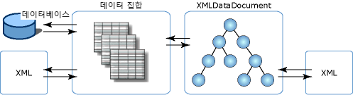

# XML과 관계형 데이터 및 ADO.NET의 통합XML Integration with Relational Data and ADO.NET
**XmlDataDocument** 클래스는 **XmlDocument**의 파생 클래스이며 XML 데이터를 포함합니다.The **XmlDataDocument** class is a derived class of the **XmlDocument**, and contains XML data. **XmlDataDocument**의 이점은 관계형 데이터와 계층형 데이터 간을 연결해 준다는 것입니다.The advantage of the **XmlDataDocument** is that it provides a bridge between relational and hierarchical data. **XmlDocument**는 **DataSet**에 바인딩할 수 있는 클래스입니다. 이러한 두 클래스는 모두 클래스에 포함된 데이터의 변경 내용을 동기화할 수 있습니다.It is an **XmlDocument** that can be bound to a **DataSet** and both classes can synchronize changes made to data contained in the two classes. **DataSet**에 바인딩된 **XmlDocument**를 통해 XML을 관계형 데이터와 통합할 수 있으므로 데이터를 XML 또는 관계형 형식으로 나타낼 필요가 없습니다.An **XmlDocument** that is bound to a **DataSet** allows XML to integrate with relational data, and you do not have to have your data represented as either XML or in a relational format. 데이터를 두 가지 형식으로 나타낼 수 있으며 한 가지 형식으로만 제약되지 않습니다.You can do both and not be constrained to a single representation of the data.  
  
 두 가지 뷰로 데이터를 사용할 수 있기 때문에 다음과 같은 이점을 얻을 수 있습니다.The benefits of having data available in two views are:  
  
-   XML 문서의 구조화된 부분을 데이터 집합에 매핑할 수 있으며 효율적으로 저장하고 인덱싱하거나 검색할 수 있습니다.The structured portion of an XML document can be mapped to a dataset, and be efficiently stored, indexed, and searched.  
  
-   커서 모델을 통해 관계형으로 저장되는 XML 데이터에 대한 변형, 유효성 검사 및 탐색 작업을 효율적으로 수행할 수 있습니다.Transformations, validation, and navigation can be done efficiently through a cursor model over the XML data that is stored relationally. 경우에 따라 이 작업은 XML이 **XmlDocument** 모델에 저장되어 있는 경우보다 관계형 구조에 대해 좀 더 효율적으로 수행될 수 있습니다.At times, it can be done more efficiently against relational structures than if the XML is stored in an **XmlDocument** model.  
  
-   **DataSet**은 XML의 일부를 저장할 수 있습니다.The **DataSet** can store a portion of the XML. 즉, **XPath** 또는 **XslTransform**을 사용하여 관련된 요소 및 특성만 **DataSet**에 저장할 수 있습니다.That is, you can use **XPath** or **XslTransform** to store to a **DataSet** only those elements and attributes of interest. 해당 DataSet에서 필터링된 보다 적은 데이터 하위 집합이 변경되고 변경 내용은 **XmlDataDocument**의 더 큰 데이터로 전파될 수 있습니다.From there, changes can be made to the smaller, filtered subset of data, with the changes propagating to the larger data in the **XmlDataDocument**.  
  
 또한 SQL Server에서 **DataSet**으로 로드된 데이터를 변환할 수도 있습니다.You can also run a transform over data that was loaded into the **DataSet** from SQL Server. 다른 옵션은 .NET Framework 클래스 스타일의 관리되는 WinForm 및 WebForm 컨트롤을 XML 입력 스트림으로부터 채워진 **DataSet**에 바인딩하는 것입니다.Another option is to bind .NET Framework classes-style-managed WinForm and WebForm controls to a **DataSet** that was populated from an XML input stream.  
  
 **XmlDataDocument**는 **XslTransform**을 지원할 뿐 아니라 **XPath** 쿼리 및 유효성 검사를 위해 관계형 데이터를 노출합니다.In addition to supporting **XslTransform**, an **XmlDataDocument** exposes relational data to **XPath** queries and validation.  기본적으로 관계형 데이터에 대해 모든 XML 서비스를 사용할 수 있으며 XML 신뢰도를 떨어뜨리지 않으면서 구조적으로 투영된 XML에 대해 컨트롤 바인딩, 코드 생성 등과 같은 관계형 기능을 사용할 수 있습니다.Basically, all XML services are available over relational data, and relational facilities, such as control binding, codegen, and so on, are available over a structured projection of XML without compromising XML fidelity.  
  
 **XmlDataDocument**는 **XmlDocument**에서 상속되므로 W3C DOM의 구현을 제공합니다.Because **XmlDataDocument** is inherited from an **XmlDocument**, it provides an implementation of the W3C DOM. **XmlDataDocument**가 **DataSet**과 연관되어 있고 DataSet 내부에 해당 데이터 하위 집합을 저장하므로 DataSet은 **XmlDocument**의 용도를 제한하거나 변경하지 않습니다.The fact that the **XmlDataDocument** is associated with, and stores a subset of its data within, a **DataSet** does not restrict or alter its use as an **XmlDocument** in any way. **XmlDocument**를 사용하도록 작성된 코드는 **XmlDataDocument**에 대해서도 동일하게 작동됩니다.Code written to consume an **XmlDocument** works unaltered against an **XmlDataDocument**. **DataSet**은 테이블, 열, 관계 및 제약 조건을 정의하여 동일한 데이터를 관계형으로 표시하는 독립 실행형, 메모리 내 사용자 데이터 저장소입니다.The **DataSet** provides the relational view of the same data by defining tables, columns, relations, and constraints, and is a stand-alone, in-memory user data store.  
  
 다음 그림은 XML 데이터의 **DataSet** 및 **XmlDataDocument**와의 다양한 연관성을 보여줍니다.The following illustration shows the different associations that XML data has with the **DataSet** and **XmlDataDocument**.  
  
   
  
 이 그림은 XML 데이터를 **DataSet**으로 직접 로드할 수 있으며 이를 통해 XML을 관계형 방식으로 직접 조작할 수 있음을 보여줍니다.The illustration shows that XML data can be loaded directly into a **DataSet**, which allows direct manipulation with XML in the relational manner. 또는 XML을 **XmlDataDocument**에 해당하는 DOM의 파생 클래스로 로드할 수 있으며, 나중에 로드하여 **DataSet**과 동기화할 수 있습니다.Or, the XML can be loaded into a derived class of the DOM, which is the **XmlDataDocument**, and subsequently loaded and synchronized with the **DataSet**. **DataSet** 및 **XmlDataDocument**는 단일 데이터 집합에 대해 동기화되므로 한 저장소에서 데이터를 변경하면 해당 변경 내용이 다른 저장소에 반영됩니다.Because the **DataSet** and **XmlDataDocument** are synchronized over a single set of data, changes made to the data in one store are reflected in the other store.  
  
 **XmlDataDocument**는 **XmlDocument**에서 모든 편집 및 탐색 기능을 상속합니다.The **XmlDataDocument** inherits all the editing and navigational features from the **XmlDocument**. **DataSet**과 동기화된 **XmlDataDocument** 및 해당하는 상속된 기능을 사용하는 것이 **DataSet**으로 XML을 직접 로드하는 것보다 더 적절한 옵션인 경우가 있습니다.There are times when using the **XmlDataDocument** and its inherited features, synchronized with a **DataSet**, is a more appropriate option than loading XML directly into the **DataSet**. 다음 표에서는 **DataSet**을 로드하는 데 사용할 방법을 선택할 때 고려해야 할 항목을 보여줍니다.The following table shows the items to be considered when choosing which method to use to load the **DataSet**.  
  
|XML을 DataSet으로 직접 로드해야 할 때When to load XML directly into a DataSet|XmlDataDocument를 DataSet과 동기화해야 할 때When to synchronize an XmlDataDocument with a DataSet|  
|----------------------------------------------|-----------------------------------------------------------|  
|**DataSet**의 데이터 쿼리는 XPath보다 SQL을 사용하면 더 쉽게 처리할 수 있습니다.Queries of data in the **DataSet** are easier using SQL than XPath.|**DataSet**의 데이터에 대해 XPath 쿼리가 필요합니다.XPath queries are needed over data in the **DataSet**.|  
|소스 XML에서 요소 순서를 유지하지 않아도 됩니다.Preservation of element ordering in the source XML is not critical.|소스 XML에서 요소 순서를 유지해야 합니다.Preservation of element ordering in the source XML is critical.|  
|소스 XML에서 요소 간의 공백과 서식을 유지할 필요가 없습니다.White space between elements and formatting does not need to be preserved in the source XML.|소스 XML에서 공백과 서식을 유지해야 합니다.White space and formatting preservation in the source XML is critical.|  
  
 필요한 **DataSet** 주소에서 직접 XML을 로드하거나 해당 주소에 직접 XML을 쓰는 경우 [XML로부터 DataSet 로드](../../../../docs/framework/data/adonet/dataset-datatable-dataview/loading-a-dataset-from-xml.md) 및 [DataSet을 XML 데이터로 작성](../../../../docs/framework/data/adonet/dataset-datatable-dataview/writing-dataset-contents-as-xml-data.md)을 참조하세요.If loading and writing XML directly into and out of a **DataSet** addresses your needs, see [Loading a DataSet from XML](../../../../docs/framework/data/adonet/dataset-datatable-dataview/loading-a-dataset-from-xml.md) and [Writing a DataSet as XML Data](../../../../docs/framework/data/adonet/dataset-datatable-dataview/writing-dataset-contents-as-xml-data.md).  
  
 필요한 **XmlDataDocument** 주소에서 **DataSet**을 로드하는 경우 [DataSet을 XML 문서와 동기화](../../../../docs/framework/data/adonet/dataset-datatable-dataview/dataset-and-xmldatadocument-synchronization.md)를 참조하세요.If loading the **DataSet** from an **XmlDataDocument** addresses your needs, see [Synchronizing a Datasetwith an XML Document](../../../../docs/framework/data/adonet/dataset-datatable-dataview/dataset-and-xmldatadocument-synchronization.md).  
  
## 참고 항목See Also  
 [데이터 집합에서 XML 사용Using XML in a DataSet](../../../../docs/framework/data/adonet/dataset-datatable-dataview/using-xml-in-a-dataset.md)
