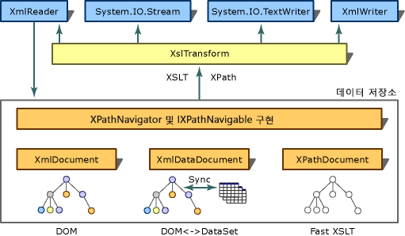

# <a name="xslt-transformations-with-the-xsltransform-class"></a>XslTransform 클래스를 사용하여 XSLT 변형
> [!NOTE]
>  <xref:System.Xml.Xsl.XslTransform> 클래스는 [!INCLUDE[dnprdnext](../../../../includes/dnprdnext-md.md)]에서 사용되지 않습니다. <xref:System.Xml.Xsl.XslCompiledTransform> 클래스를 사용하여 XSLT(Extensible Stylesheet Language for Transformations) 변환을 수행할 수 있습니다. 자세한 내용은 [XslCompiledTransform 클래스 사용](../../../../docs/standard/data/xml/using-the-xslcompiledtransform-class.md) 및 [XslTransform 클래스에서 마이그레이션](../../../../docs/standard/data/xml/migrating-from-the-xsltransform-class.md)을 참조하세요.  
  
 XSLT의 목표는 소스 XML 문서의 내용을 형식 또는 구조가 다른 문서로 변환하는 것입니다. 예를 들어, XML을 웹 사이트에서 사용하는 HTML로 변환하거나 응용 프로그램에서 필요한 필드만 포함하는 문서로 변형합니다. 이러한 변환 프로세스는 www.w3.org/TR/xslt에 있는 W3C(World Wide Web 컨소시엄) XSLT 버전 1.0 권장 사항으로 지정됩니다. [!INCLUDE[dnprdnshort](../../../../includes/dnprdnshort-md.md)]에서는 <xref:System.Xml.Xsl.XslTransform> 네임스페이스에 있는 <xref:System.Xml.Xsl> 클래스가 이 사양의 기능을 구현한 XSLT 프로세서입니다. 여기에는 W3C XSLT 1.0 권장 사항에서 구현되지 않은 몇 가지 기능이 있습니다. 이 기능에 대해서는 [XslTransform 출력](../../../../docs/standard/data/xml/outputs-from-an-xsltransform.md)을 참조하세요. 다음 그림은 [!INCLUDE[dnprdnshort](../../../../includes/dnprdnshort-md.md)]의 변환 아키텍처를 보여줍니다.  
  
## <a name="overview"></a>개요  
   
변형 아키텍처  
  
 XSLT 권장 사항에서는 XML 문서의 일부를 선택하는 데 XPath(XML Path Language)를 사용합니다. 여기서 XPath는 문서 트리의 노드를 탐색하는 데 사용되는 쿼리 언어입니다. 그림에서처럼 XPath의 [!INCLUDE[dnprdnshort](../../../../includes/dnprdnshort-md.md)] 구현은 <xref:System.Xml.XmlDocument>, <xref:System.Xml.XmlDataDocument> 및 <xref:System.Xml.XPath.XPathDocument> 등과 같은 여러 클래스에 저장된 XML의 일부를 선택하는 데 사용됩니다. <xref:System.Xml.XPath.XPathDocument>는 최적화된 XSLT 데이터 저장소로, <xref:System.Xml.Xsl.XslTransform>과 함께 사용할 경우 뛰어난 성능으로 XSLT 변환을 수행할 수 있습니다.  
  
 다음 표에서는 <xref:System.Xml.Xsl.XslTransform> 및 XPath와 해당 기능을 사용할 때 자주 사용되는 클래스의 목록을 보여줍니다.  
  
|클래스 또는 인터페이스|함수|  
|------------------------|--------------|  
|<xref:System.Xml.XPath.XPathNavigator>|XPath 쿼리 지원과 함께 저장소에 대한 커서 유형의 탐색 모델을 제공하는 API입니다. 내부 저장소에 대한 편집은 제공하지 않습니다. 편집이 필요하면 <xref:System.Xml.XmlDocument> 클래스를 사용합니다.|  
|<xref:System.Xml.XPath.IXPathNavigable>|저장소에 대한 `CreateNavigator`에 <xref:System.Xml.XPath.XPathNavigator> 메서드를 제공하는 인터페이스입니다.|  
|<xref:System.Xml.XmlDocument>|이 문서를 편집할 수 있습니다. XSLT 변환이 필요한 문서 편집 시나리오를 허용하여 <xref:System.Xml.XPath.IXPathNavigable>을 구현합니다. 자세한 내용은 [XslTransform에 대한 XmlDocument 입력](../../../../docs/standard/data/xml/xmldocument-input-to-xsltransform.md)을 참조하세요.|  
|<xref:System.Xml.XmlDataDocument>|<xref:System.Xml.XmlDocument>에서 파생됩니다. <xref:System.Data.DataSet>에서 지정된 매핑에 따라 XML 문서 내의 구조화된 데이터 저장소를 최적화하는 <xref:System.Data.DataSet>을 사용하여 관계형 데이터와 XML 데이터를 연결합니다. 데이터베이스에서 검색된 관계형 데이터에 대해 XSLT 변환이 수행될 수 있는 시나리오를 허용하여 <xref:System.Xml.XPath.IXPathNavigable>을 구현합니다. 자세한 내용은 [XML과 관계형 데이터 및 ADO.NET의 통합](../../../../docs/standard/data/xml/xml-integration-with-relational-data-and-adonet.md)을 참조하세요.|  
|<xref:System.Xml.XPath.XPathDocument>|이 클래스는 <xref:System.Xml.Xsl.XslTransform> 처리와 XPath 쿼리를 위해 최적화되었으며 고성능의 읽기 전용 캐시를 제공합니다. <xref:System.Xml.XPath.IXPathNavigable>을 구현하며 XSLT 변환에 사용하는 기본 설정 저장소입니다.|  
|<xref:System.Xml.XPath.XPathNodeIterator>|XPath 노드 집합을 탐색할 수 있게 합니다. <xref:System.Xml.XPath.XPathNavigator>에서 모든 XPath 선택 메서드는 <xref:System.Xml.XPath.XPathNodeIterator>를 반환합니다. 동일한 저장소에 대해 각각 선택된 노드 집합을 나타내는 여러 <xref:System.Xml.XPath.XPathNodeIterator> 개체를 만들 수 있습니다.|  
  
## <a name="msxml-xslt-extensions"></a>MSXML XSLT 확장  
 `msxsl:script` 및 `msxsl:node-set` 함수는 <xref:System.Xml.Xsl.XslTransform> 클래스에서 지원하는 유일한 MSXML(Microsoft XML Core Services) XSLT 확장입니다.  
  
## <a name="example"></a>예  
 다음 코드 예제에서는 XSLT 스타일시트를 로드하고 <xref:System.Xml.XPath.XPathDocument>에 mydata.xml이라는 파일을 읽어들인 후, 가상 파일인 myStyleSheet.xsl에서 데이터 변환을 수행하여 서식이 지정된 출력을 콘솔로 보냅니다.  
  
```vb  
Imports System  
Imports System.IO  
Imports System.Xml  
Imports System.Xml.XPath  
Imports System.Xml.Xsl  
  
Public Class Sample  
    Private filename As [String] = "mydata.xml"  
    Private stylesheet As [String] = "myStyleSheet.xsl"  
  
    Public Shared Sub Main()  
        Dim xslt As New XslTransform()  
        xslt.Load(stylesheet)  
        Dim xpathdocument As New XPathDocument(filename)  
        Dim writer As New XmlTextWriter(Console.Out)  
        writer.Formatting = Formatting.Indented  
  
        xslt.Transform(xpathdocument, Nothing, writer, Nothing)  
    End Sub 'Main  
End Class 'Sample  
```  
  
```csharp  
using System;  
using System.IO;  
using System.Xml;  
using System.Xml.XPath;  
using System.Xml.Xsl;  
  
public class Sample   
{  
    private const String filename = "mydata.xml";  
    private const String stylesheet = "myStyleSheet.xsl";  
  
    public static void Main()   
    {  
    XslTransform xslt = new XslTransform();  
    xslt.Load(stylesheet);  
    XPathDocument xpathdocument = new  
    XPathDocument(filename);  
    XmlTextWriter writer = new XmlTextWriter(Console.Out);  
    writer.Formatting=Formatting.Indented;  
  
    xslt.Transform(xpathdocument, null, writer, null);      
    }  
}  
```  
  
## <a name="see-also"></a>참고 항목  
 <xref:System.Xml.Xsl.XslTransform>  
 [XslTransform 클래스의 XSLT 프로세서 구현](../../../../docs/standard/data/xml/xsltransform-class-implements-the-xslt-processor.md)  
 [XslTransform 클래스에서 임의 동작 구현](../../../../docs/standard/data/xml/implementation-of-discretionary-behaviors-in-the-xsltransform-class.md)  
 [변형 과정에서 XPathNavigator의 역할](../../../../docs/standard/data/xml/xpathnavigator-in-transformations.md)  
 [변형 과정에서 XPathNodeIterator의 역할](../../../../docs/standard/data/xml/xpathnodeiterator-in-transformations.md)  
 [XslTransform에 대한 XPathDocument 입력](../../../../docs/standard/data/xml/xpathdocument-input-to-xsltransform.md)  
 [XslTransform에 대한 XmlDataDocument 입력](../../../../docs/standard/data/xml/xmldatadocument-input-to-xsltransform.md)  
 [XslTransform에 대한 XmlDocument 입력](../../../../docs/standard/data/xml/xmldocument-input-to-xsltransform.md)
