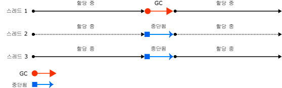
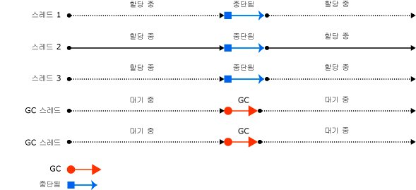
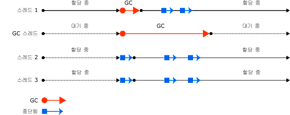
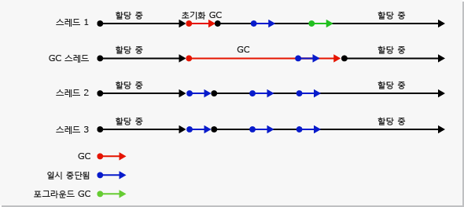
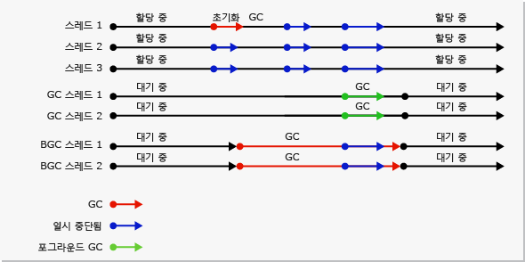

# 가비지 컬렉션 기본 사항Fundamentals of Garbage Collection
 CLR(공용 언어 런타임)에서 가비지 수집은 자동 메모리 관리자 역할을 합니다. In the common language runtime (CLR), the garbage collector serves as an automatic memory manager. 가비지 수집은 다음과 같은 이점을 제공합니다.It provides the following benefits:  
  
-   응용 프로그램을 개발할 때 메모리를 해제할 필요가 없습니다.Enables you to develop your application without having to free memory.  
  
-   관리되는 힙에 효율적으로 개체를 할당합니다.Allocates objects on the managed heap efficiently.  
  
-   더 이상 사용되지 않는 개체를 회수하고 이러한 개체의 메모리를 비워 이후 할당에서 이 메모리를 사용할 수 있도록 합니다.Reclaims objects that are no longer being used, clears their memory, and keeps the memory available for future allocations. 관리되는 개체는 자동으로 시작을 위한 정리된 콘텐츠를 받으므로 개체의 생성자가 모든 데이터 필드를 초기화할 필요가 없습니다.Managed objects automatically get clean content to start with, so their constructors do not have to initialize every data field.  
  
-   개체에서 다른 개체의 콘텐츠를 사용할 수 없도록 하여 메모리 안전을 제공합니다.Provides memory safety by making sure that an object cannot use the content of another object.  
  
 이 항목에서는 가비지 수집의 핵심 개념에 대해 설명합니다.This topic describes the core concepts of garbage collection. 여기에는 다음 단원이 포함되어 있습니다.It contains the following sections:  
  
-   [메모리 기본 사항Fundamentals of memory](#fundamentals_of_memory)  
  
-   [가비지 수집 조건Conditions for a garbage collection](#conditions_for_a_garbage_collection)  
  
-   [관리되는 힙The managed heap](#the_managed_heap)  
  
-   [세대Generations](#generations)  
  
-   [가비지 수집 중 수행되는 작업What happens during a garbage collection](#what_happens_during_a_garbage_collection)  
  
-   [관리되지 않는 리소스 조작Manipulating unmanaged resources](#manipulating_unmanaged_resources)  
  
-   [워크스테이션 및 서버 가비지 수집Workstation and server garbage collection](#workstation_and_server_garbage_collection)  
  
-   [동시 가비지 수집Concurrent garbage collection](#concurrent_garbage_collection)  
  
-   [백그라운드 워크스테이션 가비지 수집Background workstation garbage collection](#background_garbage_collection)  
  
-   [백그라운드 서버 가비지 수집Background server garbage collection](#background_server_garbage_collection)  
  
   
## 메모리 기본 사항Fundamentals of memory  
 다음 목록은 중요한 CLR 메모리 개념을 요약한 것입니다.The following list summarizes important CLR memory concepts.  
  
-   각 프로세스에는 고유한 개별 가상 주소 공간이 있습니다.Each process has its own, separate virtual address space. 동일 컴퓨터의 모든 프로세스는 동일한 실제 메모리를 공유하고 페이지 파일(있는 경우)을 공유합니다.All processes on the same computer share the same physical memory, and share the page file if there is one.  
  
-   기본적으로 32비트 컴퓨터에서는 각 프로세스에 2GB 사용자 모드 가상 주소 공간이 포함됩니다.By default, on 32-bit computers, each process has a 2-GB user-mode virtual address space.  
  
-   응용 프로그램 개발자는 가상 주소 공간만 사용하고 실제 메모리는 직접적으로 조작하지 않습니다.As an application developer, you work only with virtual address space and never manipulate physical memory directly. 가비지 수집기는 관리되는 힙에서 사용자 대신 가상 메모리를 할당 및 해제합니다.The garbage collector allocates and frees virtual memory for you on the managed heap.  
  
     네이티브 코드를 작성 중인 경우 Win32 함수를 사용하여 가상 주소 공간을 작업합니다.If you are writing native code, you use Win32 functions to work with the virtual address space. 이러한 함수는 네이티브 힙에서 사용자 대신 가상 메모리를 할당 및 해제합니다.These functions allocate and free virtual memory for you on native heaps.  
  
-   가상 메모리는 다음 세 가지 상태일 수 있습니다.Virtual memory can be in three states:  
  
    -   비어 있음.Free. 메모리 블록에 가상 메모리에 대한 참조가 없으며, 메모리 블록을 할당에 사용할 수 있습니다.The block of memory has no references to it and is available for allocation.  
  
    -   예약됨.Reserved. 메모리 블록을 사용자의 작업에 사용할 수 있으며, 다른 할당 요청에는 메모리 블록을 사용할 수 없습니다.The block of memory is available for your use and cannot be used for any other allocation request. 하지만 커밋되기 전까지는 메모리 블록에 데이터를 저장할 수 없습니다.However, you cannot store data to this memory block until it is committed.  
  
    -   커밋됨.Committed. 메모리 블록이 실제 저장소에 할당되어 있습니다.The block of memory is assigned to physical storage.  
  
-   가상 주소 공간은 조각화될 수 있습니다.Virtual address space can get fragmented. 즉, 주소 공간에 구멍이라고도 부르는 빈 블록이 존재합니다.This means that there are free blocks, also known as holes, in the address space. 가상 메모리 할당이 요청된 경우 가상 메모리 관리자는 할당 요청을 만족시킬 수 있도록 충분히 큰 단일 빈 블록을 찾아야 합니다.When a virtual memory allocation is requested, the virtual memory manager has to find a single free block that is large enough to satisfy that allocation request. 2GB의 여유 공간이 있는 경우에 2GB를 필요로 하는 할당 되지 것입니다 성공 모든 사용 가능한 공간이 단일 주소 블록에 않는.Even if you have 2 GB of free space, the allocation that requires 2 GB will be unsuccessful unless all of that free space is in a single address block.  
  
-   예약할 가상 주소 공간이 부족하거나 커밋할 실제 공간이 부족한 경우 메모리 부족이 발생할 수 있습니다.You can run out of memory if you run out of virtual address space to reserve or physical space to commit.  
  
 페이지 파일은 실제 메모리 압력(즉, 실제 메모리에 대한 요구)이 낮더라도 사용됩니다.Your page file is used even if physical memory pressure (that is, demand for physical memory) is low. 실제 메모리 압력이 처음으로 높아지면 운영 체제가 데이터를 저장하기 위해 실제 메모리에 공간을 만들어야 하며, 실제 메모리에 있는 데이터 중 일부를 페이지 파일로 백업합니다.The first time your physical memory pressure is high, the operating system must make room in physical memory to store data, and it backs up some of the data that is in physical memory to the page file. 필요할 때까지는 데이터가 페이지 파일로 저장되지 않으므로 실제 메모리 압력이 매우 낮은 상황에서도 페이징이 발생할 수 있습니다.That data is not paged until it is needed, so it is possible to encounter paging in situations where the physical memory pressure is very low. 
 
 [맨 위로 이동Back to top](#top)  
  
   
## 가비지 수집 조건Conditions for a garbage collection  
 가비지 수집은 다음 조건 중 하나가 충족될 경우 발생합니다.Garbage collection occurs when one of the following conditions is true:  
  
-   시스템의 실제 메모리가 부족합니다.The system has low physical memory. 이 감지 OS에서 메모리 부족 알림을 또는 호스트에 의해 표시 된 메모리 부족 합니다.This is detected by either the low memory notification from the OS or low memory indicated by the host.
  
-   관리되는 힙의 할당된 개체에 사용되는 메모리가 허용되는 임계값을 초과합니다.The memory that is used by allocated objects on the managed heap surpasses an acceptable threshold. 이 임계값은 프로세스가 실행됨에 따라 계속 조정됩니다.This threshold is continuously adjusted as the process runs.  
  
-   <xref:System.GC.Collect%2A?displayProperty=nameWithType> 메서드가 호출됩니다.The <xref:System.GC.Collect%2A?displayProperty=nameWithType> method is called. 가비지 수집기가 지속적으로 실행되므로 이 메서드를 호출해야 하는 경우는 거의 없습니다.In almost all cases, you do not have to call this method, because the garbage collector runs continuously. 이 메서드는 주로 특이한 상황 및 테스트에 사용됩니다.This method is primarily used for unique situations and testing.  
  
 [맨 위로 이동Back to top](#top)  
  
   
## 관리되는 힙The managed heap  
 CLR에 의해 가비지 수집기가 초기화되고 나면 가비지 수집기가 개체를 저장 및 관리하기 위해 메모리 세그먼트를 할당합니다.After the garbage collector is initialized by the CLR, it allocates a segment of memory to store and manage objects. 이 메모리를 관리되는 힙이라고 하며, 이는 운영 체제의 네이티브 힙과 대조됩니다.This memory is called the managed heap, as opposed to a native heap in the operating system.  
  
 관리되는 각 프로세스마다 관리되는 힙이 있습니다.There is a managed heap for each managed process. 프로세스의 모든 스레드는 같은 힙에 개체 메모리를 할당합니다.All threads in the process allocate memory for objects on the same heap.  
  
 메모리를 예약하기 위해 가비지 수집기는 Win32 [VirtualAlloc](http://go.microsoft.com/fwlink/?LinkId=179047) 함수를 호출하며 관리되는 응용 프로그램을 위해 한 번에 하나의 메모리 세그먼트를 예약합니다.To reserve memory, the garbage collector calls the Win32 [VirtualAlloc](http://go.microsoft.com/fwlink/?LinkId=179047) function, and reserves one segment of memory at a time for managed applications. 또한 가비지 수집기는 필요에 따라 세그먼트를 예약하고 Win32 [VirtualFree](http://go.microsoft.com/fwlink/?LinkId=179050) 함수를 호출하여 세그먼트를 해제해 운영 체제로 돌려보냅니다(세그먼트에서 개체를 지운 후).The garbage collector also reserves segments as needed, and releases segments back to the operating system (after clearing them of any objects) by calling the Win32 [VirtualFree](http://go.microsoft.com/fwlink/?LinkId=179050) function.  
  
> [!IMPORTANT]
>  가비지 수집기에서 할당되는 세그먼트 크기는 구현에 따라 다르며 정기적인 업데이트를 포함하여 언제든지 변경될 수 있습니다.The size of segments allocated by the garbage collector is implementation-specific and is subject to change at any time, including in periodic updates. 앱에서 특정 세그먼트 크기를 가정하거나 의존해서는 안 되며, 세그먼트 할당에 사용할 수 있는 메모리 크기를 구성하려고 해서도 안 됩니다.Your app should never make assumptions about or depend on a particular segment size, nor should it attempt to configure the amount of memory available for segment allocations.  
  
 힙에 할당되는 개체의 수가 적을수록 가비지 수집기가 할 일도 줄어듭니다.The fewer objects allocated on the heap, the less work the garbage collector has to do. 개체를 할당할 때는 15바이트만 필요한 상황에서 32바이트 배열을 할당하는 것처럼 필요 이상의 값을 사용하지 마세요.When you allocate objects, do not use rounded-up values that exceed your needs, such as allocating an array of 32 bytes when you need only 15 bytes.  
  
 가비지 수집이 트리거되면 가비지 수집기는 비활성 개체에 의해 점유된 메모리를 회수합니다.When a garbage collection is triggered, the garbage collector reclaims the memory that is occupied by dead objects. 회수 프로세스는 활성 개체를 압축하여 함께 이동하도록 하며, 비활성 공간이 제거되어 힙의 크기가 더 작아집니다.The reclaiming process compacts live objects so that they are moved together, and the dead space is removed, thereby making the heap smaller. 이로써 함께 할당된 개체가 관리되는 힙에서 함께 유지되어 집약성을 계속 유지합니다.This ensures that objects that are allocated together stay together on the managed heap, to preserve their locality.  
  
 가비지 수집의 개입 수준(빈도와 지속 시간)은 할당 규모 및 관리되는 힙에서 남은 메모리의 크기에 따라 결정됩니다.The intrusiveness (frequency and duration) of garbage collections is the result of the volume of allocations and the amount of survived memory on the managed heap.  
  
 힙은 두 힙(대형 개체 힙과 소형 개체 힙)의 누적으로 간주할 수 있습니다.The heap can be considered as the accumulation of two heaps: the large object heap and the small object heap.  
  
 대형 개체 힙에는 85,000바이트 이상의 매우 큰 개체가 포함됩니다.The large object heap contains very large objects that are 85,000 bytes and larger. 대형 개체 힙의 개체는 일반적으로 배열입니다.The objects on the large object heap are usually arrays. 인스턴스 개체의 크기가 상당히 커지는 경우는 거의 없습니다.It is rare for an instance object to be extremely large.  
  
 [맨 위로 이동Back to top](#top)  
  
   
## 세대Generations  
 힙은 수명이 긴 개체와 짧은 개체를 처리할 수 있도록 세대로 구성됩니다.The heap is organized into generations so it can handle long-lived and short-lived objects. 가비지 수집은 주로 힙에서 작은 부분만 점유하는 수명이 짧은 개체의 회수와 함께 발생합니다.Garbage collection primarily occurs with the reclamation of short-lived objects that typically occupy only a small part of the heap. 힙에는 세 가지 개체 세대가 있습니다.There are three generations of objects on the heap:  
  
-   **0세대**.**Generation 0**. 가장 젊은 세대이며 수명이 짧은 개체를 포함합니다.This is the youngest generation and contains short-lived objects. 수명이 짧은 개체의 예로는 임시 변수가 있습니다.An example of a short-lived object is a temporary variable. 가비지 수집은 이 세대에서 가장 자주 발생합니다.Garbage collection occurs most frequently in this generation.  
  
     새로 할당된 개체는 새로운 개체 세대를 형성하며 대형 개체가 아닌 한 암시적으로 0세대입니다. 대형 개체인 경우 2세대 수집의 대형 개체 힙으로 이동합니다.Newly allocated objects form a new generation of objects and are implicitly generation 0 collections, unless they are large objects, in which case they go on the large object heap in a generation 2 collection.  
  
     대부분의 개체는 0세대 가비지 수집에서 회수되며 다음 세대까지 남아 있지 않습니다.Most objects are reclaimed for garbage collection in generation 0 and do not survive to the next generation.  
  
-   **1세대**.**Generation 1**. 이 세대는 수명이 짧은 개체를 포함하며 수명이 짧은 개체와 수명이 긴 개체 사이에서 버퍼 역할을 합니다.This generation contains short-lived objects and serves as a buffer between short-lived objects and long-lived objects.  
  
-   **2세대**.**Generation 2**. 이 세대는 수명이 긴 개체를 포함합니다.This generation contains long-lived objects. 수명이 긴 개체의 예로는 프로세스의 기간 동안 유지되는 정적 데이터가 포함된 서버 응용 프로그램의 개체가 있습니다.An example of a long-lived object is an object in a server application that contains static data that is live for the duration of the process.  
  
 가비지 수집은 조건이 충족될 때 특정 세대에서 발생합니다.Garbage collections occur on specific generations as conditions warrant. 하나의 세대를 수집한다는 것은 해당 세대와 그보다 더 젊은 모든 세대의 개체를 수집한다는 것을 의미합니다.Collecting a generation means collecting objects in that generation and all its younger generations. 2세대 가비지 수집은 모든 세대의 모든 개체(즉, 관리되는 힙의 모든 개체)를 회수하므로 전체 가비지 수집이라고도 합니다.A generation 2 garbage collection is also known as a full garbage collection, because it reclaims all objects in all generations (that is, all objects in the managed heap).  
  
### 유지 및 승격Survival and promotions  
 가비지 수집에서 회수되지 않는 개체는 남은 개체라고 하며 다음 세대로 승격됩니다.Objects that are not reclaimed in a garbage collection are known as survivors, and are promoted to the next generation. 0세대 가비지 수집에서 남은 개체는 1세대로 승격되고, 1세대 가비지 수집에서 남은 개체는 2세대로 승격되며, 2세대 가비지 수집에서 남은 개체는 2세대에 그대로 있습니다.Objects that survive a generation 0 garbage collection are promoted to generation 1; objects that survive a generation 1 garbage collection are promoted to generation 2; and objects that survive a generation 2 garbage collection remain in generation 2.  
  
 가비지 수집기는 한 세대의 잔존율이 높음을 탐지하면 해당 세대에 대한 할당 임계값을 늘려 다음 수집에서 충분한 회수 메모리 크기가 확보되도록 합니다.When the garbage collector detects that the survival rate is high in a generation, it increases the threshold of allocations for that generation, so the next collection gets a substantial size of reclaimed memory. CLR은 응용 프로그램의 작업 집합이 너무 커지지 않도록 하는 것과 가비지 수집이 너무 많은 시간을 소요하지 않도록 하는 두 가지 우선 순위 사이에서 지속적으로 균형을 유지합니다.The CLR continually balances two priorities: not letting an application's working set get too big and not letting the garbage collection take too much time.  
  
### 임시 세대 및 세그먼트Ephemeral generations and segments  
 0세대와 1세대의 개체는 수명이 짧으므로 이러한 세대를 임시 세대라고 합니다.Because objects in generations 0 and 1 are short-lived, these generations are known as the ephemeral generations.  
  
 임시 세대는 임시 세그먼트라는 메모리 세그먼트에 할당되어야 합니다.Ephemeral generations must be allocated in the memory segment that is known as the ephemeral segment. 가비지 수집기에서 획득하는 새로운 각 세그먼트는 새로운 임시 세그먼트가 되며 0세대 가비지 수집에서 남은 개체를 포함합니다.Each new segment acquired by the garbage collector becomes the new ephemeral segment and contains the objects that survived a generation 0 garbage collection. 이전의 임시 세그먼트는 새로운 2세대 세그먼트가 됩니다.The old ephemeral segment becomes the new generation 2 segment.  
  
 임시 세그먼트의 크기는 시스템이 32비트 또는 64비트인지 및 실행 중인 가비지 수집기 형식에 따라 달라집니다.The size of the ephemeral segment varies depending on whether a system is 32- or 64-bit, and on the type of garbage collector it is running. 다음 표에서는 기본값을 보여 줍니다.Default values are shown in the following table.  
  
||32비트32-bit|64비트64-bit|  
|-|-------------|-------------|  
|워크스테이션 GCWorkstation GC|16MB16 MB|256 MB256 MB|  
|서버 GCServer GC|64MB64 MB|4 GB4 GB|  
|논리적 CPU 수가 4개를 초과하는 서버 GCServer GC with > 4 logical CPUs|32MB32 MB|2GB2 GB|  
|논리적 CPU 수가 8개를 초과하는 서버 GCServer GC with > 8 logical CPUs|16MB16 MB|1GB1 GB|  
  
 임시 세그먼트에는 2세대 개체가 포함될 수 있습니다.The ephemeral segment can include generation 2 objects. 2세대 개체는 여러 세그먼트를 사용할 수 있습니다(프로세스에 필요하고 메모리가 허용하는 한도만큼).Generation 2 objects can use multiple segments (as many as your process requires and memory allows for).  
  
 임시 가비지 수집에서 해제된 메모리의 크기는 임시 세그먼트의 크기로 제한됩니다.The amount of freed memory from an ephemeral garbage collection is limited to the size of the ephemeral segment. 해제되는 메모리의 크기는 비활성 개체가 점유했던 공간에 비례합니다.The amount of memory that is freed is proportional to the space that was occupied by the dead objects.  
  
 [맨 위로 이동Back to top](#top)  
  
   
## 가비지 수집 중 수행되는 작업What happens during a garbage collection  
 가비지 수집은 다음 단계로 구성됩니다.A garbage collection has the following phases:  
  
-   모든 활성 개체를 찾아 목록을 만드는 표시 단계A marking phase that finds and creates a list of all live objects.  
  
-   압축될 개체에 대한 참조를 업데이트하는 재배치 단계A relocating phase that updates the references to the objects that will be compacted.  
  
-   비활성 개체에 의해 점유된 공간을 회수하고 남은 개체를 압축하는 압축 단계.A compacting phase that reclaims the space occupied by the dead objects and compacts the surviving objects. 압축 단계에서는 가비지 수집에서 남은 개체가 세그먼트의 오래된 쪽으로 이동됩니다.The compacting phase moves objects that have survived a garbage collection toward the older end of the segment.  
  
     2세대 수집은 여러 세그먼트를 점유할 수 있으므로 2세대로 승격된 개체는 오래된 세그먼트로 이동될 수 있습니다.Because generation 2 collections can occupy multiple segments, objects that are promoted into generation 2 can be moved into an older segment. 1세대 및 2세대 남은 개체는 2세대로 승격되므로 모두 다른 세그먼트로 이동될 수 있습니다.Both generation 1 and generation 2 survivors can be moved to a different segment, because they are promoted to generation 2.  
  
     일반적으로 대형 개체를 복사하면 성능 저하가 발생하기 때문에 대형 개체 힙은 압축되지 않습니다.Ordinarily, the large object heap is not compacted, because copying large objects imposes a performance penalty. 하지만 [!INCLUDE[net_v451](../../../includes/net-v451-md.md)]부터 <xref:System.Runtime.GCSettings.LargeObjectHeapCompactionMode%2A?displayProperty=nameWithType> 속성을 사용하면 요구에 따라 대형 개체 힙을 압축시킬 수 있습니다.However, starting with the [!INCLUDE[net_v451](../../../includes/net-v451-md.md)], you can use the <xref:System.Runtime.GCSettings.LargeObjectHeapCompactionMode%2A?displayProperty=nameWithType> property to compact the large object heap on demand.  
  
 가비지 수집기는 다음 정보를 사용하여 개체가 활성 개체인지 여부를 판단합니다.The garbage collector uses the following information to determine whether objects are live:  
  
-   **스택 루트**.**Stack roots**. JIT(Just-In-Time) 컴파일러 및 스택 워크에서 제공한 스택 변수Stack variables provided by the just-in-time (JIT) compiler and stack walker.  
  
-   **가비지 수집 핸들**.**Garbage collection handles**. 관리되는 개체를 가리키며 사용자 코드 또는 공용 언어 런타임에 의해 할당될 수 있는 핸들입니다.Handles that point to managed objects and that can be allocated by user code or by the common language runtime.  
  
-   **정적 데이터**.**Static data**. 다른 개체를 참조할 수 있는 응용 프로그램 도메인의 정적 개체입니다.Static objects in application domains that could be referencing other objects. 각 응용 프로그램 도메인은 해당 정적 개체를 추적합니다.Each application domain keeps track of its static objects.  
  
 가비지 수집이 시작되기 전에 가비지 수집을 트리거한 스레드를 제외한 모든 관리되는 스레드가 일시 중단됩니다.Before a garbage collection starts, all managed threads are suspended except for the thread that triggered the garbage collection.  
  
 다음 그림에서는 가비지 수집을 트리거하여 다른 스레드가 일시 중단되도록 하는 스레드를 보여 줍니다.The following illustration shows a thread that triggers a garbage collection and causes the other threads to be suspended.  
  
   
가비지 수집을 트리거하는 스레드Thread that triggers a garbage collection  
  
 [맨 위로 이동Back to top](#top)  
  
   
## 관리되지 않는 리소스 조작Manipulating unmanaged resources  
 가비지 수집기는 관리되는 힙의 메모리만 추적하므로 관리되는 개체가 네이티브 파일 핸들을 사용하여 관리되지 않는 개체를 참조하는 경우에는 관리되지 않는 개체를 명시적으로 해제해야 합니다.If your managed objects reference unmanaged objects by using their native file handles, you have to explicitly free the unmanaged objects, because the garbage collector tracks memory only on the managed heap.  
  
 관리되는 개체의 사용자는 개체에 사용되는 네이티브 리소스를 삭제할 수 없습니다.Users of your managed object may not dispose the native resources used by the object. 정리 작업을 수행하려면 관리되는 개체를 종료 가능 개체로 만들면 됩니다.To perform the cleanup, you can make your managed object finalizable. 종료는 개체가 더 이상 사용되지 않을 때 실행하는 정리 작업으로 구성됩니다.Finalization consists of cleanup actions that you execute when the object is no longer in use. 관리되는 개체가 소멸되면 해당 종료자 메서드에 지정된 정리 작업이 수행됩니다.When your managed object dies, it performs cleanup actions that are specified in its finalizer method.  
  
 종료 가능 개체가 소멸된 것으로 확인되는 경우 해당 종료자는 정리 작업이 실행되도록 큐에 저장되지만 개체 자체는 다음 세대로 승격됩니다.When a finalizable object is discovered to be dead, its finalizer is put in a queue so that its cleanup actions are executed, but the object itself is promoted to the next generation. 따라서 개체가 회수되었는지 여부를 확인하려면 해당 세대에 발생하는 다음 가비지 수집(바로 다음 가비지 수집이 아닐 수도 있음)을 기다려야 합니다.Therefore, you have to wait until the next garbage collection that occurs on that generation (which is not necessarily the next garbage collection) to determine whether the object has been reclaimed.  
  
 [맨 위로 이동Back to top](#top)  
  
   
## 워크스테이션 및 서버 가비지 수집Workstation and server garbage collection  
 가비지 수집기는 자체 조정되며 다양한 시나리오에서 작동 가능합니다.The garbage collector is self-tuning and can work in a wide variety of scenarios. 구성 파일 설정을 사용하여 작업 부하의 특징을 기반으로 가비지 수집의 형식을 설정할 수 있습니다.You can use a configuration file setting to set the type of garbage collection based on the characteristics of the workload. CLR은 다음 유형의 가비지 수집을 제공합니다.The CLR provides the following types of garbage collection:  
  
-   모든 클라이언트 워크스테이션 및 독립 실행형 PC를 위한 워크스테이션 가비지 수집.Workstation garbage collection, which is for all client workstations and stand-alone PCs. 이 값에 대 한 기본 설정의 [ \<gcServer > 요소](../../../docs/framework/configure-apps/file-schema/runtime/gcserver-element.md) 런타임 구성 스키마에 있습니다.This is the default setting for the [\<gcServer> element](../../../docs/framework/configure-apps/file-schema/runtime/gcserver-element.md) in the runtime configuration schema.  
  
     워크스테이션 가비지 수집은 동시 수집 또는 비동시 수집일 수 있습니다.Workstation garbage collection can be concurrent or non-concurrent. 동시 가비지 수집의 경우 가비지 수집 중 관리되는 스레드가 작업을 계속 수행할 수 있습니다.Concurrent garbage collection enables managed threads to continue operations during a garbage collection.  
  
     [!INCLUDE[net_v40_long](../../../includes/net-v40-long-md.md)]부터는 백그라운드 가비지 수집이 동시 가비지 수집을 대체합니다.Starting with the [!INCLUDE[net_v40_long](../../../includes/net-v40-long-md.md)], background garbage collection replaces concurrent garbage collection.  
  
-   높은 처리 속도 및 확장성이 필요한 서버 응용 프로그램을 위한 서버 가비지 수집Server garbage collection, which is intended for server applications that need high throughput and scalability. 서버 가비지 수집은 비동시 또는 백그라운드일 수 있습니다.Server garbage collection can be non-concurrent or background.  
  
 다음 그림에서는 서버에서 가비지 수집을 수행하는 전용 스레드를 보여 줍니다.The following illustration shows the dedicated threads that perform the garbage collection on a server.  
  
   
서버 가비지 수집Server garbage collection  
  
### 가비지 수집 구성Configuring garbage collection  
 사용할 수는 [ \<gcServer > 요소](../../../docs/framework/configure-apps/file-schema/runtime/gcserver-element.md) CLR에서 수행할 가비지 수집의 유형을 지정 하는 런타임 구성 스키마의 원하는 합니다.You can use the [\<gcServer> element](../../../docs/framework/configure-apps/file-schema/runtime/gcserver-element.md) of the runtime configuration schema to specify the type of garbage collection you want the CLR to perform. 이 요소의 `enabled` 특성을 `false` (기본값)로 설정하면 CLR은 워크스테이션 가비지 수집을 수행합니다.When this element's `enabled` attribute is set to `false` (the default), the CLR performs workstation garbage collection. `enabled` 특성을 `true`로 설정하면 CLR은 서버 가비지 수집을 수행합니다.When you set the `enabled` attribute to `true`, the CLR performs server garbage collection.  
  
 동시 가비지 수집이 지정 된는 [ \<gcConcurrent > 요소](../../../docs/framework/configure-apps/file-schema/runtime/gcconcurrent-element.md) 런타임 구성 스키마의 합니다.Concurrent garbage collection is specified with the [\<gcConcurrent> element](../../../docs/framework/configure-apps/file-schema/runtime/gcconcurrent-element.md) of the runtime configuration schema. 기본 설정은 `enabled`입니다.The default setting is `enabled`. 이 설정은 동시 및 백그라운드 가비지 수집을 둘 다 제어합니다.This setting controls both concurrent and background garbage collection.  
  
 관리되지 않는 호스팅 인터페이스를 통해 서버 가비지 수집을 지정할 수도 있습니다.You can also specify server garbage collection with unmanaged hosting interfaces. ASP.NET 및 SQL Server는 응용 프로그램이 이러한 환경 중 하나에서 호스팅되는 경우 서버 가비지 수집을 자동으로 활성화합니다.Note that ASP.NET and SQL Server enable server garbage collection automatically if your application is hosted inside one of these environments.  
  
### 워크스테이션 및 서버 가비지 수집 비교Comparing workstation and server garbage collection  
 다음은 워크스테이션 가비지 수집 시 고려해야 하는 스레딩 및 성능 고려 사항입니다.The following are threading and performance considerations for workstation garbage collection:  
  
-   수집은 가비지 수집을 트리거한 사용자 스레드에서 발생하여 동일한 우선 순위를 유지합니다.The collection occurs on the user thread that triggered the garbage collection and remains at the same priority. 사용자 스레드는 일반적으로 보통 우선 순위로 실행되므로 보통 우선 순위 스레드에서 실행되는 가비지 수집기는 다른 스레드와 CPU 시간을 두고 경쟁해야 합니다.Because user threads typically run at normal priority, the garbage collector (which runs on a normal priority thread) must compete with other threads for CPU time.  
  
     네이티브 코드를 실행하는 스레드는 일시 중단되지 않습니다.Threads that are running native code are not suspended.  
  
-   워크스테이션 가비지 수집에 관계 없이 프로세서가 하나 밖에 있는 컴퓨터에서 사용 되는 항상는 [ \<gcServer >](../../../docs/framework/configure-apps/file-schema/runtime/gcserver-element.md) 설정 합니다.Workstation garbage collection is always used on a computer that has only one processor, regardless of the [\<gcServer>](../../../docs/framework/configure-apps/file-schema/runtime/gcserver-element.md) setting. 서버 가비지 수집을 지정하는 경우 CLR은 동시성이 비활성화된 워크스테이션 가비지 수집을 사용합니다.If you specify server garbage collection, the CLR uses workstation garbage collection with concurrency disabled.  
  
 다음은 서버 가비지 수집 시 고려해야 할 스레딩 및 성능 고려 사항입니다.The following are threading and performance considerations for server garbage collection:  
  
-   수집은 `THREAD_PRIORITY_HIGHEST` 우선 순위 수준에서 실행되는 여러 전용 스레드에서 발생합니다.The collection occurs on multiple dedicated threads that are running at `THREAD_PRIORITY_HIGHEST` priority level.  
  
-   힙과 가비지 수집을 수행하기 위한 전용 스레드가 각 CPU에 제공되며, 힙은 동시에 수집됩니다.A heap and a dedicated thread to perform garbage collection are provided for each CPU, and the heaps are collected at the same time. 각 힙에는 소형 개체 힙과 대형 개체 힙이 포함되며 모든 힙은 사용자 코드에서 액세스할 수 있습니다.Each heap contains a small object heap and a large object heap, and all heaps can be accessed by user code. 서로 다른 힙의 개체는 상호 참조할 수 있습니다.Objects on different heaps can refer to each other.  
  
-   여러 가비지 수집 스레드가 함께 작동하므로 같은 크기의 힙에서 서버 가비지 수집이 워크스테이션 가비지 수집에 비해 더 빠릅니다.Because multiple garbage collection threads work together, server garbage collection is faster than workstation garbage collection on the same size heap.  
  
-   서버 가비지 수집은 세그먼트가 큰 경우가 많습니다.Server garbage collection often has larger size segments. 그러나 이는 일반적인 경우일 뿐입니다.세그먼트 크기는 구현에 따라 다르며 변경될 수 있습니다.Note, however, that this is only a generalization: segment size is implementation-specific and is subject to change. 앱을 조정할 때 가비지 수집기에서 할당되는 세그먼트 크기를 가정하면 안 됩니다.You should make no assumptions about the size of segments allocated by the garbage collector when tuning your app.  
  
-   서버 가비지 수집은 많은 리소스를 소비할 수 있습니다.Server garbage collection can be resource-intensive. 예를 들어 프로세서가 네 개인 컴퓨터에서 12개의 프로세스가 실행 중이고 이러한 프로세스가 모두 서버 가비지 수집을 사용하는 경우 전용 가비지 수집 스레드는 48개가 됩니다.For example, if you have 12 processes running on a computer that has 4 processors, there will be 48 dedicated garbage collection threads if they are all using server garbage collection. 메모리 부하가 높은 상태에서 모든 프로세스가 가비지 수집을 시작하면 가비지 수집기는 48개의 스레드를 예약하게 됩니다.In a high memory load situation, if all the processes start doing garbage collection, the garbage collector will have 48 threads to schedule.  
  
 수백 개의 응용 프로그램 인스턴스를 실행하는 경우 동시 가비지 수집이 사용하지 않도록 설정된 워크스테이션 가비지 수집을 사용할 수 있습니다.If you are running hundreds of instances of an application, consider using workstation garbage collection with concurrent garbage collection disabled. 이렇게 하면 컨텍스트 전환이 줄어들어 성능이 향상됩니다.This will result in less context switching, which can improve performance.  
  
 [맨 위로 이동Back to top](#top)  
  
   
## 동시 가비지 수집Concurrent garbage collection  
 워크스테이션 또는 서버 가비지 수집에서 동시 가비지 수집을 활성화할 수 있습니다. 동시 가비지 수집을 사용하면 대부분의 수집 기간 동안 가비지 수집을 수행하는 전용 스레드와 다른 스레드가 동시에 실행될 수 있습니다.In workstation or server garbage collection, you can enable concurrent garbage collection, which enables threads to run concurrently with a dedicated thread that performs the garbage collection for most of the duration of the collection. 이 옵션은 2세대 가비지 수집에만 영향을 미칩니다. 0세대 및 1세대는 매우 빠르게 완료되므로 항상 비동시 수집입니다.This option affects only garbage collections in generation 2; generations 0 and 1 are always non-concurrent because they finish very fast.  
  
 동시 가비지 수집을 사용하면 수집을 위한 일시 중지가 최소화되어 대화형 응용 프로그램의 응답성이 향상됩니다.Concurrent garbage collection enables interactive applications to be more responsive by minimizing pauses for a collection. 동시 가비지 수집 스레드가 실행되는 대부분의 시간 동안 관리되는 스레드가 계속 실행될 수 있습니다.Managed threads can continue to run most of the time while the concurrent garbage collection thread is running. 이로써 가비지 수집이 발생하는 동안 일시 중지 시간이 더 짧아지게 됩니다.This results in shorter pauses while a garbage collection is occurring.  
  
 여러 프로세스가 실행될 때 성능을 개선하려면 동시 가비지 수집을 사용하지 않도록 설정합니다.To improve performance when several processes are running, disable concurrent garbage collection. 추가 하 여이 작업을 수행할 수는 [ \<gcConcurrent > 요소](../../../docs/framework/configure-apps/file-schema/runtime/gcconcurrent-element.md) 응용 프로그램의 구성 파일 및 설정의 값을 해당 `enabled` 특성을 `"false"`합니다.You can do this by adding a [\<gcConcurrent> element](../../../docs/framework/configure-apps/file-schema/runtime/gcconcurrent-element.md) to the app's configuration file and setting the value of its `enabled` attribute to `"false"`.  
  
 동시 가비지 수집은 전용 스레드에서 수행됩니다.Concurrent garbage collection is performed on a dedicated thread. 기본적으로 CLR은 동시 가비지 수집을 활성화하여 워크스테이션 가비지 수집을 실행합니다.By default, the CLR runs workstation garbage collection with concurrent garbage collection enabled. 이는 단일 프로세서 및 다중 프로세서 컴퓨터에서 모두 마찬가지입니다.This is true for single-processor and multi-processor computers.  
  
 동시 가비지 수집 동안 힙에 소형 개체를 할당하는 기능은 동시 가비지 수집이 시작될 때 임시 세그먼트에 남아 있는 개체에 의해 제한됩니다.Your ability to allocate small objects on the heap during a concurrent garbage collection is limited by the objects left on the ephemeral segment when a concurrent garbage collection starts. 세그먼트의 끝에 도달하면 소형 개체 할당을 수행해야 하는 관리되는 스레드가 일시 중단된 동안 동시 가비지 수집이 완료되기를 기다려야 합니다.As soon as you reach the end of the segment, you will have to wait for the concurrent garbage collection to finish while managed threads that have to make small object allocations are suspended.  
  
 동시 수집 중에 개체를 할당할 수 있으므로 동시 가비지 수집의 작업 집합은 비동시 가비지 수집에 비해 약간 더 큽니다.Concurrent garbage collection has a slightly bigger working set (compared with non-concurrent garbage collection), because you can allocate objects during concurrent collection. 그러나 할당하는 개체가 작업 집합의 일부가 될 수 있으므로 이는 성능에 영향을 미칠 수 있습니다.However, this can affect performance, because the objects that you allocate become part of your working set. 기본적으로 동시 가비지 수집은 일시 중지 시간이 짧은 대신 CPU 및 메모리를 더 소비합니다.Essentially, concurrent garbage collection trades some CPU and memory for shorter pauses.  
  
 다음 그림에서는 개별 전용 스레드에서 수행되는 동시 가비지 수집을 보여 줍니다.The following illustration shows concurrent garbage collection performed on a separate dedicated thread.  
  
   
동시 가비지 수집Concurrent garbage collection  
  
 [맨 위로 이동Back to top](#top)  
  
   
## 백그라운드 워크스테이션 가비지 수집Background workstation garbage collection  
 백그라운드 가비지 수집에서 임시 세대(0세대 및 1세대)는 2세대 수집이 진행되는 동안 필요에 따라 수집됩니다.In background garbage collection, ephemeral generations (0 and 1) are collected as needed while the collection of generation 2 is in progress. 백그라운드 가비지 수집은 동시 가비지 수집에서 자동으로 활성화되며 사용자가 설정할 부분이 없습니다.There is no setting for background garbage collection; it is automatically enabled with concurrent garbage collection. 백그라운드 가비지 수집은 동시 가비지 수집을 대체합니다.Background garbage collection is a replacement for concurrent garbage collection. 백그라운드 가비지 수집은 동시 가비지 수집과 마찬가지로 전용 스레드에서 수행되며 2세대 수집에만 적용될 수 있습니다.As with concurrent garbage collection, background garbage collection is performed on a dedicated thread and is applicable only to generation 2 collections.  
  
> [!NOTE]
>  백그라운드 가비지 수집은 [!INCLUDE[net_v40_short](../../../includes/net-v40-short-md.md)] 이상 버전에서만 사용할 수 있습니다.Background garbage collection is available only in the [!INCLUDE[net_v40_short](../../../includes/net-v40-short-md.md)] and later versions. [!INCLUDE[net_v40_short](../../../includes/net-v40-short-md.md)]에서는 워크스테이션 가비지 수집의 경우에만 지원됩니다.In the [!INCLUDE[net_v40_short](../../../includes/net-v40-short-md.md)], it is supported only for workstation garbage collection. .NET Framework 4.5부터 백그라운드 가비지 수집이 워크스테이션과 서버 가비지 수집 모두에서 가능합니다.Starting with the .NET Framework 4.5, background garbage collection is available for both workstation and server garbage collection.  
  
 백그라운드 가비지 수집 중의 임시 세대 수집을 포그라운드 가비지 수집이라고 합니다.A collection on ephemeral generations during background garbage collection is known as foreground garbage collection. 포그라운드 가비지 수집이 발생하면 모든 관리되는 스레드가 일시 중단됩니다.When foreground garbage collections occur, all managed threads are suspended.  
  
 백그라운드 가비지 수집이 진행 중이고 0세대에 충분한 개체가 할당된 경우 CLR은 0세대 또는 1세대 포그라운드 가비지 수집을 수행합니다.When background garbage collection is in progress and you have allocated enough objects in generation 0, the CLR performs a generation 0 or generation 1 foreground garbage collection. 전용 백그라운드 가비지 수집 스레드는 안전한 지점을 수시로 검사하여 포그라운드 가비지 수집 요청이 있는지 여부를 확인합니다.The dedicated background garbage collection thread checks at frequent safe points to determine whether there is a request for foreground garbage collection. 요청이 있는 경우 포그라운드 가비지 수집이 발생할 수 있도록 백그라운드 수집은 스스로를 일시 중단합니다.If there is, the background collection suspends itself so that foreground garbage collection can occur. 포그라운드 가비지 수집이 완료되고 나면 전용 백그라운드 가비지 수집 스레드와 사용자 스레드가 다시 시작됩니다.After the foreground garbage collection is completed, the dedicated background garbage collection thread and user threads resume.  
  
 백그라운드 가비지 수집 중에 임시 가비지 수집이 발생할 수 있으므로 백그라운드 가비지 수집은 동시 가비지 수집에 의해 적용된 할당 제한을 제거합니다.Background garbage collection removes allocation restrictions imposed by concurrent garbage collection, because ephemeral garbage collections can occur during background garbage collection. 이는 백그라운드 가비지 수집이 임시 세대에서 비활성 개체를 제거할 수 있고, 필요한 경우 1세대 가비지 수집 중에 힙을 확장할 수도 있음을 의미합니다.This means that background garbage collection can remove dead objects in ephemeral generations and can also expand the heap if needed during a generation 1 garbage collection.  
  
 다음 그림에서는 워크스테이션의 개별 전용 스레드에서 수행되는 백그라운드 가비지 수집을 보여 줍니다.The following illustration shows background garbage collection performed on a separate dedicated thread on a workstation.  
  
   
백그라운드 워크스테이션 가비지 수집Background workstation garbage collection  
  
 [맨 위로 이동Back to top](#top)  
  
   
## 백그라운드 서버 가비지 수집Background server garbage collection  
 .NET Framework 4.5부터 백그라운드 서버 가비지 수집이 서버 가비지 수집의 기본 모드입니다.Starting with the .NET Framework 4.5, background server garbage collection is the default mode for server garbage collection. 이 모드를 선택 하려면 설정는 `enabled` 특성의는 [ \<gcServer > 요소](../../../docs/framework/configure-apps/file-schema/runtime/gcserver-element.md) 를 `true` 런타임 구성 스키마에 있습니다.To choose this mode, set the `enabled` attribute of the [\<gcServer> element](../../../docs/framework/configure-apps/file-schema/runtime/gcserver-element.md) to `true` in the runtime configuration schema. 이 모드는 앞의 단원에서 설명한 백그라운드 워크스테이션 가비지 수집과 비슷하게 작동하지만 몇 가지 다른 점이 있습니다.This mode functions similarly to background workstation garbage collection, described in the previous section, but there are a few differences. 백그라운드 서버 가비지 수집은 일반적으로 각 논리 프로세서에 대한 전용 스레드인 다중 스레드를 사용하는 반면, 백그라운드 워크스테이션 가비지 수집은 단일 전용 백그라운드 가비지 수집 스레드를 사용합니다.Background workstation garbage collection uses one dedicated background garbage collection thread, whereas background server garbage collection uses multiple threads, typically a dedicated thread for each logical processor. 워크스테이션 백그라운드 가비지 수집 스레드와는 달리 이러한 스레드는 시간 초과되지 않습니다.Unlike the workstation background garbage collection thread, these threads do not time out.  
  
 다음 그림에서는 서버의 개별 전용 스레드에서 수행되는 백그라운드 가비지 수집을 보여 줍니다.The following illustration shows background garbage collection performed on a separate dedicated thread on a server.  
  
   
백그라운드 서버 가비지 수집Background server garbage collection  
  
## 참고 항목See Also  
 [가비지 수집Garbage Collection](../../../docs/standard/garbage-collection/index.md)
