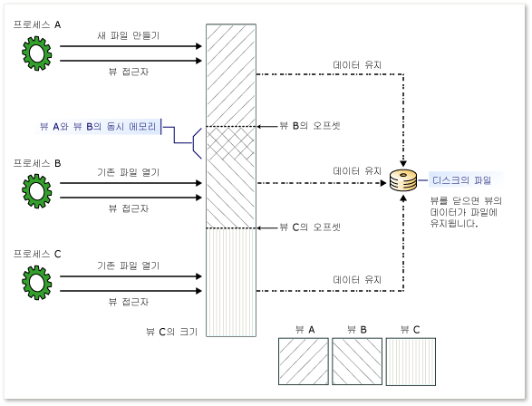

# <a name="memory-mapped-files"></a>메모리 매핑된 파일
메모리 매핑된 파일에는 가상 메모리에 있는 파일의 내용이 포함됩니다. 파일과 메모리 공간 사이의 매핑을 사용하면 여러 프로세스를 포함한 응용 프로그램이 메모리에 직접 읽고 쓰는 방식으로 파일을 수정할 수 있습니다. [!INCLUDE[net_v40_long](../../../includes/net-v40-long-md.md)]부터는 네이티브 Windows 함수가 메모리 매핑된 파일에 액세스할 때와 같은 방식으로 관리 코드를 사용하여 메모리 매핑된 파일에 액세스할 수 있습니다. 이에 대해서는 [메모리 매핑된 파일 관리](https://msdn.microsoft.com/library/ms810613.aspx)에 설명되어 있습니다.  
  
 메모리 매핑된 파일에는 다음과 같은 두 가지 형식이 있습니다.  
  
-   지속되는 메모리 매핑된 파일  
  
     지속되는 파일은 디스크에서 소스 파일과 연결된 메모리 매핑된 파일입니다. 마지막 프로세스가 파일에 대한 작업을 완료하면 데이터가 디스크의 소스 파일에 저장됩니다. 이러한 메모리 매핑된 파일은 매우 큰 소스 파일에 대한 작업에 적합합니다.  
  
-   지속되지 않는 메모리 매핑된 파일  
  
     지속되지 않는 파일은 디스크에서 파일과 연결되지 않은 메모리 매핑된 파일입니다. 마지막 프로세스가 파일에 대한 작업을 완료하면 데이터가 손실되고 파일이 가비지 수집에 의해 회수됩니다. 이러한 파일은 IPC(프로세스 간 통신)에 대한 공유 메모리를 만드는 데 적합합니다.  
  
## <a name="processes-views-and-managing-memory"></a>프로세스, 보기 및 메모리 관리  
 메모리 매핑된 파일은 여러 프로세스에서 공유할 수 있습니다. 파일을 만든 프로세스에서 할당한 일반 이름을 사용하여 동일한 메모리 매핑된 파일에 프로세스를 매핑할 수 있습니다.  
  
 메모리 매핑된 파일을 사용하려면 전체 메모리 매핑된 파일 또는 파일의 일부분에 대한 보기를 만들어야 합니다. 메모리 매핑된 파일의 동일한 부분에 대한 여러 보기를 만들어서 동시 메모리를 만들 수도 있습니다. 두 보기를 동시에 유지하려면 동일한 메모리 매핑된 파일에서 보기를 만들어야 합니다.  
  
 파일이 메모리 매핑에 사용 가능한 응용 프로그램의 논리 메모리 공간 크기(32비트 컴퓨터의 2GB)보다 크면 여러 보기가 필요할 수 있습니다.  
  
 스트림 액세스 보기 및 임의 액세스 보기라는 두 가지 유형의 보기가 있습니다. 파일에 대한 순차적 액세스에는 스트림 액세스 보기를 사용합니다. 이 보기는 지속되지 않는 파일 및 IPC에는 권장됩니다. 임의 액세스 보기는 지속되는 파일 작업에 사용하는 것이 좋습니다.  
  
 메모리 매핑된 파일은 운영 체제의 메모리 관리자를 통해 액세스되므로 파일은 여러 페이지에 자동으로 분할되고 필요에 따라 액세스됩니다. 메모리 관리를 직접 처리할 필요가 없습니다.  
  
 다음 그림은 여러 프로세스에서 동시에 동일한 메모리 매핑된 파일에 대한 여러 개의 중첩된 보기를 생성하는 방법을 보여줍니다.  
  
   
메모리 매핑된 파일에 대한 여러 개의 중첩된 보기  
  
## <a name="programming-with-memory-mapped-files"></a>메모리 매핑된 파일을 사용한 프로그래밍  
 다음 표에서는 메모리 매핑된 파일 개체 및 해당 멤버 사용에 대한 가이드를 제공합니다.  
  
|작업|사용할 메서드 또는 속성|  
|----------|----------------------------------|  
|디스크의 파일에서 지속되는 메모리 매핑된 파일을 나타내는 <xref:System.IO.MemoryMappedFiles.MemoryMappedFile> 개체를 가져옵니다.|<xref:System.IO.MemoryMappedFiles.MemoryMappedFile.CreateFromFile%2A?displayProperty=nameWithType> 메서드를 호출하여 생성됩니다.|  
|지속되지 않는 메모리 매핑된 파일(디스크의 파일과 연결되지 않음)을 나타내는 <xref:System.IO.MemoryMappedFiles.MemoryMappedFile> 개체를 가져옵니다.|<xref:System.IO.MemoryMappedFiles.MemoryMappedFile.CreateNew%2A?displayProperty=nameWithType> 메서드를 호출하여 생성됩니다.<br /><br /> 또는<br /><br /> <xref:System.IO.MemoryMappedFiles.MemoryMappedFile.CreateOrOpen%2A?displayProperty=nameWithType> 메서드를 호출하여 생성됩니다.|  
|기존 메모리 매핑된 파일(지속되는 파일 또는 지속되지 않는 파일)의 <xref:System.IO.MemoryMappedFiles.MemoryMappedFile> 개체를 가져옵니다.|<xref:System.IO.MemoryMappedFiles.MemoryMappedFile.OpenExisting%2A?displayProperty=nameWithType> 메서드를 호출하여 생성됩니다.|  
|메모리 매핑된 파일에 대한 순차적 액세스 보기의 <xref:System.IO.UnmanagedMemoryStream> 개체를 가져옵니다.|<xref:System.IO.MemoryMappedFiles.MemoryMappedFile.CreateViewStream%2A?displayProperty=nameWithType> 메서드를 호출하여 생성됩니다.|  
|메모리 매핑된 파일에 대한 임의 액세스 보기의 <xref:System.IO.UnmanagedMemoryAccessor> 개체를 가져옵니다.|<xref:System.IO.MemoryMappedFiles.MemoryMappedFile.CreateViewAccessor%2A?displayProperty=nameWithType> 메서드를 호출하여 생성됩니다.|  
|비관리 코드와 함께 사용할 <xref:Microsoft.Win32.SafeHandles.SafeMemoryMappedViewHandle> 개체를 가져옵니다.|<xref:System.IO.MemoryMappedFiles.MemoryMappedFile.SafeMemoryMappedFileHandle%2A?displayProperty=nameWithType> 속성.<br /><br /> 또는<br /><br /> <xref:System.IO.MemoryMappedFiles.MemoryMappedViewAccessor.SafeMemoryMappedViewHandle%2A?displayProperty=nameWithType> 속성.<br /><br /> 또는<br /><br /> <xref:System.IO.MemoryMappedFiles.MemoryMappedViewStream.SafeMemoryMappedViewHandle%2A?displayProperty=nameWithType> 속성.|  
|보기가 만들어질 때까지 메모리 할당을 지연시킵니다(지속되지 않는 파일만).<br /><br /> (현재 시스템 페이지 크기를 확인하려면 <xref:System.Environment.SystemPageSize%2A?displayProperty=nameWithType> 속성을 사용합니다.)|<xref:System.IO.MemoryMappedFiles.MemoryMappedFileOptions.DelayAllocatePages?displayProperty=nameWithType> 값을 가지는 <xref:System.IO.MemoryMappedFiles.MemoryMappedFile.CreateNew%2A> 메서드.<br /><br /> 또는<br /><br /> <xref:System.IO.MemoryMappedFiles.MemoryMappedFileOptions> 열거형을 매개 변수로 사용하는 <xref:System.IO.MemoryMappedFiles.MemoryMappedFile.CreateOrOpen%2A> 메서드.|  
  
### <a name="security"></a>보안  
 <xref:System.IO.MemoryMappedFiles.MemoryMappedFileAccess> 열거형을 매개 변수로 사용하는 다음 메서드를 사용하여 메모리 매핑된 파일을 만들 때 액세스 권한을 적용할 수 있습니다.  
  
-   <xref:System.IO.MemoryMappedFiles.MemoryMappedFile.CreateFromFile%2A?displayProperty=nameWithType>  
  
-   <xref:System.IO.MemoryMappedFiles.MemoryMappedFile.CreateNew%2A?displayProperty=nameWithType>  
  
-   <xref:System.IO.MemoryMappedFiles.MemoryMappedFile.CreateOrOpen%2A?displayProperty=nameWithType>  
  
 <xref:System.IO.MemoryMappedFiles.MemoryMappedFileRights>를 매개 변수로 사용하는 <xref:System.IO.MemoryMappedFiles.MemoryMappedFile.OpenExisting%2A> 메서드를 사용하여 기존 메모리 매핑된 파일을 열기 위한 액세스 권한을 지정할 수 있습니다.  
  
 또한 미리 정의된 액세스 규칙을 포함하는 <xref:System.IO.MemoryMappedFiles.MemoryMappedFileSecurity> 개체를 포함할 수 있습니다.  
  
 메모리 매핑된 파일에 새롭거나 변경된 액세스 규칙을 적용하려면 <xref:System.IO.MemoryMappedFiles.MemoryMappedFile.SetAccessControl%2A> 메서드를 사용합니다. 기존 파일에서 액세스 또는 감사 규칙을 검색하려면 <xref:System.IO.MemoryMappedFiles.MemoryMappedFile.GetAccessControl%2A> 메서드를 사용합니다.  
  
## <a name="examples"></a>예제  
  
### <a name="persisted-memory-mapped-files"></a>지속되는 메모리 매핑된 파일  
 <xref:System.IO.MemoryMappedFiles.MemoryMappedFile.CreateFromFile%2A> 메서드는 디스크의 기존 파일에서 메모리 매핑된 파일을 만듭니다.  
  
 다음 예제에서는 매우 큰 파일의 일부에 대한 메모리 매핑된 보기를 만들고 보기의 일부를 조작합니다.  
  
 [!code-csharp[MemoryMappedFiles.MemoryMappedFile.CreateFromFile#1](../../../samples/snippets/csharp/VS_Snippets_CLR/memorymappedfiles.memorymappedfile.createfromfile/cs/program.cs#1)]
 [!code-vb[MemoryMappedFiles.MemoryMappedFile.CreateFromFile#1](../../../samples/snippets/visualbasic/VS_Snippets_CLR/memorymappedfiles.memorymappedfile.createfromfile/vb/program.vb#1)]  
  
 다음 예제에서는 다른 프로세스에 대한 동일한 메모리 매핑된 파일을 엽니다.  
  
 [!code-csharp[MemoryMappedFiles.MemoryMappedFile.OpenExisting#1](../../../samples/snippets/csharp/VS_Snippets_CLR/memorymappedfiles.memorymappedfile.openexisting/cs/program.cs#1)]
 [!code-vb[MemoryMappedFiles.MemoryMappedFile.OpenExisting#1](../../../samples/snippets/visualbasic/VS_Snippets_CLR/memorymappedfiles.memorymappedfile.openexisting/vb/program.vb#1)]  
  
### <a name="non-persisted-memory-mapped-files"></a>지속되지 않는 메모리 매핑된 파일  
 <xref:System.IO.MemoryMappedFiles.MemoryMappedFile.CreateNew%2A> 및 <xref:System.IO.MemoryMappedFiles.MemoryMappedFile.CreateOrOpen%2A> 메서드는 디스크의 기존 파일에 매핑되지 않은 메모리 매핑된 파일을 만듭니다.  
  
 다음 예제는 메모리 매핑된 파일에 부울 값을 쓰는 세 개의 개별 프로세스(콘솔 응용 프로그램)로 구성됩니다. 다음 작업 시퀀스가 발생합니다.  
  
1.  `Process A`는 메모리 매핑된 파일을 만들고 이 파일에 값을 씁니다.  
  
2.  `Process B`는 메모리 매핑된 파일을 열고 이 파일에 값을 씁니다.  
  
3.  `Process C`는 메모리 매핑된 파일을 열고 이 파일에 값을 씁니다.  
  
4.  `Process A`는 메모리 매핑된 파일에서 값을 읽고 표시합니다.  
  
5.  `Process A`가 메모리 매핑된 파일로 완료된 후에는 가비지 수집에 의해 파일이 즉시 회수됩니다.  
  
 이 예제를 실행하려면 다음을 수행합니다.  
  
1.  응용 프로그램을 컴파일하고 세 개의 명령 프롬프트 창을 엽니다.  
  
2.  첫 번째 명령 프롬프트 창에서 `Process A`를 실행합니다.  
  
3.  두 번째 명령 프롬프트 창에서 `Process B`를 실행합니다.  
  
4.  `Process A`로 돌아가서 ENTER 키를 누릅니다.  
  
5.  세 번째 명령 프롬프트 창에서 `Process C`를 실행합니다.  
  
6.  `Process A`로 돌아가서 ENTER 키를 누릅니다.  
  
 `Process A`의 출력은 다음과 같습니다.  
  
```  
Start Process B and press ENTER to continue.  
Start Process C and press ENTER to continue.  
Process A says: True  
Process B says: False  
Process C says: True  
```  
  
 **프로세스 A**  
  
 [!code-csharp[System.IO.MemoryMappedFiles_IPC_X#1](../../../samples/snippets/csharp/VS_Snippets_CLR_System/system.io.memorymappedfiles_ipc_x/cs/program.cs#1)]
 [!code-vb[System.IO.MemoryMappedFiles_IPC_X#1](../../../samples/snippets/visualbasic/VS_Snippets_CLR_System/system.io.memorymappedfiles_ipc_x/vb/program.vb#1)]  
  
 **프로세스 B**  
  
 [!code-csharp[System.IO.MemoryMappedFiles_IPC_A#1](../../../samples/snippets/csharp/VS_Snippets_CLR_System/system.io.memorymappedfiles_ipc_a/cs/program.cs#1)]
 [!code-vb[System.IO.MemoryMappedFiles_IPC_A#1](../../../samples/snippets/visualbasic/VS_Snippets_CLR_System/system.io.memorymappedfiles_ipc_a/vb/program.vb#1)]  
  
 **프로세스 C**  
  
 [!code-csharp[System.IO.MemoryMappedFiles_IPC_B#1](../../../samples/snippets/csharp/VS_Snippets_CLR_System/system.io.memorymappedfiles_ipc_b/cs/program.cs#1)]
 [!code-vb[System.IO.MemoryMappedFiles_IPC_B#1](../../../samples/snippets/visualbasic/VS_Snippets_CLR_System/system.io.memorymappedfiles_ipc_b/vb/program.vb#1)]  
  
## <a name="see-also"></a>참고 항목  
 [파일 및 스트림 I/O](../../../docs/standard/io/index.md)
