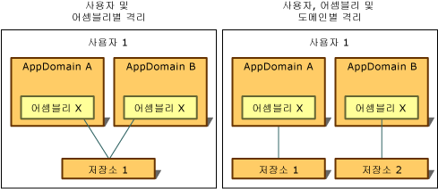

# 격리 유형Types of Isolation
격리된 저장소에 대한 액세스는 항상 저장소를 만든 사용자로 제한됩니다.Access to isolated storage is always restricted to the user who created it. 이 유형의 격리를 구현하기 위해 공용 언어 런타임은 운영 체제에서 인식하고 저장소가 열릴 때 코드가 실행 중인 프로세스에 연결된 ID인 사용자 ID의 동일한 표기법을 사용합니다.To implement this type of isolation, the common language runtime uses the same notion of user identity that the operating system recognizes, which is the identity associated with the process in which the code is running when the store is opened. 이 ID는 인증된 사용자 ID이지만 가장으로 인해 현재 사용자의 ID가 동적으로 변경될 수 있습니다.This identity is an authenticated user identity, but impersonation can cause the identity of the current user to change dynamically.  
  
 격리된 저장소에 대한 액세스는 응용 프로그램의 도메인 및 어셈블리에 연결되거나 어셈블리에만 연결된 ID에 따라 제한됩니다.Access to isolated storage is also restricted according to the identity associated with the application's domain and assembly, or with the assembly alone. 런타임은 다음과 같은 방법으로 이러한 ID를 얻습니다.The runtime obtains these identities in the following ways:  
  
-   도메인 ID는 응용 프로그램의 증거를 나타내며 웹 응용 프로그램의 경우 전체 URL일 수 있습니다.Domain identity represents the evidence of the application, which in the case of a web application might be the full URL. 셸에 호스트된 코드의 경우 도메인 ID는 응용 프로그램 디렉터리 경로를 기반으로 할 수 있습니다.For shell-hosted code, the domain identity might be based on the application directory path. 예를 들어 실행 파일이 C:\Office\MyApp.exe 경로에서 실행되는 경우 도메인 ID는 C:\Office\MyApp.exe입니다.For example, if the executable runs from the path C:\Office\MyApp.exe, the domain identity would be C:\Office\MyApp.exe.  
  
-   어셈블리 ID는 어셈블리의 증거입니다.Assembly identity is the evidence of the assembly. 이 ID는 암호화 디지털 서명에서 가져올 수 있고 어셈블리의 [강력한 이름](../../../docs/framework/app-domains/strong-named-assemblies.md), 어셈블리의 소프트웨어 게시자 또는 해당 URL ID가 사용될 수 있습니다.This might come from a cryptographic digital signature, which can be the assembly's [strong name](../../../docs/framework/app-domains/strong-named-assemblies.md), the software publisher of the assembly, or its URL identity. 어셈블리에 강력한 이름과 소프트웨어 게시자 ID가 모두 있는 경우 소프트웨어 게시자 ID가 사용됩니다.If an assembly has both a strong name and a software publisher identity, then the software publisher identity is used. 어셈블리를 인터넷에서 가져오고 서명이 없는 경우 URL ID가 사용됩니다.If the assembly comes from the Internet and is unsigned, the URL identity is used. 어셈블리 및 강력한 이름에 대한 자세한 내용은 [어셈블리를 사용한 프로그래밍](../../../docs/framework/app-domains/programming-with-assemblies.md)을 참조하세요.For more information about assemblies and strong names, see [Programming with Assemblies](../../../docs/framework/app-domains/programming-with-assemblies.md).  
  
-   로밍 저장소는 로밍 사용자 프로필이 있는 사용자와 함께 이동됩니다.Roaming stores move with a user that has a roaming user profile. 파일은 네트워크 디렉터리에 기록되고 사용자가 로그인한 컴퓨터로 다운로드됩니다.Files are written to a network directory and are downloaded to any computer the user logs into. 로밍 사용자 프로필에 대한 자세한 내용은 <xref:System.IO.IsolatedStorage.IsolatedStorageScope.Roaming?displayProperty=nameWithType>을 참조하세요.For more information about roaming user profiles, see <xref:System.IO.IsolatedStorage.IsolatedStorageScope.Roaming?displayProperty=nameWithType>.  
  
 사용자, 도메인 및 어셈블리 ID의 개념을 결합하면 격리된 저장소가 다음 방법으로 데이터를 격리할 수 있으며 각 방법에는 고유한 사용 시나리오가 있습니다.By combining the concepts of user, domain, and assembly identity, isolated storage can isolate data in the following ways, each of which has its own usage scenarios:  
  
-   [사용자 및 어셈블리별 격리Isolation by user and assembly](#UserAssembly)  
  
-   [사용자, 도메인 및 어셈블리별 격리Isolation by user, domain, and assembly](#UserDomainAssembly)  
  
 이러한 경리 중 하나가 로밍 사용자 프로필과 결합될 수 있습니다.Either of these isolations can be combined with a roaming user profile. 자세한 내용은 [격리된 저장소 및 로밍](#Roaming) 섹션을 참조하세요.For more information, see the section [Isolated Storage and Roaming](#Roaming).  
  
 다음 그림은 저장소를 여러 범위로 격리하는 방법을 보여줍니다.The following illustration demonstrates how stores are isolated in different scopes.  
  
   
격리된 저장소 유형Types of isolated storage  
  
 로밍 저장소를 제외하고 격리된 저장소는 지정된 컴퓨터에 로컬인 저장소 시설을 사용하므로 항상 컴퓨터에서 암시적으로 격리됩니다.Note that except for roaming stores, isolated storage is always implicitly isolated by computer because it uses the storage facilities that are local to a given computer.  
  
> [!IMPORTANT]
>  [!INCLUDE[win8_appname_long](../../../includes/win8-appname-long-md.md)] 응용 프로그램에는 격리된 저장소를 사용할 수 없습니다.Isolated storage is not available for [!INCLUDE[win8_appname_long](../../../includes/win8-appname-long-md.md)] apps. 대신에 `Windows.Storage` API에 포함된 [!INCLUDE[wrt](../../../includes/wrt-md.md)] 네임스페이스의 응용 프로그램 데이터 클래스를 사용하여 로컬 데이터 및 파일을 저장합니다.Instead, use the application data classes in the `Windows.Storage` namespaces included in the [!INCLUDE[wrt](../../../includes/wrt-md.md)] API to store local data and files. 자세한 내용은 Windows 개발자 센터에서 [응용 프로그램 데이터](/previous-versions/windows/apps/hh464917(v=win.10))를 참조하세요.For more information, see [Application data](/previous-versions/windows/apps/hh464917(v=win.10)) in the Windows Dev Center.  
  
   
## 사용자 및 어셈블리별 격리Isolation by User and Assembly  
 데이터 저장소를 사용하는 어셈블리를 응용 프로그램 도메인에서 액세스할 수 있어야 하는 경우 사용자 및 어셈블리별로 격리하는 것이 적절합니다.When the assembly that uses the data store needs to be accessible from any application's domain, isolation by user and assembly is appropriate. 일반적으로 이 상황에서 격리된 저장소는 여러 응용 프로그램에 적용되는 데이터를 저장하는 데 사용되며 사용자 이름 또는 라이선스 정보와 같은 특정 응용 프로그램에 연결되지 않습니다.Typically, in this situation, isolated storage is used to store data that applies across multiple applications and is not tied to any particular application, such as the user's name or license information. 사용자 및 어셈블리별로 격리된 저장소에 액세스하려면 응용 프로그램 간에 정보를 전송하기 위해 코드를 신뢰할 수 있어야 합니다.To access storage isolated by user and assembly, code must be trusted to transfer information between applications. 일반적으로 사용자 및 어셈블리별 격리는 인트라넷에서 허용되지만 인터넷에는 허용되지 않습니다.Typically, isolation by user and assembly is allowed on intranets but not on the Internet. 정적 <xref:System.IO.IsolatedStorage.IsolatedStorageFile.GetStore%2A?displayProperty=nameWithType> 메서드를 호출하고 사용자 및 어셈블리로 전달하면 <xref:System.IO.IsolatedStorage.IsolatedStorageScope>는 이 유형의 격리를 통해 저장소를 반환합니다.Calling the static <xref:System.IO.IsolatedStorage.IsolatedStorageFile.GetStore%2A?displayProperty=nameWithType> method and passing in a user and an assembly <xref:System.IO.IsolatedStorage.IsolatedStorageScope> returns storage with this kind of isolation.  
  
 다음 코드 예제에서는 사용자 및 어셈블리별로 격리되는 저장소를 검색합니다.The following code example retrieves a store that is isolated by user and assembly. `isoFile` 개체를 통해 저장소에 액세스할 수 있습니다.The store can be accessed through the `isoFile` object.  
  
 [!code-cpp[Conceptual.IsolatedStorage#17](../../../samples/snippets/cpp/VS_Snippets_CLR/conceptual.isolatedstorage/cpp/source11.cpp#17)]
 [!code-csharp[Conceptual.IsolatedStorage#17](../../../samples/snippets/csharp/VS_Snippets_CLR/conceptual.isolatedstorage/cs/source11.cs#17)]
 [!code-vb[Conceptual.IsolatedStorage#17](../../../samples/snippets/visualbasic/VS_Snippets_CLR/conceptual.isolatedstorage/vb/source11.vb#17)]  
  
 증거 매개 변수를 사용하는 예제는 <xref:System.IO.IsolatedStorage.IsolatedStorageFile.GetStore%28System.IO.IsolatedStorage.IsolatedStorageScope%2CSystem.Security.Policy.Evidence%2CSystem.Type%2CSystem.Security.Policy.Evidence%2CSystem.Type%29>을 참조하세요.For an example that uses the evidence parameters, see <xref:System.IO.IsolatedStorage.IsolatedStorageFile.GetStore%28System.IO.IsolatedStorage.IsolatedStorageScope%2CSystem.Security.Policy.Evidence%2CSystem.Type%2CSystem.Security.Policy.Evidence%2CSystem.Type%29>.  
  
 <xref:System.IO.IsolatedStorage.IsolatedStorageFile.GetUserStoreForAssembly%2A> 메서드는 다음 코드 예제와 같이 바로 가기로 사용할 수 있습니다.The <xref:System.IO.IsolatedStorage.IsolatedStorageFile.GetUserStoreForAssembly%2A> method is available as a shortcut, as shown in the following code example. 이 바로 가기는 로밍할 수 있는 저장소를 여는 데 사용할 수 없습니다. 이 경우에는 <xref:System.IO.IsolatedStorage.IsolatedStorageFile.GetStore%2A>를 사용합니다.This shortcut cannot be used to open stores that are capable of roaming; use <xref:System.IO.IsolatedStorage.IsolatedStorageFile.GetStore%2A> in such cases.  
  
 [!code-cpp[Conceptual.IsolatedStorage#18](../../../samples/snippets/cpp/VS_Snippets_CLR/conceptual.isolatedstorage/cpp/source11.cpp#18)]
 [!code-csharp[Conceptual.IsolatedStorage#18](../../../samples/snippets/csharp/VS_Snippets_CLR/conceptual.isolatedstorage/cs/source11.cs#18)]
 [!code-vb[Conceptual.IsolatedStorage#18](../../../samples/snippets/visualbasic/VS_Snippets_CLR/conceptual.isolatedstorage/vb/source11.vb#18)]  
  
   
## 사용자, 도메인 및 어셈블리별 격리Isolation by User, Domain, and Assembly  
 응용 프로그램에서 개인 데이터 저장소가 필요한 타사 어셈블리를 사용하는 경우 격리된 저장소를 사용하여 개인 데이터를 저장할 수 있습니다.If your application uses a third-party assembly that requires a private data store, you can use isolated storage to store the private data. 사용자, 도메인 및 어셈블리별 격리를 사용하면 어셈블리가 저장소를 만들 때 실행 중이던 응용 프로그램에서 어셈블리가 사용될 경우 및 저장소를 만든 사용자가 응용 프로그램을 실행하는 경우에만 지정된 어셈블리의 코드만 해당 데이터에 액세스할 수 있습니다.Isolation by user, domain, and assembly ensures that only code in a given assembly can access the data, and only when the assembly is used by the application that was running when the assembly created the store, and only when the user for whom the store was created runs the application. 사용자, 도메인 및 어셈블리별 격리를 사용하면 타사 어셈블리에 의해 데이터가 다른 응용 프로그램으로 누출되지 않습니다.Isolation by user, domain, and assembly keeps the third-party assembly from leaking data to other applications. 격리된 저장소를 사용하려고 하지만 어떤 격리 유형을 사용할지 확신할 수 없는 경우에는 기본적으로 이 격리 유형을 선택해야 합니다.This isolation type should be your default choice if you know that you want to use isolated storage but are not sure which type of isolation to use. <xref:System.IO.IsolatedStorage.IsolatedStorageFile>의 정적 <xref:System.IO.IsolatedStorage.IsolatedStorageFile.GetStore%2A> 메서드를 호출하고 사용자, 도메인 및 어셈블리로 전달하면 <xref:System.IO.IsolatedStorage.IsolatedStorageScope>는 이 유형의 격리를 통해 저장소를 반환합니다.Calling the static <xref:System.IO.IsolatedStorage.IsolatedStorageFile.GetStore%2A> method of <xref:System.IO.IsolatedStorage.IsolatedStorageFile> and passing in a user, domain, and assembly <xref:System.IO.IsolatedStorage.IsolatedStorageScope> returns storage with this kind of isolation.  
  
 다음 코드 예제에서는 사용자, 도메인 및 어셈블리별로 격리되는 저장소를 검색합니다.The following code example retrieves a store isolated by user, domain, and assembly. `isoFile` 개체를 통해 저장소에 액세스할 수 있습니다.The store can be accessed through the `isoFile` object.  
  
 [!code-cpp[Conceptual.IsolatedStorage#14](../../../samples/snippets/cpp/VS_Snippets_CLR/conceptual.isolatedstorage/cpp/source10.cpp#14)]
 [!code-csharp[Conceptual.IsolatedStorage#14](../../../samples/snippets/csharp/VS_Snippets_CLR/conceptual.isolatedstorage/cs/source10.cs#14)]
 [!code-vb[Conceptual.IsolatedStorage#14](../../../samples/snippets/visualbasic/VS_Snippets_CLR/conceptual.isolatedstorage/vb/source10.vb#14)]  
  
 또 다른 메서드는 다음 코드 예제와 같이 바로 가기로 사용할 수 있습니다.Another method is available as a shortcut, as shown in the following code example. 이 바로 가기는 로밍할 수 있는 저장소를 여는 데 사용할 수 없습니다. 이 경우에는 <xref:System.IO.IsolatedStorage.IsolatedStorageFile.GetStore%2A>를 사용합니다.This shortcut cannot be used to open stores that are capable of roaming; use <xref:System.IO.IsolatedStorage.IsolatedStorageFile.GetStore%2A> in such cases.  
  
 [!code-cpp[Conceptual.IsolatedStorage#15](../../../samples/snippets/cpp/VS_Snippets_CLR/conceptual.isolatedstorage/cpp/source10.cpp#15)]
 [!code-csharp[Conceptual.IsolatedStorage#15](../../../samples/snippets/csharp/VS_Snippets_CLR/conceptual.isolatedstorage/cs/source10.cs#15)]
 [!code-vb[Conceptual.IsolatedStorage#15](../../../samples/snippets/visualbasic/VS_Snippets_CLR/conceptual.isolatedstorage/vb/source10.vb#15)]  
  
   
## 격리된 저장소 및 로밍Isolated Storage and Roaming  
 로밍 사용자 프로필은 사용자가 네트워크에서 ID를 설정하고 해당 ID를 사용하여 모든 개인 설정을 적용하여 네트워크 컴퓨터에 로그인하도록 하는 Windows 기능입니다.Roaming user profiles are a Windows feature that enables a user to set up an identity on a network and use that identity to log into any network computer, carrying over all personalized settings. 격리된 저장소를 사용하는 어셈블리는 사용자의 격리된 저장소가 로밍 사용자 프로필과 함께 이동되도록 지정할 수 있습니다.An assembly that uses isolated storage can specify that the user's isolated storage should move with the roaming user profile. 로밍은 사용자 및 어셈블리별 격리 및 사용자, 도메인 및 어셈블리별 격리와 함께 사용할 수 있습니다.Roaming can be used in conjunction with isolation by user and assembly or with isolation by user, domain, and assembly. 로밍 범위를 사용하지 않으면 로밍 사용자 프로필이 사용되는 경우에도 저장소가 로밍되지 않습니다.If a roaming scope is not used, stores will not roam even if a roaming user profile is used.  
  
 다음 코드 예제에서는 사용자 및 어셈블리별로 격리된 로밍 저장소를 검색합니다.The following code example retrieves a roaming store isolated by user and assembly. `isoFile` 개체를 통해 저장소에 액세스할 수 있습니다.The store can be accessed through the `isoFile` object.  
  
 [!code-cpp[Conceptual.IsolatedStorage#11](../../../samples/snippets/cpp/VS_Snippets_CLR/conceptual.isolatedstorage/cpp/source9.cpp#11)]
 [!code-csharp[Conceptual.IsolatedStorage#11](../../../samples/snippets/csharp/VS_Snippets_CLR/conceptual.isolatedstorage/cs/source9.cs#11)]
 [!code-vb[Conceptual.IsolatedStorage#11](../../../samples/snippets/visualbasic/VS_Snippets_CLR/conceptual.isolatedstorage/vb/source9.vb#11)]  
  
 사용자, 도메인 및 응용 프로그램별로 격리된 로밍 저장소를 만들 위해 도메인 범위를 추가할 수 있습니다.A domain scope can be added to create a roaming store isolated by user, domain, and application. 다음 코드 예제에서는 이 작업을 보여줍니다.The following code example demonstrates this.  
  
 [!code-cpp[Conceptual.IsolatedStorage#12](../../../samples/snippets/cpp/VS_Snippets_CLR/conceptual.isolatedstorage/cpp/source9.cpp#12)]
 [!code-csharp[Conceptual.IsolatedStorage#12](../../../samples/snippets/csharp/VS_Snippets_CLR/conceptual.isolatedstorage/cs/source9.cs#12)]
 [!code-vb[Conceptual.IsolatedStorage#12](../../../samples/snippets/visualbasic/VS_Snippets_CLR/conceptual.isolatedstorage/vb/source9.vb#12)]  
  
## 참고 항목See Also  
 <xref:System.IO.IsolatedStorage.IsolatedStorageScope>  
 [격리된 저장소Isolated Storage](../../../docs/standard/io/isolated-storage.md)
