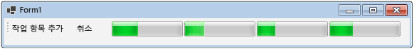

# 방법: 데이터 흐름 블록 취소How to: Cancel a Dataflow Block
이 문서에서는 응용 프로그램에서 취소를 사용하도록 설정하는 방법을 보여 줍니다.This document demonstrates how to enable cancellation in your application. 이 예제에서는 Windows Forms를 사용하여 데이터 흐름 파이프라인에서 작업 항목이 활성 상태인 위치뿐만 아니라 취소의 효과도 보여 줍니다.This example uses Windows Forms to show where work items are active in a dataflow pipeline and also the effects of cancellation.  

[!INCLUDE [tpl-install-instructions](../../../includes/tpl-install-instructions.md)]
  
## Windows Forms 응용 프로그램을 만들려면To Create the Windows Forms Application  
  
1.  C# 또는 Visual Basic **Windows Forms 응용 프로그램** 프로젝트를 만듭니다.Create a C# or Visual Basic **Windows Forms Application** project. 다음 단계에서 프로젝트의 이름은 `CancellationWinForms`입니다.In the following steps, the project is named `CancellationWinForms`.  
  
2.  기본 폼인 Form1.cs(Visual Basic에서는 Form1.vb)의 폼 디자이너에서 <xref:System.Windows.Forms.ToolStrip> 컨트롤을 추가합니다.On the form designer for the main form, Form1.cs (Form1.vb for Visual Basic), add a <xref:System.Windows.Forms.ToolStrip> control.  
  
3.  <xref:System.Windows.Forms.ToolStripButton> 컨트롤을 <xref:System.Windows.Forms.ToolStrip> 컨트롤에 추가합니다.Add a <xref:System.Windows.Forms.ToolStripButton> control to the <xref:System.Windows.Forms.ToolStrip> control. <xref:System.Windows.Forms.ToolStripItem.DisplayStyle%2A> 속성을 <xref:System.Windows.Forms.ToolStripItemDisplayStyle.Text> 및 <xref:System.Windows.Forms.ToolStripItem.Text%2A> 속성으로 설정하여 **작업 항목을 추가**합니다.Set the <xref:System.Windows.Forms.ToolStripItem.DisplayStyle%2A> property to <xref:System.Windows.Forms.ToolStripItemDisplayStyle.Text> and the <xref:System.Windows.Forms.ToolStripItem.Text%2A> property to **Add Work Items**.  
  
4.  두 번째 <xref:System.Windows.Forms.ToolStripButton> 컨트롤을 <xref:System.Windows.Forms.ToolStrip> 컨트롤에 추가합니다.Add a second <xref:System.Windows.Forms.ToolStripButton> control to the <xref:System.Windows.Forms.ToolStrip> control. <xref:System.Windows.Forms.ToolStripItem.DisplayStyle%2A> 속성을 <xref:System.Windows.Forms.ToolStripItemDisplayStyle.Text>로 설정하고, <xref:System.Windows.Forms.ToolStripItem.Text%2A> 속성을 **취소**로 설정하고, <xref:System.Windows.Forms.ToolStripItem.Enabled%2A> 속성을 `False`로 설정합니다.Set the <xref:System.Windows.Forms.ToolStripItem.DisplayStyle%2A> property to <xref:System.Windows.Forms.ToolStripItemDisplayStyle.Text>, the <xref:System.Windows.Forms.ToolStripItem.Text%2A> property to **Cancel**, and the <xref:System.Windows.Forms.ToolStripItem.Enabled%2A> property to `False`.  
  
5.  4개의 <xref:System.Windows.Forms.ToolStripProgressBar> 개체를 <xref:System.Windows.Forms.ToolStrip> 컨트롤에 추가합니다.Add four <xref:System.Windows.Forms.ToolStripProgressBar> objects to the <xref:System.Windows.Forms.ToolStrip> control.  
  
## 데이터 흐름 파이프라인 만들기Creating the Dataflow Pipeline  
 이 섹션에서는 작업 항목을 처리하고 진행률 표시줄을 업데이트하는 데이터 흐름 파이프라인을 만드는 방법을 설명합니다.This section describes how to create the dataflow pipeline that processes work items and updates the progress bars.  
  
### 데이터 흐름 파이프라인을 만들려면To Create the Dataflow Pipeline  
  
1.  프로젝트에서 System.Threading.Tasks.Dataflow.dll에 대한 참조를 추가합니다.In your project, add a reference to System.Threading.Tasks.Dataflow.dll.  
  
2.  Form1.cs(Visual Basic에서는 Form1.vb)에 다음 `using` 명령문(Visual Basic에서는 `Imports`)이 포함되어 있는지 확인합니다.Ensure that Form1.cs (Form1.vb for Visual Basic) contains the following `using` statements (`Imports` in Visual Basic).  
  
     [!code-csharp[TPLDataflow_CancellationWinForms#1](../../../samples/snippets/csharp/VS_Snippets_Misc/tpldataflow_cancellationwinforms/cs/cancellationwinforms/form1.cs#1)]
     [!code-vb[TPLDataflow_CancellationWinForms#1](../../../samples/snippets/visualbasic/VS_Snippets_Misc/tpldataflow_cancellationwinforms/vb/cancellationwinforms/form1.vb#1)]  
  
3.  `WorkItem` 클래스를 `Form1` 클래스의 내부 형식으로 추가합니다.Add the `WorkItem` class as an inner type of the `Form1` class.  
  
     [!code-csharp[TPLDataflow_CancellationWinForms#2](../../../samples/snippets/csharp/VS_Snippets_Misc/tpldataflow_cancellationwinforms/cs/cancellationwinforms/form1.cs#2)]
     [!code-vb[TPLDataflow_CancellationWinForms#2](../../../samples/snippets/visualbasic/VS_Snippets_Misc/tpldataflow_cancellationwinforms/vb/cancellationwinforms/form1.vb#2)]  
  
4.  `Form1` 클래스에 다음 데이터 멤버를 추가합니다.Add the following data members to the `Form1` class.  
  
     [!code-csharp[TPLDataflow_CancellationWinForms#3](../../../samples/snippets/csharp/VS_Snippets_Misc/tpldataflow_cancellationwinforms/cs/cancellationwinforms/form1.cs#3)]
     [!code-vb[TPLDataflow_CancellationWinForms#3](../../../samples/snippets/visualbasic/VS_Snippets_Misc/tpldataflow_cancellationwinforms/vb/cancellationwinforms/form1.vb#3)]  
  
5.  다음 `CreatePipeline` 메서드를 `Form1` 클래스에 추가합니다.Add the following method, `CreatePipeline`, to the `Form1` class.  
  
     [!code-csharp[TPLDataflow_CancellationWinForms#4](../../../samples/snippets/csharp/VS_Snippets_Misc/tpldataflow_cancellationwinforms/cs/cancellationwinforms/form1.cs#4)]
     [!code-vb[TPLDataflow_CancellationWinForms#4](../../../samples/snippets/visualbasic/VS_Snippets_Misc/tpldataflow_cancellationwinforms/vb/cancellationwinforms/form1.vb#4)]  
  
 `incrementProgress` 및 `decrementProgress` 데이터 흐름 블록이 사용자 인터페이스에서 작동하기 때문에 이러한 작업은 사용자 인터페이스 스레드에서 발생해야 합니다.Because the `incrementProgress` and `decrementProgress` dataflow blocks act on the user interface, it is important that these actions occur on the user-interface thread. 이를 위해 생성 중에 이러한 개체는 각각 <xref:System.Threading.Tasks.Dataflow.DataflowBlockOptions.TaskScheduler%2A> 속성이 <xref:System.Threading.Tasks.TaskScheduler.FromCurrentSynchronizationContext%2A?displayProperty=nameWithType>로 설정된 <xref:System.Threading.Tasks.Dataflow.ExecutionDataflowBlockOptions> 개체를 제공합니다.To accomplish this, during construction these objects each provide a <xref:System.Threading.Tasks.Dataflow.ExecutionDataflowBlockOptions> object that has the <xref:System.Threading.Tasks.Dataflow.DataflowBlockOptions.TaskScheduler%2A> property set to <xref:System.Threading.Tasks.TaskScheduler.FromCurrentSynchronizationContext%2A?displayProperty=nameWithType>. <xref:System.Threading.Tasks.TaskScheduler.FromCurrentSynchronizationContext%2A?displayProperty=nameWithType> 메서드는 현재 동기화 컨텍스트에서 작업을 수행하는 <xref:System.Threading.Tasks.TaskScheduler> 개체를 만듭니다.The <xref:System.Threading.Tasks.TaskScheduler.FromCurrentSynchronizationContext%2A?displayProperty=nameWithType> method creates a <xref:System.Threading.Tasks.TaskScheduler> object that performs work on the current synchronization context. `Form1` 생성자가 사용자 인터페이스 스레드에서 호출되기 때문에 `incrementProgress` 및 `decrementProgress` 데이터 흐름 블록에 대한 작업도 사용자 인터페이스 스레드에서 실행됩니다.Because the `Form1` constructor is called from the user-interface thread, the actions for the `incrementProgress` and `decrementProgress` dataflow blocks also run on the user-interface thread.  
  
 이 예제에서는 파이프라인의 멤버를 생성할 때 <xref:System.Threading.Tasks.Dataflow.DataflowBlockOptions.CancellationToken%2A> 속성을 설정합니다.This example sets the <xref:System.Threading.Tasks.Dataflow.DataflowBlockOptions.CancellationToken%2A> property when it constructs the members of the pipeline. <xref:System.Threading.Tasks.Dataflow.DataflowBlockOptions.CancellationToken%2A> 속성은 데이터 흐름 블록 실행을 영구적으로 취소하므로 사용자가 작업을 취소한 다음, 파이프라인에 더 많은 작업 항목을 추가하기를 원하면 전체 파이프라인을 다시 만들어야 합니다.Because the <xref:System.Threading.Tasks.Dataflow.DataflowBlockOptions.CancellationToken%2A> property permanently cancels dataflow block execution, the whole pipeline must be recreated after the user cancels the operation and then wants to add more work items to the pipeline. 작업이 취소된 후 다른 작업을 수행할 수 있도록 데이터 흐름 블록을 취소하는 대체 방법을 보여 주는 예제는 [연습: Windows Forms 응용 프로그램에서 데이터 흐름 사용](../../../docs/standard/parallel-programming/walkthrough-using-dataflow-in-a-windows-forms-application.md)을 참조하세요.For an example that demonstrates an alternative way to cancel a dataflow block so that other work can be performed after an operation is canceled, see [Walkthrough: Using Dataflow in a Windows Forms Application](../../../docs/standard/parallel-programming/walkthrough-using-dataflow-in-a-windows-forms-application.md).  
  
## 사용자 인터페이스에 데이터 흐름 파이프라인 연결Connecting the Dataflow Pipeline to the User Interface  
 이 섹션에서는 사용자 인터페이스에 데이터 흐름 파이프라인을 연결하는 방법에 대해 설명합니다.This section describes how to connect the dataflow pipeline to the user interface. 파이프라인을 만들고 파이프라인에 작업 항목을 추가하는 작업은 모두 **작업 항목 추가** 단추의 이벤트 처리기에서 제어됩니다.Both creating the pipeline and adding work items to the pipeline are controlled by the event handler for the **Add Work Items** button. 취소는 **취소** 단추를 클릭하면 시작됩니다.Cancellation is initiated by the **Cancel** button. 사용자가 이러한 단추 중 하나를 클릭하면 적절한 작업이 비동기식으로 시작됩니다.When the user clicks either of these buttons, the appropriate action is initiated in an asynchronous manner.  
  
### 사용자 인터페이스에 데이터 흐름 파이프라인을 연결하려면To Connect the Dataflow Pipeline to the User Interface  
  
1.  기본 폼의 폼 디자이너에서 **작업 항목 추가** 단추에 대한 <xref:System.Windows.Forms.ToolStripItem.Click> 이벤트의 이벤트 처리기를 만듭니다.On the form designer for the main form, create an event handler for the <xref:System.Windows.Forms.ToolStripItem.Click> event for the **Add Work Items** button.  
  
2.  **작업 항목 추가** 단추에 대한 <xref:System.Windows.Forms.ToolStripItem.Click> 이벤트를 구현합니다.Implement the <xref:System.Windows.Forms.ToolStripItem.Click> event for the **Add Work Items** button.  
  
     [!code-csharp[TPLDataflow_CancellationWinForms#5](../../../samples/snippets/csharp/VS_Snippets_Misc/tpldataflow_cancellationwinforms/cs/cancellationwinforms/form1.cs#5)]
     [!code-vb[TPLDataflow_CancellationWinForms#5](../../../samples/snippets/visualbasic/VS_Snippets_Misc/tpldataflow_cancellationwinforms/vb/cancellationwinforms/form1.vb#5)]  
  
3.  기본 폼의 폼 디자이너에서 **취소** 단추에 대한 <xref:System.Windows.Forms.ToolStripItem.Click> 이벤트 처리기의 이벤트 처리기를 만듭니다.On the form designer for the main form, create an event handler for the <xref:System.Windows.Forms.ToolStripItem.Click> event handler for the **Cancel** button.  
  
4.  **취소** 단추에 대한 <xref:System.Windows.Forms.ToolStripItem.Click> 이벤트 처리기를 구현합니다.Implement the <xref:System.Windows.Forms.ToolStripItem.Click> event handler for the **Cancel** button.  
  
     [!code-csharp[TPLDataflow_CancellationWinForms#6](../../../samples/snippets/csharp/VS_Snippets_Misc/tpldataflow_cancellationwinforms/cs/cancellationwinforms/form1.cs#6)]
     [!code-vb[TPLDataflow_CancellationWinForms#6](../../../samples/snippets/visualbasic/VS_Snippets_Misc/tpldataflow_cancellationwinforms/vb/cancellationwinforms/form1.vb#6)]  
  
## 예Example  
 다음 예제에서는 Form1.cs(Visual Basic에서는 Form1.vb)의 전체 코드를 보여 줍니다.The following example shows the complete code for Form1.cs (Form1.vb for Visual Basic).  
  
 [!code-csharp[TPLDataflow_CancellationWinForms#100](../../../samples/snippets/csharp/VS_Snippets_Misc/tpldataflow_cancellationwinforms/cs/cancellationwinforms/form1.cs#100)]
 [!code-vb[TPLDataflow_CancellationWinForms#100](../../../samples/snippets/visualbasic/VS_Snippets_Misc/tpldataflow_cancellationwinforms/vb/cancellationwinforms/form1.vb#100)]  
  
 다음 그림에서는 실행 중인 응용 프로그램을 보여 줍니다.The following illustration shows the running application.  
  
   

## 참고 항목See Also  
 [데이터 흐름Dataflow](../../../docs/standard/parallel-programming/dataflow-task-parallel-library.md)
