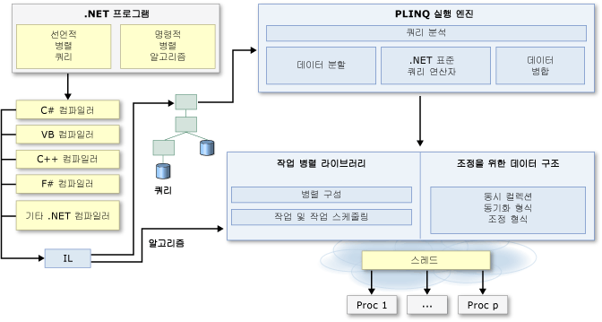

# .NET으로 병렬 프로그래밍Parallel Programming in .NET
여러 개인용 컴퓨터 및 워크스테이션에는 코어, 즉 CPU가 2개 또는 4개 있기 때문에 다중 스레드가 동시에 실행될 수 있습니다.Many personal computers and workstations have two or four cores (that is, CPUs) that enable multiple threads to be executed simultaneously. 가까운 미래에 컴퓨터의 코어 수는 대폭 증가할 것으로 예상됩니다.Computers in the near future are expected to have significantly more cores. 현재 및 미래의 하드웨어를 활용하기 위해 코드를 병렬화하여 작업을 여러 프로세스에 분산할 수 있습니다.To take advantage of the hardware of today and tomorrow, you can parallelize your code to distribute work across multiple processors. 이전의 병렬화에서는 스레드 및 잠금에 대한 저수준 조작이 필요했습니다.In the past, parallelization required low-level manipulation of threads and locks. [!INCLUDE[vs_dev10_long](../../../includes/vs-dev10-long-md.md)] 및 [!INCLUDE[net_v40_short](../../../includes/net-v40-short-md.md)]에서는 새로운 런타임, 새로운 클래스 라이브러리 형식 및 새로운 진단 도구를 제공하여 병렬 프로그래밍에 대한 지원이 향상되었습니다. and the [!INCLUDE[net_v40_short](../../../includes/net-v40-short-md.md)] enhance support for parallel programming by providing a new runtime, new class library types, and new diagnostic tools. 이러한 기능은 병렬 개발을 단순화하기 때문에 개발자는 스레드 또는 스레드 풀을 직접 건드릴 필요 없이 효율적이고 세부적이고 확장명 가능한 병렬 코드를 자연스러운 언어로 작성할 수 있습니다.These features simplify parallel development so that you can write efficient, fine-grained, and scalable parallel code in a natural idiom without having to work directly with threads or the thread pool. 다음 그림에서는 [!INCLUDE[net_v40_short](../../../includes/net-v40-short-md.md)]의 병렬 프로그래밍 아키텍처에 대한 간략한 개요를 제공합니다.The following illustration provides a high-level overview of the parallel programming architecture in the [!INCLUDE[net_v40_short](../../../includes/net-v40-short-md.md)].  
  
   
  
## 관련 항목Related Topics  
  
|기술Technology|설명Description|  
|----------------|-----------------|  
|[TPL(작업 병렬 라이브러리)Task Parallel Library (TPL)](../../../docs/standard/parallel-programming/task-parallel-library-tpl.md)|<xref:System.Threading.Tasks.Parallel?displayProperty=nameWithType> 및 `For` 루프의 병렬 버전을 포함하는 `ForEach` 클래스 및 비동기 작업에 대한 선호되는 표현 방식을 나타내는 <xref:System.Threading.Tasks.Task?displayProperty=nameWithType> 클래스의 설명서를 제공합니다.Provides documentation for the <xref:System.Threading.Tasks.Parallel?displayProperty=nameWithType> class, which includes parallel versions of `For` and `ForEach` loops, and also for the <xref:System.Threading.Tasks.Task?displayProperty=nameWithType> class, which represents the preferred way to express asynchronous operations.|  
|[PLINQ(병렬 LINQ)Parallel LINQ (PLINQ)](../../../docs/standard/parallel-programming/parallel-linq-plinq.md)|여러 시나리오에서 성능을 대폭 향상시키는 LINQ to Objects의 병렬 구현입니다.A parallel implementation of LINQ to Objects that significantly improves performance in many scenarios.|  
|[병렬 프로그래밍을 위한 데이터 구조Data Structures for Parallel Programming](../../../docs/standard/parallel-programming/data-structures-for-parallel-programming.md)|스레드로부터 안전한 컬렉션 클래스, 간단한 동기화 형식 및 초기화 지연 관련 형식에 대한 설명서의 링크를 제공합니다.Provides links to documentation for thread-safe collection classes, lightweight synchronization types, and types for lazy initialization.|  
|[병렬 진단 도구Parallel Diagnostic Tools](../../../docs/standard/parallel-programming/parallel-diagnostic-tools.md)|Visual Studio 디버거의 작업 및 병렬 스택 창에 대한 설명서와 병렬 코드의 디버깅 및 성능 튜닝에 사용 가능한 [!INCLUDE[vsprvsts](../../../includes/vsprvsts-md.md)] 프로파일러의 뷰 집합으로 구성되는 [Concurrency Visualizer](/visualstudio/profiling/concurrency-visualizer)에 대한 설명서의 링크를 제공합니다.Provides links to documentation for Visual Studio debugger windows for tasks and parallel stacks, and the [Concurrency Visualizer](/visualstudio/profiling/concurrency-visualizer), which consists of a set of views in the [!INCLUDE[vsprvsts](../../../includes/vsprvsts-md.md)] Profiler that you can use to debug and to tune the performance of parallel code.|  
|[PLINQ 및 TPL에 대한 사용자 지정 파티셔너Custom Partitioners for PLINQ and TPL](../../../docs/standard/parallel-programming/custom-partitioners-for-plinq-and-tpl.md)|파티션 작동 방식 및 기본 파티션을 구성하거나 새 파티션을 만드는 방법에 대해 설명합니다.Describes how partitioners work and how to configure the default partitioners or create a new partitioner.|  
|[작업 스케줄러Task Schedulers](http://msdn.microsoft.com/library/638f8ea5-21db-47a2-a934-86e1e961bf65)|스케줄러 작동 방식 및 기본 스케줄러의 구성 방법에 대해 설명합니다.Describes how schedulers work and how the default schedulers may be configured.|  
|[PLINQ 및 TPL의 람다 식Lambda Expressions in PLINQ and TPL](../../../docs/standard/parallel-programming/lambda-expressions-in-plinq-and-tpl.md)|C# 및 Visual Basic으로 작성된 람다 식의 간략한 개요를 제공하고, 람다 식이 PLINQ 및 작업 병렬 라이브러리에서 사용되는 방식을 보여 줍니다.Provides a brief overview of lambda expressions in C# and Visual Basic, and shows how they are used in PLINQ and the Task Parallel Library.|  
|[추가 정보For Further Reading](../../../docs/standard/parallel-programming/for-further-reading-parallel-programming.md)|.NET Framework의 병렬 프로그래밍과 관련된 추가적 설명서 및 샘플 리소스에 대한 링크를 제공합니다.Provides links to additional documentation and sample resources for parallel programming in the .NET Framework.|  
  
## 참고 항목See Also  
 [병렬 프로그래밍 패턴: .NET Framework 4의 병렬 패턴 이해 및 적용Patterns for Parallel Programming: Understanding and Applying Parallel Patterns with the .NET Framework 4](http://go.microsoft.com/fwlink/?LinkID=185142)  
 [NET Framework를 사용한 병렬 프로그래밍 샘플Samples for Parallel Programming with the .NET Framework](http://code.msdn.microsoft.com/Samples-for-Parallel-b4b76364)
