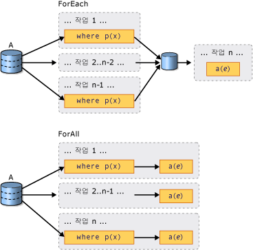

# PLINQ 소개Introduction to PLINQ
## 병렬 쿼리는 무엇입니까?What is a Parallel Query?  
 LINQ(Language-Integrated Query)가 [!INCLUDE[net_v35_long](../../../includes/net-v35-long-md.md)]에 도입되었습니다.Language-Integrated Query (LINQ) was introduced in the [!INCLUDE[net_v35_long](../../../includes/net-v35-long-md.md)].  모든 <xref:System.Collections.IEnumerable?displayProperty=nameWithType> 또는 <xref:System.Collections.Generic.IEnumerable%601?displayProperty=nameWithType> 데이터 소스를 형식이 안전한 방법으로 쿼리하기 위한 통합 모델로 기능합니다.It features a unified model for querying any <xref:System.Collections.IEnumerable?displayProperty=nameWithType> or <xref:System.Collections.Generic.IEnumerable%601?displayProperty=nameWithType> data source in a type-safe manner. LINQ to Objects는 <xref:System.Collections.Generic.List%601> 및 배열과 같은 메모리 내 컬렉션에 대해 실행되는 LINQ 쿼리에 대한 이름입니다.LINQ to Objects is the name for LINQ queries that are run against in-memory collections such as <xref:System.Collections.Generic.List%601> and arrays. 이 문서에서는 사용자가 LINQ의 기본적인 개념을 이해하고 있다고 가정합니다.This article assumes that you have a basic understanding of LINQ. 자세한 내용은 [LINQ(Language-Integrated Query)](https://msdn.microsoft.com/library/a73c4aec-5d15-4e98-b962-1274021ea93d)를 참조하세요.For more information, see [LINQ (Language-Integrated Query)](https://msdn.microsoft.com/library/a73c4aec-5d15-4e98-b962-1274021ea93d).  
  
 PLINQ(병렬 LINQ)는 LINQ 패턴의 병렬 구현입니다.Parallel LINQ (PLINQ) is a parallel implementation of the LINQ pattern. PLINQ 쿼리는 비병렬 LINQ to Objects 쿼리와 여러 가지 방법에서 유사합니다.A PLINQ query in many ways resembles a non-parallel LINQ to Objects query. 순차적 [!INCLUDE[vbteclinq](../../../includes/vbteclinq-md.md)] 쿼리와 마찬가지로 PLINQ 쿼리는 모든 메모리 내 <xref:System.Collections.IEnumerable> 또는 <xref:System.Collections.Generic.IEnumerable%601> 데이터 소스에서 작동하며 지연된 실행을 가집니다. 즉, 쿼리가 열거될 때까지 실행을 시작하지 않습니다.PLINQ queries, just like sequential [!INCLUDE[vbteclinq](../../../includes/vbteclinq-md.md)] queries, operate on any in-memory <xref:System.Collections.IEnumerable> or <xref:System.Collections.Generic.IEnumerable%601> data source, and have deferred execution, which means they do not begin executing until the query is enumerated. 주요 차이점은 PLINQ가 시스템에서 모든 프로세서를 충분히 활용하도록 시도한다는 것입니다.The primary difference is that PLINQ attempts to make full use of all the processors on the system. 데이터 소스를 세그먼트로 분할한 다음 다중 프로세서에서 병렬로 별도 작업자 스레드의 각 세그먼트에서 쿼리를 실행하여 수행합니다.It does this by partitioning the data source into segments, and then executing the query on each segment on separate worker threads in parallel on multiple processors. 대부분의 경우 병렬 실행은 쿼리가 훨씬 더 빠르게 실행되는 것을 의미합니다.In many cases, parallel execution means that the query runs significantly faster.  
  
 병렬 실행을 통해 PLINQ는 종종 데이터 소스에 <xref:System.Linq.ParallelEnumerable.AsParallel%2A> 쿼리 작업을 추가하여 특정한 쿼리 종류의 레거시 코드에 대한 큰 성능 개선을 얻을 수 있습니다.Through parallel execution, PLINQ can achieve significant performance improvements over legacy code for certain kinds of queries, often just by adding the <xref:System.Linq.ParallelEnumerable.AsParallel%2A> query operation to the data source. 그러나 병렬 처리는 자체 복잡성을 도입할 수 있으며 모든 쿼리 작업은 PLINQ에서 더 빠르게 실행될 수 없습니다.However, parallelism can introduce its own complexities, and not all query operations run faster in PLINQ. 사실, 병렬화는 실제로 특정 쿼리의 속도를 낮춥니다.In fact, parallelization actually slows down certain queries. 따라서 순서 지정과 같은 문제가 병렬 쿼리에 미치는 영향을 이해해야 합니다.Therefore, you should understand how issues such as ordering affect parallel queries. 자세한 내용은 [PLINQ의 속도 향상 이해](../../../docs/standard/parallel-programming/understanding-speedup-in-plinq.md)를 참조하세요.For more information, see [Understanding Speedup in PLINQ](../../../docs/standard/parallel-programming/understanding-speedup-in-plinq.md).  
  
> [!NOTE]
>  이 문서에서는 람다 식을 사용하여 PLINQ에 대리자를 정의합니다.This documentation uses lambda expressions to define delegates in PLINQ. C# 또는 Visual Basic의 람다 식을 잘 모르는 경우 [PLINQ 및 TPL의 람다 식](../../../docs/standard/parallel-programming/lambda-expressions-in-plinq-and-tpl.md)을 참조하세요.If you are not familiar with lambda expressions in C# or Visual Basic, see [Lambda Expressions in PLINQ and TPL](../../../docs/standard/parallel-programming/lambda-expressions-in-plinq-and-tpl.md).  
  
 이 문서의 나머지 부분에서는 주요 PLINQ 클래스의 개요 및 PLINQ 쿼리를 만드는 방법을 설명합니다.The remainder of this article gives an overview of the main PLINQ classes, and discusses how to create PLINQ queries. 각 섹션은 보다 자세한 정보 및 코드 예제에 대한 링크를 포함합니다.Each section contains links to more detailed information and code examples.  
  
## ParallelEnumerable 클래스The ParallelEnumerable Class  
 <xref:System.Linq.ParallelEnumerable?displayProperty=nameWithType> 클래스는 거의 모든 PLINQ 기능을 노출합니다.The <xref:System.Linq.ParallelEnumerable?displayProperty=nameWithType> class exposes almost all of PLINQ's functionality.  해당 항목 및 나머지 <xref:System.Linq?displayProperty=nameWithType> 네임스페이스 형식은 System.Core.dll 어셈블리에 컴파일됩니다.It and the rest of the <xref:System.Linq?displayProperty=nameWithType> namespace types are compiled into the System.Core.dll assembly. Visual Studio에서 기본 C# 및 Visual Basic 프로젝트는 모두 어셈블리를 참조하고 네임스페이스를 가져옵니다.The default C# and Visual Basic projects in Visual Studio both reference the assembly and import the namespace.  
  
 <xref:System.Linq.ParallelEnumerable>은 각각을 병렬 처리하려고 하지 않지만 LINQ to Objects가 지원하는 모든 표준 쿼리 연산자의 구현을 포함합니다.<xref:System.Linq.ParallelEnumerable> includes implementations of all the standard query operators that LINQ to Objects supports, although it does not attempt to parallelize each one. [!INCLUDE[vbteclinq](../../../includes/vbteclinq-md.md)]와 익숙하지 않은 경우 [LINQ 소개](https://msdn.microsoft.com/library/24dddf19-12a0-4707-a4bc-eba4fa7f219e)를 참조하세요.If you are not familiar with [!INCLUDE[vbteclinq](../../../includes/vbteclinq-md.md)], see [Introduction to LINQ](https://msdn.microsoft.com/library/24dddf19-12a0-4707-a4bc-eba4fa7f219e).  
  
 표준 쿼리 연산자뿐만 아니라 <xref:System.Linq.ParallelEnumerable> 클래스에는 병렬 실행과 관련된 동작을 사용하도록 설정하는 메서드 집합이 포함되어 있습니다.In addition to the standard query operators, the <xref:System.Linq.ParallelEnumerable> class contains a set of methods that enable behaviors specific to parallel execution. 이러한 PLINQ 전용 메서드는 다음 표에 나열되어 있습니다.These PLINQ-specific methods are listed in the following table.  
  
|ParallelEnumerable 연산자ParallelEnumerable Operator|설명Description|  
|---------------------------------|-----------------|  
|<xref:System.Linq.ParallelEnumerable.AsParallel%2A>|PLINQ에 대한 진입점입니다.The entry point for PLINQ. 가능한 경우 나머지 쿼리가 병렬화되어야 한다는 것을 지정합니다.Specifies that the rest of the query should be parallelized, if it is possible.|  
|<xref:System.Linq.ParallelEnumerable.AsSequential%2A>|비병렬 LINQ 쿼리로 나머지 쿼리가 순차적으로 실행되어야 한다는 것을 지정합니다.Specifies that the rest of the query should be run sequentially, as a non-parallel LINQ query.|  
|<xref:System.Linq.ParallelEnumerable.AsOrdered%2A>|PLINQ가 나머지 쿼리에 대해 또는 순서 지정이 변경될 때까지 소스 시퀀스의 순서 지정(예: OrderBy(Visual Basic에서 Order By) 절의 사용에 따라)을 유지해야 한다는 것을 지정합니다.Specifies that PLINQ should preserve the ordering of the source sequence for the rest of the query, or until the ordering is changed, for example by the use of an orderby (Order By in Vlsual Basic) clause.|  
|<xref:System.Linq.ParallelEnumerable.AsUnordered%2A>|쿼리의 나머지 부분에 대해 소스 시퀀스의 순서 지정을 유지하기 위해 PLINQ가 필요 없음을 지정합니다.Specifies that PLINQ for the rest of the query is not required to preserve the ordering of the source sequence.|  
|<xref:System.Linq.ParallelEnumerable.WithCancellation%2A>|PLINQ가 제공된 취소 토큰의 상태를 주기적으로 모니터링하고 요청되는 경우 실행을 취소해야 한다는 것을 지정합니다.Specifies that PLINQ should periodically monitor the state of the provided cancellation token and cancel execution if it is requested.|  
|<xref:System.Linq.ParallelEnumerable.WithDegreeOfParallelism%2A>|PLINQ에서 쿼리를 병렬화하는 데 사용해야 하는 프로세서의 최대 수를 지정합니다.Specifies the maximum number of processors that PLINQ should use to parallelize the query.|  
|<xref:System.Linq.ParallelEnumerable.WithMergeOptions%2A>|가능한 경우 PLINQ가 병렬 결과를 소비 스레드에서 하나의 시퀀스로 다시 병합해야 하는 방법에 대한 힌트를 제공합니다.Provides a hint about how PLINQ should, if it is possible, merge parallel results back into just one sequence on the consuming thread.|  
|<xref:System.Linq.ParallelEnumerable.WithExecutionMode%2A>|기본 동작이 순차적으로 실행해야 하는 경우 PLINQ에서 쿼리를 병렬화해야 하는지 여부를 지정합니다.Specifies whether PLINQ should parallelize the query even when the default behavior would be to run it sequentially.|  
|<xref:System.Linq.ParallelEnumerable.ForAll%2A>|쿼리 결과 반복과 달리 소비자 스레드로 다시 병합하지 않고 병렬로 처리될 결과를 활성화하는 다중 스레드 열거형 메서드.A multithreaded enumeration method that, unlike iterating over the results of the query, enables results to be processed in parallel without first merging back to the consumer thread.|  
|<xref:System.Linq.ParallelEnumerable.Aggregate%2A> 오버로드<xref:System.Linq.ParallelEnumerable.Aggregate%2A> overload|PLINQ에 고유하고 스레드 로컬 파티션에 대한 중간 집계뿐만 아니라 모든 파티션의 결과를 결합하는 최종 집계 함수를 활성화하는 오버로드.An overload that is unique to PLINQ and enables intermediate aggregation over thread-local partitions, plus a final aggregation function to combine the results of all partitions.|  
  
## 옵트 인(Opt-in) 모델The Opt-in Model  
 쿼리를 작성하는 경우 다음 예제와 같이 데이터 소스에서 <xref:System.Linq.ParallelEnumerable.AsParallel%2A?displayProperty=nameWithType> 확장 메서드를 호출하여 PLINQ에 옵트 인합니다.When you write a query, opt in to PLINQ by invoking the <xref:System.Linq.ParallelEnumerable.AsParallel%2A?displayProperty=nameWithType> extension method on the data source, as shown in the following example.  
  
 [!code-csharp[PLINQ#1](../../../samples/snippets/csharp/VS_Snippets_Misc/plinq/cs/plinq2_cs.cs#1)]
 [!code-vb[PLINQ#1](../../../samples/snippets/visualbasic/VS_Snippets_Misc/plinq/vb/plinq2_vb.vb#1)]  
  
 `select` 확장 메서드는 후속 쿼리 연산자(이 경우 <xref:System.Linq.ParallelEnumerable.AsParallel%2A> 및 `where`)를 <xref:System.Linq.ParallelEnumerable?displayProperty=nameWithType> 구현에 바인딩합니다.The <xref:System.Linq.ParallelEnumerable.AsParallel%2A> extension method binds the subsequent query operators, in this case, `where` and `select`, to the <xref:System.Linq.ParallelEnumerable?displayProperty=nameWithType> implementations.  
  
## 실행 모드Execution Modes  
 기본적으로 PLINQ는 보수적입니다.By default, PLINQ is conservative. 런타임 시 PLINQ 인프라는 쿼리의 전체 구조를 분석합니다.At run time, the PLINQ infrastructure analyzes the overall structure of the query. 쿼리가 병렬화로 속도가 향상될 가능성이 있는 경우 PLINQ는 동시에 실행될 수 있는 작업으로 소스 시퀀스를 분할합니다.If the query is likely to yield speedups by parallelization, PLINQ partitions the source sequence into tasks that can be run concurrently. 쿼리를 병렬화하는 것이 안전하지 않는 경우 PLINQ는 쿼리를 순차적으로 실행합니다.If it is not safe to parallelize a query, PLINQ just runs the query sequentially. PLINQ가 잠재적으로 비용이 많이 드는 병렬 알고리즘 또는 저렴한 순차적 알고리즘 중 하나를 선택할 수 있는 경우 기본적으로 순차적 알고리즘을 선택합니다.If PLINQ has a choice between a potentially expensive parallel algorithm or an inexpensive sequential algorithm, it chooses the sequential algorithm by default. <xref:System.Linq.ParallelEnumerable.WithExecutionMode%2A> 메서드 및 <xref:System.Linq.ParallelExecutionMode?displayProperty=nameWithType> 열거형을 사용하여 PLINQ가 병렬 알고리즘을 선택하도록 지시할 수 있습니다.You can use the <xref:System.Linq.ParallelEnumerable.WithExecutionMode%2A> method and the <xref:System.Linq.ParallelExecutionMode?displayProperty=nameWithType> enumeration to instruct PLINQ to select the parallel algorithm. 특정 쿼리가 테스트와 측정으로 병렬로 더 빨리 실행되는 것을 알고 있는 경우에 유용합니다.This is useful when you know by testing and measurement that a particular query executes faster in parallel. 자세한 내용은 [방법: PLINQ에 실행 모드 지정](../../../docs/standard/parallel-programming/how-to-specify-the-execution-mode-in-plinq.md)을 참조하세요.For more information, see [How to: Specify the Execution Mode in PLINQ](../../../docs/standard/parallel-programming/how-to-specify-the-execution-mode-in-plinq.md).  
  
## 병렬 처리 수준Degree of Parallelism  
 기본적으로 PLINQ는 호스트 컴퓨터에서 모든 프로세서를 사용합니다.By default, PLINQ uses all of the processors on the host computer. <xref:System.Linq.ParallelEnumerable.WithDegreeOfParallelism%2A> 메서드를 사용하여 PLINQ가 지정된 프로세서 수보다 더 많은 프로세서를 사용하지 않도록 지시할 수 있습니다.You can instruct PLINQ to use no more than a specified number of processors by using the <xref:System.Linq.ParallelEnumerable.WithDegreeOfParallelism%2A> method. 컴퓨터에서 실행되는 다른 프로세서가 특정 양의 CPU 시간을 받는지 확인하려는 경우에 유용합니다.This is useful when you want to make sure that other processes running on the computer receive a certain amount of CPU time. 다음 코드 조각은 쿼리가 최대 두 개의 프로세서를 사용하도록 제한합니다.The following snippet limits the query to utilizing a maximum of two processors.  
  
 [!code-csharp[PLINQ#5](../../../samples/snippets/csharp/VS_Snippets_Misc/plinq/cs/plinqsamples.cs#5)]
 [!code-vb[PLINQ#5](../../../samples/snippets/visualbasic/VS_Snippets_Misc/plinq/vb/plinq2_vb.vb#5)]  
  
 쿼리가 상당한 양의 파일 I/O와 같은 비계산 바운드 작업을 수행하는 경우 컴퓨터의 코어 수보다 큰 병렬 처리 수준을 지정하는 것이 도움이 될 수 있습니다.In cases where a query is performing a significant amount of non-compute-bound work such as File I/O, it might be beneficial to specify a degree of parallelism greater than the number of cores on the machine.  
  
## 순서가 지정된 병렬 쿼리와 순서가 지정되지 않은 병렬 쿼리 비교Ordered Versus Unordered Parallel Queries  
 일부 쿼리에서 쿼리 연산자는 소스 시퀀스의 순서 지정을 유지하는 결과를 생성해야 합니다.In some queries, a query operator must produce results that preserve the ordering of the source sequence. PLINQ는 이 용도로 <xref:System.Linq.ParallelEnumerable.AsOrdered%2A> 연산자를 제공합니다.PLINQ provides the <xref:System.Linq.ParallelEnumerable.AsOrdered%2A> operator for this purpose. <xref:System.Linq.ParallelEnumerable.AsOrdered%2A>는 <xref:System.Linq.ParallelEnumerable.AsSequential%2A>과 다릅니다.<xref:System.Linq.ParallelEnumerable.AsOrdered%2A> is distinct from <xref:System.Linq.ParallelEnumerable.AsSequential%2A>. <xref:System.Linq.ParallelEnumerable.AsOrdered%2A> 시퀀스는 여전히 병렬로 처리되지만 해당 결과는 버퍼링되고 정렬됩니다.An <xref:System.Linq.ParallelEnumerable.AsOrdered%2A> sequence is still processed in parallel, but its results are buffered and sorted. 일반적으로 순서 유지는 추가 작업을 수반하므로 <xref:System.Linq.ParallelEnumerable.AsOrdered%2A> 시퀀스는 기본 <xref:System.Linq.ParallelEnumerable.AsUnordered%2A> 시퀀스보다 더욱 느리게 처리될 수 있습니다.Because order preservation typically involves extra work, an <xref:System.Linq.ParallelEnumerable.AsOrdered%2A> sequence might be processed more slowly than the default <xref:System.Linq.ParallelEnumerable.AsUnordered%2A> sequence. 특정 순서가 지정된 병렬 작업이 순차적 버전의 작업보다 빠른지 여부는 많은 요인에 따라 달라집니다.Whether a particular ordered parallel operation is faster than a sequential version of the operation depends on many factors.  
  
 다음 코드 예제에서는 순서 유지로 옵트 인하는 방법을 보여 줍니다.The following code example shows how to opt in to order preservation.  
  
 [!code-csharp[PLINQ#3](../../../samples/snippets/csharp/VS_Snippets_Misc/plinq/cs/plinq2_cs.cs#3)]
 [!code-vb[PLINQ#3](../../../samples/snippets/visualbasic/VS_Snippets_Misc/plinq/vb/plinq2_vb.vb#3)]  
  
 자세한 내용은 [PLINQ에서 순서 유지](../../../docs/standard/parallel-programming/order-preservation-in-plinq.md)를 참조하세요.For more information, see [Order Preservation in PLINQ](../../../docs/standard/parallel-programming/order-preservation-in-plinq.md).  
  
## 병렬 쿼리와 순차적 쿼리Parallel vs. Sequential Queries  
 일부 작업에서는 원본 데이터가 순차적으로 전달되어야 합니다.Some operations require that the source data be delivered in a sequential manner. <xref:System.Linq.ParallelEnumerable> 쿼리 연산자는 필요할 때 자동으로 순차 모드로 되돌립니다.The <xref:System.Linq.ParallelEnumerable> query operators revert to sequential mode automatically when it is required. 순차적 실행이 필요한 사용자 정의 쿼리 연산자 및 사용자 대리자의 경우 PLINQ는 <xref:System.Linq.ParallelEnumerable.AsSequential%2A> 메서드를 제공합니다.For user-defined query operators and user delegates that require sequential execution, PLINQ provides the <xref:System.Linq.ParallelEnumerable.AsSequential%2A> method. <xref:System.Linq.ParallelEnumerable.AsSequential%2A>을 사용하는 경우 쿼리에서 모든 후속 연산자는 <xref:System.Linq.ParallelEnumerable.AsParallel%2A>이 다시 호출될 때까지 순차적으로 실행됩니다.When you use <xref:System.Linq.ParallelEnumerable.AsSequential%2A>, all subsequent operators in the query are executed sequentially until <xref:System.Linq.ParallelEnumerable.AsParallel%2A> is called again. 자세한 내용은 [방법: 병렬 및 순차적 LINQ 쿼리 결합](../../../docs/standard/parallel-programming/how-to-combine-parallel-and-sequential-linq-queries.md)을 참조하세요.For more information, see [How to: Combine Parallel and Sequential LINQ Queries](../../../docs/standard/parallel-programming/how-to-combine-parallel-and-sequential-linq-queries.md).  
  
## 쿼리 결과 병합에 대한 옵션Options for Merging Query Results  
 PLINQ 쿼리가 병렬로 실행되는 경우 각 작업자 스레드의 해당 결과는 `foreach` 반복(Visual Basic에서 `For Each`) 또는 목록 또는 배열로 삽입으로 소비에 대한 주 스레드로 다시 병합되어야 합니다.When a PLINQ query executes in parallel, its results from each worker thread must be merged back onto the main thread for consumption by a `foreach` loop (`For Each` in Visual Basic), or insertion into a list or array. 일부 경우에서 특정 종류의 병합 작업을 지정하는 것이 도움이 될 수도 있습니다(예: 보다 신속하게 결과 생성을 시작하도록).In some cases, it might be beneficial to specify a particular kind of merge operation, for example, to begin producing results more quickly. 이를 위해 PLINQ는 <xref:System.Linq.ParallelEnumerable.WithMergeOptions%2A> 메서드 및 <xref:System.Linq.ParallelMergeOptions> 열거형을 지원합니다.For this purpose, PLINQ supports the <xref:System.Linq.ParallelEnumerable.WithMergeOptions%2A> method, and the <xref:System.Linq.ParallelMergeOptions> enumeration. 자세한 내용은 [PLINQ의 병합 옵션](../../../docs/standard/parallel-programming/merge-options-in-plinq.md)을 참조하세요.For more information, see [Merge Options in PLINQ](../../../docs/standard/parallel-programming/merge-options-in-plinq.md).  
  
## ForAll 연산자The ForAll Operator  
 순차적 [!INCLUDE[vbteclinq](../../../includes/vbteclinq-md.md)] 쿼리에서 실행은 쿼리가 `foreach`(Visual Basic에서 `For Each`) 루프에서 또는 <xref:System.Linq.ParallelEnumerable.ToList%2A>, <xref:System.Linq.ParallelEnumerable.ToArray%2A> 또는 <xref:System.Linq.ParallelEnumerable.ToDictionary%2A>과 같은 메서드를 호출하여 열거될 때까지 지연됩니다.In sequential [!INCLUDE[vbteclinq](../../../includes/vbteclinq-md.md)] queries, execution is deferred until the query is enumerated either in a `foreach` (`For Each` in Visual Basic) loop or by invoking a method such as <xref:System.Linq.ParallelEnumerable.ToList%2A> , <xref:System.Linq.ParallelEnumerable.ToArray%2A> , or <xref:System.Linq.ParallelEnumerable.ToDictionary%2A>. PLINQ에서 `foreach`를 사용하여 쿼리를 실행하고 결과를 반복할 수도 있습니다.In PLINQ, you can also use `foreach` to execute the query and iterate through the results. 그러나 `foreach` 자체는 병렬로 실행되지 않으므로 모든 병렬 작업의 출력은 반복이 실행되는 스레드로 다시 병합되어야 합니다.However, `foreach` itself does not run in parallel, and therefore, it requires that the output from all parallel tasks be merged back into the thread on which the loop is running. PLINQ에서 쿼리 결과의 최종 순서 지정을 유지해야 하는 경우 및 각 요소에 대해 `Console.WriteLine`을 호출하는 경우와 같이 직렬 방식으로 결과를 처리할 때마다 `foreach`를 사용할 수 있습니다.In PLINQ, you can use `foreach` when you must preserve the final ordering of the query results, and also whenever you are processing the results in a serial manner, for example when you are calling `Console.WriteLine` for each element. 빠른 쿼리 실행을 위해 순서 유지가 필요하지 않은 경우 및 결과 처리 자체가 병렬로 처리될 수 있는 경우 <xref:System.Linq.ParallelEnumerable.ForAll%2A> 메서드를 사용하여 PLINQ 쿼리를 실행합니다.For faster query execution when order preservation is not required and when the processing of the results can itself be parallelized, use the <xref:System.Linq.ParallelEnumerable.ForAll%2A> method to execute a PLINQ query. <xref:System.Linq.ParallelEnumerable.ForAll%2A>은 이 최종 병합 단계를 수행하지 않습니다.<xref:System.Linq.ParallelEnumerable.ForAll%2A> does not perform this final merge step. 다음 코드 예제에서는 <xref:System.Linq.ParallelEnumerable.ForAll%2A> 메서드를 사용하는 방법을 보여 줍니다.The following code example shows how to use the <xref:System.Linq.ParallelEnumerable.ForAll%2A> method. <xref:System.Collections.Concurrent.ConcurrentBag%601?displayProperty=nameWithType>은 여러 스레드에 대해 항목 제거를 시도하지 않고 동시 추가에 최적화되었기 때문에 여기에서 사용됩니다.<xref:System.Collections.Concurrent.ConcurrentBag%601?displayProperty=nameWithType> is used here because it is optimized for multiple threads adding concurrently without attempting to remove any items.  
  
 [!code-csharp[PLINQ#4](../../../samples/snippets/csharp/VS_Snippets_Misc/plinq/cs/plinq2_cs.cs#4)]
 [!code-vb[PLINQ#4](../../../samples/snippets/visualbasic/VS_Snippets_Misc/plinq/vb/plinq2_vb.vb#4)]  
  
 다음 그림은 쿼리 실행과 관련하여 `foreach` 및 <xref:System.Linq.ParallelEnumerable.ForAll%2A> 간의 차이를 보여줍니다.The following illustration shows the difference between `foreach` and <xref:System.Linq.ParallelEnumerable.ForAll%2A> with regard to query execution.  
  
   
  
## 취소Cancellation  
 PLINQ는 [!INCLUDE[net_v40_short](../../../includes/net-v40-short-md.md)]에서 취소 유형과 통합됩니다.PLINQ is integrated with the cancellation types in [!INCLUDE[net_v40_short](../../../includes/net-v40-short-md.md)]. (자세한 내용은 [관리되는 스레드의 취소](../../../docs/standard/threading/cancellation-in-managed-threads.md)를 참조하세요.) 따라서 순차적 LINQ to Objects 쿼리와 달리 PLINQ 쿼리는 취소할 수 있습니다.(For more information, see [Cancellation in Managed Threads](../../../docs/standard/threading/cancellation-in-managed-threads.md).) Therefore, unlike sequential LINQ to Objects queries, PLINQ queries can be canceled. 취소 가능한 PLINQ 쿼리를 만들려면 쿼리에서 <xref:System.Linq.ParallelEnumerable.WithCancellation%2A> 연산자를 사용하고 인수로 <xref:System.Threading.CancellationToken> 인스턴스를 제공합니다.To create a cancelable PLINQ query, use the <xref:System.Linq.ParallelEnumerable.WithCancellation%2A> operator on the query and provide a <xref:System.Threading.CancellationToken> instance as the argument. 토큰에서 <xref:System.Threading.CancellationToken.IsCancellationRequested%2A> 속성이 true로 설정된 경우 PLINQ는 이를 감지하고 모든 스레드에서 처리를 중지하고 <xref:System.OperationCanceledException>을 throw합니다.When the <xref:System.Threading.CancellationToken.IsCancellationRequested%2A> property on the token is set to true, PLINQ will notice it, stop processing on all threads, and throw an <xref:System.OperationCanceledException>.  
  
 PLINQ 쿼리는 취소 토큰이 설정된 후 몇 가지 요소를 계속해서 처리할 수 있습니다.It is possible that a PLINQ query might continue to process some elements after the cancellation token is set.  
  
 응답성을 높이기 위해 장기 실행 사용자 대리자에서 취소 요청에 응답할 수도 있습니다.For greater responsiveness, you can also respond to cancellation requests in long-running user delegates. 자세한 내용은 [방법: PLINQ 쿼리 취소](../../../docs/standard/parallel-programming/how-to-cancel-a-plinq-query.md)를 참조하세요.For more information, see [How to: Cancel a PLINQ Query](../../../docs/standard/parallel-programming/how-to-cancel-a-plinq-query.md).  
  
## 예외Exceptions  
 PLINQ 쿼리를 실행하는 경우 여러 예외가 서로 다른 여러 스레드에서 동시에 throw될 수 있습니다.When a PLINQ query executes, multiple exceptions might be thrown from different threads simultaneously. 또한 예외를 처리하는 코드는 예외를 throw한 코드와 다른 스레드에 있을 수 있습니다.Also, the code to handle the exception might be on a different thread than the code that threw the exception. PLINQ는 <xref:System.AggregateException> 형식을 사용하여 쿼리에 의해 throw된 모든 예외를 캡슐화하고 이러한 예외를 호출 스레드로 다시 마샬링합니다.PLINQ uses the <xref:System.AggregateException> type to encapsulate all the exceptions that were thrown by a query, and marshal those exceptions back to the calling thread. 호출 스레드에서는 하나의 try-catch 블록만 필요합니다.On the calling thread, only one try-catch block is required. 그러나 <xref:System.AggregateException>에서 캡슐화되는 모든 예외를 반복하고 안전하게 복구할 수 있는 모든 항목을 catch할 수 있습니다.However, you can iterate through all of the exceptions that are encapsulated in the <xref:System.AggregateException> and catch any that you can safely recover from. 드문 경우에서 <xref:System.AggregateException>에서 래핑되지 않은 몇 가지 예외가 throw될 수 있으며 <xref:System.Threading.ThreadAbortException>도 래핑되지 않습니다.In rare cases, some exceptions may be thrown that are not wrapped in an <xref:System.AggregateException>, and <xref:System.Threading.ThreadAbortException>s  are also not wrapped.  
  
 예외가 가입된 스레드로 다시 버블 업될 수 있는 경우 예외가 발생한 후에도 쿼리에서 일부 항목을 계속 처리할 수 있습니다.When exceptions are allowed to bubble up back to the joining thread, then it is possible that a query may continue to process some items after the exception is raised.  
  
 자세한 내용은 [방법: PLINQ 쿼리의 예외 처리](../../../docs/standard/parallel-programming/how-to-handle-exceptions-in-a-plinq-query.md)를 참조하세요.For more information, see [How to: Handle Exceptions in a PLINQ Query](../../../docs/standard/parallel-programming/how-to-handle-exceptions-in-a-plinq-query.md).  
  
## 사용자 지정 파티셔너Custom Partitioners  
 경우에 따라 원본 데이터의 일부 특성을 사용하는 사용자 지정 파티셔너를 작성하여 쿼리 성능을 향상시킬 수 있습니다.In some cases, you can improve query performance by writing a custom partitioner that takes advantage of some characteristic of the source data. 쿼리에서 사용자 지정 파티셔너 자체는 쿼리되는 열거 가능한 개체입니다.In the query, the custom partitioner itself is the enumerable object that is queried.  
  
 [!code-csharp[PLINQ#2](../../../samples/snippets/csharp/VS_Snippets_Misc/plinq/cs/plinq2_cs.cs#2)]
 [!code-vb[PLINQ#2](../../../samples/snippets/visualbasic/VS_Snippets_Misc/plinq/vb/plinq3.vb#2)]  
  
 PLINQ는 고정된 파티션 수를 지원합니다(데이터는 부하 분산을 위해 런타임 동안 해당 파티션에 동적으로 다시 할당될 수도 있음).PLINQ supports a fixed number of partitions (although data may be dynamically reassigned to those partitions during run time for load balancing.). <xref:System.Threading.Tasks.Parallel.For%2A> 및 <xref:System.Threading.Tasks.Parallel.ForEach%2A>는 동적 분할만을 지원합니다. 즉, 파티션 수가 런타임 시 변경됨을 의미합니다.<xref:System.Threading.Tasks.Parallel.For%2A> and <xref:System.Threading.Tasks.Parallel.ForEach%2A> support only dynamic partitioning, which means that the number of partitions changes at run time. 자세한 내용은 [PLINQ 및 TPL에 대한 사용자 지정 파티셔너](../../../docs/standard/parallel-programming/custom-partitioners-for-plinq-and-tpl.md)를 참조하세요.For more information, see [Custom Partitioners for PLINQ and TPL](../../../docs/standard/parallel-programming/custom-partitioners-for-plinq-and-tpl.md).  
  
## PLINQ 성능 측정Measuring PLINQ Performance  
 대부분의 경우에서 쿼리는 병렬화될 수 있지만 병렬 쿼리 설정의 오버헤드는 얻게 되는 성능 이점을 능가합니다.In many cases, a query can be parallelized, but the overhead of setting up the parallel query outweighs the performance benefit gained. 쿼리가 많은 계산을 수행하지 않거나 데이터 소스가 작은 경우 PLINQ 쿼리는 순차 LINQ to Objects 쿼리보다 느려질 수 있습니다.If a query does not perform much computation or if the data source is small, a PLINQ query may be slower than a sequential LINQ to Objects query. Visual Studio Team Server에서 병렬 성능 분석기를 사용하여 처리 병목 지점을 찾고 쿼리가 병렬로 실행 중인지 순차적으로 실행 중인지 여부를 확인하도록 다양한 쿼리의 성능을 비교할 수 있습니다.You can use the Parallel Performance Analyzer in Visual Studio Team Server to compare the performance of various queries, to locate processing bottlenecks, and to determine whether your query is running in parallel or sequentially. 자세한 내용은 [동시성 시각화 도우미](/visualstudio/profiling/concurrency-visualizer) 및 [방법: PLINQ 쿼리 성능 측정](../../../docs/standard/parallel-programming/how-to-measure-plinq-query-performance.md)을 참조하세요.For more information, see [Concurrency Visualizer](/visualstudio/profiling/concurrency-visualizer) and [How to: Measure PLINQ Query Performance](../../../docs/standard/parallel-programming/how-to-measure-plinq-query-performance.md).  
  
## 참고 항목See Also  
 [PLINQ(병렬 LINQ)Parallel LINQ (PLINQ)](../../../docs/standard/parallel-programming/parallel-linq-plinq.md)  
 [PLINQ의 속도 향상 이해Understanding Speedup in PLINQ](../../../docs/standard/parallel-programming/understanding-speedup-in-plinq.md)
