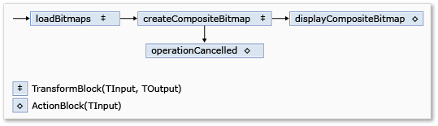
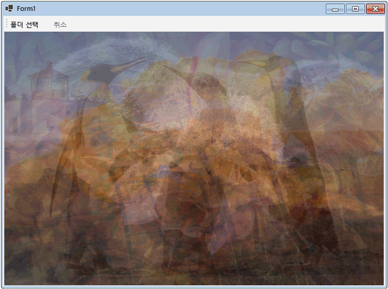

# 연습: Windows Forms 응용 프로그램에서 데이터 흐름 사용
이 문서에서는 Windows Forms 응용 프로그램에서 이미지 처리를 수행하는 데이터 흐름 블록의 네트워크를 만드는 방법을 보여 줍니다.  
  
 이 예제는 지정된 폴더에서 이미지 파일을 로드하고 합성 이미지를 만들어 결과를 표시합니다. 이 예제에서는 네트워크를 통해 이미지를 라우팅하는 데 데이터 흐름 모델을 사용합니다. 데이터 흐름 모델에서는, 프로그램의 개별 구성 요소가 메시지를 전달하여 서로 통신합니다. 구성 요소가 메시지를 받으면 어떤 작업을 수행한 후 결과를 다른 구성 요소에 전달합니다. 이를 응용 프로그램에서 제어 구조(예 : 조건 문, 루프 등)를 사용하는 제어 흐름 모델과 비교하여 프로그램에서 작업 순서를 제어합니다.  
  
## 전제 조건  
 이 연습을 시작하기 전에 [데이터 흐름](../../../docs/standard/parallel-programming/dataflow-task-parallel-library.md)을 읽어 보세요.  

[!INCLUDE [tpl-install-instructions](../../../includes/tpl-install-instructions.md)]

## 섹션  
 이 연습에는 다음과 같은 섹션이 있습니다.  
  
-   [Windows Forms 응용 프로그램 만들기](#winforms)  
  
-   [데이터 흐름 네트워크 만들기](#network)  
  
-   [사용자 인터페이스에 데이터 흐름 네트워크 연결](#ui)  
  
-   [전체 예제](#complete)  
  
   
## Windows Forms 응용 프로그램 만들기  
 이 섹션에서는 기본 Windows Forms 응용 프로그램을 만들고 기본 폼에 컨트롤을 추가하는 방법을 설명합니다.  
  
#### Windows Forms 응용 프로그램을 만들려면  
  
1.  Visual Studio에서 Visual C# 또는 Visual Basic **Windows Forms 응용 프로그램** 프로젝트를 만듭니다. 이 문서에서 프로젝트 이름은 `CompositeImages`입니다.  
  
2.  기본 폼인 Form1.cs(Visual Basic에서는 Form1.vb)의 폼 디자이너에서 <xref:System.Windows.Forms.ToolStrip> 컨트롤을 추가합니다.  
  
3.  <xref:System.Windows.Forms.ToolStripButton> 컨트롤을 <xref:System.Windows.Forms.ToolStrip> 컨트롤에 추가합니다. <xref:System.Windows.Forms.ToolStripItem.DisplayStyle%2A> 속성을 <xref:System.Windows.Forms.ToolStripItemDisplayStyle.Text>로 설정하고 <xref:System.Windows.Forms.ToolStripItem.Text%2A> 속성을 **폴더 선택**으로 설정합니다.  
  
4.  두 번째 <xref:System.Windows.Forms.ToolStripButton> 컨트롤을 <xref:System.Windows.Forms.ToolStrip> 컨트롤에 추가합니다. <xref:System.Windows.Forms.ToolStripItem.DisplayStyle%2A> 속성을 <xref:System.Windows.Forms.ToolStripItemDisplayStyle.Text>로 설정하고, <xref:System.Windows.Forms.ToolStripItem.Text%2A> 속성을 **취소**로 설정하고, <xref:System.Windows.Forms.ToolStripItem.Enabled%2A> 속성을 `False`로 설정합니다.  
  
5.  기본 폼에 <xref:System.Windows.Forms.PictureBox> 개체를 추가합니다. <xref:System.Windows.Forms.Control.Dock%2A> 속성을 <xref:System.Windows.Forms.DockStyle.Fill>으로 설정합니다.  
  
   
## 데이터 흐름 네트워크 만들기  
 이 섹션에서는 이미지 처리를 수행하는 데이터 흐름 네트워크를 만드는 방법을 설명합니다.  
  
#### 데이터 흐름 네트워크를 만들려면  
  
1.  프로젝트에 System.Threading.Tasks.Dataflow.dll에 대한 참조를 추가합니다.  
  
2.  Form1.cs(Visual Basic에서는 Form1.vb)에 다음 `using`(Visual Basic에서는 `Using`) 명령문이 포함되어 있는지 확인합니다.  
  
     [!code-csharp[TPLDataflow_CompositeImages#1](../../../samples/snippets/csharp/VS_Snippets_Misc/tpldataflow_compositeimages/cs/compositeimages/form1.cs#1)]  
  
3.  `Form1` 클래스에 다음 데이터 멤버를 추가합니다.  
  
     [!code-csharp[TPLDataflow_CompositeImages#2](../../../samples/snippets/csharp/VS_Snippets_Misc/tpldataflow_compositeimages/cs/compositeimages/form1.cs#2)]  
  
4.  다음 `CreateImageProcessingNetwork` 메서드를 `Form1` 클래스에 추가합니다. 이 메서드는 이미지 처리 네트워크를 만듭니다.  
  
     [!code-csharp[TPLDataflow_CompositeImages#3](../../../samples/snippets/csharp/VS_Snippets_Misc/tpldataflow_compositeimages/cs/compositeimages/form1.cs#3)]  
  
5.  `LoadBitmaps` 메서드를 구현합니다.  
  
     [!code-csharp[TPLDataflow_CompositeImages#4](../../../samples/snippets/csharp/VS_Snippets_Misc/tpldataflow_compositeimages/cs/compositeimages/form1.cs#4)]  
  
6.  `CreateCompositeBitmap` 메서드를 구현합니다.  
  
     [!code-csharp[TPLDataflow_CompositeImages#5](../../../samples/snippets/csharp/VS_Snippets_Misc/tpldataflow_compositeimages/cs/compositeimages/form1.cs#5)]  
  
    > [!NOTE]
    >  `CreateCompositeBitmap` 메서드의 C# 버전에서는 포인터를 사용하여 <xref:System.Drawing.Bitmap?displayProperty=nameWithType> 개체를 효율적으로 처리할 수 있습니다. 따라서 [unsafe](~/docs/csharp/language-reference/keywords/unsafe.md) 키워드를 사용하려면 프로젝트에서 **안전하지 않은 코드 허용** 옵션을 사용하도록 설정해야 합니다. Visual C# 프로젝트에서 안전하지 않은 코드를 사용하는 방법에 대한 자세한 내용은 [빌드 페이지, 프로젝트 디자이너(C#)](/visualstudio/ide/reference/build-page-project-designer-csharp)를 참조하세요.  
  
 다음 표에서는 네트워크의 멤버를 설명합니다.  
  
|멤버|형식|설명|  
|------------|----------|-----------------|  
|`loadBitmaps`|<xref:System.Threading.Tasks.Dataflow.TransformBlock%602>|폴더 경로를 입력으로 사용하고 <xref:System.Drawing.Bitmap> 개체 컬렉션을 출력으로 생성합니다.|  
|`createCompositeBitmap`|<xref:System.Threading.Tasks.Dataflow.TransformBlock%602>|<xref:System.Drawing.Bitmap> 개체 컬렉션을 입력으로 사용하고 복합 비트맵을 출력으로 생성합니다.|  
|`displayCompositeBitmap`|<xref:System.Threading.Tasks.Dataflow.ActionBlock%601>|폼에 복합 비트맵을 표시합니다.|  
|`operationCancelled`|<xref:System.Threading.Tasks.Dataflow.ActionBlock%601>|작업이 취소되었고 사용자가 다른 폴더를 선택할 수 있음을 나타내는 이미지를 표시합니다.|  
  
 이 예제에서는 데이터 흐름 블록을 폼에 연결하기 위해 네트워크가 <xref:System.Threading.Tasks.Dataflow.ISourceBlock%601.LinkTo%2A> 메서드를 사용합니다. <xref:System.Threading.Tasks.Dataflow.ISourceBlock%601.LinkTo%2A> 메서드에는 대상 블록이 메시지를 허용 또는 거부하는지 여부를 결정하는 <xref:System.Predicate%601> 개체를 사용하는 오버로드된 버전이 포함되어 있습니다. 이 필터링 메커니즘을 통해 메시지 블록은 특정 값만 받을 수 있습니다. 이 예제에서는 네트워크가 두 방법 중 하나로 분기할 수 있습니다. 주 분기에서는 디스크에서 이미지를 로드하고 복합 이미지를 만들고 폼에 이미지를 표시합니다. 대체 분기는 현재 작업을 취소합니다. <xref:System.Predicate%601> 개체를 사용하면 주 분기를 따르는 데이터 흐름 블록이 특정 메시지를 거부하여 대체 분기로 전환할 수 있습니다. 예를 들어 사용자가 작업을 취소하면 데이터 흐름 블록 `createCompositeBitmap`은 출력으로 `null`(Visual Basic에서는 `Nothing`)을 생성합니다. 데이터 흐름 블록 `displayCompositeBitmap`은 `null` 입력 값을 거부하므로 메시지가 `operationCancelled`에 제공됩니다. 데이터 흐름 블록 `operationCancelled`은 모든 메시지를 수락하므로 작업이 취소됨을 나타내는 이미지를 표시합니다.  
  
 다음 그림에서는 이미지 처리 네트워크를 보여 줍니다.  
  
   
  
 `displayCompositeBitmap` 및 `operationCancelled` 데이터 흐름 블록이 사용자 인터페이스에서 작동하기 때문에 이러한 작업은 사용자 인터페이스 스레드에서 발생해야 합니다. 이를 위해 생성 중에 이러한 개체는 각각 <xref:System.Threading.Tasks.Dataflow.DataflowBlockOptions.TaskScheduler%2A> 속성이 <xref:System.Threading.Tasks.TaskScheduler.FromCurrentSynchronizationContext%2A?displayProperty=nameWithType>로 설정된 <xref:System.Threading.Tasks.Dataflow.ExecutionDataflowBlockOptions> 개체를 제공합니다. <xref:System.Threading.Tasks.TaskScheduler.FromCurrentSynchronizationContext%2A?displayProperty=nameWithType> 메서드는 현재 동기화 컨텍스트에서 작업을 수행하는 <xref:System.Threading.Tasks.TaskScheduler> 개체를 만듭니다. `CreateImageProcessingNetwork` 메서드가 사용자 인터페이스 스레드에서 실행되는 **폴더 선택** 단추 처리기에서 호출되기 때문에 `displayCompositeBitmap` 및 `operationCancelled` 데이터 흐름 블록에 대한 작업도 사용자 인터페이스 스레드에서 실행됩니다.  
  
 이 예제에서는 <xref:System.Threading.Tasks.Dataflow.DataflowBlockOptions.CancellationToken%2A> 속성이 데이터 흐름 블록 실행을 영구적으로 취소하므로 <xref:System.Threading.Tasks.Dataflow.DataflowBlockOptions.CancellationToken%2A> 속성을 설정하는 대신, 공유된 취소 토큰을 사용합니다. 이 예제에서는 취소 토큰을 통해 사용자가 하나 이상의 작업을 취소한 경우에도, 동일한 데이터 흐름 네트워크를 여러 번 재사용할 수 있습니다. <xref:System.Threading.Tasks.Dataflow.DataflowBlockOptions.CancellationToken%2A>를 사용하여 데이터 흐름 블록 실행을 영구적으로 취소하는 예제를 보려면 [방법: 데이터 흐름 블록 취소](../../../docs/standard/parallel-programming/how-to-cancel-a-dataflow-block.md)를 참조하세요.  
  
   
## 사용자 인터페이스에 데이터 흐름 네트워크 연결  
 이 섹션에서는 사용자 인터페이스에 데이터 흐름 네트워크를 연결하는 방법에 대해 설명합니다. 복합 이미지 생성 및 작업 취소는 **폴더 선택** 및 **취소** 단추에서 시작됩니다. 사용자가 이러한 단추 중 하나를 선택하면 해당 작업이 비동기식으로 시작됩니다.  
  
#### 사용자 인터페이스에 데이터 흐름 네트워크를 연결하려면  
  
1.  기본 폼의 폼 디자이너에서 **폴더 선택** 단추에 대한 <xref:System.Windows.Forms.ToolStripItem.Click> 이벤트의 이벤트 처리기를 만듭니다.  
  
2.  **폴더 선택** 단추에 대한 <xref:System.Windows.Forms.ToolStripItem.Click> 이벤트를 구현합니다.  
  
     [!code-csharp[TPLDataflow_CompositeImages#6](../../../samples/snippets/csharp/VS_Snippets_Misc/tpldataflow_compositeimages/cs/compositeimages/form1.cs#6)]  
  
3.  기본 폼의 폼 디자이너에서 **취소** 단추에 대한 <xref:System.Windows.Forms.ToolStripItem.Click> 이벤트의 이벤트 처리기를 만듭니다.  
  
4.  **취소** 단추에 대한 <xref:System.Windows.Forms.ToolStripItem.Click> 이벤트를 구현합니다.  
  
     [!code-csharp[TPLDataflow_CompositeImages#7](../../../samples/snippets/csharp/VS_Snippets_Misc/tpldataflow_compositeimages/cs/compositeimages/form1.cs#7)]  
  
   
## 전체 예제  
 다음 예제에서는 이 연습의 전체 코드를 보여 줍니다.  
  
 [!code-csharp[TPLDataflow_CompositeImages#100](../../../samples/snippets/csharp/VS_Snippets_Misc/tpldataflow_compositeimages/cs/compositeimages/form1.cs#100)]  
  
 다음 그림에서는 \Sample Pictures\ 공통 폴더에 대한 일반적인 출력을 보여 줍니다.  
  
   

## 참고 항목  
 [데이터 흐름](../../../docs/standard/parallel-programming/dataflow-task-parallel-library.md)
