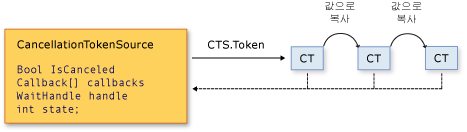

# 관리되는 스레드의 취소
[!INCLUDE[net_v40_long](../../../includes/net-v40-long-md.md)]부터 .NET Framework에서는 비동기 또는 장기 실행 비동기 작업의 협조적 취소를 위한 통합 모델을 사용합니다. 이 모델은 취소 토큰이라는 경량 개체에 기반을 둡니다. 취소할 수 있는 작업 하나 이상을 호출하는 개체가 새 스레드나 작업 등을 만드는 방식으로 토큰을 각 작업에 전달합니다. 개별 작업이 토큰 복사본을 다시 다른 작업에 전달할 수 있습니다. 나중에 토큰을 만든 개체가 해당 토큰을 사용하여 관련 작업이 수행 중인 작업을 중지하도록 요청할 수 있습니다. 요청 개체만 취소 요청을 실행할 수 있고 각 수신기는 적절한 시간에 적절한 방식으로 요청을 알리고 요청에 응답해야 합니다.  
  
 협조적 취소 모델을 구현하는 일반적인 패턴은 다음과 같습니다.  
  
-   개별 취소 토큰을 관리하고 토큰에 취소 알림을 보내는 <xref:System.Threading.CancellationTokenSource> 개체를 인스턴스화합니다.  
  
-   <xref:System.Threading.CancellationTokenSource.Token%2A?displayProperty=nameWithType> 속성에서 반환된 토큰을 취소를 수신 대기하는 각 작업이나 스레드에 전달합니다.  
  
-   각 작업이나 스레드가 취소에 응답하는 메커니즘을 제공합니다.  
  
-   <xref:System.Threading.CancellationTokenSource.Cancel%2A?displayProperty=nameWithType> 메서드를 호출하여 취소 알림을 제공합니다.  
  
> [!IMPORTANT]
>  <xref:System.Threading.CancellationTokenSource> 클래스는 <xref:System.IDisposable> 인터페이스를 구현합니다. 취소 토큰 소스 사용을 마치면 <xref:System.Threading.CancellationTokenSource.Dispose%2A?displayProperty=nameWithType> 메서드를 호출하여 토큰에 포함된 관리되지 않는 리소스를 해제해야 합니다.  
  
 다음 그림에서는 토큰 소스와 모든 토큰 복사본의 관계를 보여 줍니다.  
  
   
  
 새 취소 모델을 통해 취소 인식 응용 프로그램 및 라이브러리를 더 쉽게 만들 수 있고 이 모델은 다음 기능을 지원합니다.  
  
-   취소는 협조적이고 수신기에 적용되지 않습니다. 수신기는 취소 요청에 대한 응답으로 정상적으로 종료하는 방법을 결정합니다.  
  
-   요청은 수신 대기와 다릅니다. 취소할 수 있는 작업을 호출하는 개체는 취소가 있더라도 취소가 요청되는 시점을 제어할 수 있습니다.  
  
-   요청 개체는 단 하나의 메서드 호출을 통해 모든 토큰 복사본에 대해 취소 요청을 실행합니다.  
  
-   수신기는 여러 토큰을 하나의 *연결된 토큰*으로 결합하여 동시에 수신 대기할 수 있습니다.  
  
-   사용자 코드는 라이브러리 코드에서 취소 요청을 인식하고 이 요청에 응답할 수 있고, 라이브러리 코드는 사용자 코드에서 취소 요청을 인식하고 이 요청에 응답할 수 있습니다.  
  
-   수신기는 대기 핸들에 대한 폴링, 콜백 등록 또는 대기를 통해 취소 요청에 대한 알림을 받을 수 있습니다.  
  
## 취소 형식  
 취소 프레임워크는 다음 표에 나열된 관련 형식 집합으로 구현됩니다.  
  
|형식 이름|설명|  
|---------------|-----------------|  
|<xref:System.Threading.CancellationTokenSource>|취소 토큰을 만들고 해당 토큰의 모든 복사본에 대한 취소 요청을 실행하는 개체입니다.|  
|<xref:System.Threading.CancellationToken>|일반적으로 메서드 매개 변수로 수신기 하나 이상에 전달되는 경량 값 형식입니다. 수신기는 핸들을 폴링, 콜백 또는 대기하여 토큰의 `IsCancellationRequested` 속성 값을 모니터링합니다.|  
|<xref:System.OperationCanceledException>|이 예외 생성자의 오버로드는 <xref:System.Threading.CancellationToken>을 매개 변수로 허용합니다. 수신기는 선택적으로 이 예외를 throw하여 취소의 출처를 확인하고 취소 요청에 응답했다는 것을 다른 수신기에 알립니다.|  
  
 새 취소 모델은 여러 가지 형식으로 [!INCLUDE[dnprdnshort](../../../includes/dnprdnshort-md.md)]에 통합되었습니다. 가장 중요한 형식은 <xref:System.Threading.Tasks.Parallel?displayProperty=nameWithType>, <xref:System.Threading.Tasks.Task?displayProperty=nameWithType>, <xref:System.Threading.Tasks.Task%601?displayProperty=nameWithType> 및 <xref:System.Linq.ParallelEnumerable?displayProperty=nameWithType>입니다. 모든 새 라이브러리 및 응용 프로그램 코드에 대해 이 새 취소 모델을 사용하는 것이 좋습니다.  
  
## 코드 예제  
 다음 예제에서는 요청 개체가 <xref:System.Threading.CancellationTokenSource> 개체를 만들고 <xref:System.Threading.CancellationTokenSource.Token%2A> 속성을 취소 가능한 작업에 전달합니다. 요청을 수신하는 작업에서는 폴링을 통해 토큰의 <xref:System.Threading.CancellationToken.IsCancellationRequested%2A> 속성 값을 모니터링합니다. 값이 `true`가 되면 수신기가 적절한 방식이더라도 종료될 수 있습니다. 이 예제에서는 대부분 경우에 모두 필요한 메서드가 종료됩니다.  
  
> [!NOTE]
>  예제에서는 <xref:System.Threading.ThreadPool.QueueUserWorkItem%2A> 메서드를 사용하여 새 취소 프레임워크가 기존 API와 호환된다는 것을 보여 줍니다. 새로운 권장 <xref:System.Threading.Tasks.Task?displayProperty=nameWithType> 형식을 사용하는 예에 대해서는 [방법: 작업 및 해당 자식 취소](../../../docs/standard/parallel-programming/how-to-cancel-a-task-and-its-children.md)를 참조하세요.  
  
 [!code-csharp[Cancellation#1](../../../samples/snippets/csharp/VS_Snippets_Misc/cancellation/cs/cancellationex1.cs#1)]
 [!code-vb[Cancellation#1](../../../samples/snippets/visualbasic/VS_Snippets_Misc/cancellation/vb/cancellationex1.vb#1)]  
  
## 작업 취소 대 개체 취소  
 새 취소 프레임워크에서 취소는 개체가 아니라 작업을 나타냅니다. 취소 요청은 필요한 정리가 수행되고 나서 가능하면 즉시 작업이 중지되어야 함을 의미합니다. 취소 토큰 하나가 “취소할 수 있는 작업" 하나를 나타내야 하지만 해당 작업은 프로그램에서 구현될 수 있습니다. 토큰의 <xref:System.Threading.CancellationToken.IsCancellationRequested%2A> 속성이 `true`로 설정되고 나면 `false`로 재설정될 수 없습니다. 따라서 취소 토큰이 취소된 후에는 해당 토큰을 다시 사용할 수 없습니다.  
  
 개체 취소 메커니즘이 필요하면 다음 예제와 같이 <xref:System.Threading.CancellationToken.Register%2A?displayProperty=nameWithType> 메서드를 호출하여 작업 취소 메커니즘을 기반으로 개체 취소 메커니즘을 적용할 수 있습니다.  
  
 [!code-csharp[Cancellation#2](../../../samples/snippets/csharp/VS_Snippets_Misc/cancellation/cs/objectcancellation1.cs#2)]
 [!code-vb[Cancellation#2](../../../samples/snippets/visualbasic/VS_Snippets_Misc/cancellation/vb/objectcancellation1.vb#2)]  
  
 개체가 동시 취소 가능 작업을 두 개 이상 지원하면 개별 토큰을 개별 취소 가능한 작업에 입력으로 전달합니다. 이런 방식으로 다른 작업에 영향을 미치지 않고 작업을 취소할 수 있습니다.  
  
## 취소 요청 수신 대기 및 응답  
 사용자 대리자에서 취소 가능한 작업의 구현자는 취소 요청에 대한 응답으로 작업을 종료하는 방법을 결정합니다. 대부분 경우에 사용자 대리자는 필요한 정리를 수행하고 즉시 반환될 수 있습니다.  
  
 그러나 더 복잡한 경우에 사용자 대리자가 취소가 발생했다는 정보를 라이브러리 코드에 알려야 할 수 있습니다. 이 경우 작업을 종료하는 올바른 방법은 <xref:System.OperationCanceledException>을 throw하는 <xref:System.Threading.CancellationToken.ThrowIfCancellationRequested%2A> 메서드를 대리자가 호출하는 것입니다. 라이브러리 코드는 사용자 대리자 스레드에서 이 예외를 catch하고 예외의 토큰을 검사하여 예외가 협조적 취소를 나타내는지, 아니면 다른 예외적인 상황인지를 결정합니다.  
  
 <xref:System.Threading.Tasks.Task> 클래스는 이 방식으로 <xref:System.OperationCanceledException>을 처리합니다. 자세한 내용은 [작업 취소](../../../docs/standard/parallel-programming/task-cancellation.md)를 참조하세요.  
  
### 폴링으로 수신 대기  
 루핑되거나 재귀적으로 사용되는 장기 실행 계산의 경우 <xref:System.Threading.CancellationToken.IsCancellationRequested%2A?displayProperty=nameWithType> 속성 값을 주기적으로 폴링하여 취소 요청을 수신 대기할 수 있습니다. 값이 `true`이면 메서드가 가능한 한 빠르게 정리 및 종료되어야 합니다. 최적 폴링 빈도는 응용 프로그램 형식에 따라 다릅니다. 특정 프로그램에 대한 최적 폴링 빈도는 개발자가 결정할 수 있습니다. 폴링 자체는 성능에 큰 영향을 미치지 않습니다. 다음 예제에서는 한 가지 가능한 폴링 방법을 보여 줍니다.  
  
 [!code-csharp[Cancellation#3](../../../samples/snippets/csharp/VS_Snippets_Misc/cancellation/cs/cancellationex11.cs#3)]
 [!code-vb[Cancellation#3](../../../samples/snippets/visualbasic/VS_Snippets_Misc/cancellation/vb/cancellationex11.vb#3)]  
  
 더 자세한 예제를 보려면 [방법: 폴링을 통해 취소 요청 수신 대기](../../../docs/standard/threading/how-to-listen-for-cancellation-requests-by-polling.md)를 참조하세요.  
  
### 콜백을 등록하여 수신 대기  
 일부 작업은 적절한 시기에 취소 토큰의 값을 확인할 수 없는 방식으로 차단될 수 있습니다. 이러한 경우에는 취소 요청이 수신될 때 메서드를 차단 해제하는 콜백 메서드를 등록할 수 있습니다.  
  
 <xref:System.Threading.CancellationToken.Register%2A> 메서드는 특히 이 목적으로 사용되는 <xref:System.Threading.CancellationTokenRegistration> 개체를 반환합니다. 다음 예제에서는 <xref:System.Threading.CancellationToken.Register%2A> 메서드를 사용하여 비동기 웹 요청을 취소하는 방법을 보여 줍니다.  
  
 [!code-csharp[Cancellation#4](../../../samples/snippets/csharp/VS_Snippets_Misc/cancellation/cs/cancellationex4.cs#4)]
 [!code-vb[Cancellation#4](../../../samples/snippets/visualbasic/VS_Snippets_Misc/cancellation/vb/cancellationex4.vb#4)]  
  
 <xref:System.Threading.CancellationTokenRegistration> 개체는 스레드 동기화를 관리하고 콜백이 정확한 시점에 실행을 중지하는지 확인합니다.  
  
 시스템 응답성을 확인하고 교착 상태를 방지하려면 콜백을 등록할 때 다음 지침을 따라야 합니다.  
  
-   콜백 메서드는 동기적으로 호출되어 콜백이 반환될 때까지 <xref:System.Threading.CancellationTokenSource.Cancel%2A>에 대한 호출이 반환되지 않으므로 콜백 메서드는 빨라야 합니다.  
  
-   콜백이 실행되는 동안 <xref:System.Threading.CancellationTokenRegistration.Dispose%2A>를 호출하고 콜백이 대기하도록 잠금을 유지하면 프로그램에서 교착 상태가 발생할 수 있습니다. `Dispose`가 반환되고 나서 콜백에 필요한 리소스를 해제할 수 있습니다.  
  
-   콜백은 한 콜백에서 수동 스레드 또는 <xref:System.Threading.SynchronizationContext> 사용을 수행하면 안 됩니다. 콜백이 특정 스레드에서 실행되어야 하면 대상 syncContext가 활성 <xref:System.Threading.SynchronizationContext.Current%2A?displayProperty=nameWithType>가 되도록 지정할 수 있는 <xref:System.Threading.CancellationTokenRegistration?displayProperty=nameWithType> 생성자를 사용합니다. 콜백에서 수동 스레딩을 수행하면 교착 상태가 발생할 수 있습니다.  
  
 더 자세한 예제를 보려면 [방법: 취소 요청에 대한 콜백 등록](../../../docs/standard/threading/how-to-register-callbacks-for-cancellation-requests.md)을 참조하세요.  
  
### 대기 핸들을 사용하여 수신 대기  
 취소할 수 있는 작업이 <xref:System.Threading.ManualResetEvent?displayProperty=nameWithType> 또는 <xref:System.Threading.Semaphore?displayProperty=nameWithType>와 같은 동기화 기본 형식에서 대기하는 동안 차단되면 <xref:System.Threading.CancellationToken.WaitHandle%2A?displayProperty=nameWithType> 속성을 사용하여 작업이 이벤트 및 취소 요청에서 대기하도록 할 수 있습니다. 취소 토큰의 대기 핸들은 취소 요청에 대한 응답으로 신호가 전송되고 메서드는 <xref:System.Threading.WaitHandle.WaitAny%2A> 메서드의 반환 값을 사용하여 신호를 전송한 취소 토큰이었는지를 판별할 수 있습니다. 그리고 나서 작업은 적절하게 종료되거나 <xref:System.OperationCanceledException>을 throw합니다.  
  
 [!code-csharp[Cancellation#5](../../../samples/snippets/csharp/VS_Snippets_Misc/cancellation/cs/cancellationex9.cs#5)]
 [!code-vb[Cancellation#5](../../../samples/snippets/visualbasic/VS_Snippets_Misc/cancellation/vb/cancellationex9.vb#5)]  
  
 [!INCLUDE[net_v40_long](../../../includes/net-v40-long-md.md)]을(를) 대상으로 지정한 새 코드에서 <xref:System.Threading.ManualResetEventSlim?displayProperty=nameWithType> 및 <xref:System.Threading.SemaphoreSlim?displayProperty=nameWithType>은 둘 다 `Wait` 메서드에서 새 취소 프레임워크를 지원합니다. <xref:System.Threading.CancellationToken>을 메서드에 전달하고 취소가 요청될 대 이벤트가 활성화되어 <xref:System.OperationCanceledException>을 throw합니다.  
  
 [!code-csharp[Cancellation#6](../../../samples/snippets/csharp/VS_Snippets_Misc/cancellation/cs/cancellationex10.cs#6)]
 [!code-vb[Cancellation#6](../../../samples/snippets/visualbasic/VS_Snippets_Misc/cancellation/vb/cancellationex10.vb#6)]  
  
 더 자세한 예제를 보려면 [방법: 대기 핸들이 있는 취소 요청 수신 대기](../../../docs/standard/threading/how-to-listen-for-cancellation-requests-that-have-wait-handles.md)를 참조하세요.  
  
### 동시에 여러 토큰 수신 대기  
 경우에 따라 수신기는 여러 취소 토큰을 동시에 수신 대기해야 할 수 있습니다. 예를 들어 취소 가능한 작업은 외부에서 메서드 매개 변수에 인수로 전달되는 토큰 이외에 내부 취소 토큰을 모니터링해야 할 수 있습니다. 이 작업을 하려면 다음 예제와 같이 토큰 두 개 이상을 토큰 하나로 결합할 수 있는 연결된 토큰 소스를 만듭니다.  
  
 [!code-csharp[Cancellation#7](../../../samples/snippets/csharp/VS_Snippets_Misc/cancellation/cs/cancellationex13.cs#7)]
 [!code-vb[Cancellation#7](../../../samples/snippets/visualbasic/VS_Snippets_Misc/cancellation/vb/cancellationex13.vb#7)]  
  
 작업을 완료했을 때 연결된 토큰 소스에서 `Dispose`를 호출해야 합니다. 더 자세한 예제를 보려면 [방법: 여러 취소 요청 수신 대기](../../../docs/standard/threading/how-to-listen-for-multiple-cancellation-requests.md)를 참조하세요.  
  
## 라이브러리 코드와 사용자 코드 간 협력  
 통합 취소 프레임워크를 사용하면 라이브러리 코드에서 사용자 코드를 취소하고 사용자 코드에서 협조적 방식으로 라이브러리 코드를 취소할 수 있습니다. 원활한 협력은 다음 지침에 따라 양측에 의존합니다.  
  
-   취소 가능한 작업을 제공하는 라이브러리 코드는 사용자 코드가 취소를 요청할 수 있도록 외부 취소 토큰을 허용하는 공용 메서드도 제공해야 합니다.  
  
-   라이브러리 코드가 사용자 코드를 호출하면 라이브러리 코드는 OperationCanceledException(externalToken)을 *협조적 취소*로 해석하고 오류 예외로 해석할 필요는 없습니다.  
  
-   사용자 대리자는 적절한 시간에 라이브러리 코드의 취소 요청에 응답해야 합니다.  
  
 <xref:System.Threading.Tasks.Task?displayProperty=nameWithType> 및 <xref:System.Linq.ParallelEnumerable?displayProperty=nameWithType>은 이들 지침을 따르는 클래스의 예입니다. 자세한 내용은 [작업 취소](../../../docs/standard/parallel-programming/task-cancellation.md) 및 [방법: PLINQ 쿼리 취소](../../../docs/standard/parallel-programming/how-to-cancel-a-plinq-query.md)를 참조하세요.  
  
## 참고 항목  
 [관리되는 스레딩 기본 사항](../../../docs/standard/threading/managed-threading-basics.md)
