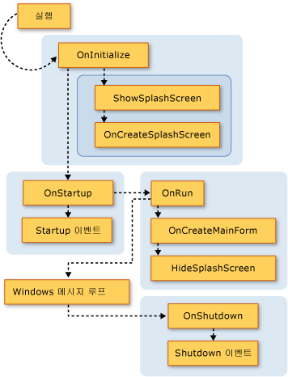
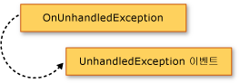

# Extending the Visual Basic Application Model
[!INCLUDE[vs2017banner](../../../visual-basic/developing-apps/includes/vs2017banner.md)]

<xref:Microsoft.VisualBasic.ApplicationServices.WindowsFormsApplicationBase> 클래스의 `Overridable` 멤버를 재정의하여 응용 프로그램 모델에 기능을 추가할 수 있습니다.  이 기술을 사용하면 응용 프로그램 모델의 동작을 사용자 지정하고 응용 프로그램이 시작 및 종료될 때 사용자 고유의 메서드에 호출을 추가할 수 있습니다.  
  
## 응용 프로그램 모델의 시각적 개요  
 이 단원에서는 Visual Basic 응용 프로그램 모델에서 일련의 함수 호출을 시각적으로 나타냅니다.  다음 단원에서는 각 함수의 용도를 자세하게 설명합니다.  
  
 다음 그래픽에서는 일반적인 Visual Basic Windows Forms 응용 프로그램의 응용 프로그램 모델 호출 시퀀스를 보여 줍니다.  `Sub Main` 프로시저에서 <xref:Microsoft.VisualBasic.ApplicationServices.WindowsFormsApplicationBase.Run%2A> 메서드를 호출할 때 시퀀스가 시작됩니다.  
  
   
  
 또한 Visual Basic 응용 프로그램 모델은 <xref:Microsoft.VisualBasic.ApplicationServices.WindowsFormsApplicationBase.StartupNextInstance> 및 <xref:Microsoft.VisualBasic.ApplicationServices.WindowsFormsApplicationBase.UnhandledException> 이벤트도 제공합니다.  다음 그래픽에서는 이러한 이벤트를 발생시키는 메커니즘을 보여 줍니다.  
  
   
  
   
  
## 기본 메서드 재정의  
 <xref:Microsoft.VisualBasic.ApplicationServices.WindowsFormsApplicationBase.Run%2A> 메서드는 `Application` 메서드가 실행되는 순서를 정의합니다.  기본적으로 Windows Forms 응용 프로그램의 `Sub Main` 프로시저는 <xref:Microsoft.VisualBasic.ApplicationServices.WindowsFormsApplicationBase.Run%2A> 메서드를 호출합니다.  
  
 응용 프로그램이 일반 응용 프로그램\(다중 인스턴스 응용 프로그램\)이거나 단일 인스턴스 응용 프로그램의 첫 번째 인스턴스인 경우 <xref:Microsoft.VisualBasic.ApplicationServices.WindowsFormsApplicationBase.Run%2A> 메서드는 `Overridable` 메서드를 다음 순서로 실행합니다.  
  
1.  <xref:Microsoft.VisualBasic.ApplicationServices.WindowsFormsApplicationBase.OnInitialize%2A>.  기본적으로 이 메서드는 응용 프로그램에서 Windows 인증을 사용하는 경우 기본 응용 프로그램 스레드의 비주얼 스타일, 텍스트 표시 스타일 및 현재 보안 주체를 설정하고 `/nosplash`와 `-nosplash`가 모두 명령줄 인수로 사용되지 않는 경우 `ShowSplashScreen`을 호출합니다.  
  
     이 함수가 `False`를 반환하면 응용 프로그램 시작 시퀀스가 취소됩니다.  응용 프로그램을 실행하지 않아야 하는 상황일 경우에 유용합니다.  
  
     <xref:Microsoft.VisualBasic.ApplicationServices.WindowsFormsApplicationBase.OnInitialize%2A> 메서드는 다음 메서드를 호출합니다.  
  
    1.  <xref:Microsoft.VisualBasic.ApplicationServices.WindowsFormsApplicationBase.ShowSplashScreen%2A>.  응용 프로그램에 시작 화면이 정의되어 있는지 확인하여 정의되어 있으면 별도 스레드에 시작 화면을 표시합니다.  
  
         <xref:Microsoft.VisualBasic.ApplicationServices.WindowsFormsApplicationBase.ShowSplashScreen%2A> 메서드에는 최소한 <xref:Microsoft.VisualBasic.ApplicationServices.WindowsFormsApplicationBase.MinimumSplashScreenDisplayTime%2A> 속성으로 지정된 밀리초 동안 시작 화면을 표시하는 코드가 포함되어 있습니다.  이 기능을 사용하려면 `My.Application.MinimumSplashScreenDisplayTime` 속성을 2초로 지정하는 **프로젝트 디자이너**를 사용하여 응용 프로그램에 시작 화면을 추가하거나, <xref:Microsoft.VisualBasic.ApplicationServices.WindowsFormsApplicationBase.OnInitialize%2A> 또는 <xref:Microsoft.VisualBasic.ApplicationServices.WindowsFormsApplicationBase.OnCreateSplashScreen%2A> 메서드를 재정의하는 `My.Application.MinimumSplashScreenDisplayTime` 속성을 메서드에 설정해야 합니다.  자세한 내용은 <xref:Microsoft.VisualBasic.ApplicationServices.WindowsFormsApplicationBase.MinimumSplashScreenDisplayTime%2A>을 참조하십시오.  
  
    2.  <xref:Microsoft.VisualBasic.ApplicationServices.WindowsFormsApplicationBase.OnCreateSplashScreen%2A>.  디자이너에서 시작 화면을 초기화하는 코드를 내보내도록 합니다.  
  
         기본적으로 이 메서드는 아무 작업도 수행하지 않습니다.  그러나 [!INCLUDE[vbprvb](../../../csharp/programming-guide/concepts/linq/includes/vbprvb-md.md)] **프로젝트 디자이너**에서 응용 프로그램의 시작 화면을 선택하면 디자이너는 <xref:Microsoft.VisualBasic.ApplicationServices.WindowsFormsApplicationBase.SplashScreen%2A> 속성을 시작 화면 폼의 새 인스턴스로 설정하는 메서드를 사용하여 <xref:Microsoft.VisualBasic.ApplicationServices.WindowsFormsApplicationBase.OnCreateSplashScreen%2A> 메서드를 재정의합니다.  
  
2.  <xref:Microsoft.VisualBasic.ApplicationServices.WindowsFormsApplicationBase.OnStartup%2A>.  `Startup` 이벤트를 발생시키기 위한 확장 지점을 제공합니다.  이 함수가 `False`를 반환하면 응용 프로그램 시작 시퀀스가 중지됩니다.  
  
     기본적으로 이 메서드는 <xref:Microsoft.VisualBasic.ApplicationServices.WindowsFormsApplicationBase.Startup> 이벤트를 발생시킵니다.  이벤트 처리기가 이벤트 인수의 <xref:System.ComponentModel.CancelEventArgs.Cancel%2A> 속성을 `True`로 설정하면 메서드는 `False`를 반환하여 응용 프로그램 시작을 취소합니다.  
  
3.  <xref:Microsoft.VisualBasic.ApplicationServices.WindowsFormsApplicationBase.OnRun%2A>.  초기화가 완료된 후 기본 응용 프로그램 실행을 시작할 준비가 되면 시작 지점을 제공합니다.  
  
     기본적으로 Windows Forms 메시지 루프에 들어가기 전에 이 메서드는 `OnCreateMainForm` 메서드를 호출하여 응용 프로그램의 기본 폼을 만들고 `HideSplashScreen` 메서드를 호출하여 시작 화면을 닫습니다.  
  
    1.  <xref:Microsoft.VisualBasic.ApplicationServices.WindowsFormsApplicationBase.OnCreateMainForm%2A>.  디자이너에서 이 메서드를 통해 기본 폼을 초기화하는 코드를 내보낼 수 있습니다.  
  
         기본적으로 이 메서드는 아무 작업도 수행하지 않습니다.  그러나 [!INCLUDE[vbprvb](../../../csharp/programming-guide/concepts/linq/includes/vbprvb-md.md)] **프로젝트 디자이너**에서 응용 프로그램의 기본 폼을 선택하면 디자이너는 <xref:Microsoft.VisualBasic.ApplicationServices.WindowsFormsApplicationBase.MainForm%2A> 속성을 기본 폼의 새 인스턴스로 설정하는 메서드를 사용하여 <xref:Microsoft.VisualBasic.ApplicationServices.WindowsFormsApplicationBase.OnCreateMainForm%2A> 메서드를 재정의합니다.  
  
    2.  <xref:Microsoft.VisualBasic.ApplicationServices.WindowsFormsApplicationBase.HideSplashScreen%2A>.  응용 프로그램에 시작 화면이 정의되어 있고 시작 화면이 열려 있으면 이 메서드는 시작 화면을 닫습니다.  
  
         기본적으로 이 메서드는 시작 화면을 닫습니다.  
  
4.  <xref:Microsoft.VisualBasic.ApplicationServices.WindowsFormsApplicationBase.OnStartupNextInstance%2A>.  이 메서드를 통해 단일 인스턴스 응용 프로그램이 해당 응용 프로그램의 다른 인스턴스가 시작될 경우 어떻게 작동하도록 할 것인지를 사용자 지정할 수 있습니다.  
  
     기본적으로 이 메서드는 <xref:Microsoft.VisualBasic.ApplicationServices.WindowsFormsApplicationBase.StartupNextInstance> 이벤트를 발생시킵니다.  
  
5.  <xref:Microsoft.VisualBasic.ApplicationServices.WindowsFormsApplicationBase.OnShutdown%2A>.  `Shutdown` 이벤트를 발생시키기 위한 확장 지점을 제공합니다.  주 응용 프로그램에서 처리되지 않은 예외가 발생하면 이 메서드는 실행되지 않습니다.  
  
     기본적으로 이 메서드는 <xref:Microsoft.VisualBasic.ApplicationServices.WindowsFormsApplicationBase.Shutdown> 이벤트를 발생시킵니다.  
  
6.  <xref:Microsoft.VisualBasic.ApplicationServices.WindowsFormsApplicationBase.OnUnhandledException%2A>.  위의 메서드 중에서 처리되지 않은 예외가 발생할 경우 실행됩니다.  
  
     디버거가 연결되어 있지 않고 응용 프로그램에서 `UnhandledException` 이벤트를 처리할 경우 기본적으로 이 메서드는 <xref:Microsoft.VisualBasic.ApplicationServices.WindowsFormsApplicationBase.UnhandledException> 이벤트를 발생시킵니다.  
  
 응용 프로그램이 단일 인스턴스 응용 프로그램이고 이 응용 프로그램이 이미 실행되고 있으면 이후의 응용 프로그램 인스턴스는 원래 응용 프로그램 인스턴스의 <xref:Microsoft.VisualBasic.ApplicationServices.WindowsFormsApplicationBase.OnStartupNextInstance%2A> 메서드를 호출한 다음 종료됩니다.  
  
 <xref:Microsoft.VisualBasic.ApplicationServices.WindowsFormsApplicationBase> 생성자는 <xref:Microsoft.VisualBasic.ApplicationServices.WindowsFormsApplicationBase.UseCompatibleTextRendering%2A> 속성을 호출하여 응용 프로그램의 폼에 사용할 텍스트 렌더링 엔진을 결정합니다.  기본적으로 <xref:Microsoft.VisualBasic.ApplicationServices.WindowsFormsApplicationBase.UseCompatibleTextRendering%2A> 속성은 `False`를 반환하는데, 이 값은 [!INCLUDE[vbprvblong](../../../visual-basic/developing-apps/customizing-extending-my/includes/vbprvblong-md.md)]의 기본값인 GDI 텍스트 렌더링 엔진이 사용된다는 것을 나타냅니다.  <xref:Microsoft.VisualBasic.ApplicationServices.WindowsFormsApplicationBase.UseCompatibleTextRendering%2A> 속성을 재정의하여 `True`를 반환할 수 있습니다. 즉, Visual Basic .NET 2002 및 Visual Basic .NET 2003의 기본값인 GDI\+ 텍스트 렌더링 엔진을 사용한다는 것을 나타냅니다.  
  
## 응용 프로그램 구성  
 [!INCLUDE[vbprvb](../../../csharp/programming-guide/concepts/linq/includes/vbprvb-md.md)] 응용 프로그램 모델의 일부인 <xref:Microsoft.VisualBasic.ApplicationServices.WindowsFormsApplicationBase> 클래스는 응용 프로그램을 구성하는 protected 속성을 제공합니다.  이들 속성은 구현 클래스의 생성자에서 설정해야 합니다.  
  
 기본 Windows Forms 프로젝트의 경우 **프로젝트 디자이너**에서 속성을 디자이너 설정으로 설정하는 코드를 생성합니다.  속성은 응용 프로그램이 시작될 때만 사용됩니다. 응용 프로그램이 시작된 이후에 설정하면 아무런 효과가 없습니다.  
  
||||  
|-|-|-|  
|속성|기능|프로젝트 디자이너의 응용 프로그램 창에서 설정합니다.|  
|<xref:Microsoft.VisualBasic.ApplicationServices.WindowsFormsApplicationBase.IsSingleInstance%2A>|응용 프로그램이 단일 인스턴스로 실행되는지 다중 인스턴스 응용 프로그램으로 실행되는지를 결정합니다.|**단일 인스턴스 응용 프로그램 작성** 확인란|  
|<xref:Microsoft.VisualBasic.ApplicationServices.WindowsFormsApplicationBase.EnableVisualStyles%2A>|응용 프로그램에 맞는 Windows XP 비주얼 스타일을 사용할 경우.|**XP 비주얼 스타일 사용** 확인란|  
|<xref:Microsoft.VisualBasic.ApplicationServices.WindowsFormsApplicationBase.SaveMySettingsOnExit%2A>|응용 프로그램이 종료될 때 응용 프로그램의 사용자 설정 변경 내용을 자동으로 저장하는지 결정합니다.|**시스템 종료에서 종료할 때 My.Settings 저장** 확인란|  
|<xref:Microsoft.VisualBasic.ApplicationServices.WindowsFormsApplicationBase.ShutdownStyle%2A>|응용 프로그램이 종료, 시작 폼을 닫을 때 또는 마지막 폼을 닫을 때 등 원인이 무엇 인지.|**종료 모드가** 목록|  
  
## 참고 항목  
 <xref:Microsoft.VisualBasic.ApplicationServices.ApplicationBase>   
 <xref:Microsoft.VisualBasic.ApplicationServices.WindowsFormsApplicationBase.Startup>   
 <xref:Microsoft.VisualBasic.ApplicationServices.WindowsFormsApplicationBase.StartupNextInstance>   
 <xref:Microsoft.VisualBasic.ApplicationServices.WindowsFormsApplicationBase.UnhandledException>   
 <xref:Microsoft.VisualBasic.ApplicationServices.WindowsFormsApplicationBase.Shutdown>   
 <xref:Microsoft.VisualBasic.ApplicationServices.WindowsFormsApplicationBase.NetworkAvailabilityChanged>   
 <xref:Microsoft.VisualBasic.ApplicationServices.WindowsFormsApplicationBase>   
 [Overview of the Visual Basic Application Model](../../../visual-basic/developing-apps/development-with-my/overview-of-the-visual-basic-application-model.md)   
 [프로젝트 디자이너, 응용 프로그램 페이지\(Visual Basic\)](/visual-studio/ide/reference/application-page-project-designer-visual-basic)