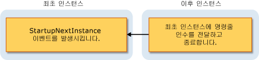

# Visual Basic 응용 프로그램 모델 개요Overview of the Visual Basic Application Model
[!INCLUDE[vbprvb](../../../csharp/programming-guide/concepts/linq/includes/vbprvb_md.md)]Windows Forms 응용 프로그램의 동작을 제어 하기 위한 잘 정의 된 모델을 제공 합니다:는 [!INCLUDE[vbprvb](../../../csharp/programming-guide/concepts/linq/includes/vbprvb_md.md)] 응용 프로그램 모델입니다. provides a well-defined model for controlling the behavior of Windows Forms applications: the [!INCLUDE[vbprvb](../../../csharp/programming-guide/concepts/linq/includes/vbprvb_md.md)] Application model. 이 모델에 대 한 처리 되지 않은 예외를 catch 하는 이벤트 뿐만 아니라 응용 프로그램의 시작 및 종료를 처리 하기 위해 이벤트를 포함 합니다.This model includes events for handling the application's startup and shutdown, as well as events for catching unhandled exceptions. 단일 인스턴스 응용 프로그램 개발에 대 한 지원 기능을 제공 합니다.It also provides support for developing single-instance applications. 응용 프로그램 모델 확장 가능 이므로 더 많은 제어가 필요한 개발자는 재정의 가능한 메서드를 사용자 지정할 수 있습니다.The application model is extensible, so developers that need more control can customize its overridable methods.  
  
## 응용 프로그램 모델에 대 한 사용Uses for the Application Model  
 일반적인 응용 프로그램은 시작 하 고 종료 하는 경우 작업을 수행 해야 합니다.A typical application needs to perform tasks when it starts up and shuts down. 예를 들어를 시작할 때 응용 프로그램 수 시작 화면을 표시, 데이터베이스 연결을 확인, 저장된 된 상태를 로드 및 등입니다.For example, when it starts up, the application can display a splash screen, make database connections, load a saved state, and so on. 응용 프로그램을 종료 하는 경우 데이터베이스 연결을 닫을 하 고, 현재 상태를 저장 하 고, 등 수 것입니다.When the application shuts down, it can close database connections, save the current state, and so on. 또한 통해 응용 프로그램 종료 될 때 특정 코드를 실행할 수 아래로 예기치 않게 같은 처리 되지 않은 예외가 발생 한 경우 처럼 합니다.In addition, the application can execute specific code when the application shuts down unexpectedly, such as during an unhandled exception.  
  
 [!INCLUDE[vbprvb](../../../csharp/programming-guide/concepts/linq/includes/vbprvb_md.md)] 응용 프로그램 모델을 사용 하면 쉽게 만들 수는 *단일 인스턴스* 응용 프로그램입니다.The [!INCLUDE[vbprvb](../../../csharp/programming-guide/concepts/linq/includes/vbprvb_md.md)] Application model makes it easy to create a *single-instance* application. 단일 인스턴스 응용 프로그램을 일반 응용 프로그램에서 응용 프로그램의 인스턴스 하나만 실행할 수 한 번에 차이가 있습니다.A single-instance application differs from a normal application in that only one instance of the application can be running at a time. 단일 인스턴스 응용 프로그램의 다른 인스턴스를 시작 하려고 하면 발생 한 알림을 받지 원본 인스턴스에-방법으로 `StartupNextInstance` 이벤트-다른 실행이 시도 했습니다.An attempt to launch another instance of a single-instance application results in the original instance being notified—by means of the `StartupNextInstance` event—that another launch attempt was made. 알림을 후속 인스턴스의 명령줄 인수를 포함합니다.The notification includes the subsequent instance's command-line arguments. 초기화가 실행 되기 전에 응용 프로그램의 후속 인스턴스가 닫힙니다.The subsequent instance of the application is then closed before any initialization can occur.  
  
 단일 인스턴스 응용 프로그램을 시작 하 고 첫 번째 인스턴스 또는 응용 프로그램의 후속 인스턴스에 인지 확인 합니다.A single-instance application starts and checks whether it is the first instance or a subsequent instance of the application:  
  
-   첫 번째 인스턴스를 정상적으로 시작 됩니다.If it is the first instance, it starts as usual.  
  
-   첫 번째 인스턴스가 실행 되는 동안 응용 프로그램을 시작 하려고 할 때마다 매우 다른 동작이 발생 합니다.Each subsequent attempt to start the application, while the first instance runs, results in very different behavior. 후속 시도 명령줄 인수에 대 한 첫 번째 인스턴스를 알리고 즉시 종료 됩니다.The subsequent attempt notifies the first instance about the command-line arguments, and then immediately exits. 첫 번째 인스턴스 핸들은 `StartupNextInstance` 이벤트를 확인 하 고 후속 인스턴스의 명령줄 인수를 계속 실행 합니다.The first instance handles the `StartupNextInstance` event to determine what the subsequent instance's command-line arguments were, and continues to run.  
  
     이 다이어그램에서는 후속 인스턴스가 첫 번째 인스턴스를 알리는 방법을 보여 줍니다.This diagram shows how a subsequent instance signals the first instance.  
  
       
  
 처리는 `StartupNextInstance` 이벤트를 단일 인스턴스 응용 프로그램의 동작을 제어할 수 있습니다.By handling the `StartupNextInstance` event, you can control how your single-instance application behaves. 예를 들어, Microsoft Outlook는 일반적으로 실행 단일 인스턴스 응용 프로그램입니다. Outlook이 실행 되 고 Outlook을 시작 하려고 할 때 원래 인스턴스에 포커스가 이동 이번 다른 인스턴스가 열리지 않습니다.For example, Microsoft Outlook typically runs as a single-instance application; when Outlook is running and you attempt to start Outlook again, focus shifts to the original instance but another instance does not open.  
  
## 응용 프로그램 모델의 이벤트Events in the Application Model  
 다음 이벤트가 되는 응용 프로그램 모델에 있습니다.The following events are found in the application model:  
  
-   **응용 프로그램 시작**합니다.**Application startup**. 발생 된 <xref:Microsoft.VisualBasic.ApplicationServices.WindowsFormsApplicationBase.Startup>시작 될 때 이벤트.</xref:Microsoft.VisualBasic.ApplicationServices.WindowsFormsApplicationBase.Startup>The application raises the <xref:Microsoft.VisualBasic.ApplicationServices.WindowsFormsApplicationBase.Startup> event when it starts. 이 이벤트를 처리 하 여 기본 폼을 로드 하기 전에 응용 프로그램을 초기화 하는 코드를 추가할 수 있습니다.By handling this event, you can add code that initializes the application before the main form is loaded. `Startup` 이벤트 시작 프로세스의 해당 단계에서 응용 프로그램의 실행 취소에 대 한 원하는 경우도 제공 합니다.The `Startup` event also provides for canceling execution of the application during that phase of the startup process, if desired.  
  
     응용 프로그램 시작 코드가 실행 되는 동안 시작 화면을 표시 하려면 응용 프로그램을 구성할 수 있습니다.You can configure the application to show a splash screen while the application startup code runs. 기본적으로 응용 프로그램 모델 시작을 억제 때 화면 중 하나는 `/nosplash` 또는 `-nosplash` 명령줄 인수를 사용 합니다.By default, the application model suppresses the splash screen when either the `/nosplash` or `-nosplash` command-line argument is used.  
  
-   **단일 인스턴스 응용 프로그램**합니다.**Single-instance applications**. <xref:Microsoft.VisualBasic.ApplicationServices.WindowsFormsApplicationBase.StartupNextInstance>이벤트는 단일 인스턴스 응용 프로그램의 후속 인스턴스가 시작 될 때 발생 합니다.</xref:Microsoft.VisualBasic.ApplicationServices.WindowsFormsApplicationBase.StartupNextInstance>The <xref:Microsoft.VisualBasic.ApplicationServices.WindowsFormsApplicationBase.StartupNextInstance> event is raised when a subsequent instance of a single-instance application starts. 이 이벤트는 후속 인스턴스의 명령줄 인수를 전달합니다.The event passes the command-line arguments of the subsequent instance.  
  
-   **처리 되지 않은 예외**합니다.**Unhandled exceptions**. 응용 프로그램에서 처리 되지 않은 예외를 발견 하는 경우 발생는 <xref:Microsoft.VisualBasic.ApplicationServices.WindowsFormsApplicationBase.UnhandledException>이벤트.</xref:Microsoft.VisualBasic.ApplicationServices.WindowsFormsApplicationBase.UnhandledException>If the application encounters an unhandled exception, it raises the <xref:Microsoft.VisualBasic.ApplicationServices.WindowsFormsApplicationBase.UnhandledException> event. 해당 이벤트의 처리기는 예외를 검사 하 고 실행을 계속 여부를 확인할 수 있습니다.Your handler for that event can examine the exception and determine whether to continue execution.  
  
     `UnhandledException` 경우에 따라 이벤트가 발생 하지 않습니다.The `UnhandledException` event is not raised in some circumstances. 자세한 내용은 <xref:Microsoft.VisualBasic.ApplicationServices.WindowsFormsApplicationBase.UnhandledException>.</xref:Microsoft.VisualBasic.ApplicationServices.WindowsFormsApplicationBase.UnhandledException> 을 참조 하십시오.For more information, see <xref:Microsoft.VisualBasic.ApplicationServices.WindowsFormsApplicationBase.UnhandledException>.  
  
-   **네트워크 연결 변경**합니다.**Network-connectivity changes**. 응용 프로그램 발생 하는 컴퓨터의 네트워크 가용성 변경 되는 경우는 <xref:Microsoft.VisualBasic.ApplicationServices.WindowsFormsApplicationBase.NetworkAvailabilityChanged>이벤트.</xref:Microsoft.VisualBasic.ApplicationServices.WindowsFormsApplicationBase.NetworkAvailabilityChanged>If the computer's network availability changes, the application raises the <xref:Microsoft.VisualBasic.ApplicationServices.WindowsFormsApplicationBase.NetworkAvailabilityChanged> event.  
  
     `NetworkAvailabilityChanged` 경우에 따라 이벤트가 발생 하지 않습니다.The `NetworkAvailabilityChanged` event is not raised in some circumstances. 자세한 내용은 <xref:Microsoft.VisualBasic.ApplicationServices.WindowsFormsApplicationBase.NetworkAvailabilityChanged>.</xref:Microsoft.VisualBasic.ApplicationServices.WindowsFormsApplicationBase.NetworkAvailabilityChanged> 을 참조 하십시오.For more information, see <xref:Microsoft.VisualBasic.ApplicationServices.WindowsFormsApplicationBase.NetworkAvailabilityChanged>.  
  
-   **응용 프로그램을 종료할**합니다.**Application shut down**. 응용 프로그램이 제공 된 <xref:Microsoft.VisualBasic.ApplicationServices.WindowsFormsApplicationBase.Shutdown>종료 되려고 할 때 신호를 보내는 이벤트.</xref:Microsoft.VisualBasic.ApplicationServices.WindowsFormsApplicationBase.Shutdown>The application provides the <xref:Microsoft.VisualBasic.ApplicationServices.WindowsFormsApplicationBase.Shutdown> event to signal when it is about to shut down. 이벤트 처리기를 수 있게 하는 작업 응용 프로그램을 수행 해야 하는지-닫기 및 예를 들어 저장-완료 됩니다.In that event handler, you can make sure that the operations your application needs to perform—closing and saving, for example—are completed. 기본 폼이 닫힐 때 종료 하거나 모든 폼이 닫힐 때만 종료 하려면 응용 프로그램을 구성할 수 있습니다.You can configure your application to shut down when the main form closes, or to shut down only when all forms close.  
  
## 가용성Availability  
 기본적으로는 [!INCLUDE[vbprvb](../../../csharp/programming-guide/concepts/linq/includes/vbprvb_md.md)] 응용 프로그램 모델은 Windows Forms 프로젝트에 사용할 수 있습니다.By default, the [!INCLUDE[vbprvb](../../../csharp/programming-guide/concepts/linq/includes/vbprvb_md.md)] Application model is available for Windows Forms projects. 다른 시작 개체를 사용 하 여 응용 프로그램을 구성 하는 경우 또는 응용 프로그램 코드를 사용자 지정 시작 `Sub Main`, 하는 개체 또는 클래스의 구현을 제공 해야 할 수는 <xref:Microsoft.VisualBasic.ApplicationServices.WindowsFormsApplicationBase>응용 프로그램 모델을 사용 하는 클래스입니다.</xref:Microsoft.VisualBasic.ApplicationServices.WindowsFormsApplicationBase>If you configure the application to use a different startup object, or start the application code with a custom `Sub Main`, then that object or class may need to provide an implementation of the <xref:Microsoft.VisualBasic.ApplicationServices.WindowsFormsApplicationBase> class to use the application model. 시작 개체를 변경 하는 방법에 대 한 정보를 참조 하십시오. [응용 프로그램 페이지, 프로젝트 디자이너 (Visual Basic)](https://docs.microsoft.com/visualstudio/ide/reference/application-page-project-designer-visual-basic)합니다.For information about changing the startup object, see [Application Page, Project Designer (Visual Basic)](https://docs.microsoft.com/visualstudio/ide/reference/application-page-project-designer-visual-basic).  
  
## 참고 항목See Also  
 <xref:Microsoft.VisualBasic.ApplicationServices.WindowsFormsApplicationBase></xref:Microsoft.VisualBasic.ApplicationServices.WindowsFormsApplicationBase><xref:Microsoft.VisualBasic.ApplicationServices.WindowsFormsApplicationBase>   
 <xref:Microsoft.VisualBasic.ApplicationServices.WindowsFormsApplicationBase.Startup></xref:Microsoft.VisualBasic.ApplicationServices.WindowsFormsApplicationBase.Startup><xref:Microsoft.VisualBasic.ApplicationServices.WindowsFormsApplicationBase.Startup>   
 <xref:Microsoft.VisualBasic.ApplicationServices.WindowsFormsApplicationBase.StartupNextInstance></xref:Microsoft.VisualBasic.ApplicationServices.WindowsFormsApplicationBase.StartupNextInstance><xref:Microsoft.VisualBasic.ApplicationServices.WindowsFormsApplicationBase.StartupNextInstance>   
 <xref:Microsoft.VisualBasic.ApplicationServices.WindowsFormsApplicationBase.UnhandledException></xref:Microsoft.VisualBasic.ApplicationServices.WindowsFormsApplicationBase.UnhandledException><xref:Microsoft.VisualBasic.ApplicationServices.WindowsFormsApplicationBase.UnhandledException>   
 <xref:Microsoft.VisualBasic.ApplicationServices.WindowsFormsApplicationBase.Shutdown></xref:Microsoft.VisualBasic.ApplicationServices.WindowsFormsApplicationBase.Shutdown><xref:Microsoft.VisualBasic.ApplicationServices.WindowsFormsApplicationBase.Shutdown>   
 <xref:Microsoft.VisualBasic.ApplicationServices.WindowsFormsApplicationBase.NetworkAvailabilityChanged></xref:Microsoft.VisualBasic.ApplicationServices.WindowsFormsApplicationBase.NetworkAvailabilityChanged><xref:Microsoft.VisualBasic.ApplicationServices.WindowsFormsApplicationBase.NetworkAvailabilityChanged>   
 <xref:Microsoft.VisualBasic.ApplicationServices.WindowsFormsApplicationBase></xref:Microsoft.VisualBasic.ApplicationServices.WindowsFormsApplicationBase><xref:Microsoft.VisualBasic.ApplicationServices.WindowsFormsApplicationBase>   
 [Visual Basic 응용 프로그램 모델 확장](../../../visual-basic/developing-apps/customizing-extending-my/extending-the-visual-basic-application-model.md) [Extending the Visual Basic Application Model](../../../visual-basic/developing-apps/customizing-extending-my/extending-the-visual-basic-application-model.md)
