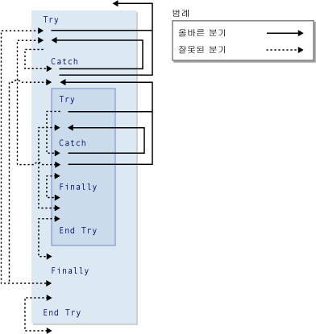

# GoTo Statement
[!INCLUDE[vs2017banner](../../../visual-basic/developing-apps/includes/vs2017banner.md)]

프로시저의 지정된 줄로 무조건 분기합니다.  
  
## 구문  
  
```  
GoTo line  
```  
  
## 파트  
 `line`  
 필수 요소.  임의의 줄 레이블입니다.  
  
## 설명  
 `GoTo` 문은 프로시저의 줄로만 분기할 수 있습니다.  줄에는 `GoTo`가 참조할 수 있는 줄 레이블이 있어야 합니다.  자세한 내용은 [How to: Label Statements](../../../visual-basic/programming-guide/program-structure/how-to-label-statements.md)을 참조하십시오.  
  
> [!NOTE]
>  `GoTo` 문을 사용하면 코드를 읽고 유지하는 것이 어렵게 됩니다.  가능하면 컨트롤 구조를 사용하는 것이 좋습니다.  자세한 내용은 [Control Flow](../../../visual-basic/programming-guide/language-features/control-flow/index.md)를 참조하십시오.  
  
 `For`...`Next`, `For Each`...`Next`, `SyncLock`...`End SyncLock`, `Try`...`Catch`...`Finally`, `With`...`End With` 또는 `Using`...`End Using` 구문 외부에서 내부 레이블로 분기하는 데 `GoTo` 문을 사용할 수 없습니다.  
  
## 분기 및 Try 구문  
 `Try`...`Catch`...`Finally` 구문 내에서 `GoTo` 문을 사용하여 분기할 때 다음 규칙을 적용합니다.  
  
|블록 또는 지역|외부에서 내부로 분기|내부에서 외부로 분기|  
|--------------|-----------------|-----------------|  
|`Try` 블록|동일한 구문<sup>1</sup>의 `Catch` 블록에서만 가능|전체 구문의 외부에만 가능|  
|`Catch` 블록|허용하지 않음|전체 구문의 외부 또는 동일한 구문<sup>1</sup>의 `Try` 블록에만 가능|  
|`Finally` 블록|허용하지 않음|허용하지 않음|  
  
 <sup>1</sup> 하나의 `Try`...`Catch`...`Finally` 구문이 다른 Try...Catch...Finally 구문에 중첩된 경우 `Catch` 블록은 같은 중첩 수준에 있는 `Try` 블록으로 분기할 수 있지만 다른 중첩 수준의 `Try` 블록으로는 분기할 수 없습니다.  중첩된 `Try`...`Catch`...`Finally` 구문은 중첩된 내부에 있는 구문의 `Try` 또는 `Catch` 블록 내에 완전히 포함되어 있어야 합니다.  
  
 다음 그림은 다른 구문 내에 중첩된 하나의 `Try` 구문을 보여 줍니다.  두 구문의 블록 사이에 여러 분기가 올바른 분기 또는 잘못된 분기로 표시되어 있습니다.  
  
   
Try 구문에서의 올바른 분기 및 잘못된 분기  
  
## 예제  
 다음 예제에서는 `GoTo` 문을 사용하여 프로시저의 줄 레이블로 분기합니다.  
  
 [!code-vb[VbVbalrStatements#31](../../../visual-basic/language-reference/error-messages/codesnippet/visualbasic/goto-statement_1.vb)]  
  
## 참고 항목  
 [Do...Loop Statement](../../../visual-basic/language-reference/statements/do-loop-statement.md)   
 [For...Next 문](../../../visual-basic/language-reference/statements/for-next-statement.md)   
 [For Each...Next 문](../../../visual-basic/language-reference/statements/for-each-next-statement.md)   
 [If...Then...Else Statement](../../../visual-basic/language-reference/statements/if-then-else-statement.md)   
 [Select...Case Statement](../../../visual-basic/language-reference/statements/select-case-statement.md)   
 [Try...Catch...Finally Statement](../../../visual-basic/language-reference/statements/try-catch-finally-statement.md)   
 [While...End While Statement](../../../visual-basic/language-reference/statements/while-end-while-statement.md)   
 [With...End With Statement](../../../visual-basic/language-reference/statements/with-end-with-statement.md)