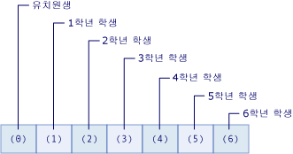

# <a name="arrays-in-visual-basic"></a>Visual Basic의 배열
배열은 초등학교에서 각 학년의 학생 수와 같이 서로 논리적으로 관련된 값의 집합입니다.  VBA(Visual Basic for Applications)의 배열에 대한 도움말을 찾으려는 경우 [언어 참조](https://msdn.microsoft.com/library/office/gg264383\(v=office.14\).aspx)를 참조하세요.  
  
 배열을 사용하면 이러한 관련된 값을 동일한 이름으로 참조하고 인덱스 또는 아래 첨자라는 번호를 사용하여 서로 구분할 수 있습니다. 개별 값을 배열의 요소라고 합니다. 인덱스 0부터 가장 높은 인덱스 값까지 연속됩니다.  
  
 배열과 달리 단일 값을 포함하는 변수를 *스칼라* 변수라고 합니다.  
  
 설명하기 전에 몇 가지 빠른 예제는 다음과 같습니다.  
  
```vb  
  
'Declare a single-dimension array of 5 values  
Dim numbers(4) As Integer   
  
‘Declare a single-dimension array and set array element values  
Dim numbers = New Integer() {1, 2, 4, 8}  
  
 ‘Redefine the size of an existing array retaining the current values  
ReDim Preserve numbers(15)  
  
 ‘Redefine the size of an existing array, resetting the values  
ReDim numbers(15)  
  
‘Declare a multi-dimensional array  
Dim matrix(5, 5) As Double  
  
‘Declare a multi-dimensional array and set array element values  
Dim matrix = New Integer(4, 4) {{1, 2}, {3, 4}, {5, 6}, {7, 8}}  
  
 ‘Declare a jagged array  
Dim sales()() As Double = New Double(11)() {}  
```  
  
 **항목 내용**  
  
-   [1차원 배열의 배열 요소](#BKMK_ArrayElements)  
  
-   [배열 만들기](#BKMK_CreatingAnArray)  
  
-   [배열에 값 저장](#BKMK_StoringValues)  
  
-   [배열을 초기 값으로 채우기](#BKMK_Populating)  
  
    -   [중첩된 배열 리터럴](#BKMK_NestedArrayLiterals)  
  
-   [배열 반복](#BKMK_Iterating)  
  
-   [반환 값 및 매개 변수로 사용되는 배열](#BKMK_ReturnValues)  
  
-   [가변 배열](#BKMK_JaggedArrays)  
  
-   [길이가 0인 배열](#BKMK_ZeroLength)  
  
-   [배열 크기](#BKMK_ArraySize)  
  
-   [배열 형식 및 기타 형식](#BKMK_ArrayTypes)  
  
-   [배열의 대안으로 사용되는 컬렉션](#BKMK_Collections)  
  
##  <a name="BKMK_ArrayElements"></a> 1차원 배열의 배열 요소  
 다음 예제에서는 초등학교 각 학년의 학생 수를 보유하는 배열 변수를 선언합니다.  
  
 [!code-vb[VbVbalrArrays#2](../../../../visual-basic/programming-guide/language-features/arrays/codesnippet/VisualBasic/index_1.vb)]  
  
 앞의 예제에서 `students` 배열은 7개 요소를 포함합니다. 요소의 인덱스 범위는 0부터 6까지입니다. 이 배열은 사용하는 것이 7개의 변수를 선언하는 것보다 더 간단합니다.  
  
 다음 그림은 배열 `students`를 보여 줍니다. 각 배열 요소에서  
  
-   요소의 인덱스는 학년을 나타냅니다(인덱스 0은 유치원을 나타냄).  
  
-   요소에 포함된 값은 해당 학년의 학생 수를 나타냅니다.  
  
   
"학생" 배열의 요소  
  
 다음 예제에서는 `students`배열의 첫 번째, 두 번째 및 마지막 요소를 참조하는 방법을 보여 줍니다.  
  
 [!code-vb[VbVbalrArrays#3](../../../../visual-basic/programming-guide/language-features/arrays/codesnippet/VisualBasic/index_2.vb)]  
  
 인덱스 없이 배열 변수 이름만 사용하여 배열 전체를 참조할 수 있습니다.  
  
 앞의 예제에서 `students` 배열은 하나의 인덱스를 사용하며 1차원 배열로 간주됩니다. 둘 이상의 인덱스 또는 아래 첨자를 사용하는 배열을 다차원 배열이라고 합니다. 자세한 내용은 이 항목의 나머지 부분과 [Visual Basic의 배열 차원](../../../../visual-basic/programming-guide/language-features/arrays/array-dimensions.md)을 참조하세요.  
  
##  <a name="BKMK_CreatingAnArray"></a> 배열 만들기  
 여러 가지 방법으로 배열의 크기를 정의할 수 있습니다. 다음 예제와 같이 배열을 선언할 때 크기를 제공할 수 있습니다.  
  
 [!code-vb[VbVbalrArrays#12](../../../../visual-basic/programming-guide/language-features/arrays/codesnippet/VisualBasic/index_3.vb)]  
  
 다음 예제와 같이 배열을 만들 때 `New` 절을 사용하여 배열의 크기를 제공할 수도 있습니다.  
  
 [!code-vb[VbVbalrArrays#11](../../../../visual-basic/programming-guide/language-features/arrays/codesnippet/VisualBasic/index_4.vb)]  
  
 기존 배열이 있는 경우 `Redim` 문을 사용하여 해당 크기를 다시 정의할 수 있습니다. `Redim` 문이 배열에 있는 값을 유지하도록 지정하거나 빈 배열을 만들도록 지정할 수 있습니다. 다음 예제에서는 `Redim` 문을 사용하여 기존 배열의 크기를 수정하는 여러 가지 방법을 보여 줍니다.  
  
 [!code-vb[VbVbalrArrays#13](../../../../visual-basic/programming-guide/language-features/arrays/codesnippet/VisualBasic/index_5.vb)]  
  
 자세한 내용은 [ReDim 문](../../../../visual-basic/language-reference/statements/redim-statement.md)을 참조하세요.  
  
##  <a name="BKMK_StoringValues"></a> 배열에 값 저장  
 `Integer`형식의 인덱스를 사용하여 배열의 각 위치에 액세스할 수 있습니다. 괄호로 묶인 해당 인덱스를 통해 각 배열 위치를 참조하여 배열에 값을 저장하고 검색할 수 있습니다. 다차원 배열에 대한 인덱스는 쉼표(,)로 구분됩니다. 각 배열 차원에 대해 하나의 인덱스가 필요합니다. 다음 예제는 배열에 값을 저장하는 몇 가지 문을 보여 줍니다.  
  
 [!code-vb[VbVbalrArrays#5](../../../../visual-basic/programming-guide/language-features/arrays/codesnippet/VisualBasic/index_6.vb)]  
  
 다음 예제는 배열에서 값을 가져오는 몇 가지 문을 보여 줍니다.  
  
 [!code-vb[VbVbalrArrays#6](../../../../visual-basic/programming-guide/language-features/arrays/codesnippet/VisualBasic/index_7.vb)]  
  
##  <a name="BKMK_Populating"></a> 배열을 초기 값으로 채우기  
 배열 리터럴을 사용하여 초기 값 집합을 포함하는 배열을 만들 수 있습니다. 배열 리터럴은 중괄호(`{}`)로 묶인 쉼표로 구분된 값 목록으로 구성됩니다.  
  
 배열 리터럴을 사용하여 배열을 만드는 경우 배열 형식을 제공하거나 형식 유추를 사용하여 배열 형식을 결정할 수 있습니다. 다음 코드에서는 두 가지 옵션을 모두 보여 줍니다.  
  
 [!code-vb[VbVbalrCollectionInitializers#3](../../../../visual-basic/programming-guide/language-features/arrays/codesnippet/VisualBasic/index_8.vb)]  
  
 형식 유추를 사용하는 경우 배열 리터럴에 대해 제공된 값 목록의 기준 형식에 의해 배열 형식이 결정됩니다. 기준 형식은 배열 리터럴의 다른 모든 형식이 확장될 수 있는 고유 형식입니다. 이 고유 형식을 확인할 수 없는 경우 기준 형식은 배열의 다른 모든 형식이 축소될 수 있는 고유 형식입니다. 이러한 고유 형식을 모두 확인할 수 없는 경우 기준 형식은 `Object`입니다. 예를 들어 배열 리터럴에 제공된 값 목록이 `Integer`, `Long`및 `Double`형식의 값을 포함하는 경우 결과 배열은 `Double`형식입니다. `Integer` 및 `Long` 은 둘 다 `Double`로만 확장됩니다. 따라서 기준 형식은 `Double` 입니다. 자세한 내용은 [확대 변환과 축소 변환](../../../../visual-basic/programming-guide/language-features/data-types/widening-and-narrowing-conversions.md)을 참조하세요. 이러한 유추 규칙은 클래스 멤버에서 정의된 지역 변수인 배열에 대해 유추된 형식에 적용됩니다. 클래스 수준 변수를 만들 때 배열 리터럴을 사용할 수 있지만 클래스 수준에서 형식 유추를 사용할 수는 없습니다. 따라서 클래스 수준에서 지정된 배열 리터럴은 배열 리터럴에 대해 제공된 값을 `Object`형식으로 유추합니다.  
  
 배열 리터럴을 사용하여 만든 배열의 요소 형식을 명시적으로 지정할 수 있습니다. 이 경우 배열 리터럴의 값이 배열 요소의 형식으로 확장되어야 합니다. 다음 코드 예제는 정수 목록에서 `Double` 형식의 배열을 만듭니다.  
  
 [!code-vb[VbVbalrCollectionInitializers#4](../../../../visual-basic/programming-guide/language-features/arrays/codesnippet/VisualBasic/index_9.vb)]  
  
###  <a name="BKMK_NestedArrayLiterals"></a> 중첩된 배열 리터럴  
 중첩된 배열 리터럴을 사용하여 다차원 배열을 만들 수 있습니다. 중첩된 배열 리터럴에는 결과 배열과 일치하는 차원 및 차원 수 또는 차수가 있어야 합니다. 다음 코드 예제는 배열 리터럴을 사용하여 정수의 2차원 배열을 만듭니다.  
  
 [!code-vb[VbVbalrCollectionInitializers#7](../../../../visual-basic/programming-guide/language-features/arrays/codesnippet/VisualBasic/index_10.vb)]  
  
 이전 예제에서 중첩된 배열 리터럴의 요소 수가 일치하지 않으면 오류가 발생합니다. 배열 변수를 2차원 이외의 배열로 명시적으로 선언한 경우에도 오류가 발생합니다.  
  
> [!NOTE]
>  내부 배열 리터럴을 괄호로 묶어 여러 차원의 중첩된 배열 리터럴을 제공하면 오류를 방지할 수 있습니다. 다음 코드와 같이 괄호는 배열 리터럴 식이 계산되도록 강제하며, 결과 값이 외부 배열 리터럴과 함께 사용됩니다.  
  
 [!code-vb[VbVbalrCollectionInitializers#11](../../../../visual-basic/programming-guide/language-features/arrays/codesnippet/VisualBasic/index_11.vb)]  
  
 중첩된 배열 리터럴을 사용하여 다차원 배열을 만드는 경우 형식 유추를 사용할 수 있습니다. 형식 유추를 사용하는 경우 유추된 형식은 중첩 수준의 모든 배열 리터럴에 있는 모든 값에 대한 기준 형식입니다. 다음 코드 예제는 `Double` 및 `Integer` 형식의 값에서 `Double`형식의 2차원 배열을 만듭니다.  
  
 [!code-vb[VbVbalrCollectionInitializers#8](../../../../visual-basic/programming-guide/language-features/arrays/codesnippet/VisualBasic/index_12.vb)]  
  
 추가 예제를 보려면 [방법: Visual Basic에서 배열 변수 초기화](../../../../visual-basic/programming-guide/language-features/arrays/how-to-initialize-an-array-variable.md)를 참조하세요.  
  
##  <a name="BKMK_Iterating"></a> 배열 반복  
 배열을 반복하는 경우 가장 낮은 인덱스부터 가장 높은 인덱스까지 배열의 각 요소에 액세스합니다.  
  
 다음 예제에서는 [For...Next 문](../../../../visual-basic/language-reference/statements/for-next-statement.md)을 사용하여 1차원 배열을 반복합니다. <xref:System.Array.GetUpperBound%2A> 메서드는 인덱스가 가질 수 있는 가장 높은 값을 반환합니다. 가장 낮은 인덱스 값은 항상 0입니다.  
  
 [!code-vb[VbVbalrArrays#41](../../../../visual-basic/programming-guide/language-features/arrays/codesnippet/VisualBasic/index_13.vb)]  
  
 다음 예제에서는 `For...Next` 문을 사용하여 다차원 배열을 반복합니다. <xref:System.Array.GetUpperBound%2A> 메서드는 차원을 지정하는 매개 변수를 갖습니다. `GetUpperBound(0)`는 첫 번째 차원에 대한 높은 인덱스 값을 반환하고 `GetUpperBound(1)`는 두 번째 차원에 대한 높은 인덱스 값을 반환합니다.  
  
 [!code-vb[VbVbalrArrays#42](../../../../visual-basic/programming-guide/language-features/arrays/codesnippet/VisualBasic/index_14.vb)]  
  
 다음 예제에서는 [For Each...Next 문](../../../../visual-basic/language-reference/statements/for-each-next-statement.md)을 사용하여 1차원 배열을 반복합니다.  
  
 [!code-vb[VbVbalrArrays#43](../../../../visual-basic/programming-guide/language-features/arrays/codesnippet/VisualBasic/index_15.vb)]  
  
 다음 예제에서는 `For Each...Next` 문을 사용하여 다차원 배열을 반복합니다. 그러나 이전 예제와 같이 중첩된 `For…Next` 문을 `For Each…Next` 문 대신 사용하면 다차원 배열의 요소를 보다 효과적으로 제어할 수 있습니다.  
  
 [!code-vb[VbVbalrArrays#44](../../../../visual-basic/programming-guide/language-features/arrays/codesnippet/VisualBasic/index_16.vb)]  
  
##  <a name="BKMK_ReturnValues"></a> 반환 값 및 매개 변수로 사용되는 배열  
 `Function` 프로시저에서 배열을 반환하려면 배열 데이터 형식 및 차원 수를 [Function 문](../../../../visual-basic/language-reference/statements/function-statement.md)의 반환 형식으로 지정합니다. 함수 내에서 동일한 데이터 형식 및 차원 수의 지역 배열 변수를 선언합니다. [Return 문](../../../../visual-basic/language-reference/statements/return-statement.md)에 지역 배열 변수를 괄호 없이 포함합니다.  
  
 `Sub` 또는 `Function` 프로시저에 대한 매개 변수로 배열을 지정하려면 지정된 데이터 형식 및 차원 수의 배열로 매개 변수를 정의합니다. 프로시저 호출에서 동일한 데이터 형식 및 차원 수의 배열 변수를 보냅니다.  
  
 다음 예제에서 `GetNumbers` 함수는 `Integer()`를 반환합니다. 이 배열 형식은 `Integer`형식의 1차원 배열입니다. `ShowNumbers` 프로시저는 `Integer()` 인수를 사용합니다.  
  
 [!code-vb[VbVbalrArrays#51](../../../../visual-basic/programming-guide/language-features/arrays/codesnippet/VisualBasic/index_17.vb)]  
  
 다음 예제에서 `GetNumbersMultiDim` 함수는 `Integer(,)`를 반환합니다. 이 배열 형식은 `Integer`형식의 2차원 배열입니다.  `ShowNumbersMultiDim` 프로시저는 `Integer(,)` 인수를 사용합니다.  
  
 [!code-vb[VbVbalrArrays#52](../../../../visual-basic/programming-guide/language-features/arrays/codesnippet/VisualBasic/index_18.vb)]  
  
##  <a name="BKMK_JaggedArrays"></a> 가변 배열  
 다른 배열을 요소로 포함하는 배열을 배열의 배열 또는 가변 배열이라고 합니다. 가변 배열 및 가변 배열의 각 요소에는 하나 이상의 차원이 있을 수 있습니다. 응용 프로그램의 데이터 구조가 2차원 배열이지만 사각형이 아닌 경우도 있습니다.  
  
 다음 예제에는 각 요소가 일 배열인 월 배열이 있습니다. 각 월의 일수가 서로 다르기 때문에 요소는 사각형 2차원 배열을 만들지 않습니다. 따라서 다차원 배열 대신 가변 배열이 사용됩니다.  
  
 [!code-vb[VbVbalrArrays#21](../../../../visual-basic/programming-guide/language-features/arrays/codesnippet/VisualBasic/index_19.vb)]  
  
##  <a name="BKMK_ZeroLength"></a> 길이가 0인 배열  
 요소를 포함하지 않는 배열을 길이가 0인 배열이라고도 합니다. 길이가 0인 배열을 저장하는 변수에는 `Nothing`값이 없습니다. 요소가 없는 배열을 만들려면 다음 예제와 같이 배열의 차원 중 하나를 -1로 선언합니다.  
  
 [!code-vb[VbVbalrArrays#14](../../../../visual-basic/programming-guide/language-features/arrays/codesnippet/VisualBasic/index_20.vb)]  
  
 다음과 같은 경우 길이가 0인 배열을 만들어야 할 수도 있습니다.  
  
-   코드는 <xref:System.NullReferenceException> 예외를 발생하지 않으면서 <xref:System.Array.Length%2A>또는 <xref:System.Array.Rank%2A>와 같은 <xref:System.Array> 클래스 멤버에 액세스하거나 <xref:Microsoft.VisualBasic.Information.UBound%2A> 같은 [!INCLUDE[vbprvb](../../../../csharp/programming-guide/concepts/linq/includes/vbprvb_md.md)] 함수를 호출해야 합니다.  
  
-   `Nothing` 을 특별한 경우로 확인할 필요가 없도록 하여 사용하는 코드를 보다 간단하게 유지하려는 경우  
  
-   코드가 하나 이상의 프로시저에 길이가 0인 배열을 전달해야 하거나 하나 이상의 프로시저에서 길이가 0인 배열을 반환하는 API(응용 프로그래밍 인터페이스)와 상호 작용하는 경우  
  
##  <a name="BKMK_ArraySize"></a> 배열 크기  
 배열 크기는 모든 차원의 길이 곱입니다. 현재 배열에 포함된 요소의 총 수를 나타냅니다.  
  
 다음 예제에서는 3차원 배열을 선언합니다.  
  
```  
Dim prices(3, 4, 5) As Long  
```  
  
 `prices` 변수에서 배열의 전체 크기는 (3 + 1) x (4 + 1) x (5 + 1) = 120입니다.  
  
 <xref:System.Array.Length%2A> 속성을 사용하여 배열의 크기를 찾을 수 있습니다. <xref:System.Array.GetLength%2A> 메서드를 사용하여 다차원 배열의 각 차원 길이를 찾을 수 있습니다.  
  
 새 배열 개체를 할당하거나 `ReDim` 문을 사용하여 배열 변수의 크기를 조정할 수 있습니다.  
  
 배열의 크기를 처리할 때 유의해야 하는 여러 가지 사항이 있습니다.  
  
|||  
|---|---|  
|차원 길이|각 차원의 인덱스는 0부터 시작하므로 0부터 상한까지의 범위입니다. 따라서 지정된 차원의 길이는 해당 차원에 대해 선언된 상한보다 1만큼 더 큽니다.|  
|길이 제한|배열의 각 차원 길이는 `Integer` 데이터 형식의 최대값, 즉 (2 ^ 31) - 1로 제한됩니다. 그러나 배열의 총 크기는 시스템에서 사용 가능한 메모리에 의해서도 제한됩니다. 사용 가능한 RAM 크기를 초과하는 배열을 초기화하려고 하면 공용 언어 런타임에서 <xref:System.OutOfMemoryException> 예외가 throw됩니다.|  
|크기 및 요소 크기|배열의 크기는 해당 요소의 데이터 형식과 독립적입니다. 크기는 항상 저장소에서 사용하는 바이트 수가 아니라 요소의 총 수를 나타냅니다.|  
|메모리 소비|배열이 메모리에 저장되는 방법에 대해서는 어떠한 가정도 하지 않는 것이 좋습니다. 저장소는 각 데이터 너비의 플랫폼마다 달라지므로 동일한 배열이 32비트 시스템보다 64비트 시스템에서 더 많은 메모리를 사용할 수 있습니다. 시스템 구성에 따라 배열을 초기화할 때 CLR(공용 언어 런타임)에서 저장소를 할당하여 요소를 최대한 가깝게 압축하거나 모두 일반적인 하드웨어 경계에 맞출 수 있습니다. 또한 배열의 제어 정보로 인해 저장소 오버헤드가 필요하며, 차원이 추가될 때마다 이 오버헤드가 증가합니다.|  
  
##  <a name="BKMK_ArrayTypes"></a> 배열 형식 및 기타 형식  
 각 배열에는 데이터 형식이 있지만 해당 요소의 데이터 형식과 다릅니다. 모든 배열에 대한 단일 데이터 형식은 없습니다. 대신, 배열의 데이터 형식은 배열의 차원 수 또는 *차수*와 배열에 있는 요소의 데이터 형식에 의해 결정됩니다. 두 배열 변수는 동일한 차수이고 해당 요소가 동일한 데이터 형식인 경우에만 동일한 데이터 형식으로 간주됩니다. 배열의 차원 길이는 배열 데이터 형식에 영향을 주지 않습니다.  
  
 모든 배열은 <xref:System.Array?displayProperty=fullName> 클래스에서 상속되며, `Array` 형식으로 변수를 선언할 수 있지만 `Array` 형식의 배열을 만들 수는 없습니다. 또한 [ReDim 문](../../../../visual-basic/language-reference/statements/redim-statement.md)은 `Array` 형식으로 선언된 변수에 대해 작업할 수 없습니다. 이러한 이유 및 형식 안전성을 위해 앞의 예제에서 모든 배열을 `Integer` 와 같은 특정 형식으로 선언하는 것이 좋습니다.  
  
 배열이나 해당 요소의 데이터 형식을 여러 가지 방법으로 확인할 수 있습니다.  
  
-   변수에 대해 <xref:System.Object.GetType%2A?displayProperty=fullName> 메서드를 호출하여 변수의 런타임 형식에 대한 <xref:System.Type> 개체를 수신할 수 있습니다. <xref:System.Type> 개체는 해당 속성과 메서드에 광범위한 정보를 보유합니다.  
  
-   <xref:Microsoft.VisualBasic.Information.TypeName%2A> 함수에 변수를 전달하여 런타임 형식의 이름을 포함하는 `String`을 받을 수 있습니다.  
  
-   <xref:Microsoft.VisualBasic.Information.VarType%2A> 함수에 변수를 전달하여 변수의 형식 분류를 나타내는 `VariantType` 값을 받을 수 있습니다.  
  
 다음 예제에서는 `TypeName` 함수를 호출하여 배열 형식과 배열의 요소 형식을 확인합니다. 배열 형식은 `Integer(,)` 이고 배열의 요소는 `Integer`형식입니다.  
  
 [!code-vb[VbVbalrArrays#15](../../../../visual-basic/programming-guide/language-features/arrays/codesnippet/VisualBasic/index_21.vb)]  
  
##  <a name="BKMK_Collections"></a> 배열의 대안으로 사용되는 컬렉션  
 배열은 고정된 개수의 강력한 형식 개체를 만들고 작업하는 데 가장 유용합니다. 컬렉션은 개체 그룹에 대해 작업하는 보다 유연한 방법을 제공합니다. 배열과 달리, 응용 프로그램의 요구가 변경됨에 따라 작업하는 개체 그룹이 동적으로 확장되거나 축소될 수 있습니다.  
  
 배열 크기를 변경해야 하는 경우 [ReDim 문](../../../../visual-basic/language-reference/statements/redim-statement.md)을 사용해야 합니다. 이렇게 하면 [!INCLUDE[vbprvb](../../../../csharp/programming-guide/concepts/linq/includes/vbprvb_md.md)]에서 새 배열을 만들고 이전 배열을 삭제하도록 해제합니다. 이 경우 실행 시간이 걸립니다. 따라서 작업하는 항목 수가 자주 변경되거나 필요한 항목의 최대 개수를 예측할 수 없는 경우 컬렉션을 사용하여 성능을 개선할 수 있습니다.  
  
 일부 컬렉션의 경우 키를 사용하여 개체를 신속하게 검색할 수 있도록 컬렉션에 추가하는 모든 개체에 키를 할당할 수 있습니다.  
  
 컬렉션에 단일 데이터 형식의 요소만 포함된 경우 <xref:System.Collections.Generic?displayProperty=fullName> 네임스페이스의 클래스 중 하나를 사용할 수 있습니다. 제네릭 컬렉션은 다른 데이터 형식을 추가할 수 없도록 형식 안전성을 적용합니다. 제네릭 컬렉션에서 요소를 검색하는 경우 해당 데이터 형식을 결정하거나 변환할 필요가 없습니다.  
  
 항목 컬렉션에 대한 자세한 내용은 [컬렉션](http://msdn.microsoft.com/library/e76533a9-5033-4a0b-b003-9c2be60d185b)을 참조하세요.  
  
### <a name="example"></a>예제  
 다음 예제에서는 [!INCLUDE[dnprdnshort](../../../../csharp/getting-started/includes/dnprdnshort_md.md)] 제네릭 클래스 <xref:System.Collections.Generic.List%601?displayProperty=fullName>을 사용하여 `Customer` 개체의 목록 컬렉션을 만듭니다.  
  
 [!code-vb[VbVbalrArrays#1](../../../../visual-basic/programming-guide/language-features/arrays/codesnippet/VisualBasic/index_22.vb)]  
  
 `CustomerFile` 컬렉션의 선언은 `Customer`형식의 요소만 포함될 수 있도록 지정합니다. 또한 200개 요소의 초기 용량을 제공합니다. `AddNewCustomer` 프로시저는 새 요소의 유효성을 확인하고 컬렉션에 추가합니다. `PrintCustomers` 프로시저는 `For Each` 루프를 사용하여 컬렉션을 트래버스하고 해당 요소를 표시합니다.  
  
## <a name="related-topics"></a>관련 항목  
  
|용어|정의|  
|----------|----------------|  
|[Visual Basic의 배열 차원](../../../../visual-basic/programming-guide/language-features/arrays/array-dimensions.md)|배열의 차수 및 차원을 설명합니다.|  
|[방법: Visual Basic에서 배열 변수 초기화](../../../../visual-basic/programming-guide/language-features/arrays/how-to-initialize-an-array-variable.md)|배열에 초기 값을 채우는 방법을 설명합니다.|  
|[방법: Visual Basic에서 배열 정렬](../../../../visual-basic/programming-guide/language-features/arrays/how-to-sort-an-array.md)|배열의 요소를 사전순으로 정렬하는 방법을 보여 줍니다.|  
|[방법: 한 배열에 다른 배열 할당](../../../../visual-basic/programming-guide/language-features/arrays/how-to-assign-one-array-to-another-array.md)|다른 배열 변수에 배열을 할당하는 규칙 및 단계를 설명합니다.|  
|[배열 문제 해결](../../../../visual-basic/programming-guide/language-features/arrays/troubleshooting-arrays.md)|배열에서 작업할 때 발생할 수 있는 몇 가지 일반적인 문제를 설명합니다.|  
  
## <a name="see-also"></a>참고 항목  
 <xref:System.Array>   
 [Dim 문](../../../../visual-basic/language-reference/statements/dim-statement.md)   
 [ReDim 문](../../../../visual-basic/language-reference/statements/redim-statement.md)
