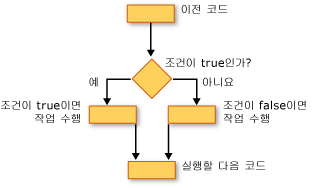

# 판단 구조(Visual Basic)
Visual Basic을 사용 하 여 조건을 테스트 하 고 해당 테스트의 결과 따라 다른 작업을 수행할 수 있습니다. 조건이 true 또는 false를 반환 하는 식의 다양 한 값에 대 한 또는 일련의 문 실행할 때 생성 되는 다양 한 예외에 대 한 인지 테스트할 수 있습니다.  
  
 다음 그림에는 조건이 true 인지 테스트 하 고 true 또는 false 인지에 따라 다른 작업을 수행 하는 의사 결정 구조를 보여 줍니다.  
  
   
True 및 false 인 경우 조건이 일 때 다른 작업을 수행 합니다.  
  
## 다음과 같은 경우... 다음 중... Else 생성  
 `If...Then...Else` 구문을 사용 하나 이상의 조건을 테스트 하 고 각 조건에 따라 하나 이상의 문을 실행할 수 있습니다. 조건을 테스트 하 고 다음과 같은 방법으로 작업을 수행할 수 있습니다.  
  
-   조건이 하나 이상의 문 실행 `True`  
  
-   조건이 하나 이상의 문 실행 `False`  
  
-   조건이 일부 문이 실행 `True` 와 다른 경우 `False`  
  
-   이전 조건이 경우 추가 조건을 테스트 합니다. `False`  
  
 이러한 모든 가능성을 제공 하는 제어 구조는 [경우... 다음 중... Else 문](../../../../visual-basic/language-reference/statements/if-then-else-statement.md)합니다. 단일 테스트와 실행 문이 있는 경우 단일 행 버전을 사용할 수 있습니다. 조건 및 동작의 더 복잡 한 집합을 사용 하는 경우에 여러 행 버전을 사용할 수 있습니다.  
  
## 선택... Case 구문  
 `Select...Case` 생성 식을 한 번 평가 하 고 여러 다른 가능한 값을 기반으로 하는 문을 실행할 수 있습니다. 자세한 내용은 참조 [선택... Case 문](../../../../visual-basic/language-reference/statements/select-case-statement.md)합니다.  
  
## 시도 중... Catch 하는 중... 마지막으로 생성  
 `Try...Catch...Finally` 구문을 사용 여러 문 중 하나라도 문의 하면 예외가 발생 하는 경우 제어를 유지 하는 환경에서 실행할 수 있습니다. 서로 다른 예외에 대 한 다른 동작을 취할 수 있습니다. 필요에 따라 전체를 종료 하기 전에 실행 되는 코드 블록을 지정할 수 있습니다 `Try...Catch...Finally` 수행 되는 동작에 관계 없이 생성 합니다. 자세한 내용은 [Try...Catch...Finally 문](../../../../visual-basic/language-reference/statements/try-catch-finally-statement.md)을 참조하세요.  
  
> [!NOTE]
>  대부분의 제어 구조에 대 한 키워드를 클릭할 때 모든 키워드 구조에서 강조 표시 됩니다. 예를 들어, 클릭 하면 `If` 에 `If...Then...Else` 생성, 함수의 모든 인스턴스의 `If`, `Then`, `ElseIf`, `Else`, 및 `End If` 생성에서의 강조 표시 됩니다. 다음 또는 이전 강조 표시 된 키워드를 이동 하려면 CTRL + SHIFT + 아래쪽 화살표 또는 CTRL + SHIFT + 위쪽 화살표 키를 누릅니다.  
  
## 참고 항목  
 [제어 흐름](../../../../visual-basic/programming-guide/language-features/control-flow/index.md)  
 [루프 구조](../../../../visual-basic/programming-guide/language-features/control-flow/loop-structures.md)  
 [기타 제어 구조](../../../../visual-basic/programming-guide/language-features/control-flow/other-control-structures.md)  
 [중첩 제어 구조](../../../../visual-basic/programming-guide/language-features/control-flow/nested-control-structures.md)  
 [If 연산자](../../../../visual-basic/language-reference/operators/if-operator.md)
