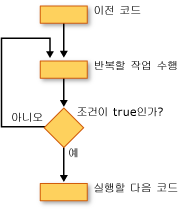

# 루프 구조(Visual Basic)Loop Structures (Visual Basic)
[!INCLUDE[vbprvb](../../../../csharp/programming-guide/concepts/linq/includes/vbprvb_md.md)]루프 구조를 사용 하면 하나 이상의 코드 줄을 반복 해 서 실행할 수 있습니다. loop structures allow you to run one or more lines of code repetitively. 조건이 될 때까지 루프 구조에서 문을 반복할 수 `True`조건이 될 때까지, `False`, 컬렉션에서 각 요소에 대해 한 번 횟수 또는 번호를 지정 합니다.You can repeat the statements in a loop structure until a condition is `True`, until a condition is `False`, a specified number of times, or once for each element in a collection.  
  
 다음 그림에는 조건이 true가 될 때까지 문 집합을 실행 하는 루프 구조를 보여 줍니다.The following illustration shows a loop structure that runs a set of statements until a condition becomes true.  
  
   
조건이 true가 될 때까지 문 집합을 실행 합니다.Running a set of statements until a condition becomes true  
  
## While 루프While Loops  
 The `While`... `End While` 에 지정 된 조건으로 문 집합을 실행 하는 생성 된 `While` 문이 `True`합니다.The `While`...`End While` construction runs a set of statements as long as the condition specified in the `While` statement is `True`. 자세한 내용은 참조 [동안... While 문 종료](../../../../visual-basic/language-reference/statements/while-end-while-statement.md)합니다.For more information, see [While...End While Statement](../../../../visual-basic/language-reference/statements/while-end-while-statement.md).  
  
## Do 루프Do Loops  
 The `Do`... `Loop` 구문을 시작 또는 루프 구조의 끝에서 조건을 테스트할 수 있습니다.The `Do`...`Loop` construction allows you to test a condition at either the beginning or the end of a loop structure. 조건이 동안 루프를 반복할지 여부를 지정할 수도 있습니다 `True` 될 때까지 또는 `True`합니다.You can also specify whether to repeat the loop while the condition remains `True` or until it becomes `True`. 자세한 내용은 참조 [수행... 반복 문](../../../../visual-basic/language-reference/statements/do-loop-statement.md)합니다.For more information, see [Do...Loop Statement](../../../../visual-basic/language-reference/statements/do-loop-statement.md).  
  
## For 루프For Loops  
 The `For`... `Next` 구문은 루프 횟수 만큼 수행 합니다.The `For`...`Next` construction performs the loop a set number of times. 라고도 하는 루프 제어 변수를 사용 하 여 한 *카운터*, 반복을 추적 합니다.It uses a loop control variable, also called a *counter*, to keep track of the repetitions. 시작 및 끝이 카운터에 대 한 값을 지정 하 고 필요에 따라 증가 하 한 반복에서 다음 크기를 지정할 수 있습니다.You specify the starting and ending values for this counter, and you can optionally specify the amount by which it increases from one repetition to the next. 자세한 내용은 참조 [에 대 한... 다음 문](../../../../visual-basic/language-reference/statements/for-next-statement.md)합니다.For more information, see [For...Next Statement](../../../../visual-basic/language-reference/statements/for-next-statement.md).  
  
## 각 루프에 대 한For Each Loops  
 The `For Each`... `Next` 구문은 컬렉션의 각 요소에 한 번씩 문 집합을 실행 합니다.The `For Each`...`Next` construction runs a set of statements once for each element in a collection. 루프 제어 변수를 지정 하지만 시작 또는 끝 값을 확인할 필요가 없습니다.You specify the loop control variable, but you do not have to determine starting or ending values for it. 자세한 내용은 참조 [각각에 대해... 다음 문](../../../../visual-basic/language-reference/statements/for-each-next-statement.md)합니다.For more information, see [For Each...Next Statement](../../../../visual-basic/language-reference/statements/for-each-next-statement.md).  
  
## 참고 항목See Also  
 [제어 흐름](../../../../visual-basic/programming-guide/language-features/control-flow/index.md) [Control Flow](../../../../visual-basic/programming-guide/language-features/control-flow/index.md)   
 [판단 구조](../../../../visual-basic/programming-guide/language-features/control-flow/decision-structures.md)  [Decision Structures](../../../../visual-basic/programming-guide/language-features/control-flow/decision-structures.md)   
 [기타 제어 구조](../../../../visual-basic/programming-guide/language-features/control-flow/other-control-structures.md)  [Other Control Structures](../../../../visual-basic/programming-guide/language-features/control-flow/other-control-structures.md)   
 [중첩 제어 구조](../../../../visual-basic/programming-guide/language-features/control-flow/nested-control-structures.md) [Nested Control Structures](../../../../visual-basic/programming-guide/language-features/control-flow/nested-control-structures.md)
