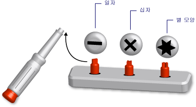

# Visual Basic의 제네릭 형식(Visual Basic)
*제네릭 형식* 은 다양한 데이터 형식에 대해 동일한 기능을 수행하도록 조정되는 단일 프로그래밍 요소입니다. 제네릭 클래스 또는 프로시저를 정의할 때는 해당 기능을 수행하고자 하는 각 데이터 형식마다 별도의 버전을 정의할 필요가 없습니다.  
  
 비유하자면 헤드를 교체할 수 있는 스크루드라이버와 비슷합니다. 즉, 돌려야 하는 나사에 맞는 헤드(일자, 십자, 별 모양)를 선택합니다. 그리고 올바른 헤드를 스크루드라이버 핸들에 삽입하면 스크루드라이버와 정확하게 동일한 기능, 즉 나사를 돌리는 기능을 수행할 수 있습니다.  
  
   
제네릭 도구 역할을 하는 스크루드라이버 세트  
  
 제네릭 형식을 정의할 때는 하나 이상의 데이터 형식을 사용하여 매개 변수를 지정할 수 있습니다. 이렇게 하면 코드를 사용하여 데이터 형식을 요구 사항에 맞출 수 있습니다. 각각 서로 다른 데이터 형식 집합에 대해 작동하는 여러 프로그래밍 요소를 제네릭 요소에서 선언할 수 있습니다. 하지만 선언된 요소는 사용하는 데이터 형식에 관계없이 모두 동일한 논리를 수행합니다.  
  
 예를 들어 `String`과 같은 특정 데이터 형식에서 작동하는 큐 클래스를 만들어 사용할 수 있습니다. 이러한 클래스를 선언할 수 <xref:System.Collections.Generic.Queue%601?displayProperty=fullName>다음 예제와 같이.</xref:System.Collections.Generic.Queue%601?displayProperty=fullName>  
  
 [!code-vb[VbVbalrDataTypes #&1;](../../../../visual-basic/language-reference/data-types/codesnippet/VisualBasic/generic-types_1.vb)]  
  
 이제 `stringQ` 를 사용하여 `String` 값으로만 작업할 수 있습니다. `stringQ` 는 `String` 값에 일반화되는 것이 아니라 `Object` 에 한정되므로 런타임에 바인딩 또는 형식 변환이 없습니다. 이를 통해 실행 시간을 절약하고 런타임 오류를 줄일 수 있습니다.  
  
 제네릭 형식 사용에 대 한 자세한 내용은 참조 하십시오. [하는 방법: 제네릭 클래스를 사용 하 여](../../../../visual-basic/programming-guide/language-features/data-types/how-to-use-a-generic-class.md)합니다.  
  
## 제네릭 클래스의 예  
 다음 예에서는 제네릭 클래스의 기본 정의를 보여 줍니다.  
  
 [!code-vb[VbVbalrDataTypes #&2;](../../../../visual-basic/language-reference/data-types/codesnippet/VisualBasic/generic-types_2.vb)]  
  
 앞의 기본 정의에서 `t` 은 *형식 매개 변수*, 즉 클래스를 선언할 때 제공하는 데이터 형식에 대한 자리 표시자입니다. 코드의 다른 곳에서 `classHolder` 에 대한 다양한 데이터 형식을 제공하여 여러 버전의 `t`를 선언할 수 있습니다. 다음 예제에서는 이러한 선언 두 가지를  보여 줍니다.  
  
 [!code-vb[VbVbalrDataTypes #&3;](../../../../visual-basic/language-reference/data-types/codesnippet/VisualBasic/generic-types_3.vb)]  
  
 위의 문에서는 특정 형식이 형식 매개 변수를 대체하는 *생성된 클래스*를 선언합니다. 이 대체는 생성된 클래스 내에서 코드 전체로 전파됩니다. 다음 예에서는 `processNewItem` 의 `integerClass`프로시저 모습을 보여 줍니다.  
  
 [!code-vb[VbVbalrDataTypes #&4;](../../../../visual-basic/language-reference/data-types/codesnippet/VisualBasic/generic-types_4.vb)]  
  
 자세한 예제를 참조 하십시오. [하는 방법: 기능을 정의 된 클래스는 수 제공 동일한 서로 다른 데이터 형식에](../../../../visual-basic/programming-guide/language-features/data-types/how-to-define-a-class-that-can-provide-identical-functionality.md)합니다.  
  
## 적용 가능한 프로그래밍 요소  
 제네릭 클래스, 구조체, 인터페이스, 프로시저 및 대리자를 정의하고 사용할 수 있습니다. [!INCLUDE[dnprdnshort](../../../../csharp/getting-started/includes/dnprdnshort_md.md)] 여러 제네릭 클래스, 구조체 및 자주 사용 되는 제네릭 요소를 나타내는 인터페이스를 정의 합니다. <xref:System.Collections.Generic?displayProperty=fullName>사전, 목록, 큐 및 스택 네임 스페이스를 제공 합니다.</xref:System.Collections.Generic?displayProperty=fullName> 일반 사용자가 직접 요소를 정의 하기 전에 <xref:System.Collections.Generic?displayProperty=fullName>.</xref:System.Collections.Generic?displayProperty=fullName> 에서 사용할 수 있는 이미 있는지 확인 하십시오  
  
 프로시저는 형식이 아니지만 제네릭 프로시저를 정의하고 사용할 수 있습니다. 참조 [Visual Basic의 제네릭 프로시저](../../../../visual-basic/programming-guide/language-features/data-types/generic-procedures.md)합니다.  
  
## 제네릭 형식의 장점  
 제네릭 형식은 각각 특정 데이터 형식에서 작동하는 서로 다른 프로그래밍 요소 여러 개를 선언하는 기초의 역할을 합니다. 제네릭 형식의 대안은 다음과 같습니다.  
  
1.  `Object` 데이터 형식에서 작동하는 단일 형식.  
  
2.  형식의 *형식 특정* 버전 집합. 각 버전은 `String`, `Integer`또는 사용자 정의 형식(예: `customer`)과 같은 하나의 특정 데이터 형식에 대해 개별적으로 코딩되고 작동합니다.  
  
 이러한 대안에 비교했을 때 제네릭 형식에는 다음과 같은 장점이 있습니다.  
  
-   **형식 안전성입니다.** 제네릭 형식은 컴파일 시간 형식 검사를 적용합니다. `Object` 에 기반한 형식은 모든 데이터 형식을 수락하며 입력 데이터 형식이 수락 가능한지 확인하기 위한 코드를 작성해야 합니다. 제네릭 형식을 사용하면 컴파일러가 런타임 전에 불일치를 찾아낼 수 있습니다.  
  
-   **성능을 제공 합니다.** 제네릭 형식은 데이터 *box* 및 *unbox* 작업을 수행할 필요가 없습니다. 각각 하나의 데이터 형식에 특수화되기 때문입니다. `Object` 에 기반한 작업에서는 입력 데이터 형식에 box 작업을 수행하여 `Object` 로 변환한 다음 출력을 위한 데이터를 unbox해야 합니다. 이러한 box 및 unbox 작업으로 성능이 저하됩니다.  
  
     또한 `Object` 에 기반한 형식은 런타임에 바인딩되므로 해당 멤버에 액세스하려면 런타임에 추가 코드가 필요합니다. 이 경우에도 성능이 저하됩니다.  
  
-   **코드 통합입니다.** 제네릭 형식의 코드는 한 번만 정의하면 됩니다. 형식의 형식 특정 버전 집합은 각 버전에서 동일한 코드를 복제해야 하며 유일한 차이는 해당 버전의 특정 데이터 형식입니다. 제네릭 형식을 사용하면 형식 특정 버전이 모두 원본 제네릭 형식에서 생성됩니다.  
  
-   **코드 다시 사용 합니다.** 특정 데이터 형식에 종속되지 않는 코드는 제네릭일 경우 여러 데이터 형식에 재사용할 수 있습니다. 원래 예상하지 않았던 데이터 형식에도 재사용할 수 있는 경우도 많습니다.  
  
-   **IDE 지원 합니다.** 제네릭 형식에서 선언된 생성된 형식을 사용하면 코드 개발 시 IDE(통합 개발 환경)에서 더 많은 지원 기능이 제공됩니다. 예를 들어 IntelliSense가 생성자 또는 메서드의 인수에 대한 형식 특정 옵션을 표시할 수 있습니다.  
  
-   **제네릭 알고리즘입니다.** 형식에 독립적인 추상 알고리즘이 제네릭 형식의 좋은 후보입니다. 예를 들어, 제네릭 프로시저 임을 확인 하는 <xref:System.IComparable>인터페이스 <xref:System.IComparable>.</xref:System.IComparable> 를 구현 하는 모든 데이터 형식을 사용 하 여</xref:System.IComparable> 사용 하 여 항목을 정렬  
  
## 제약 조건  
 제네릭 형식 정의의 코드는 가능한 형식에 독립적이어야 하지만 제네릭 형식에 제공되는 모든 데이터 형식의 특정 기능을 요구해야 할 수 있습니다. 예를 들어, 정렬 또는 데이터 정렬을 위해 두 항목을 비교 하려는 경우 데이터 형식을 구현 해야는 <xref:System.IComparable>인터페이스.</xref:System.IComparable> 형식 매개 변수에 *제약 조건* 을 추가하여 이 요구 사항을 적용할 수 있습니다.  
  
### 제약 조건의 예  
 다음 예제에서 형식 인수 <xref:System.IComparable>.</xref:System.IComparable> 를 구현 하는 제약 조건 사용 하는 클래스의 기본 정의 보여 줍니다.  
  
 [!code-vb[VbVbalrDataTypes #&5;](../../../../visual-basic/language-reference/data-types/codesnippet/VisualBasic/generic-types_5.vb)]  
  
 이후 코드에서 클래스를 생성 하려고 할 경우 `itemManager` 구현 하지 않는 한 형식을 제공 <xref:System.IComparable>, 컴파일러에서 오류를 알립니다.</xref:System.IComparable>  
  
### 제약 조건의 형식  
 제약 조건은 다음 요구 사항을 원하는 대로 조합하여 지정할 수 있습니다.  
  
-   형식 인수는 하나 이상의 인터페이스를 구현해야 합니다.  
  
-   형식 인수는 최대 하나의 클래스에서 형식을 상속하거나 해당 클래스의 형식이어야 함  
  
-   형식 인수는 매개 변수 없는 생성자로부터 개체를 만드는 코드에 액세스할 수 있는 매개 변수 없는 생성자를 노출해야 함  
  
-   형식 인수는 *참조 형식*이거나 *값 형식*이어야 함  
  
 둘 이상의 요구 사항을 적용해야 하는 경우 쉼표로 구분된 *제약 조건 목록* 을 중괄호(`{ }`) 안에 넣으세요. 포함 하는 액세스 가능 생성자를 필요로 하는 [New 연산자](../../../../visual-basic/language-reference/operators/new-operator.md) 키워드 목록에 있습니다. 참조 형식을 요구하려면 `Class` 키워드를 넣고, 값 형식을 요구하려면 `Structure` 키워드를 넣으세요.  
  
 참조 제약 조건에 대 한 자세한 내용은 [유형 목록](../../../../visual-basic/language-reference/statements/type-list.md)합니다.  
  
### 다중 제약 조건의 예  
 다음 예제에서는 형식 매개 변수에 제약 조건 목록이 있는 제네릭 클래스의 기본 정의를 보여 줍니다. 이 클래스의 인스턴스를 만드는 코드에서 형식 인수 모두 구현 해야는 <xref:System.IComparable>및 <xref:System.IDisposable>인터페이스를 참조 형식 이어야 하 고 액세스 가능한 매개 변수가 없는 생성자를 노출 합니다.</xref:System.IDisposable> </xref:System.IComparable>  
  
 [!code-vb[VbVbalrDataTypes #&6;](../../../../visual-basic/language-reference/data-types/codesnippet/VisualBasic/generic-types_6.vb)]  
  
## 중요 용어  
 제네릭 형식에서는 다음의 용어를 사용합니다.  
  
-   *제네릭 형식*. 선언할 때 최소 하나의 데이터 형식을 제공하는 클래스, 구조체, 인터페이스, 프로시저 또는 대리자의 정의입니다.  
  
-   *형식 매개 변수*. 제네릭 형식 정의에서 형식을 선언할 때 제공하는 데이터 형식에 대한 자리 표시자입니다.  
  
-   *형식 인수*. 제네릭 형식에서 생성된 형식을 선언할 때 형식 매개 변수를 대체하는 특정 데이터 형식입니다.  
  
-   *제약 조건*. 제공할 수 있는 형식 인수를 제한하는 형식 매개 변수에 대한 조건입니다. 제약 조건은 형식 인수가 특정 인터페이스를 구현하도록 요구하거나, 특정 클래스이거나 특정 클래스에서 상속되도록 요구하거나, 액세스 가능한 매개 변수 없는 생성자를 가지도록 요구하거나, 참조 형식 또는 값 형식이도록 요구할 수 있습니다. 이러한 제약 조건을 결합할 수 있지만 최대 하나의 클래스를 지정할 수 있습니다.  
  
-   *생성된 형식*. 형식 매개 변수에 대한 형식 인수를 제공하여 제네릭 형식에서 선언된 클래스, 구조체, 인터페이스, 프로시저 또는 대리자입니다.  
  
## 참고 항목  
 [데이터 형식](../../../../visual-basic/programming-guide/language-features/data-types/index.md)   
 [형식 문자](../../../../visual-basic/programming-guide/language-features/data-types/type-characters.md)   
 [값 형식과 참조 형식](../../../../visual-basic/programming-guide/language-features/data-types/value-types-and-reference-types.md)   
 [Visual Basic의 형식 변환](../../../../visual-basic/programming-guide/language-features/data-types/type-conversions.md)   
 [데이터 형식 문제 해결](../../../../visual-basic/programming-guide/language-features/data-types/troubleshooting-data-types.md)   
 [데이터 형식](../../../../visual-basic/language-reference/data-types/data-type-summary.md)   
 [Of](../../../../visual-basic/language-reference/statements/of-clause.md)   
 [마찬가지로](../../../../visual-basic/language-reference/statements/as-clause.md)   
 [Object 데이터 형식](../../../../visual-basic/language-reference/data-types/object-data-type.md)   
 [공 분산과 반공 분산](http://msdn.microsoft.com/library/a58cc086-276f-4f91-a366-85b7f95f38b8)   
 [반복기](http://msdn.microsoft.com/library/f45331db-d595-46ec-9142-551d3d1eb1a7)
