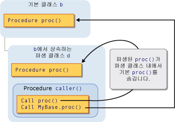

# Shadowing in Visual Basic
[!INCLUDE[vs2017banner](../../../../visual-basic/developing-apps/includes/vs2017banner.md)]

두 프로그래밍 요소가 같은 이름을 공유하는 경우 두 요소 중 하나가 나머지 요소를 *숨길* 수 있습니다.  이러한 경우 숨겨진 요소는 참조할 수 없습니다. 대신, 코드에서 해당 요소 이름을 사용할 경우 [!INCLUDE[vbprvb](../../../../csharp/programming-guide/concepts/linq/includes/vbprvb-md.md)] 컴파일러에서 해당 요소는 숨기는 요소로 확인됩니다.  
  
## 목적  
 숨김 기능은 주로 클래스 멤버의 정의를 보호하는 용도로 사용됩니다.  기본 클래스에서는 이미 정의한 요소와 같은 이름의 요소를 만드는 경우가 있을 수 있습니다.  이러한 경우 `Shadows` 한정자를 사용하면 클래스를 통한 참조가 새 기본 클래스 요소 대신 이미 정의한 멤버로 확인됩니다.  
  
## 숨김 형식  
 요소는 두 가지 방법으로 다른 요소를 숨길 수 있습니다.  숨기는 요소는 숨겨진 요소가 포함된 영역의 하위 영역 안에 선언될 수 있습니다. 이러한 경우 *범위를 통해* 숨김이 수행됩니다.  또는 파생하는 클래스가 기본 클래스의 멤버를 재정의하는 방법도 있습니다. 이 경우에는 *상속을 통해* 숨김이 수행됩니다.  
  
### 범위를 통한 숨김  
 같은 모듈, 클래스 또는 구조체에 있는 프로그래밍 요소의 경우 이름은 같지만 범위가 다를 수 있습니다.  코드에서 이런 방식으로 선언된 두 요소의 공통 이름을 참조할 경우 두 요소 중 범위가 더 좁은 요소가 나머지 요소를 숨깁니다\(블록 범위가 가장 좁음\).  
  
 예를 들어, 어떤 모듈이 `temp`라는 `Public` 변수를 정의하고 이 모듈 내의 프로시저도 `temp`라는 지역 변수를 선언한다고 가정합니다.  프로시저 내에서 `temp`를 참조하는 경우에는 지역 변수에 액세스하지만 프로시저 외부에서 `temp`를 참조하면 `Public` 변수에 액세스합니다.  이 경우 프로시저 변수 `temp`는 모듈 변수 `temp`를 숨깁니다.  
  
 다음 그림에서는 이름이 `temp`인 두 개의 변수를 보여 줍니다.  지역 변수 `temp`는 해당 변수가 선언된 프로시저 `p` 내에서 액세스될 경우 멤버 변수 `temp`를 숨깁니다.  그러나 `MyClass` 키워드를 사용하면 숨김 기능이 사용되지 않고 멤버 변수에 액세스하게 됩니다.  
  
   
범위를 통한 숨김  
  
 범위를 통한 숨김의 예제를 보려면 [How to: Hide a Variable with the Same Name as Your Variable](../../../../visual-basic/programming-guide/language-features/declared-elements/how-to-hide-a-variable-with-the-same-name-as-your-variable.md)를 참조하십시오.  
  
### 상속을 통한 숨김  
 파생 클래스가 기본 클래스에서 상속한 프로그래밍 요소를 재정의하는 경우 재정의 요소는 원래 요소를 숨깁니다.  모든 형식의 선언 요소 또는 오버로드된 요소 집합을 다른 형식을 사용하여 숨길 수 있습니다.  예를 들어, `Integer` 변수는 `Function` 프로시저를 숨길 수 있습니다.  한 프로시저를 다른 프로시저로 숨길 경우 다른 매개 변수 목록 및 다른 반환 형식을 사용할 수 있습니다.  
  
 다음 그림에서는 기본 클래스 `b`와 `b`에서 상속한 파생 클래스 `d`를 보여 줍니다.  기본 클래스는 `proc`라는 프로시저를 정의하고 파생 클래스는 같은 이름의 다른 프로시저로 이 프로시저를 숨깁니다.  첫 번째 `Call` 문은 파생 클래스의 숨기는 `proc`에 액세스합니다.  그러나 `MyBase` 키워드를 사용하면 숨김 기능이 사용되지 않고 기본 클래스의 숨겨진 프로시저에 액세스하게 됩니다.  
  
   
상속을 통한 숨김  
  
 상속을 통한 숨김의 예제를 보려면 [How to: Hide a Variable with the Same Name as Your Variable](../../../../visual-basic/programming-guide/language-features/declared-elements/how-to-hide-a-variable-with-the-same-name-as-your-variable.md) 및 [How to: Hide an Inherited Variable](../../../../visual-basic/programming-guide/language-features/declared-elements/how-to-hide-an-inherited-variable.md)를 참조하십시오.  
  
#### 숨김 및 액세스 수준  
 파생 클래스를 사용하는 코드에서 숨기는 요소에 액세스할 수 없는 경우도 있습니다.  예를 들어, 요소가 `Private`로 선언된 경우에는  숨김이 적용되지 않으며 컴파일러에서는 모든 참조를 숨김이 없을 때와 동일한 요소로 확인합니다.  이 요소는 숨기는 클래스에서 바로 이전 파생 단계의 액세스 가능한 요소입니다.  숨겨진 요소가 프로시저이면 이름, 매개 변수 목록 및 반환 형식이 같은 가장 비슷한 액세스 가능한 버전으로 확인됩니다.  
  
 다음 예제에서는 세 클래스의 상속 계층 구조를 보여 줍니다.  각 클래스는 `Sub` 프로시저 `display`를 정의하고 각 파생 클래스는 기본 클래스의 `display` 프로시저를 숨깁니다.  
  
```  
Public Class firstClass  
    Public Sub display()  
        MsgBox("This is firstClass")  
    End Sub  
End Class  
Public Class secondClass  
    Inherits firstClass  
    Private Shadows Sub display()  
        MsgBox("This is secondClass")  
    End Sub  
End Class  
Public Class thirdClass  
    Inherits secondClass  
    Public Shadows Sub display()  
        MsgBox("This is thirdClass")  
    End Sub  
End Class  
Module callDisplay  
    Dim first As New firstClass  
    Dim second As New secondClass  
    Dim third As New thirdClass  
    Public Sub callDisplayProcedures()  
        ' The following statement displays "This is firstClass".  
        first.display()  
        ' The following statement displays "This is firstClass".  
        second.display()  
        ' The following statement displays "This is thirdClass".  
        third.display()  
    End Sub  
End Module  
```  
  
 앞의 예제에서 파생 클래스 `secondClass`는 `display`를 `Private` 프로시저로 숨깁니다.  모듈 `callDisplay`에서 `secondClass`의 `display`를 호출하면 호출하는 코드는 `secondClass`의 외부에 있으므로 전용 `display` 프로시저에 액세스할 수 없습니다.  즉, 숨김이 적용되지 않으며 컴파일러에서는 해당 참조를 기본 클래스 `display` 프로시저로 확인합니다.  
  
 그러나 추가 파생 클래스 `thirdClass`는 `display`를 `Public`으로 선언하므로 `callDisplay`의 코드에서 이 프로시저에 액세스할 수 없습니다.  
  
## 숨김 및 재정의  
 숨김과 재정의를 혼동하지 마십시오.  두 가지 모두 파생된 클래스가 기본 클래스에서 상속할 때 사용되며, 하나의 선언된 요소를 다른 요소로 재정의하지만  둘 사이에는 상당한 차이점이 있습니다.  숨김과 재정의의 비교에 대한 자세한 내용은 [Differences Between Shadowing and Overriding](../../../../visual-basic/programming-guide/language-features/declared-elements/differences-between-shadowing-and-overriding.md)을 참조하십시오.  
  
## 숨김 및 오버로딩  
 동일한 기본 클래스 요소를 파생 클래스에 있는 둘 이상의 요소로 숨기는 경우 숨기는 요소는 해당 요소의 오버로드된 버전이 됩니다.  자세한 내용은 [Procedure Overloading](../../../../visual-basic/programming-guide/language-features/procedures/procedure-overloading.md)을 참조하십시오.  
  
## 숨겨진 요소에 액세스  
 파생 클래스에서 특정 요소에 액세스할 경우 대개 `Me` 키워드로 해당 요소 이름을 한정하여 파생 클래스의 현재 인스턴스를 사용합니다.  파생 클래스가 기본 클래스의 요소를 숨기는 경우에는 `MyBase` 키워드로 한정하여 기본 클래스 요소에 액세스할 수 있습니다.  
  
 숨겨진 요소 액세스에 대한 예제를 보려면 [How to: Access a Variable Hidden by a Derived Class](../../../../visual-basic/programming-guide/language-features/declared-elements/how-to-access-a-variable-hidden-by-a-derived-class.md)를 참조하십시오.  
  
### 개체 변수 선언  
 또한 개체 변수를 만드는 방법에 따라서도 파생 클래스가 숨기는 요소에 액세스할지 또는 숨겨진 요소에 액세스할지가 결정됩니다.  다음 예제에서는 파생 클래스로부터 두 개의 개체를 만들지만 한 개체는 기본 클래스로 선언되고 다른 개체는 파생 클래스로 선언됩니다.  
  
```  
Public Class baseCls  
    ' The following statement declares the element that is to be shadowed.  
    Public z As Integer = 100  
End Class  
Public Class dervCls  
    Inherits baseCls  
    ' The following statement declares the shadowing element.  
    Public Shadows z As String = "*"  
End Class  
Public Class useClasses  
    ' The following statement creates the object declared as the base class.  
    Dim basObj As baseCls = New dervCls()  
    ' Note that dervCls widens to its base class baseCls.  
    ' The following statement creates the object declared as the derived class.  
    Dim derObj As dervCls = New dervCls()  
    Public Sub showZ()   
    ' The following statement outputs 100 (the shadowed element).  
        MsgBox("Accessed through base class: " & basObj.z)  
    ' The following statement outputs "*" (the shadowing element).  
        MsgBox("Accessed through derived class: " & derObj.z)  
    End Sub  
End Class  
```  
  
 앞의 예제에서 `basObj` 변수는 기본 클래스로 선언되었습니다.  이 변수에 `dervCls` 개체를 할당하는 것은 확대 변환이 구성되므로 올바른 할당입니다.  그러나 기본 클래스는 파생된 클래스의 `z` 변수에 대한 숨김 버전에 액세스할 수 없기 때문에 컴파일러에서는 `basObj.z` 변수를 원래의 기본 클래스 값으로 계산합니다.  
  
## 참고 항목  
 [References to Declared Elements](../../../../visual-basic/programming-guide/language-features/declared-elements/references-to-declared-elements.md)   
 [Scope in Visual Basic](../../../../visual-basic/programming-guide/language-features/declared-elements/scope.md)   
 [Widening and Narrowing Conversions](../../../../visual-basic/programming-guide/language-features/data-types/widening-and-narrowing-conversions.md)   
 [Shadows](../../../../visual-basic/language-reference/modifiers/shadows.md)   
 [Overrides](../../../../visual-basic/language-reference/modifiers/overrides.md)   
 [Me, My, MyBase, and MyClass](../../../../visual-basic/programming-guide/program-structure/me-my-mybase-and-myclass.md)   
 [Inheritance Basics](../../../../visual-basic/programming-guide/language-features/objects-and-classes/inheritance-basics.md)