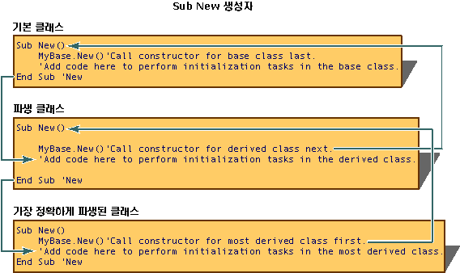
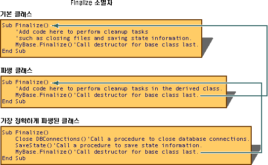

# <a name="object-lifetime-how-objects-are-created-and-destroyed-visual-basic"></a><span data-ttu-id="8fa2e-102">개체 수명: 개체가 만들어지고 제거되는 방법(Visual Basic)</span><span class="sxs-lookup"><span data-stu-id="8fa2e-102">Object Lifetime: How Objects Are Created and Destroyed (Visual Basic)</span></span>
<span data-ttu-id="8fa2e-103">`New` 키워드를 사용하여 클래스의 인스턴스인 개체를 만듭니다.</span><span class="sxs-lookup"><span data-stu-id="8fa2e-103">An instance of a class, an object, is created by using the `New` keyword.</span></span> <span data-ttu-id="8fa2e-104">새 개체를 사용하기 전에 초기화 작업을 수행해야 하는 경우가 많습니다.</span><span class="sxs-lookup"><span data-stu-id="8fa2e-104">Initialization tasks often must be performed on new objects before they are used.</span></span> <span data-ttu-id="8fa2e-105">일반적인 초기화 작업으로는 파일 열기, 데이터베이스에 연결, 레지스트리 키의 값 읽기 등이 포함됩니다.</span><span class="sxs-lookup"><span data-stu-id="8fa2e-105">Common initialization tasks include opening files, connecting to databases, and reading values of registry keys.</span></span> <span data-ttu-id="8fa2e-106">Visual Basic 라는 프로시저를 사용 하 여 새 개체를 초기화 하는 제어 *생성자* (초기화 제어할 수 있는 특별 한 메서드).</span><span class="sxs-lookup"><span data-stu-id="8fa2e-106">Visual Basic controls the initialization of new objects using procedures called *constructors* (special methods that allow control over initialization).</span></span>  
  
 <span data-ttu-id="8fa2e-107">범위를 벗어나는 개체는 CLR(공용 언어 런타임)에 의해 해제됩니다.</span><span class="sxs-lookup"><span data-stu-id="8fa2e-107">After an object leaves scope, it is released by the common language runtime (CLR).</span></span> <span data-ttu-id="8fa2e-108">라는 프로시저를 사용 하 여 시스템 리소스 해제를 제어 하는 Visual Basic *소멸자*합니다.</span><span class="sxs-lookup"><span data-stu-id="8fa2e-108">Visual Basic controls the release of system resources using procedures called *destructors*.</span></span> <span data-ttu-id="8fa2e-109">생성자와 소멸자를 통해 예측 가능하며 효율적인 클래스 라이브러리 만들기를 지원할 수 있습니다.</span><span class="sxs-lookup"><span data-stu-id="8fa2e-109">Together, constructors and destructors support the creation of robust and predictable class libraries.</span></span>  
  
## <a name="using-constructors-and-destructors"></a><span data-ttu-id="8fa2e-110">생성자 및 소멸자 사용</span><span class="sxs-lookup"><span data-stu-id="8fa2e-110">Using Constructors and Destructors</span></span>  
 <span data-ttu-id="8fa2e-111">생성자와 소멸자는 개체 만들기 및 소멸을 제어합니다.</span><span class="sxs-lookup"><span data-stu-id="8fa2e-111">Constructors and destructors control the creation and destruction of objects.</span></span> <span data-ttu-id="8fa2e-112">`Sub New` 및 `Sub Finalize` ; 대체 초기화 하 고 개체를 제거 하는 Visual Basic의 프로시저는 `Class_Initialize` 및 `Class_Terminate` Visual Basic 6.0 및 이전 버전에서 사용 하는 방법입니다.</span><span class="sxs-lookup"><span data-stu-id="8fa2e-112">The `Sub New` and `Sub Finalize` procedures in Visual Basic initialize and destroy objects; they replace the `Class_Initialize` and `Class_Terminate` methods used in Visual Basic 6.0 and earlier versions.</span></span>  
  
### <a name="sub-new"></a><span data-ttu-id="8fa2e-113">Sub New</span><span class="sxs-lookup"><span data-stu-id="8fa2e-113">Sub New</span></span>  
 <span data-ttu-id="8fa2e-114">`Sub New` 생성자는 클래스를 만들 때 한 번만 실행할 수 있으며,</span><span class="sxs-lookup"><span data-stu-id="8fa2e-114">The `Sub New` constructor can run only once when a class is created.</span></span> <span data-ttu-id="8fa2e-115">같은 클래스나 파생 클래스에서 다른 생성자의 첫 번째 코드 줄이 아닌 위치에서 명시적으로 호출할 수는 없습니다.</span><span class="sxs-lookup"><span data-stu-id="8fa2e-115">It cannot be called explicitly anywhere other than in the first line of code of another constructor from either the same class or from a derived class.</span></span> <span data-ttu-id="8fa2e-116">또한 `Sub New` 메서드의 코드는 항상 클래스의 다른 코드보다 먼저 실행됩니다.</span><span class="sxs-lookup"><span data-stu-id="8fa2e-116">Furthermore, the code in the `Sub New` method always runs before any other code in a class.</span></span> [!INCLUDE[vbprvblong](~/includes/vbprvblong-md.md)]<span data-ttu-id="8fa2e-117"> 이상 버전에서 암시적으로 만듭니다는 `Sub New` 명시적으로 정의 하지 않는 경우 런타임 시 생성자는 `Sub New` 클래스에 대 한 프로시저입니다.</span><span class="sxs-lookup"><span data-stu-id="8fa2e-117"> and later versions implicitly create a `Sub New` constructor at run time if you do not explicitly define a `Sub New` procedure for a class.</span></span>  
  
 <span data-ttu-id="8fa2e-118">클래스의 생성자를 만들려면 클래스 정의 내 임의의 위치에 `Sub New` 프로시저를 만듭니다.</span><span class="sxs-lookup"><span data-stu-id="8fa2e-118">To create a constructor for a class, create a procedure named `Sub New` anywhere in the class definition.</span></span> <span data-ttu-id="8fa2e-119">매개 변수화된 생성자를 만들려면 다음 코드에 나와 있는 것처럼 다른 프로시저에 인수를 지정할 때와 마찬가지로 `Sub New`에 인수의 이름과 데이터 형식을 지정합니다.</span><span class="sxs-lookup"><span data-stu-id="8fa2e-119">To create a parameterized constructor, specify the names and data types of arguments to `Sub New` just as you would specify arguments for any other procedure, as in the following code:</span></span>  
  
 [!code-vb[VbVbalrOOP#42](../../../../visual-basic/misc/codesnippet/VisualBasic/object-lifetime-how-objects-are-created-and-destroyed_1.vb)]  
  
 <span data-ttu-id="8fa2e-120">다음 코드에서와 같이 생성자는 오버로드되는 경우가 많습니다.</span><span class="sxs-lookup"><span data-stu-id="8fa2e-120">Constructors are frequently overloaded, as in the following code:</span></span>  
  
 [!code-vb[VbVbalrOOP#116](../../../../visual-basic/misc/codesnippet/VisualBasic/object-lifetime-how-objects-are-created-and-destroyed_2.vb)]  
  
 <span data-ttu-id="8fa2e-121">다른 클래스에서 파생되는 클래스를 정의할 때 생성자의 첫 줄은 기본 클래스의 생성자에 대한 호출이어야 합니다. 단, 기본 클래스에 매개 변수가 없는 액세스 가능 생성자가 있는 경우는 예외입니다.</span><span class="sxs-lookup"><span data-stu-id="8fa2e-121">When you define a class derived from another class, the first line of a constructor must be a call to the constructor of the base class, unless the base class has an accessible constructor that takes no parameters.</span></span> <span data-ttu-id="8fa2e-122">예를 들어 위의 생성자를 포함하는 기본 클래스에 대한 호출은 `MyBase.New(s)`가 됩니다.</span><span class="sxs-lookup"><span data-stu-id="8fa2e-122">A call to the base class that contains the above constructor, for example, would be `MyBase.New(s)`.</span></span> <span data-ttu-id="8fa2e-123">그렇지 않으면 `MyBase.New` 는 선택 사항이 고 Visual Basic 런타임 암시적으로 호출 합니다.</span><span class="sxs-lookup"><span data-stu-id="8fa2e-123">Otherwise, `MyBase.New` is optional, and the Visual Basic runtime calls it implicitly.</span></span>  
  
 <span data-ttu-id="8fa2e-124">부모 개체의 생성자를 호출하는 코드를 작성한 후에는 `Sub New` 프로시저에 초기화 코드를 더 추가할 수 있습니다.</span><span class="sxs-lookup"><span data-stu-id="8fa2e-124">After you write the code to call the parent object's constructor, you can add any additional initialization code to the `Sub New` procedure.</span></span> <span data-ttu-id="8fa2e-125">`Sub New`는 매개 변수화된 생성자로 호출할 때 인수를 허용할 수 있습니다.</span><span class="sxs-lookup"><span data-stu-id="8fa2e-125">`Sub New` can accept arguments when called as a parameterized constructor.</span></span> <span data-ttu-id="8fa2e-126">이러한 매개 변수는 생성자를 호출하는 프로시저에서 전달됩니다(예: `Dim AnObject As New ThisClass(X)`).</span><span class="sxs-lookup"><span data-stu-id="8fa2e-126">These parameters are passed from the procedure calling the constructor, for example, `Dim AnObject As New ThisClass(X)`.</span></span>  
  
### <a name="sub-finalize"></a><span data-ttu-id="8fa2e-127">Sub Finalize</span><span class="sxs-lookup"><span data-stu-id="8fa2e-127">Sub Finalize</span></span>  
 <span data-ttu-id="8fa2e-128">CLR은 개체를 해제하기 전에 `Finalize` 프로시저를 정의하는 개체에 대해 `Sub Finalize` 메서드를 자동으로 호출합니다.</span><span class="sxs-lookup"><span data-stu-id="8fa2e-128">Before releasing objects, the CLR automatically calls the `Finalize` method for objects that define a `Sub Finalize` procedure.</span></span> <span data-ttu-id="8fa2e-129">`Finalize` 메서드는 파일을 닫고 상태 정보를 저장하는 코드와 같이 개체가 소멸되기 직전에 실행해야 하는 코드를 포함할 수 있습니다.</span><span class="sxs-lookup"><span data-stu-id="8fa2e-129">The `Finalize` method can contain code that needs to execute just before an object is destroyed, such as code for closing files and saving state information.</span></span> <span data-ttu-id="8fa2e-130">`Sub Finalize`를 실행할 때는 성능이 약간 저하되므로 개체를 명시적으로 해제해야 하는 경우에만 `Sub Finalize` 메서드를 정의해야 합니다.</span><span class="sxs-lookup"><span data-stu-id="8fa2e-130">There is a slight performance penalty for executing `Sub Finalize`, so you should define a `Sub Finalize` method only when you need to release objects explicitly.</span></span>  
  
> [!NOTE]
>  <span data-ttu-id="8fa2e-131">CLR의 가비지 수집기는 그렇지 않습니다 없습니다 삭제할의 *개체를 관리 되지 않는*, 운영 체제 CLR 환경 외부에서 직접 실행 하는 개체입니다.</span><span class="sxs-lookup"><span data-stu-id="8fa2e-131">The garbage collector in the CLR does not (and cannot) dispose of *unmanaged objects*, objects that the operating system executes directly, outside the CLR environment.</span></span> <span data-ttu-id="8fa2e-132">관리되지 않는 개체는 각각 다른 방식으로 삭제해야 하기 때문입니다.</span><span class="sxs-lookup"><span data-stu-id="8fa2e-132">This is because different unmanaged objects must be disposed of in different ways.</span></span> <span data-ttu-id="8fa2e-133">해당 정보는 관리되지 않는 개체와 직접 연결되어 있지 않으며 개체 설명서에서 확인해야 합니다.</span><span class="sxs-lookup"><span data-stu-id="8fa2e-133">That information is not directly associated with the unmanaged object; it must be found in the documentation for the object.</span></span> <span data-ttu-id="8fa2e-134">관리되지 않는 개체를 사용하는 클래스는 해당 `Finalize` 메서드에서 개체를 삭제해야 합니다.</span><span class="sxs-lookup"><span data-stu-id="8fa2e-134">A class that uses unmanaged objects must dispose of them in its `Finalize` method.</span></span>  
  
 <span data-ttu-id="8fa2e-135">`Finalize` 소멸자는 소멸자가 속한 클래스나 파생 클래스에서만 호출할 수 있는 보호된 메서드입니다.</span><span class="sxs-lookup"><span data-stu-id="8fa2e-135">The `Finalize` destructor is a protected method that can be called only from the class it belongs to, or from derived classes.</span></span> <span data-ttu-id="8fa2e-136">시스템은 개체 소멸 시 `Finalize`를 자동으로 호출하므로 파생 클래스의 `Finalize` 구현 외부에서 `Finalize`를 명시적으로 호출해서는 안 됩니다.</span><span class="sxs-lookup"><span data-stu-id="8fa2e-136">The system calls `Finalize` automatically when an object is destroyed, so you should not explicitly call `Finalize` from outside of a derived class's `Finalize` implementation.</span></span>  
  
 <span data-ttu-id="8fa2e-137">개체가 nothing으로 설정되는 즉시 실행되는 `Class_Terminate`와는 달리, 개체 범위가 손실되는 시점과 Visual Basic에서 `Finalize` 소멸자를 호출하는 시점 사이에는 대개 지연 시간이 생깁니다.</span><span class="sxs-lookup"><span data-stu-id="8fa2e-137">Unlike `Class_Terminate`, which executes as soon as an object is set to nothing, there is usually a delay between when an object loses scope and when Visual Basic calls the `Finalize` destructor.</span></span> [!INCLUDE[vbprvblong](~/includes/vbprvblong-md.md)]<span data-ttu-id="8fa2e-138"> 이상 버전에서는 언제든지 명시적으로 호출하여 리소스를 즉시 해제할 수 있는 두 번째 종류의 소멸자인 <xref:System.IDisposable.Dispose%2A>를 사용할 수 있습니다.</span><span class="sxs-lookup"><span data-stu-id="8fa2e-138"> and later versions allow for a second kind of destructor, <xref:System.IDisposable.Dispose%2A>, which can be explicitly called at any time to immediately release resources.</span></span>  
  
> [!NOTE]
>  <span data-ttu-id="8fa2e-139">`Finalize` 소멸자는 예외를 throw해서는 안 됩니다. 이러한 예외는 응용 프로그램에서 처리할 수 없으며 throw되는 경우 응용 프로그램이 종료되기 때문입니다.</span><span class="sxs-lookup"><span data-stu-id="8fa2e-139">A `Finalize` destructor should not throw exceptions, because they cannot be handled by the application and can cause the application to terminate.</span></span>  
  
### <a name="how-new-and-finalize-methods-work-in-a-class-hierarchy"></a><span data-ttu-id="8fa2e-140">클래스 계층 구조에서 New 및 Finalize 메서드가 작동하는 방식</span><span class="sxs-lookup"><span data-stu-id="8fa2e-140">How New and Finalize Methods Work in a Class Hierarchy</span></span>  
 <span data-ttu-id="8fa2e-141">클래스의 인스턴스를 만들 때마다 CLR(공용 언어 런타임)은 `New` 프로시저가 개체에 있으면 해당 프로시저의 실행을 시도합니다.</span><span class="sxs-lookup"><span data-stu-id="8fa2e-141">Whenever an instance of a class is created, the common language runtime (CLR) attempts to execute a procedure named `New`, if it exists in that object.</span></span> <span data-ttu-id="8fa2e-142">`New`는 개체의 다른 코드가 실행되기 전에 새 개체를 초기화하는 데 사용되는 `constructor`라는 프로시저 형식입니다.</span><span class="sxs-lookup"><span data-stu-id="8fa2e-142">`New` is a type of procedure called a `constructor` that is used to initialize new objects before any other code in an object executes.</span></span> <span data-ttu-id="8fa2e-143">`New` 생성자를 사용하여 파일을 열고, 데이터베이스에 연결하고, 변수를 초기화하고, 개체를 사용하려면 수행해야 하는 기타 작업을 처리할 수 있습니다.</span><span class="sxs-lookup"><span data-stu-id="8fa2e-143">A `New` constructor can be used to open files, connect to databases, initialize variables, and take care of any other tasks that need to be done before an object can be used.</span></span>  
  
 <span data-ttu-id="8fa2e-144">파생 클래스의 인스턴스를 만들 때는 기본 클래스의 `Sub New` 생성자가 먼저 실행되고 파생 클래스의 생성자가 실행됩니다.</span><span class="sxs-lookup"><span data-stu-id="8fa2e-144">When an instance of a derived class is created, the `Sub New` constructor of the base class executes first, followed by constructors in derived classes.</span></span> <span data-ttu-id="8fa2e-145">`Sub New` 생성자의 첫 번째 코드 줄은 `MyBase.New()` 구문을 사용하여 클래스 계층 구조에서 바로 위에 있는 클래스의 생성자를 호출하기 때문입니다.</span><span class="sxs-lookup"><span data-stu-id="8fa2e-145">This happens because the first line of code in a `Sub New` constructor uses the syntax `MyBase.New()`to call the constructor of the class immediately above itself in the class hierarchy.</span></span> <span data-ttu-id="8fa2e-146">그 다음에는 기본 클래스의 생성자에 도달할 때까지 클래스 계층 구조의 각 클래스에 대해 `Sub New` 생성자가 호출됩니다.</span><span class="sxs-lookup"><span data-stu-id="8fa2e-146">The `Sub New` constructor is then called for each class in the class hierarchy until the constructor for the base class is reached.</span></span> <span data-ttu-id="8fa2e-147">기본 클래스의 생성자에 도달하면 기본 클래스 생성자의 코드가 실행되며, 모든 파생 클래스 내 각 생성자의 코드와 대부분의 파생 클래스 내 코드가 마지막으로 실행됩니다.</span><span class="sxs-lookup"><span data-stu-id="8fa2e-147">At that point, the code in the constructor for the base class executes, followed by the code in each constructor in all derived classes and the code in the most derived classes is executed last.</span></span>  
  
 <span data-ttu-id="8fa2e-148"></span><span class="sxs-lookup"><span data-stu-id="8fa2e-148"></span></span>  
  
 <span data-ttu-id="8fa2e-149">CLR은 개체가 더 이상 필요하지 않으면 메모리를 해제하기 전에 해당 개체에 대해 <xref:System.Object.Finalize%2A> 메서드를 호출합니다.</span><span class="sxs-lookup"><span data-stu-id="8fa2e-149">When an object is no longer needed, the CLR calls the <xref:System.Object.Finalize%2A> method for that object before freeing its memory.</span></span> <span data-ttu-id="8fa2e-150"><xref:System.Object.Finalize%2A> 메서드는 상태 정보 저장, 데이터베이스에 대한 연결과 파일 닫기 그리고 개체를 해제하기 전에 수행해야 하는 기타 작업 등의 정리 작업을 수행하므로 `destructor`라고 합니다.</span><span class="sxs-lookup"><span data-stu-id="8fa2e-150">The <xref:System.Object.Finalize%2A> method is called a `destructor` because it performs cleanup tasks, such as saving state information, closing files and connections to databases, and other tasks that must be done before releasing the object.</span></span>  
  
 <span data-ttu-id="8fa2e-151"></span><span class="sxs-lookup"><span data-stu-id="8fa2e-151"></span></span>  
  
## <a name="idisposable-interface"></a><span data-ttu-id="8fa2e-152">IDisposable 인터페이스</span><span class="sxs-lookup"><span data-stu-id="8fa2e-152">IDisposable Interface</span></span>  
 <span data-ttu-id="8fa2e-153">클래스 인스턴스는 Windows 핸들 및 데이터베이스 연결과 같이 CLR에서 관리하지 않는 리소스를 제어하는 경우가 많습니다.</span><span class="sxs-lookup"><span data-stu-id="8fa2e-153">Class instances often control resources not managed by the CLR, such as Windows handles and database connections.</span></span> <span data-ttu-id="8fa2e-154">이러한 리소스는 클래스의 `Finalize` 메서드에서 삭제되어야 하므로 가비지 수집기가 개체를 소멸시킬 때 해제됩니다.</span><span class="sxs-lookup"><span data-stu-id="8fa2e-154">These resources must be disposed of in the `Finalize` method of the class, so that they will be released when the object is destroyed by the garbage collector.</span></span> <span data-ttu-id="8fa2e-155">그러나 가비지 수집기는 CLR에 사용 가능한 메모리가 더 필요할 때만 개체를 소멸시킵니다.</span><span class="sxs-lookup"><span data-stu-id="8fa2e-155">However, the garbage collector destroys objects only when the CLR requires more free memory.</span></span> <span data-ttu-id="8fa2e-156">즉, 개체가 범위를 벗어난 후 오랜 시간이 지날 때까지 리소스가 해제되지 않을 수도 있습니다.</span><span class="sxs-lookup"><span data-stu-id="8fa2e-156">This means that the resources may not be released until long after the object goes out of scope.</span></span>  
  
 <span data-ttu-id="8fa2e-157">가비지 수집을 보완하기 위해 클래스는 <xref:System.IDisposable> 인터페이스를 구현하는 경우 시스템 리소스를 실제로 관리하는 메커니즘을 제공할 수 있습니다.</span><span class="sxs-lookup"><span data-stu-id="8fa2e-157">To supplement garbage collection, your classes can provide a mechanism to actively manage system resources if they implement the <xref:System.IDisposable> interface.</span></span> <span data-ttu-id="8fa2e-158"><xref:System.IDisposable>에는 클라이언트가 개체 사용을 완료할 때 호출해야 하는 <xref:System.IDisposable.Dispose%2A>라는 메서드가 있습니다.</span><span class="sxs-lookup"><span data-stu-id="8fa2e-158"><xref:System.IDisposable> has one method, <xref:System.IDisposable.Dispose%2A>, which clients should call when they finish using an object.</span></span> <span data-ttu-id="8fa2e-159"><xref:System.IDisposable.Dispose%2A> 메서드를 사용하면 리소스를 즉시 해제하고 데이터베이스 연결 및 파일 닫기와 같은 작업을 수행할 수 있습니다.</span><span class="sxs-lookup"><span data-stu-id="8fa2e-159">You can use the <xref:System.IDisposable.Dispose%2A> method to immediately release resources and perform tasks such as closing files and database connections.</span></span> <span data-ttu-id="8fa2e-160">`Finalize` 소멸자와 달리 <xref:System.IDisposable.Dispose%2A> 메서드는 자동으로 호출되지 않기 때문에</span><span class="sxs-lookup"><span data-stu-id="8fa2e-160">Unlike the `Finalize` destructor, the <xref:System.IDisposable.Dispose%2A> method is not called automatically.</span></span> <span data-ttu-id="8fa2e-161">리소스를 즉시 해제하려는 경우 클래스의 클라이언트가 <xref:System.IDisposable.Dispose%2A>를 명시적으로 호출해야 합니다.</span><span class="sxs-lookup"><span data-stu-id="8fa2e-161">Clients of a class must explicitly call <xref:System.IDisposable.Dispose%2A> when you want to immediately release resources.</span></span>  
  
### <a name="implementing-idisposable"></a><span data-ttu-id="8fa2e-162">IDisposable 구현</span><span class="sxs-lookup"><span data-stu-id="8fa2e-162">Implementing IDisposable</span></span>  
 <span data-ttu-id="8fa2e-163"><xref:System.IDisposable> 인터페이스를 구현하는 클래스는 다음 코드 섹션을 포함해야 합니다.</span><span class="sxs-lookup"><span data-stu-id="8fa2e-163">A class that implements the <xref:System.IDisposable> interface should include these sections of code:</span></span>  
  
-   <span data-ttu-id="8fa2e-164">개체가 삭제되었는지 여부를 추적하는 필드</span><span class="sxs-lookup"><span data-stu-id="8fa2e-164">A field for keeping track of whether the object has been disposed:</span></span>  
  
    ```  
    Protected disposed As Boolean = False  
    ```  
  
-   <span data-ttu-id="8fa2e-165">클래스 리소스를 해제하는 <xref:System.IDisposable.Dispose%2A>의 오버로드.</span><span class="sxs-lookup"><span data-stu-id="8fa2e-165">An overload of the <xref:System.IDisposable.Dispose%2A> that frees the class's resources.</span></span> <span data-ttu-id="8fa2e-166">기본 클래스의 <xref:System.IDisposable.Dispose%2A> 및 `Finalize` 메서드가 이 메서드를 호출해야 합니다.</span><span class="sxs-lookup"><span data-stu-id="8fa2e-166">This method should be called by the <xref:System.IDisposable.Dispose%2A> and `Finalize` methods of the base class:</span></span>  
  
    ```  
    Protected Overridable Sub Dispose(ByVal disposing As Boolean)  
        If Not Me.disposed Then  
            If disposing Then  
                ' Insert code to free managed resources.  
            End If  
            ' Insert code to free unmanaged resources.  
        End If  
        Me.disposed = True  
    End Sub  
    ```  
  
-   <span data-ttu-id="8fa2e-167">다음 코드만 포함하는 <xref:System.IDisposable.Dispose%2A>의 구현</span><span class="sxs-lookup"><span data-stu-id="8fa2e-167">An implementation of <xref:System.IDisposable.Dispose%2A> that contains only the following code:</span></span>  
  
    ```  
    Public Sub Dispose() Implements IDisposable.Dispose  
        Dispose(True)  
        GC.SuppressFinalize(Me)  
    End Sub  
    ```  
  
-   <span data-ttu-id="8fa2e-168">다음 코드만 포함하는 `Finalize` 메서드의 재정의</span><span class="sxs-lookup"><span data-stu-id="8fa2e-168">An override of the `Finalize` method that contains only the following code:</span></span>  
  
    ```  
    Protected Overrides Sub Finalize()  
        Dispose(False)  
        MyBase.Finalize()  
    End Sub  
    ```  
  
### <a name="deriving-from-a-class-that-implements-idisposable"></a><span data-ttu-id="8fa2e-169">IDisposable을 구현하는 클래스에서 파생</span><span class="sxs-lookup"><span data-stu-id="8fa2e-169">Deriving from a Class that Implements IDisposable</span></span>  
 <span data-ttu-id="8fa2e-170"><xref:System.IDisposable> 인터페이스를 구현하는 기본 클래스에서 파생되는 클래스는 삭제해야 하는 추가 리소스를 사용하는 경우가 아니면 기본 메서드를 재정의할 필요가 없습니다.</span><span class="sxs-lookup"><span data-stu-id="8fa2e-170">A class that derives from a base class that implements the <xref:System.IDisposable> interface does not need to override any of the base methods unless it uses additional resources that need to be disposed.</span></span> <span data-ttu-id="8fa2e-171">이 경우 파생 클래스는 기본 클래스의 `Dispose(disposing)` 메서드를 재정의하여 파생 클래스의 리소스를 삭제해야 합니다.</span><span class="sxs-lookup"><span data-stu-id="8fa2e-171">In that situation, the derived class should override the base class's `Dispose(disposing)` method to dispose of the derived class's resources.</span></span> <span data-ttu-id="8fa2e-172">이 재정의는 기본 클래스의 `Dispose(disposing)` 메서드를 호출해야 합니다.</span><span class="sxs-lookup"><span data-stu-id="8fa2e-172">This override must call the base class's `Dispose(disposing)` method.</span></span>  
  
```  
Protected Overrides Sub Dispose(ByVal disposing As Boolean)  
    If Not Me.disposed Then  
        If disposing Then  
            ' Insert code to free managed resources.  
        End If  
        ' Insert code to free unmanaged resources.  
    End If  
    MyBase.Dispose(disposing)  
End Sub  
```  
  
 <span data-ttu-id="8fa2e-173">파생 클래스는 기본 클래스의 <xref:System.IDisposable.Dispose%2A> 및 `Finalize` 메서드를 재정의해서는 안 됩니다.</span><span class="sxs-lookup"><span data-stu-id="8fa2e-173">A derived class should not override the base class's <xref:System.IDisposable.Dispose%2A> and `Finalize` methods.</span></span> <span data-ttu-id="8fa2e-174">파생 클래스의 인스턴스에서 이러한 메서드를 호출하면 해당 메서드의 기본 클래스 구현이 파생 클래스의 `Dispose(disposing)` 메서드 재정의를 호출합니다.</span><span class="sxs-lookup"><span data-stu-id="8fa2e-174">When those methods are called from an instance of the derived class, the base class's implementation of those methods call the derived class's override of the `Dispose(disposing)` method.</span></span>  
  
## <a name="garbage-collection-and-the-finalize-destructor"></a><span data-ttu-id="8fa2e-175">가비지 컬렉션 및 Finalize 소멸자</span><span class="sxs-lookup"><span data-stu-id="8fa2e-175">Garbage Collection and the Finalize Destructor</span></span>  
 <span data-ttu-id="8fa2e-176">[!INCLUDE[dnprdnshort](~/includes/dnprdnshort-md.md)] 사용 하 여는 *참조 추적 가비지 수집* 시스템을 정기적으로 사용 되지 않는 리소스를 해제 합니다.</span><span class="sxs-lookup"><span data-stu-id="8fa2e-176">The [!INCLUDE[dnprdnshort](~/includes/dnprdnshort-md.md)] uses the *reference-tracing garbage collection* system to periodically release unused resources.</span></span> <span data-ttu-id="8fa2e-177">Visual Basic 6.0 및 이전 버전에서는 라는 다른 시스템 사용 *참조 횟수* 리소스를 관리 합니다.</span><span class="sxs-lookup"><span data-stu-id="8fa2e-177">Visual Basic 6.0 and earlier versions used a different system called *reference counting* to manage resources.</span></span> <span data-ttu-id="8fa2e-178">두 시스템은 동일한 기능을 자동으로 수행하지만 몇 가지 중요한 차이점이 있습니다.</span><span class="sxs-lookup"><span data-stu-id="8fa2e-178">Although both systems perform the same function automatically, there are a few important differences.</span></span>  
  
 <span data-ttu-id="8fa2e-179">CLR은 시스템에서 더 이상 필요하지 않다고 결정하는 개체를 주기적으로 소멸시킵니다.</span><span class="sxs-lookup"><span data-stu-id="8fa2e-179">The CLR periodically destroys objects when the system determines that such objects are no longer needed.</span></span> <span data-ttu-id="8fa2e-180">개체는 시스템 리소스가 부족하면 더 빨리 해제되고 그렇지 않으면 더 천천히 해제됩니다.</span><span class="sxs-lookup"><span data-stu-id="8fa2e-180">Objects are released more quickly when system resources are in short supply, and less frequently otherwise.</span></span> <span data-ttu-id="8fa2e-181">개체의 범위가 손실되는 시점과 CLR이 해당 개체를 해제하는 시점 사이에는 지연 시간이 있습니다. 즉, Visual Basic 6.0 이하 버전의 개체와는 달리 개체 제거 시기를 정확하게 확인할 수는 없습니다.</span><span class="sxs-lookup"><span data-stu-id="8fa2e-181">The delay between when an object loses scope and when the CLR releases it means that, unlike with objects in Visual Basic 6.0 and earlier versions, you cannot determine exactly when the object will be destroyed.</span></span> <span data-ttu-id="8fa2e-182">이러한 경우에는 개체 있다고 *수명이 명확 하지*합니다.</span><span class="sxs-lookup"><span data-stu-id="8fa2e-182">In such a situation, objects are said to have *non-deterministic lifetime*.</span></span> <span data-ttu-id="8fa2e-183">`Finalize` 소멸자가 즉시 실행되지 않을 수도 있다는 점만 기억한다면 대부분의 경우 수명이 명확하지 않더라도 개체의 범위 손실 시 응용 프로그램 작성 방법을 변경할 필요가 없습니다.</span><span class="sxs-lookup"><span data-stu-id="8fa2e-183">In most cases, non-deterministic lifetime does not change how you write applications, as long as you remember that the `Finalize` destructor may not immediately execute when an object loses scope.</span></span>  
  
 <span data-ttu-id="8fa2e-184">가비지 수집 시스템 간의 또 다른 차이점은 `Nothing` 사용법입니다.</span><span class="sxs-lookup"><span data-stu-id="8fa2e-184">Another difference between the garbage-collection systems involves the use of `Nothing`.</span></span> <span data-ttu-id="8fa2e-185">Visual Basic 6.0 이하 버전에서는 프로그래머가 참조 횟수 기능을 활용하기 위해 개체 변수에 `Nothing`을 할당하여 해당 변수에 저장된 참조를 해제하는 경우가 있었습니다.</span><span class="sxs-lookup"><span data-stu-id="8fa2e-185">To take advantage of reference counting in Visual Basic 6.0 and earlier versions, programmers sometimes assigned `Nothing` to object variables to release the references those variables held.</span></span> <span data-ttu-id="8fa2e-186">이때 개체에 대한 마지막 참조가 변수에 저장되어 있었다면 해당 개체의 리소스가 즉시 해제됩니다.</span><span class="sxs-lookup"><span data-stu-id="8fa2e-186">If the variable held the last reference to the object, the object's resources were released immediately.</span></span> <span data-ttu-id="8fa2e-187">최신 Visual Basic 버전에서는 이 프로시저가 계속 유용한 경우도 있지만, 해당 프로시저를 수행해도 참조되는 개체가 리소스를 즉시 해제하지는 않습니다.</span><span class="sxs-lookup"><span data-stu-id="8fa2e-187">In later versions of Visual Basic, while there may be cases in which this procedure is still valuable, performing it never causes the referenced object to release its resources immediately.</span></span> <span data-ttu-id="8fa2e-188">리소스를 즉시 해제하려면 개체의 <xref:System.IDisposable.Dispose%2A> 메서드를 사용합니다(사용 가능한 경우).</span><span class="sxs-lookup"><span data-stu-id="8fa2e-188">To release resources immediately, use the object's <xref:System.IDisposable.Dispose%2A> method, if available.</span></span> <span data-ttu-id="8fa2e-189">가비지 수집기가 분리된 개체를 검색하는 데 걸리는 시간에 비해 변수의 수명이 더 긴 경우에만 해당 변수를 `Nothing`로 설정해야 합니다.</span><span class="sxs-lookup"><span data-stu-id="8fa2e-189">The only time you should set a variable to `Nothing` is when its lifetime is long relative to the time the garbage collector takes to detect orphaned objects.</span></span>  
  
## <a name="see-also"></a><span data-ttu-id="8fa2e-190">참고 항목</span><span class="sxs-lookup"><span data-stu-id="8fa2e-190">See Also</span></span>  
 <xref:System.IDisposable.Dispose%2A>  
 [<span data-ttu-id="8fa2e-191">구성 요소의 초기화 및 종료</span><span class="sxs-lookup"><span data-stu-id="8fa2e-191">Initialization and Termination of Components</span></span>](http://msdn.microsoft.com/library/58444076-a9d2-4c91-b3f6-0e180dc0695d)  
 [<span data-ttu-id="8fa2e-192">New 연산자</span><span class="sxs-lookup"><span data-stu-id="8fa2e-192">New Operator</span></span>](../../../../visual-basic/language-reference/operators/new-operator.md)  
 [<span data-ttu-id="8fa2e-193">관리되지 않는 리소스 정리</span><span class="sxs-lookup"><span data-stu-id="8fa2e-193">Cleaning Up Unmanaged Resources</span></span>](../../../../standard/garbage-collection/unmanaged.md)  
 [<span data-ttu-id="8fa2e-194">Nothing</span><span class="sxs-lookup"><span data-stu-id="8fa2e-194">Nothing</span></span>](../../../../visual-basic/language-reference/nothing.md)
