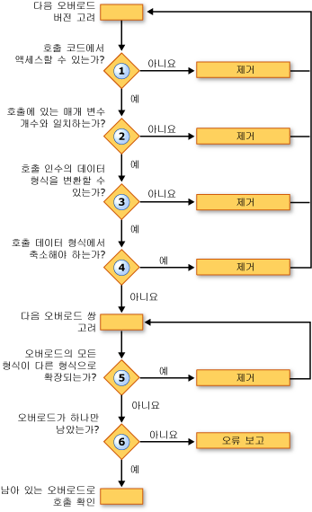

# 오버로드 확인(Visual Basic)
Visual Basic 컴파일러에서 몇 가지 오버 로드 된 버전에 정의 된 프로시저 호출을를 발견 하면 호출 하는 오버 로드 중 어떤 결정 해야 합니다. 다음 단계를 수행 하 여 수행 합니다.  
  
1.  **접근성.** 호출 코드에서 메서드를 호출 하지 않도록 설정 하는 액세스 수준으로 오버 로드 모두 제거 합니다.  
  
2.  **매개 변수 수입니다.** 호출에서 제공 하는 다른 개수의 매개 변수를 정의 하는 오버 로드를 모두 제거 합니다.  
  
3.  **매개 변수 데이터 형식입니다.** 컴파일러는 확장 메서드를 통해 기본 설정 인스턴스 메서드를 제공합니다. 인스턴스 메서드만 확장 프로시저 호출에 맞게 변환을 필요로 하 있으면 모든 확장 메서드를 삭제 하 고 컴파일러만는 인스턴스 메서드와 계속 됩니다. 이러한 인스턴스 메서드가 없으면 인스턴스 및 확장 메서드를 모두 사용 하 여 계속 합니다.  
  
     이 단계에서는 오버 로드를 호출 인수의 데이터 형식을 변환할 수 없습니다는 오버 로드에 정의 된 매개 변수 형식을 모두 제거 합니다.  
  
4.  **축소 변환입니다.** 호출 인수 형식에서 정의 된 매개 변수 형식 축소 변환 되어야 하는 오버 로드를 모두 제거 합니다. 이러한 현상은 여부 형식 검사 스위치 ([Option Strict 문](../../../../visual-basic/language-reference/statements/option-strict-statement.md))은 `On` 또는 `Off`합니다.  
  
5.  **최소 확대 합니다.** 컴파일러는 쌍의 나머지 오버 로드를 고려합니다. 각 쌍에 대해 정의 된 매개 변수의 데이터 형식과 비교합니다. 모든 오버 로드 중 하나에 있는 형식을 다른 시그니처에 있는 해당 형식으로 확장, 컴파일러는 후자를 제거 합니다. 즉, 확대 변환 부분이 가장 적은 필요로 하는 오버 로드를 유지 합니다.  
  
6.  **단일 후보입니다.** 오버 로드를 하나만 남을 때까지 쌍 유지를 오버 로드 하 고 해당 오버 로드에 대 한 호출을 확인 하는 검토를 계속 합니다. 컴파일러는 오버 로드는 단일 후보를 줄일 수 없습니다, 하는 경우 오류를 생성 합니다.  
  
 다음은 호출 하 여 오버 로드 된 버전의 집합을 결정 하는 프로세스입니다.  
  
   
오버 로드 버전에서 해결  
  
 다음 예제에서는이 오버 로드 확인 프로세스를 보여 줍니다.  
  
 [!code-vb[VbVbcnProcedures#62](./codesnippet/VisualBasic/overload-resolution_1.vb)]  
  
 [!code-vb[VbVbcnProcedures#63](./codesnippet/VisualBasic/overload-resolution_2.vb)]  
  
 첫 번째 호출에서 컴파일러는 첫 번째 오버 로드를 제거 하기 때문에 첫 번째 인수의 형식 (`Short`) 해당 매개 변수의 형식으로 축소 (`Byte`). 두 번째 오버 로드에 각 인수를 입력 하기 때문에 다음 세 번째 오버 로드를 제거 (`Short` 및 `Single`) 세 번째 오버 로드에서 해당 형식으로 확장 되는지를 (`Integer` 및 `Single`). 두 번째 오버 로드 컴파일러 호출에 사용 되므로 적은 확대 필요 합니다.  
  
 두 번째 호출에서 컴파일러 축소 변환을 기반으로 오버 로드를 제거할 수 없습니다. 적은 확대 인수 형식의 두 번째 오버 로드를 호출할 수 있으므로 첫 번째 호출에서와 같은 이유로 세 번째 오버 로드를 제거 합니다. 그러나 컴파일러는 첫 번째 및 두 번째 오버 로드 간의 확인할 수 없습니다. 각각 다른의 해당 형식으로 확대 되는 하나의 정의 된 매개 변수 형식을 갖는 (`Byte` 를 `Short`, 하지만 `Single` 를 `Double`). 따라서 컴파일러는 오버 로드 확인 오류를 생성합니다.  
  
## 선택적 오버 로드 및 ParamArray 인수  
 마지막 매개 변수가 선언 된 점을 제외 하 고 프로시저의 두 개의 오버 로드 시그니처가 같은 경우 [Optional](../../../../visual-basic/language-reference/modifiers/optional.md) 하나에 및 [ParamArray](../../../../visual-basic/language-reference/modifiers/paramarray.md) 컴파일러는 다른으로 해당 프로시저에 대 한 호출을 확인 다음과 같습니다.  
  
|호출으로 서의 마지막 인수를 제공 하는 경우|로 서의 마지막 인수를 선언 하는 오버 로드에 대 한 호출을 해결 하는 컴파일러|  
|---|---|  
|값 없음 (인수를 생략)|`Optional`|  
|단일 값|`Optional`|  
|쉼표로 구분 된 목록에 두 개 이상의 값|`ParamArray`|  
|배열 길이 (빈 배열을 포함)|`ParamArray`|  
  
## 참고 항목  
 [선택적 매개 변수](./optional-parameters.md)  
 [매개 변수 배열](./parameter-arrays.md)  
 [프로시저 오버로딩](./procedure-overloading.md)  
 [프로시저 문제 해결](./troubleshooting-procedures.md)  
 [방법: 여러 버전의 프로시저 정의](./how-to-define-multiple-versions-of-a-procedure.md)  
 [방법: 오버로드된 프로시저 호출](./how-to-call-an-overloaded-procedure.md)  
 [방법: 선택적 매개 변수를 사용하는 프로시저 오버로드](./how-to-overload-a-procedure-that-takes-optional-parameters.md)  
 [방법: 매개 변수를 무제한으로 사용하는 프로시저 오버로드](./how-to-overload-a-procedure-that-takes-an-indefinite-number-of-parameters.md)  
 [프로시저를 오버로드할 때 고려해야 할 사항](./considerations-in-overloading-procedures.md)  
 [오버로드](../../../../visual-basic/language-reference/modifiers/overloads.md)  
 [확장명 메서드](./extension-methods.md)
