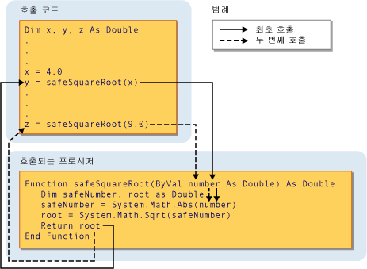

# 프로시저 매개 변수 및 인수(Visual Basic)
대부분의 경우에서 프로시저는 호출 된 있는 상황에 대 한 몇 가지 정보가 필요 합니다. 반복 또는 공유 작업을 수행 하는 프로시저는 각 호출에 대 한 다른 정보를 사용 합니다. 이 정보는 변수, 상수, 및 호출 하면 프로시저에 전달 하는 식으로 구성 됩니다.  
  
 A *매개 변수* 프로시저 프로시저를 호출할 때 제공 해야 하는 값을 나타냅니다. 프로시저의 선언 매개 변수를 정의합니다.  
  
 매개 변수 없이 매개 변수 하나 또는 여러 개를 사용 하 여 프로시저를 정의할 수 있습니다. 매개 변수를 지정 하는 프로시저 정의의 일부 라고는 *매개 변수 목록*합니다.  
  
 *인수* 는 프로시저를 호출할 때 프로시저 매개 변수에 제공 하는 값을 나타냅니다. 호출 하는 코드는 프로시저를 호출할 때 인수를 제공 합니다. 인수를 지정 하는 프로시저 호출의 일부 라고는 *인수 목록*합니다.  
  
 다음 그림은 프로시저를 호출 하는 코드를 보여 줍니다. `safeSquareRoot` 서로 다른 두 위치에서 합니다. 변수 값을 전달 하는 첫 번째 호출 `x` (4.0) 매개 변수에 `number`, 및 반환 값에 `root` (2.0)를 변수에 할당할 `y`합니다. 두 번째 호출 하는 리터럴 값 9.0 전달 `number`, 반환 값 (3.0) 변수에 할당 `z`합니다.  
  
   
매개 변수에 인수를 전달합니다.  
  
 자세한 내용은 참조 [차이점 간의 매개 변수 및 인수](./differences-between-parameters-and-arguments.md)합니다.  
  
## 매개 변수 데이터 형식  
 매개 변수에 대 한 데이터 형식을 사용 하 여 정의 된 `As` 선언에는 절. 예를 들어 다음 함수는 문자열과 정수를 허용 합니다.  
  
 [!code-vb[VbVbcnProcedures#32](./codesnippet/VisualBasic/procedure-parameters-and-arguments_1.vb)]  
  
 형식 검사 스위치 하는 경우 ([Option Strict 문](../../../../visual-basic/language-reference/statements/option-strict-statement.md))은 `Off,` 는 `As` 제외 하 고 모든 매개 변수에서 사용 해야 매개 변수 하나를 사용 하면 절은 선택 사항입니다. 형식 검사를 통과 하는 경우 `On`, `As` 절이 모든 프로시저 매개 변수에 필요 합니다.  
  
 호출 코드에서는 해당 매개 변수를와 다른 데이터 형식과 같은 인수를 제공 하는 경우 `Byte` 에 `String` 매개 변수를 다음 중 하나를 수행 해야 합니다.  
  
-   인수만 지정; 매개 변수 데이터 형식으로 확장 된 데이터 형식  
  
-   설정 `Option Strict Off` 암시적 축소 변환을; 수 있도록 또는  
  
-   변환 키워드를 사용 하 여 데이터 형식을 명시적으로 변환 합니다.  
  
### 형식 매개 변수  
 A *제네릭 프로시저* 하나 이상의 정의 *형식 매개 변수* 일반 매개 변수 외에도 합니다. 제네릭 프로시저가 호출 코드를를 데이터 형식을 각 개별 호출의 요구 사항에 맞게 제대로 조정할 수 있도록는 프로시저를 호출할 때마다 다른 데이터 형식을 전달할 수 있습니다. [Generic Procedures in Visual Basic](../../../../visual-basic/programming-guide/language-features/data-types/generic-procedures.md)을 참조하세요.  
  
## 참고 항목  
 [절차](./index.md)  
 [Sub 프로시저](./sub-procedures.md)  
 [Function 프로시저](./function-procedures.md)  
 [속성 프로시저](./property-procedures.md)  
 [연산자 프로시저](./operator-procedures.md)  
 [방법: 프로시저의 매개 변수 정의](./how-to-define-a-parameter-for-a-procedure.md)  
 [방법: 프로시저에 인수 전달](./how-to-pass-arguments-to-a-procedure.md)  
 [값 또는 참조로 인수 전달](./passing-arguments-by-value-and-by-reference.md)  
 [프로시저 오버로딩](./procedure-overloading.md)  
 [Visual Basic의 형식 변환](../../../../visual-basic/programming-guide/language-features/data-types/type-conversions.md)
